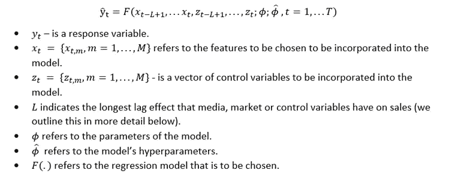
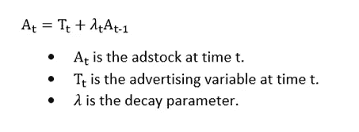
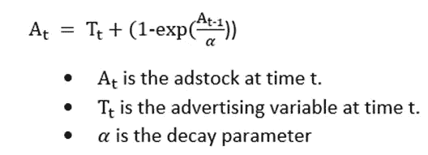
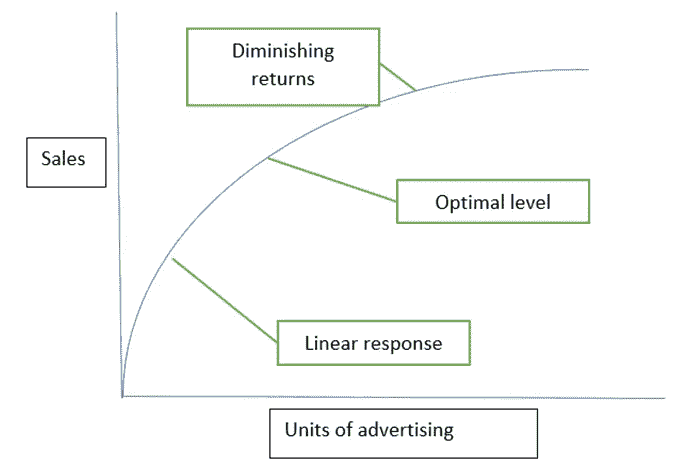
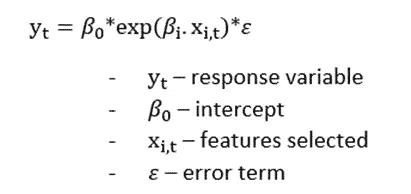
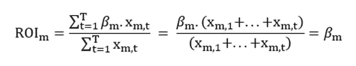
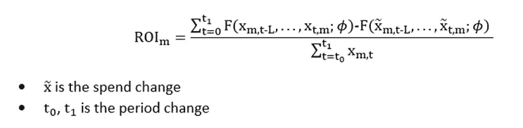

# 作为一名数据科学家，你需要了解媒体混合建模

> 原文：<https://medium.com/mlearning-ai/understand-your-media-channel-effectiveness-through-mixed-marketing-modelling-43b55413a3cf?source=collection_archive---------2----------------------->

有越来越多的媒体渠道可以用来增加公司的客户群。尽管有好处，任何规模的公司的广告预算都是有限的，因此必须了解这些营销渠道的有效性，以及公司如何优化这些渠道的支出。为了实现这一目标，之前已经使用了许多方法，其中最著名的是针对不同广告支出组合的多个随机实验。信息系统方法的问题是所需的规模，多次复制这种方法被证明是特别具有挑战性的。解决这个问题的方法之一是媒体混合建模。

**如果您喜欢与数据科学、统计和技术相关的内容，请关注我的** [**中型**](/@patrick.stewart) **个人资料以保持更新。是支持我内容输出的最好方式。**

# *进入媒体混合建模*

媒体组合建模是指基于时间序列数据的各种回归技术，以模拟销售结果。由此，我们可以生成许多与广告绩效相关的指标，如投资回报率(ROI)以及优化的广告预算分配。

*有效的媒体组合建模需要哪些数据输入？*

-总销售额通常用作回归中的**响应变量(因变量)**，考察渠道支出的变化如何影响需求。

-不同媒体渠道的广告指标被用作**独立变量**的一部分。这方面的例子包括社交媒体、广播和电视，测量类型包括印象、点击或广告支出。

-市场指标也被用作一些独立变量**。这方面的例子包括价格、促销和产品指标。**

*   **各种控制也被用作一些**独立变量**。例如，媒体混合模型通常控制季节性。**

# ***将这一切结合在一起***

**既然我们理解了输入，我们可以这样总结回归模型:**

****

# ***转换媒体变量(滞后效应)***

**目前，根据我们的原始数据，我们假设广告支出的变化会对销售产生直接影响。我们知道这不是真的，广告的增加不仅仅会带来第二天的销售，还会带来接下来几天/几周的销售。因此，需要转换营销变量，以便在当前和未来期间分配效果。**

# ***Adstock***

**Adstock 是一种用来更好地表示营销支出结转效果的技术。它反映了一个理论，即广告的效果会随着最初的曝光而滞后和衰减。在本文中，我们将重点介绍两种 adstock 技术。**

# ***几何***

**Geometric 是最简单的 adstock 模型之一，在该模型中，当前期间的广告支出效果在未来期间每次都会减少λ。例如，如果λ= 0.75，则前一时段中的 75%的印象被带入时段 2。完整的等式如下所示:**

****

# ***威布尔***

**威布尔类似于几何形状，但形状被调整为曲线，因此折旧对参数更加敏感。完整的等式如下所示:**

****

## ***理解边际收益递减的重要性***

**媒体组合建模中经常考虑的另一个影响是，随着总支出价值的增加，营销支出的影响可能会产生递减的回报。这就是众所周知的形状效应，我们将在文章的后面讨论如何对此建模。**

****

**Understanding the effect of diminishing returns between sales and advertising expenditure**

# ***建模过程中需要考虑的其他因素？***

**1.是否有足够的数据进行适当的回归？**

**-通常对于媒体混合建模，获取足够详细的数据集可能是一个问题。**

**2.数据范围是否太有限？**

**-与第一点类似，如果数据范围过于有限，那么显然存在外推不确定性。**

**3.相关输入变量**

**-广告商通常以相关的方式在广告渠道中分配他们的支出。此外，相关的广告选择与其他营销变量相互作用，这导致广泛的相关输入变量集合。**

**4.是否存在选择偏差的风险？**

*   **当一个媒体变量与一个不可观察的需求变量相关联，从而增加销售时，就会出现这种情况。例如，漏斗效应可能意味着通过一个渠道的支出也可以通过另一个渠道提高效率。**

# ***媒体混合建模的功能形式***

**1.线性模型**

**媒体组合建模最简单的方法是拟合最方便应用的线性模型，提供非线性销售函数的合理近似值，尤其是在数据相当有限的情况下。**

**2.对数线性模型**

**对数线性模型如下所示:**

****

**对数线性模型的主要优点是，它最适合模拟收益递减，因为函数形式给出了一条凹型响应曲线。**

**3.半对数形式**

**半对数模型如下所示:**

****

**在这种情况下，函数形式现在是凸的。虽然这不再处理边际收益递减的问题，但它可以模拟不同渠道可以互补并导致规模收益递增的事实。**

# ***模型选择和不确定性***

**媒体组合建模在模型选择方面有三个重要的标准，根据这些因素选择最佳模型。**

**1.拟合质量**

**-这定义了模型的预测与实际销售的关联程度。**

**拟合质量的典型度量包括均方根误差和平均绝对误差。**

**2.解释的可能性**

**3.解释的置信度**

**-这通常通过检查参数估计值的置信区间来衡量。**

# ***获得 ROI***

**如前所述，我们希望获得的关键指标是不同媒体渠道的投资回报。有许多方法可以计算这一点，但在本文中我们主要使用的线性模型中，基本上假设了一个恒定的投资回报率(即，支出的变化意味着您在任何水平上获得的销售额都更多)。因此，我们可以将 ROI 描述如下:**

****

**如果回归是更复杂的形式，如对数线性或半对数形式，那么 ROI 的计算就变得更复杂。最常见的方法之一是将标准化的贡献除以该渠道的总支出。**

**另一种更通用的方法(Jin 等人)在方程中提出:**

****

# ***结论***

**正如你所看到的许多统计模型一样，媒体混合建模既是一门科学，也是一门艺术。因此，不管你的软件是什么，对不同广告渠道的有效性做出成功的结论，智能的解释和理解是至关重要的。**

***更多内容请订阅。***

***参考文献***

**金、王乐清、孙、和吉姆克勒。*具有遗留效应和形状效应的媒体混合建模的贝叶斯方法*。技术。众议员谷歌公司，2017 年**

** [## Mlearning.ai 提交建议

### 如何成为 Mlearning.ai 上的作家

medium.com](/mlearning-ai/mlearning-ai-submission-suggestions-b51e2b130bfb)**