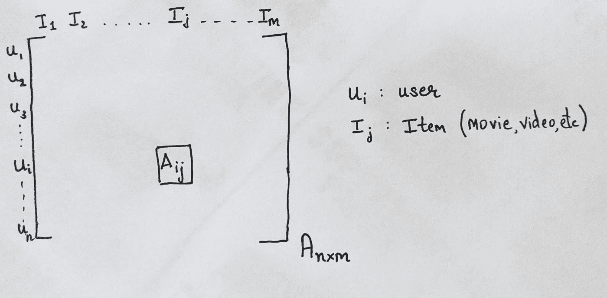
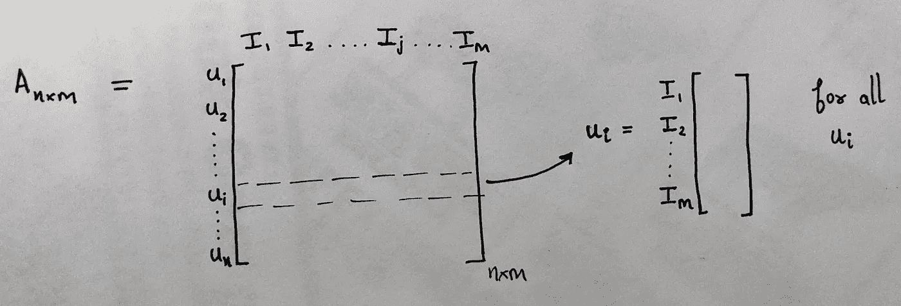
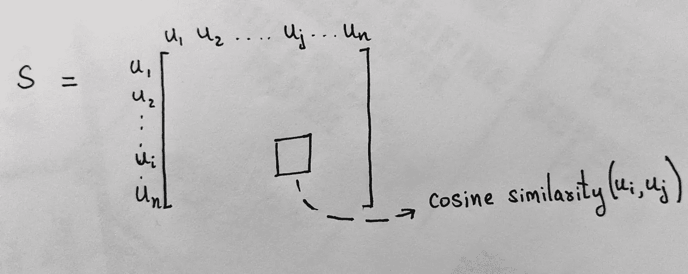
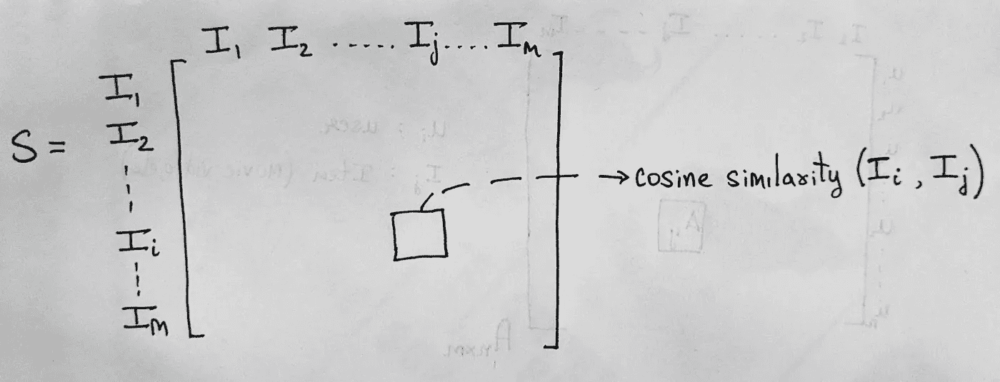
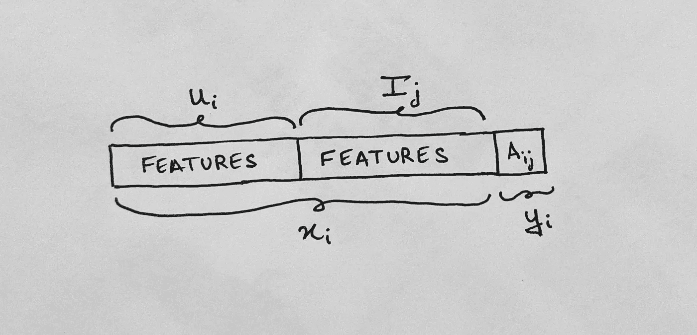
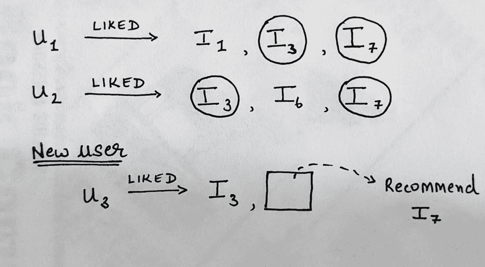

# 了解基本的推荐系统

> 原文：<https://medium.com/mlearning-ai/understanding-a-basic-recommendation-system-d6fd0d8cbb83?source=collection_archive---------1----------------------->

## 机器学习系列:第一部分

[Source](https://pixabay.com/)

因此，我一直在从事一个基于推荐系统的项目，并决定将我对这些系统如何工作的理解写在博客上，希望能帮助一名即将到来的数据科学家。另外，请随时通过我的 [LinkedIn](https://www.linkedin.com/in/rithwikshetty/) :)与我联系

## **什么是推荐系统？**

> 一个**推荐系统**，或者一个**推荐系统**(有时用一个同义词如平台或者**引擎**代替“**系统**”)，是信息过滤**系统**的一个子类，它试图预测用户对一个项目的“评分”或者“偏好”。

让我为你简化一下。下面是一个在 YouTube 上播放的视频截图，你可以在右手边看到视频列表。向我们展示(推荐)这几组视频，是因为它们的内容与我们正在观看的视频相似，机器学习模型预测我们可能会对它们感兴趣。

Main video (LEFT), Recommended Videos (RIGHT)

我们可以看到网飞和亚马逊也在使用类似的系统，在那里我们可以分别看到“因为你看过《盗梦空间》”和“看过这个项目的顾客也看过:”这样的分类。现在，让我们试着通过各种矩阵运算来深入了解这些系统。

## 数据

假设我们有一个矩阵 **A** ，其中每一行表示一个唯一的用户( **u_i)** ，每一列表示一部唯一的电影( **I_j)** ，矩阵元素( **A_ij** )可以是二进制的(如果用户 **u_i** 看过电影 **I_j** 或者整数(由用户**u _ I**评级)*从下图*中你会有更好的理解。****

Matrix A has **n users** and **m movies**, hence denoted as A_nxm

我们可以说矩阵 A 是一个**稀疏矩阵**，意味着矩阵中的大部分值是 0 或 Na(在整数的情况下)。**为什么？因为在现实世界中，有数十亿用户和数百万部电影，单个用户几乎不可能观看每一部电影。所以假设矩阵中的大多数元素是 0 或 Na 是安全的。**

从这个给定的矩阵 A 中，我们可以了解一个推荐系统是如何构建的。

## 简单的推荐系统

> a) **基于用户-用户的推荐系统:**

*   考虑一个矩阵 **A** 有 **n 行**(用户)和 **m 列**(项目)(如图所示)。
*   我们可以分离所有的用户向量( **u_1，u_2…，u_n** )来自矩阵 A，*如图所示*。每个向量由用户 **u_i** 对电影 **I_1** 到 **I_m** 给出的评级组成

**U_i** is a user vector (for all i ranging from 1 to n)

*   现在，取 **u_i** 和 **u_j** 的所有组合，我们可以计算两个向量之间的相似度。也就是说，我们可以计算两个用户彼此有多相似。在我们的例子中，我们将计算两个向量之间的 [**余弦相似度**](https://en.wikipedia.org/wiki/Cosine_similarity) 。从而创建一个**相似度矩阵 S** ( ***nxn*** )。

Similarity Matrix S_nxn

现在如果要给(比如说)用户 **u_10** 推荐什么东西，可以查一下 **u_10** 和谁最相似(最好是 top 3 相似)。然后我们检查哪些项目(电影)没有被 **u_10** 观看，但是被同类用户评价良好。那些项目可以推荐给我们的用户 **u_10** 。

这种方法的问题是用户的喜好会随着时间而改变，所以我们可能会推荐用户不再感兴趣的东西。

> b) **基于项目的推荐系统**

这种推荐系统在 21 世纪初被亚马逊广泛使用。

*   这里的概念非常类似于用户-用户类型的推荐系统。这里的主要区别是，我们不是从用户向量计算相似性矩阵 **S** ，而是使用项目向量来计算它。
*   每个向量 **I_j** (I_1，I_2 … I_m)由每个用户(u_1，u_2 … u_n)对**项目 j.** 给出的所有评分组成

Similarity Matrix S_mxm

现在，如果用户喜欢电影(比如说) **I_10、I_21 和 I_30** ，我们可以检查哪些电影与这些最相似，优先选择常见的电影。

当 **a)** 用户数量远大于项目数量，以及 **b)** 当我们知道项目评级在一定时间后不会改变时，可以使用基于项目的推荐系统。

## 基于机器学习的推荐系统

现代推荐系统是使用机器学习技术构建的。推荐系统可以是:

## 1.分类/回归系统(基于内容的过滤):

从矩阵 A 中，如果我们有关于每个用户 **u_i** 和电影 **m_j** 的更多信息，我们可以继续创建一个新的传统数据集，其中 **u_i** 的特征与 **m_j、**的特征连接作为属性，元素 **A_ij** 作为类标签。*(如图所示)*

我们的模型可以在 A_ij 可用的数据上训练。测试数据由所有的 **Null A_ij** 值组成(建议)。

这里的主要任务是到达 **u_i & m_j.** 的**特征表示**

## 2.矩阵完成系统(协同过滤):

*   这是一种更常用的方法，我们将在本系列的后面部分深入研究这种方法背后的数学原理。为了让你对这是如何工作的有一个基本的了解，让我们假设一个用户 **u_1** 已经观看并且喜欢电影 **I_1、I_3 和 I_7** ，并且用户 **u_2** 已经观看并且喜欢电影 **I_3、I_6 和 I_7** 。

*   现在考虑另一个用户 **u_3** ，他刚刚看完电影 **I_3** 。
*   根据现有数据，我们知道喜欢过电影**i3**的用户(**u1 和 U2**)也喜欢过电影**i7。因此，向我们的用户 **u_3** 推荐电影 **I_7** 到可能是安全的。**

## 结论

在本系列的下一部分中，我们将看到如何使用诸如非负矩阵分解之类的操作来解决这个矩阵补全问题。我们还将了解机器学习优化方程是如何求解的，以及如何向用户提供建议。