# 用实例理解线性回归算法。

> 原文：<https://medium.com/mlearning-ai/understanding-a-linear-regression-algorithm-with-example-6c3f285c2100?source=collection_archive---------4----------------------->

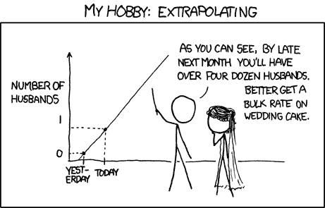

source- pinterest

## 本文中使用的数据集和笔记本可以在这里找到:

完整笔记本链接:[多元线性回归模型](https://github.com/Jnjerry/Multiple-Linear-Regression--Ecommerce-Analysis/blob/main/Customer%20Spending.ipynb)

数据集链接:[电子商务客户](https://github.com/Jnjerry/Multiple-Linear-Regression--Ecommerce-Analysis/blob/main/Ecommerce%20Customers.csv)

# 让我们从几个场景的线性回归开始:

*   金融公司预测导致客户贷款违约的主要因素。
*   体育公司分析训练的哪些变化对运动员的表现有影响。
*   影响一个国家经济增长的因素。
*   预测股票价格。

上述场景是现实生活中的用例，我们在**一个或多个数值变量**的基础上预测一个**数值变量**。这些变量通常绘制在 X 轴和 Y 轴上，如下图所示。

例如，下图向我们展示了客户在应用程序上花费的**时间**和他们花费的**金额**之间的关系。

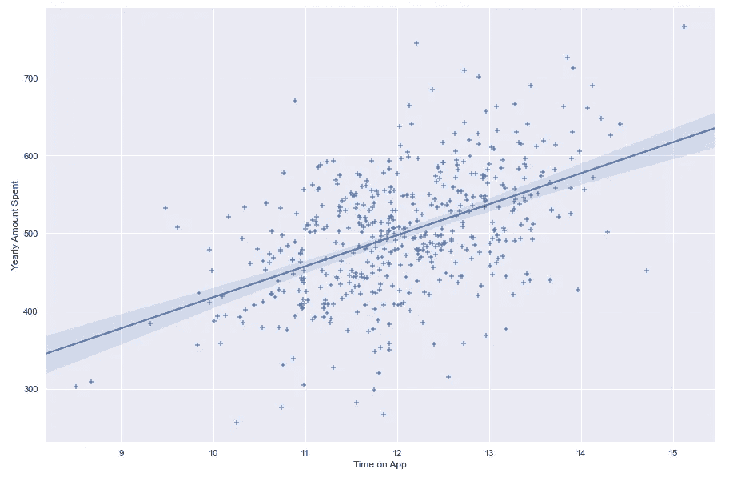

Linear Regression Graph

线性回归试图**研究一种趋势或模式**，然后基于此我们可以预测一个输出。例如，在上图中，我们的线性回归是通过以下步骤实现的

*   利用历史数据，我们在 x 轴**上绘制了人们在应用上花费的时间**，在 y 轴上绘制了他们在应用上花费的时间。
*   然后，我们绘制一条尽可能接近我们所有点的线，称为最佳拟合线**。**
*   **然后，我们将使用这条最佳路线来帮助我们预测数量。如果我们有一个不在最佳拟合线上的观察值，那么我们将**外推**这条线来找到我们的预测值。**

**在数学语言中，这条最佳拟合线可以通过方程 y=mx+c 来表示和推导。**

**假设你想预测一个客户在我们公司花费的**年金额**，给定客户在 App 上的**时间**和**会员资格年限(年)**。**

****App 上的时间**和**隶属长度**将称为**自变量**。这意味着它们的价值不受其他变量的影响。**

**然而，**年金额**将被称为**因变量**，这意味着其值根据自变量而变化，在这种情况下，App 上的**时间**和**会员资格长度(年)**。**

**因此，在我们的上下文中，等式 y=mx+c 将被解释为 App + **m2** * **成员资格长度** + **c.** 上的**年度金额** = **m1** * **时间****

# **方程式分解**

****每年金额**=**m1*****App 上时间** + **m2** * **会员年限** + **c.****

****c** 换句话说叫做 **y 轴截距**(图形与 y 轴相交的点)。在这种情况下，我们的 y 截距是 350 美元。这意味着任何客户消费的最低金额预计为 350 美元。**

**m1 和 m2 是系数。我们将在本文后面看到系数的含义。**

# **例子**

**假设你被一家电子商务公司聘用为他们的数据科学家。该公司正试图:**

*   **在新的营销和财务策略中，决定是否将精力和资源集中在移动应用体验或网站上。**
*   **确定哪些因素对客户的年度支出影响最大。**

**这家商店有店内服装建议环节，以特征(平均值)表示。会话长度)。**

**我们将使用此[数据集](https://github.com/Jnjerry/Multiple-Linear-Regression--Ecommerce-Analysis/blob/main/Ecommerce%20Customers.csv)根据如下所示的总体特征中的相关特征来预测客户每年的消费金额。**

**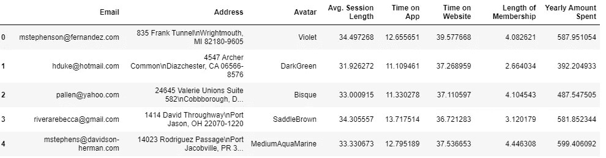**

# ****#检测连续变量****

**线性回归找出连续变量之间的关系。这意味着我们只需要包括数值，而不是分类变量。**

**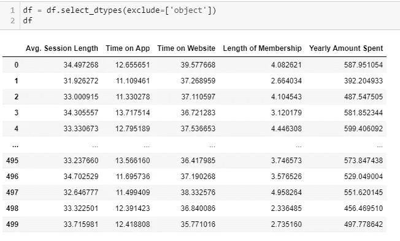**

**我们现在只有连续的变量在我们的数据框架中，删除了电子邮件、地址和头像列。**

**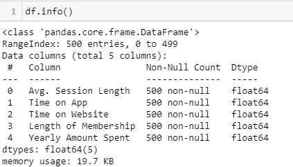**

# ****#然后我们需要检查丢失的值****

**数据中缺少值会导致模型性能不佳。**

**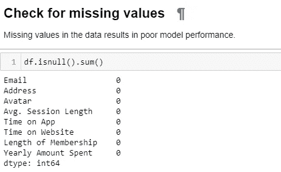**

**我们的模型没有缺失值。但是，如果我们有缺失的价值观，我们可以用这些主要方法之一或组合来处理它们:**

*   **摆脱列中有大量缺失值的客户。**
*   **去掉整个属性或删除整个列。**
*   **将缺失值设置为某个值(零、平均值、中间值等。).**

# ****#检测目标变量****

**在我们的数据集中，目标变量很容易识别和处理。我们的**目标变量**是**每年花费的金额**，这是在给定我们数据框架中所有或部分独立变量的情况下，我们希望能够预测的值。**

**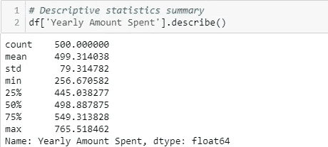**

# ****#检测线性关系****

**我们的自变量和因变量之间必须存在线性关系，这样我们才能继续使用回归分析来分析数据集。这可以用散点图来证实。**

**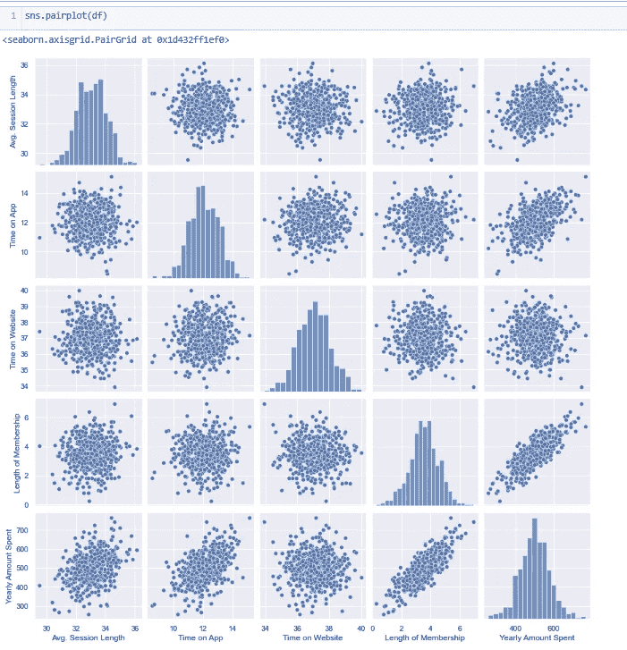**

**我们的自变量随着因变量的增加而增加。这很好，我们可以继续我们的分析。**

# **#检测异常值**

**异常值代表太小或太大的数据点。它可以通过夸大错误率来影响模型。如果数据中有异常值，则删除它们，或者用平均值或中值替换它们。**

**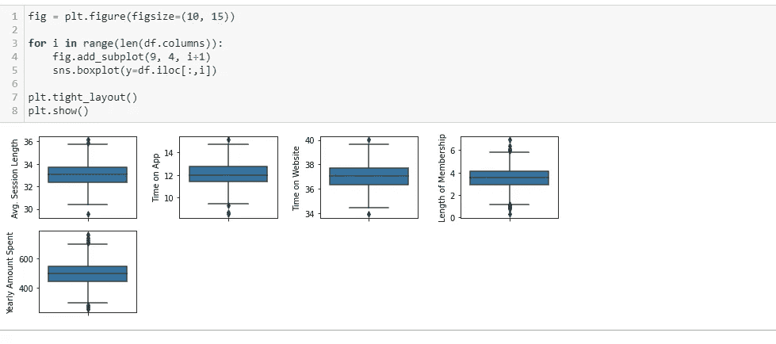**

**对于我们的特性，我们将删除那些属性高于 0.999 分位数的客户，这可以解释为高度异常的数据点。**

**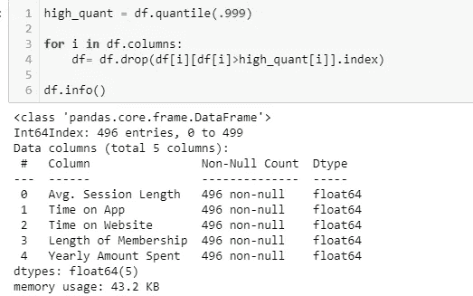**

**从计数输出中，剔除了 4 个数据点高度异常的客户。**

# **#检查数据点的正态分布。**

**为了进行线性回归，我们的数据点需要围绕真实平均值对称分布。我们可以通过绘制分布图来检查分布情况。**

**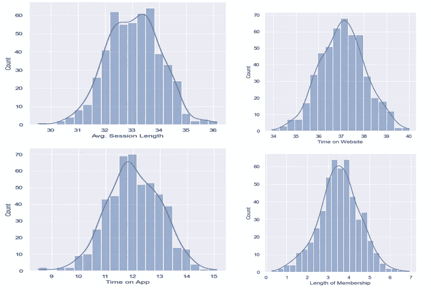**

**如果数据不正常，执行数据转换以减少其偏斜度。**

**负偏差数据需要幂变换或指数变换。相反，正偏差数据需要对数变换或平方根变换。**

# **#检测相关性**

**相关性衡量变量之间的关系。**

**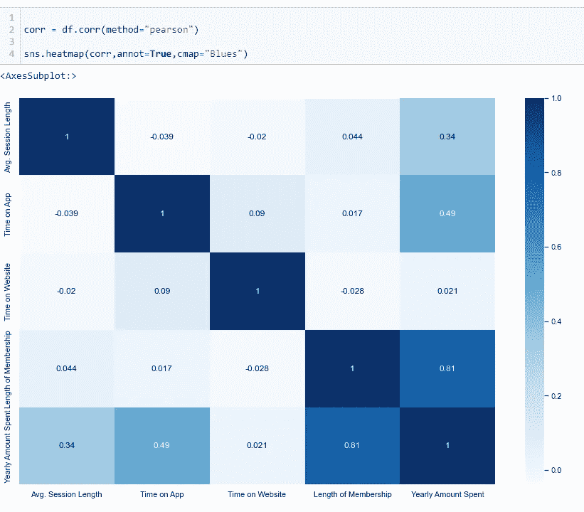**

# **#按照自变量与因变量的相关性顺序排列自变量。**

**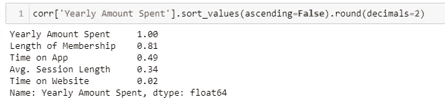**

**会员资格的长短和在 App 上的时间对每年花费的金额影响最大。**

**相关性衡量两个变量之间的关系。当这两个变量高度相关，可以相互解释(以至于可以用一个变量预测另一个变量)，那么我们就有共线性。**

**数据中必须很少或没有多重共线性。**

# **#检查独立变量之间的相关性**

**我们丢弃相关性为 1.0 的结果，这表明我们正在处理自相关。**

**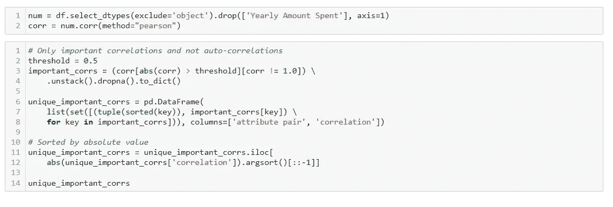**

**我们没有任何产出，因此我们没有任何相互高度相关的独立变量，这就是我们想要的情景。**

# **#定义我们的自变量 X 和因变量 y**

**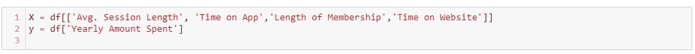**

# **#将数据分为训练数据和测试数据**

**我们只在部分数据上训练我们的模型，因为并保留其余的(测试数据)来评估我们模型的质量。**

**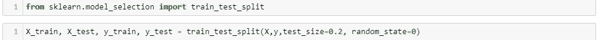**

# **#标准化数据**

**进行特征缩放是为了标准化在量值和单位上有很大差异的特征。这包括:kNN 算法、kMeans 聚类(欧几里德距离)、线性回归、逻辑回归和 SVM。**

****NB-缩放通常用于 x 轴变量，而不需要用于目标变量。****

**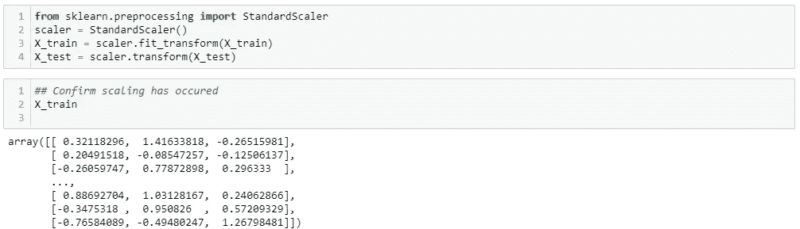**

# **#根据训练数据训练模型(拟合模型)**

**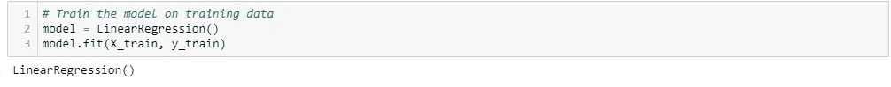**

# **#使用统计模型**

**我们将使用统计模型库，它将探索我们的数据，并执行统计测试和估计统计模型。**

```
import statsmodels.api as sm
```

**导入统计模型后，我们将把它放入我们的训练数据中。**

**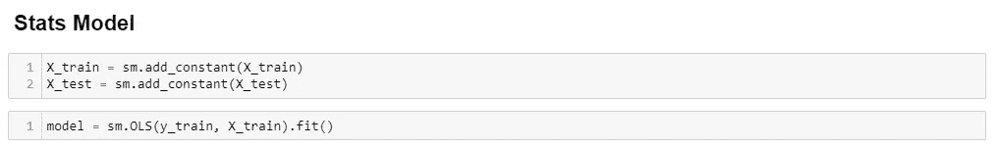****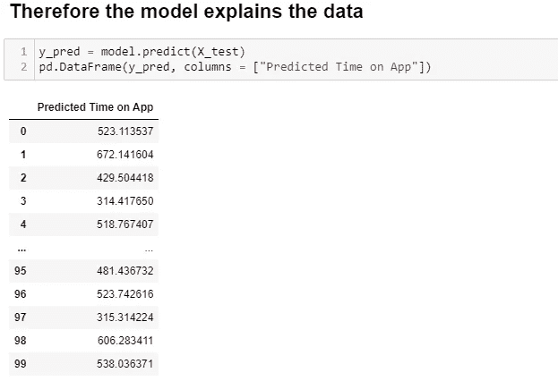**

**y_pred 输出是我们对模型的预测。这些预测将与实际 y_test(保留值)进行比较，以使用 R 平方和调整后 R 平方等方法评估我们的模型。**

# **#使用 statsmodel 的模型性能总结**

**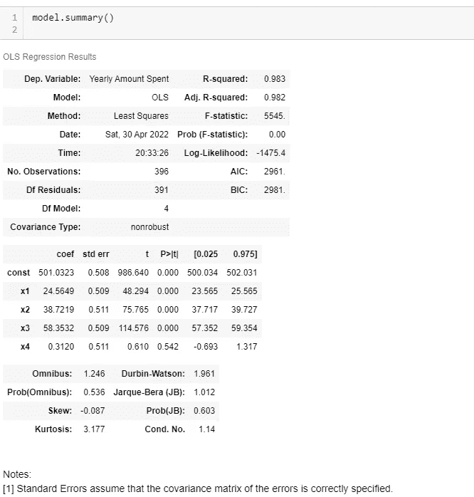**

# **解释**

**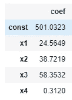**

****常量 501** 是我们的 y 轴截距。这意味着任何客户每年消费的最低金额预计为 501 美元。**

****x1** 是我们的变量 **Avg。会话长度。**这是一个回归系数。这意味着，平均而言，每增加一次客户会话时间，客户每年的消费金额就会增加 24.5649 美元。**

****x2** 是我们在 App 上的变量**时间。这是回归系数。这意味着，平均而言，客户在应用上每多花一分钟，每年的消费金额就会增加 38.7219 美元。****

****x3** 是我们的变量**成员资格的长度**。这是回归系数。这意味着，平均而言，随着客户会员资格的延长，客户每年的消费金额将增加 58.3532 美元。**

****x4** 是我们在网站上的变量**时间。**这是回归系数。这意味着，平均而言，客户在网站上每多花一分钟，客户每年的消费金额就会增加 0.312 美元。**

# **#我们的系数和业务问题的结论？**

**在网站上花费的**时间似乎对**年花费金额(0.312 美元)**影响不大****

**App 上的**时间**对顾客消费的影响更大。**

**你对公司有什么建议？也许顾客在网站上的体验不好，他们可以做一个调查，问顾客为什么不喜欢在网站上购买产品。**

**会员资格的长短对顾客每年的花费影响最大。**

# **#假设检验和 P 值**

**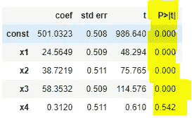**

**p 值为 0，意味着**零假设被拒绝**并且我们的测试具有统计显著性**。****

**p 值越小，我们应该拒绝零假设的证据就越强。**

*****R 平方*** —这是用来衡量独立变量的变化可以解释多少结果的变化。它也被称为模型的拟合优度。**

**其值的范围是从 0 到 1，其中 0 表示结果不能由任何独立变量预测，1 表示结果可以由独立变量预测而没有误差**

**我们的 R-Square 是 0.983 或 98.3%，这意味着 98.3%的“Y **早期花费金额**”可以用“**平均值来解释。会话时长**、**应用时间、【会员时长】和**网站时间。**

**然而，我想指出的是。这并不意味着我们的模型有 98.3%的准确性。低 R 平方值表明我们的自变量不能解释因变量的变化。**

****调整后的 R 平方****

**r 平方是确定模型与因变量拟合程度的一个好方法。然而，它没有考虑过拟合问题。如果您的回归模型有许多独立变量，由于模型太复杂，它可能非常适合定型数据，但对于测试数据来说表现很差。**

**引入调整的 R 平方是因为它惩罚了添加到我们模型中的任何额外的独立变量，并调整了度量以防止过度拟合问题。**

****注意:调整后的 R 平方应始终低于或等于 R 平方****

**我们调整后的 R 平方也是 0.983 或 98.3%，这意味着 98.3%的“Y **早期花费金额**”可以用“**平均”来解释。“会话时长**”、“App 上的**时间”、“会员时长”和“网站上的时间**”。**

*****问题？计算并解释平均绝对误差、均方误差和均方根误差。*****

# **#我们还可以做些什么来提高我们的模型性能？答案:超参数调谐**

**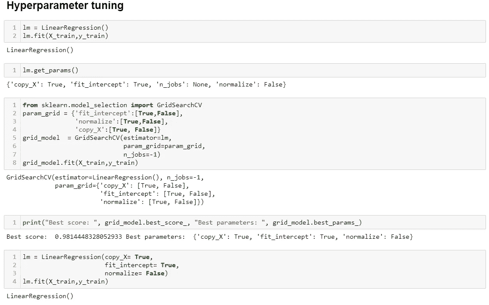**

**我们已经结束了我们的线性回归文章，并看到了我们如何将业务问题应用到模型中，并从统计角度结束我们的分析。我们还看到了在处理线性回归模型时需要注意的事项，如相关性、异常值、分布等。**

**完整笔记本链接:[多元线性回归模型](https://github.com/Jnjerry/Multiple-Linear-Regression--Ecommerce-Analysis/blob/main/Customer%20Spending.ipynb)**

**数据集链接:[电子商务客户](https://github.com/Jnjerry/Multiple-Linear-Regression--Ecommerce-Analysis/blob/main/Ecommerce%20Customers.csv)**

**[](/mlearning-ai/mlearning-ai-submission-suggestions-b51e2b130bfb) [## Mlearning.ai 提交建议

### 如何成为 Mlearning.ai 上的作家

medium.com](/mlearning-ai/mlearning-ai-submission-suggestions-b51e2b130bfb)**