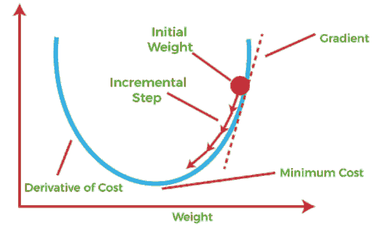
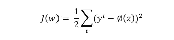
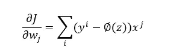
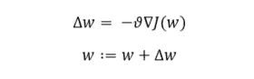
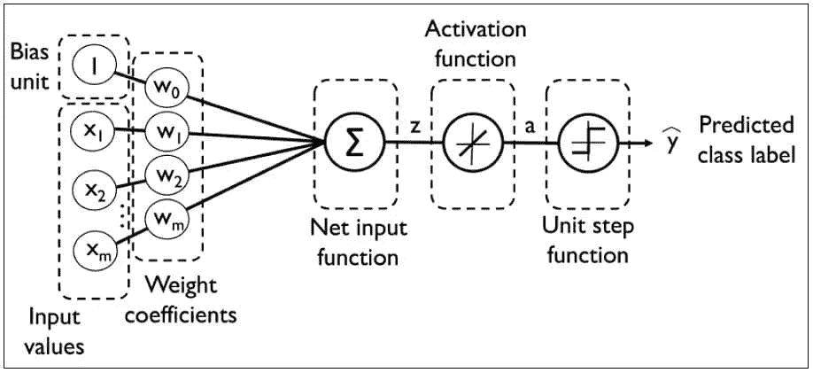
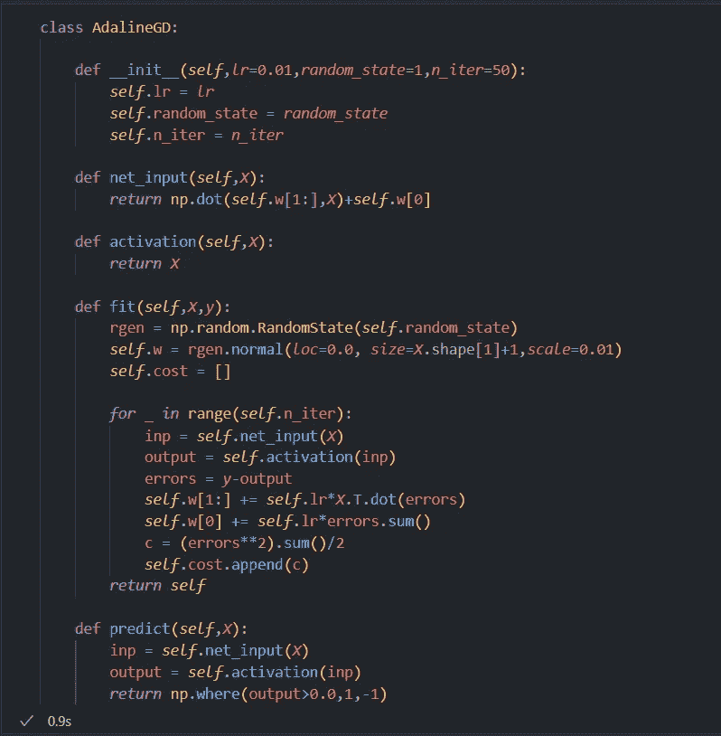
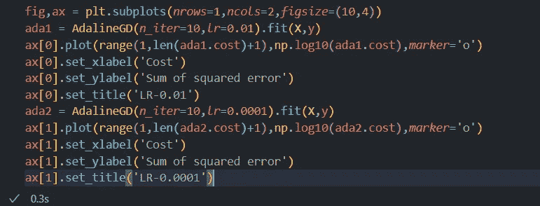
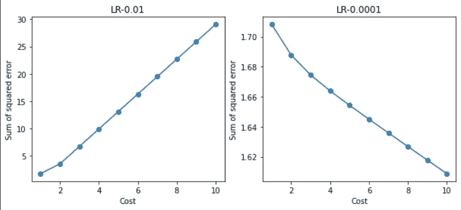

# 了解 Adaline

> 原文：<https://medium.com/mlearning-ai/understanding-adaline-da79ab8bbc5a?source=collection_archive---------10----------------------->

供稿人:[shumgapriya，](/@pshunmugapriya)Sathya Krishnan Suresh
Github 链接:[https://github.com/SathyaKrishnan1211/Medium-Article-Code](https://github.com/SathyaKrishnan1211/Medium-Article-Code)

Adaline-是由 Widrow 教授和他的学生 Ted Hoff 在 1960 年开发的单层神经网络。Adaline 可以被认为是感知器模型的改进。如果你还没有读过我之前写的感知器模型，在阅读本文之前，请在这里查看一下。

**Adaline 背后的理论:**

Adaline 改进了感知器模型，包括两个非常重要的优化概念，称为*激活函数*和*成本函数。*

激活函数是给我们一个值来与阈值函数一起工作的函数。激活函数使用要素的权重来工作。激活函数的一些著名例子是逻辑回归的 sigmoid 函数、支持向量机的径向基函数等。但是对于一个单层 Adaline，我们将使用一个标识函数，它简单地将发送给它的内容返回给我们。我在这里提到了激活函数，因为在大多数监督分类模型中，都会存在激活函数。

成本函数是每个机器学习算法将努力最小化的函数，以便它可以给出准确的结果。这是 Adaline 真正偏离感知器的地方，因为感知器中没有成本函数，没有成本函数感知器什么也不会最小化。这就是为什么 Adaline 被认为是感知器的改进，因为你可以通过简单地查看它的成本函数来了解它是如何改进其预测的。我说过机器学习算法会试图降低成本函数。但是具体怎么做呢？这就是梯度下降的由来。当你谈论成本函数时，必须提到梯度下降，它本身值得一篇单独的文章，但我将尝试在这里给出一个简短的定义。

梯度下降:
它是一种寻找微分函数局部极小值的一阶迭代优化算法。看看下面这张图。

权重沿 x 轴测量，成本函数沿 y 轴测量。下面给出了成本函数 J。好好看看这个成本函数，因为我稍后会指出感知机和 Adaline 之间的另一个重要区别。

梯度下降首先找到具有以下形式的成本函数的微分方程

这是上图的斜率，将用于更新要素的权重。所以梯度下降的作用类似于下山走向山谷。在这种情况下，谷是成本函数的全局最小值。它试图通过使用斜率、作为超参数的学习率和特征的当前权重来更新特征的权重，从而达到全局最小值。

上述两个等式构成 Adaline 的核心，其中权重使用梯度下降优化技术进行自我更新。

所以现在我们已经讨论了 Adaline 使用的三个新概念。现在来说说 Adaline 的工作流程。

Adaline 的工作流程:
1。它不是一次接受一个特征值，而是接受整个特征集。
2。将其乘以相应的权重，这是由网络输入函数完成的。
3。将其传递给激活函数。
4。激活函数返回的值用于更新权重。
5。当专门调用预测函数时，单位步长函数用于预测标注。

下图显示了 Adaline 算法的工作流程。

**Adaline 的 Python 实现:**

根据上面讨论的概念，让我们尝试为 Adaline 实现一个 python 代码。

如前所述，我们有一个激活函数和一个成本函数，这里是成本变量的形式。让我们一个功能一个功能地来。

在“init”函数中，我们得到超参数，如学习率、随机状态和迭代次数。随机状态在模型的预测准确性中不发挥主要作用，但是其他两个起着非常重要的作用，尤其是学习率。学习率起着重要的作用，因为它是我们的模型在迭代过程中努力最小化的成本函数的一部分。如果你没有为学习率设置一个合适的值，就会有超调的危险，或者模型永远达不到全局最小值。

在‘net _ input’函数中，我们采用输入特征。特征向量和相应的权重相乘。请记住，权重向量的第一个值(索引 0)始终是一个偏差单位。

在激活函数中，我们简单地返回“net_input”函数的返回值。正如我前面说过的，激活函数在这里没有任何作用，但是它为理解分类模型的工作流程奠定了基础，我们将在以后的文章中讨论。

“合身”功能是神奇之处。首先，我们设置权重，为了实现成本函数，我们将成本变量分配给一个空列表。这是另一点，你应该注意到感知器和 Adaline 之间的区别。感知器更新每行数据的权重，而 Adaline 接受整个数据并更新整个数据的权重。它不会更新每一行的权重。还记得我让你们仔细看看成本函数的那一点吗，这是我解释原因的地方。在感知器模型中，预测值是**离散类别标签**，但是在 adaline 中，由于使用了激活函数，与真实标签相比的**值是连续值。**是的，这是所有奇迹发生的地方。因为将类标签与连续值进行比较，所以误差到处都是，并且它们在迭代开始时受到严重惩罚，并且随着它们向迭代结束前进，误差将开始减少。

为了强调为学习率设置适当值的重要性，我将在没有“viriginica”的“Iris”数据集上实现两个 Adaline 模型。

第一个模型的学习率为 0.01，而第二个模型的学习率为 0.0001。让我们看看他们的成本函数值的日志。

从第一个模型中，我们可以看到，对于学习率的大值，该模型简单地超调，并且将永远无法达到全局最小值。对于较大的学习率，减少迭代次数将产生更好的结果。从第二个模型，我们可以推断，对于小的学习率，梯度下降将永远达到全局最小值。对于小值，建议增加迭代次数，但这在计算上将是昂贵的。因此，总有一个人必须记住的权衡。

**结论:**

Adaline 是另一个单层神经网络，其高级版本在现实生活中有很多应用。下一篇文章将讨论逻辑回归。希望你和我写这篇文章时一样开心。

 [## Mlearning.ai 提交建议

### 如何成为 Mlearning.ai 上的作家

medium.com](/mlearning-ai/mlearning-ai-submission-suggestions-b51e2b130bfb)