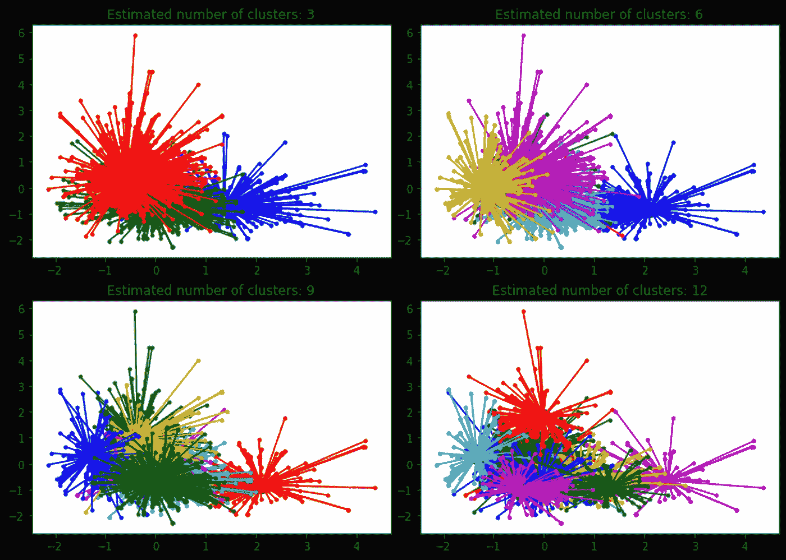

# 了解相似性传播聚类:SciKit 实践-学习

> 原文：<https://medium.com/mlearning-ai/understanding-affinity-propagation-clustering-hands-on-with-scikit-learn-12447b69928c?source=collection_archive---------0----------------------->

## 无监督学习—聚类

亲和传播是一个相对较新的模型，由 Brendan Frey 和 Delbert Dueck 在 2007 年首次发表。就资源消耗而言，该模型有点复杂，因为它需要我们的机器执行几项操作，但我将尝试用简单的语言向您解释它…