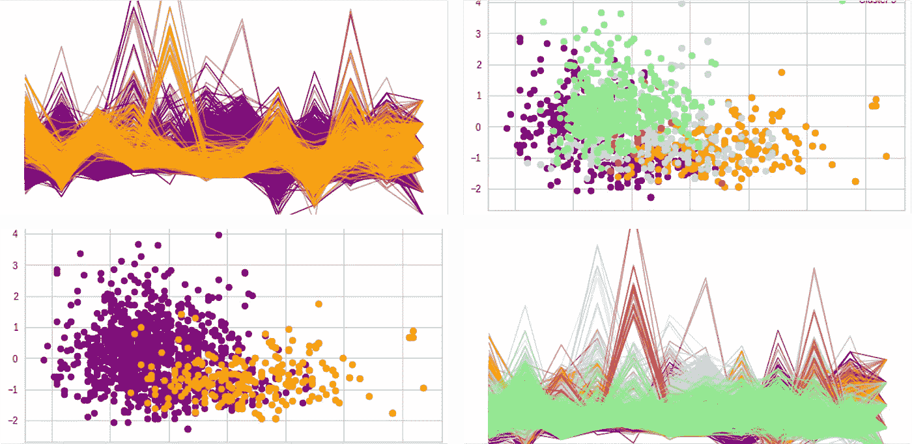

# 理解聚集聚类:SciKit 实践-学习

> 原文：<https://medium.com/mlearning-ai/understanding-affinity-propagation-clustering-hands-on-with-scikit-learn-69406b1cdb1a?source=collection_archive---------2----------------------->

## 无监督学习—聚类

凝聚聚类，也称为凝聚嵌套(AGNES)，是一种非监督学习算法，它通过形成具有相似观察值的连续对(从单个数据点开始)来工作，直到所有数据点都被分配到一个聚类。