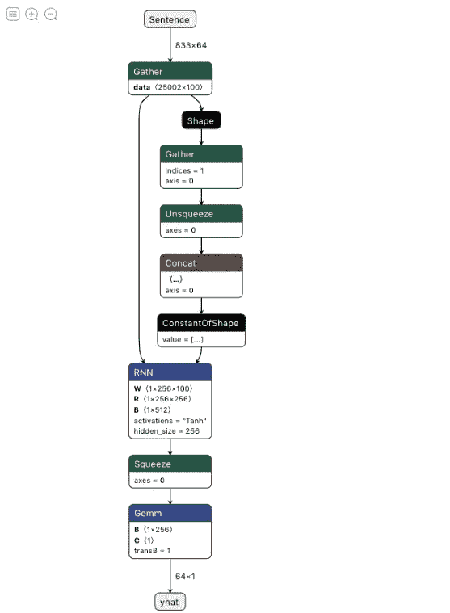

# 理解和使用 PyTorch 创建模型的类结构🔥

> 原文：<https://medium.com/mlearning-ai/understanding-and-using-the-class-structure-for-creating-models-with-pytorch-76e2502e8d7e?source=collection_archive---------0----------------------->


Photo by [Hitesh Choudhary](https://unsplash.com/@hiteshchoudhary?utm_source=medium&utm_medium=referral) on [Unsplash](https://unsplash.com?utm_source=medium&utm_medium=referral)

为了在 PyTorch 中创建通用模型，我们使用`nn.Sequential` API 并创建我们的神经网络模型。

```
**model** **=** **nn.Sequential(**
          **nn.Conv2d(**1**,**20**,**5**),**
          **nn.ReLU(),**
          **nn.Conv2d(**20**,**64**,**5**),**
          **nn.ReLU()**
        **)**
```

这种结构的问题是，你不能有混合模式。创建复杂的模型，并且您不能完全控制您的模型并在模型上传递数据。

为了完全控制模型并创建一个在真正的机器学习中对我们有帮助的模型，我们可以使用类 like 结构并从 PyTorch 模块类继承`torch.nn.Module`来做同样的事情

```
import torch 
import torch.nn as nn class MyModel(torch.nn.Module):
     def __init__(self):
         super(MyModel,self).__init__()
         self.lay1 = nn.Conv2d(1,20,5)
         self.lay2 = nn.Conv2d(20,64,5)
         self.flatten = nn.Flatten()
         self.relu = nn.ReLU()

     def forward(self,inputs):
         ins = self.relu(self.lay1(inputs))
         ins = self.relu(self.lay2(ins))
         output = self.flatten(ins)
```

这里的优势是您可以完全控制数据如何流入模型。您可以拥有多个层和混合结构，如下图所示



当你控制你的模型中的整个数据流时，让我们看一下我们之前代码中的每个部分显示了什么

# 类结构中 __init__ 是什么？

该方法有助于 python 中的面向对象编程。这是一个保留的方法，它充当我们类的构造函数。

构造函数是初始化类中内容的第一件事，当我们创建模型的对象时，它是第一个被调用的方法，并且将使用随机权重初始化我们的 Conv 和线性层

# 什么叫超级(MyModel，self)。__init__()在做什么？

`super(MyModel, self).__init__()`是指这是`nn.Module`的子类，并且继承了所有方法。定义好这个之后，我们就可以使用 PyTorch 的`nn.Module`类中已经实现的所有预处理代码了。

## 简而言之，super 方法允许您使用 torch.nn.Module 类中实现的所有模块。

# 课堂上的自我是什么？

self 表示类的实例。该属性可用于访问类中定义的属性和方法(函数)。在上面的例子中，我们使用 self 来声明层，这样我们就可以在 forward 方法中使用它们。

# 什么是正向法？

这个方法是我们模型的驱动方法，这是在训练循环中调用我们的模型后，我们层的权重得到更新的地方。

> 感谢你阅读我的博客:)关注更多，在评论中向我问好，这给了我写更多博客的鼓励:)祝你有美好的一天:)