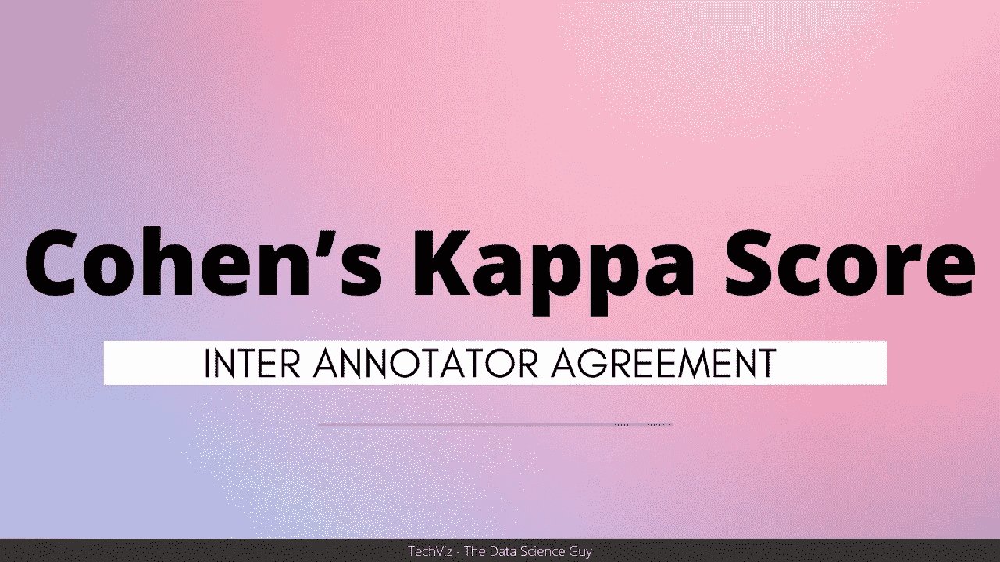

# 从一个例子看科恩的 Kappa

> 原文：<https://medium.com/mlearning-ai/understanding-cohens-kappa-with-an-example-6350c5a2fc3e?source=collection_archive---------3----------------------->

## 注释者间协议评分

*在这篇博客中，我将讨论科恩的 Kappa，并为大家展示一个计算该 Kappa 的实用示例。*

在构建端到端机器学习管道的早期阶段，控制用于训练机器学习模型的数据质量是非常重要的一步。简单地说…