# 了解高斯过程

> 原文：<https://medium.com/mlearning-ai/understanding-gaussian-processes-ac348aa546a2?source=collection_archive---------2----------------------->

机器学习正迅速成为科学界最热门的话题之一，这是有充分理由的。它可用于许多领域，通常比人工分析更高效、更准确。具体来说，高斯过程通常用于最大限度地优化函数。例如，在风力发电领域，高斯过程不仅可以用于确定最大扭矩的最佳涡轮机角度，还可以用于找到整个领域中涡轮机的最佳布局。高斯过程的另一个例子是在生物工程领域，它们被用来优化蛋白质序列的设计。机器学习拥有巨大的潜力和广阔的范围，这使得理解它非常重要，但如果没有以前的经验，看到超级复杂的功能和奇怪的术语会令人望而生畏，这往往会阻止人们学习更多。

想象给你一个有十个旋钮和一个灯泡的儿童玩具。这十个旋钮对灯泡有不同的作用，有些是调暗，有些是调亮，有些旋钮可能会增加或减少其他旋钮的效果，这取决于它们的组合方式。现在假设你想优化灯泡，使其尽可能亮。你可以花很长时间对每个旋钮进行反复试验，试图弄清楚它们是如何一起创造出最亮的灯泡的，但这可能要花很长时间。相反，您可以使用高斯过程创建一个预测模型，将您的十个旋钮都作为输入，这样会更快，需要的尝试更少。

然而，拥有一个 10 维的输入从一开始就很复杂，所以假设你只想在最少的可能实验中找到 below 函数的最大值。

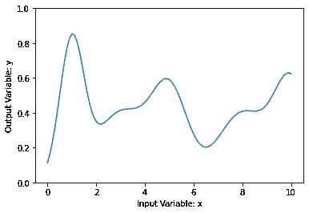

Example 1 Dimensional Input Function

我们可以从尝试对 3 个随机选择的起点进行线性回归开始。

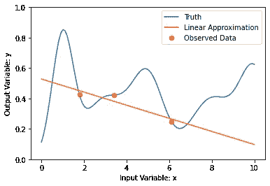

Linear Regression With 3 Known Points

在进行这些实验时，我们不知道函数的真实形状，所以我们继续选择回归最大值处的下一个点。

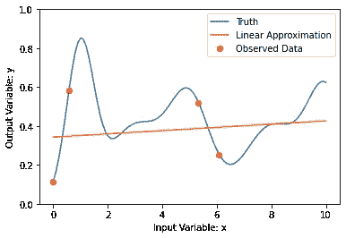

Linear Regression With 4 Known Points

在这一点上，很明显，我们的线性回归是我们真实函数的可怕近似，因为它不经过我们的任何观察点，并且通过均匀地观察整个函数，它变得更加清楚，线性近似永远不会是准确的。

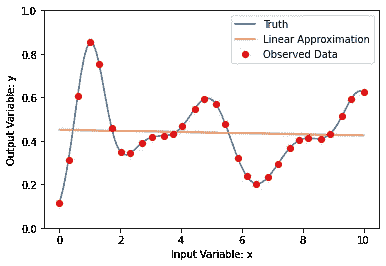

Linear Regression With Full Knowledge

我们将使用所谓的高斯过程，而不是使用线性回归，这是一种机器学习模型，可以对我们的函数进行准确预测。

我们再次选择 3 个完全随机的初始值，但是这次使用 GP 近似值来估计我们的函数。

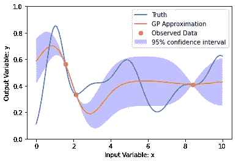

GP Approximation With 3 Known Points

如果我们接着重复与线性函数相同的过程，通过基于我们 GP 的相信的最大值选择我们的下一个点，我们可以通过慢慢学习更多来找到未知函数的真实最大值。

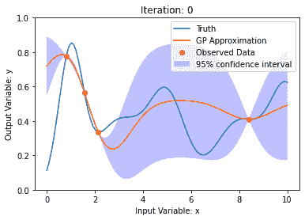

20 Iterations of Gaussian Process Learning

在上面的例子中，高斯过程确实相对较快地找到了真正的最大值，这就是为什么它停止探索函数的其余部分，并且只选择相信的最大值作为下一个要测试的点。虽然速度很快，但我们目前的方法有许多问题，陷入局部而不是绝对的最大值。

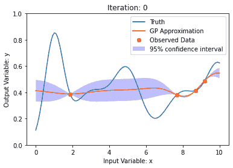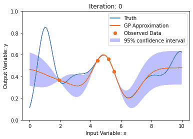

正如您在上面的两个例子中所看到的，GP 从至少一个接近局部最大值的点开始，因为它只是根据它的最大值选择下一个最佳点进行测试，所以它永远不会进一步探索。我们可以通过使用所谓的获取函数来解决这个问题。

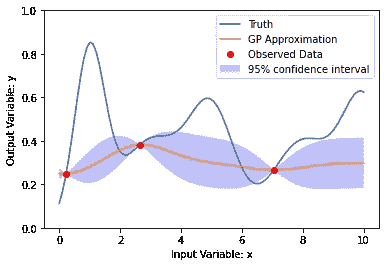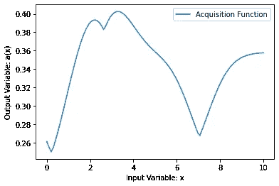

Simple Acquisition Function

该采集函数的等式为:

a(x) = μ(x) + γ*σ(x)

在此函数中，μ(x)表示 GP 近似值，σ，σ(x)表示函数的标准差。γ，γ，是一个预先设定的常数，你可以按照你认为合适的方式来设定。在这种情况下，我们观察的最佳新点将在大约 x=3 处，这是我们采集函数的最大值。

通过将标准偏差纳入我们的采集函数，它考虑了一个区域的最大值和不确定性，从而创造了更多的勘探机会，减少了卡住的情况。伽玛值越高，采集函数越倾向于探索未知区域，反之，伽玛值越低，采集函数越倾向于利用已知最大值的区域。通过基于我们的采集函数的最大值选择我们的下一个点，我们获得了比以前更加一致的结果。

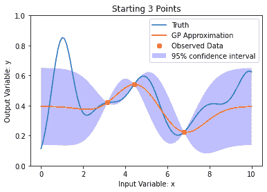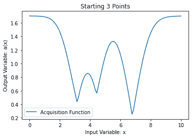

10 Iterations of Gaussian Process With Simple Acquisition Function

到目前为止，我们已经为我展示的所有例子使用了一个 gamma，但是如前所述，gamma 的值可以调整以平衡我们采集函数中的勘探和开发。

通过运行 100 个实验，每个实验有 3 个随机起点，并绘制它们的最大观察值，很容易观察到不同伽马值的影响。

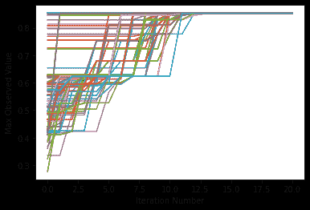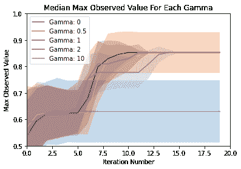

100 Experiments With Gamma = 1 (left) - Comparison of 5 Gamma Values (right)

左边的第一个图是一个使用 gamma = 1 的例子，显示了所有 100 个随机起点的实验是如何组合在一起的。通过绘制这 100 条线的中间值和标准偏差的阴影，很容易看出不同伽马值的影响。当伽玛值非常低时，如 0 和 0.5，高斯模型达到不正确的最大值，标准偏差无限期地保持在高水平。当伽玛值非常高时，如 10，高斯模型会搜索整个函数，需要更长的时间才能找到真正的最大值。这就是为什么 1 左右的 gamma 值对这个问题有好处，因为它带来了速度和准确性的良好平衡。

高斯过程不仅可以用于模拟简单的一维输入函数，还可以扩展到二维输入，甚至更多。下面这个具有 2 个输入维度的简单问题将说明如何以这种方式使用高斯过程。

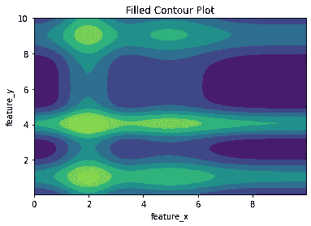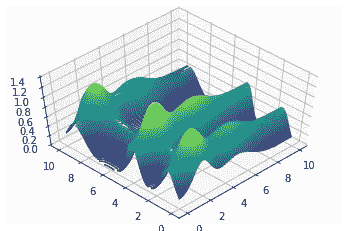

Countour and 3d Plots of Simple Example Problem

使用相同的优化方法和获取函数，我们可以再次选择 3 个随机起始点，并创建精确的高斯模型。

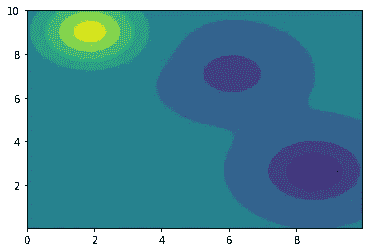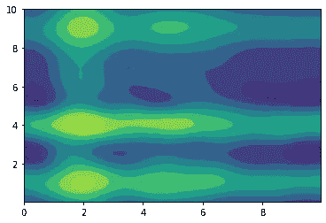

Graph of 3 Random Starting Points (left) and Gaussian Model After 150 Iterations (right)

到目前为止，我们只使用 a(x) = μ(x) + γ*σ(x)作为简单的获取函数，但是有无数不同的可能获取函数。一种常见的更复杂的采集函数称为归一化函数。在此函数中，将高斯过程近似值和标准偏差除以它们的最大值来归一化数据，如下所示:

a(x) = μ(x) /(最大μ(x)) + γ*σ(x) /(最大σ(x))

因为我们正在使用一个新的采集函数，我们现在应该测试在这种情况下是否有一个新的更优的 gamma 值。使用运行 100 个实验的相同想法，但是使用 2D 输入和新的采集功能，产生如下图所示的图形。

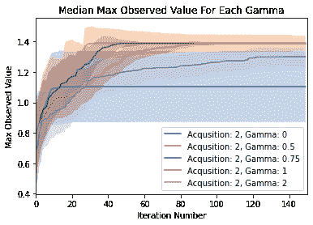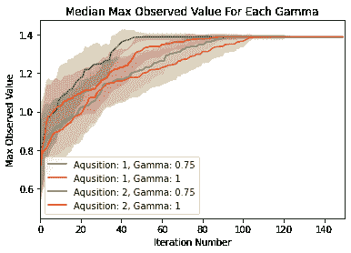

Comparison of 5 Gamma Values (left), Comparison of Two Acquisition Functions (right)

在这两个图中，采集 1 和 2 分别代表旧的简单采集函数和新的归一化采集函数

左边的图表清楚地显示，对于这个新问题和采集函数，0.75 的 gamma 是最快的，并且不会牺牲精度。此外，右图显示，通过使用新的标准化采集函数解决这个更复杂的问题，性能有了很大的提高。

高斯过程不仅在解决具有很少局部最大值的简单问题时非常有效，而且可以用来解决复杂得多的问题，正如现实世界中的许多问题一样

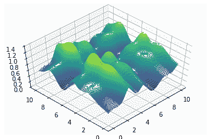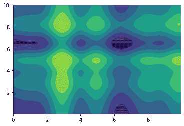

使用相同的精确归一化采集函数和 0.75 的伽马值，高斯模型可以非常快地适合这个超级复杂的问题。

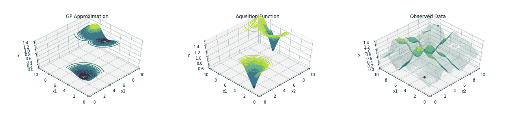

Normalized Acquisition Function Point Selection

Random Point Selection

使用归一化采集函数的高斯过程拟合和使用随机点的高斯过程拟合的速度之间的比较说明了智能点选择的有效性和重要性。

无论是因为尝试次数有限而进行的优化，还是对速度和成本效益的渴望，这些优化方法在许多行业中都非常有用。允许你在最少的实验中最大化期望的输出可以导致更快的增长，并且对于优化人类无法单独解决的复杂问题是必要的。

 [## Mlearning.ai 提交建议

### 如何成为 Mlearning.ai 上的作家

medium.com](/mlearning-ai/mlearning-ai-submission-suggestions-b51e2b130bfb)