# 彻底了解梯度下降

> 原文：<https://medium.com/mlearning-ai/understanding-gradient-descent-with-simple-mathematical-intuition-e8a2246638cf?source=collection_archive---------5----------------------->

# 概念背后有什么大惊小怪的！

简而言之，梯度下降是一种 ML 优化策略，它有助于 ML 模型找到与最佳可变参数相关的最小损失(成本)函数。

Courtesy : Pixabay

让我们通过将其应用于 ML 工程师和数据科学家使用的最常见的回归算法之一，即线性回归，来详细理解这个概念。

为了便于理解梯度下降，我们将使用单变量线性回归，重点是确定一个自变量和一个因变量(目标变量)之间的关系。

一元线性回归在数学上表示为 **y = mx+c** ，其中' **y'** 为因变量，' **x'** 为自变量或目标变量。m 和 c 分别是斜率和截距，这两个我们都需要借助梯度下降来优化。

我们将考虑一个工资与教育的典型例子，其中工资将是我们的因变量，沿 y 轴表示，而教育将沿 x 轴表示。

下面的散点图清楚地显示了两个变量之间的线性趋势

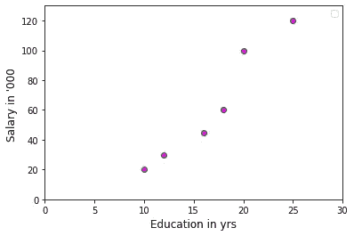

The data points are showing linear trend

现在，因为我们需要找到这两个变量之间的最佳线性关系，我们的工作是找到一条完美的线，它可以最好地描述这两个变量(x 和 y)之间的行为。根据 ML 术语，这条线被称为“回归线”。

梯度下降将帮助我们找到最佳拟合线，不仅具有最大的准确性，而且通过优化“m”(斜率)和“c”(截距)，使计算成本低廉。

我们先画一条截距= 0 的随机线，表示它会经过原点(0，0)，我们让斜率(θ)= 0.45。通过将= 0.45 的值代入 tan(0.45)，我们得到 m = '1.619 '

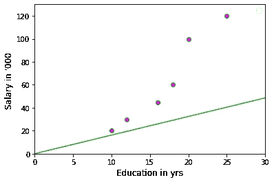

The intercept of 0 signifies the origin position and as we increase it’s value, it starting position changes vertically along the y-axis.

*注意:我们已经随机选择了截距和斜率的值。你可以选择你想要的任何东西。*

从这些斜率和截距的随机值开始，我们将给出梯度下降法。

我们问题的数学表达式如下:

## **工资=斜率*教育年限+截距**

将这些随机值代入等式，我们得到:

## **== >工资= 1.619 *教育年限+ 0**

***注意:*** *我们可以从任何初始值开始，不一定是 0 和 1.619*

我们将看到这条线如何用最小损失函数拟合两个轴上的数据。我们将使用**“残差平方和”**，它是回归算法中的损失函数之一，用于评估我们的拟合线。

ML 中有一项是回归算法中任何损失函数的前身。它被称为“误差项”。

通过取实际值和预测值之间的差来计算误差项。回归线基本上给我们提供了每个数据点(因变量的数据点)对应于每个自变量数据点(即本例中的工资)的预测值。

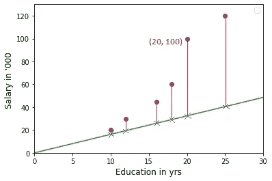

The purple point corresponds to the actual datapoint while the blue cross on the regression line corresponds to predicted datapoint

让我们把教育的实际价值代入上一个等式，比如说 20 年，来计算预测的工资

## **== >工资= 1.619* 20+ 0 = 32.38**

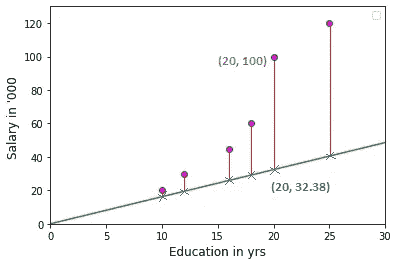

Actual vs Predicted data points

我们现在将通过取 ***【实际工资和预测工资】*** 之间的差来计算残差(误差项)

## **== >残差= 100–32.38 = 67.62**

# 价值函数

我们将考虑我们在最初讨论中提到的成本函数(损失函数)，即**“残差平方和”**

残差平方和(SSR)是对应于因变量(即工资)的每个数据点的残差平方和

## **= =>****SSR =(3.80)+(10.57)+(19.09)+(30.85)+(67.62)+(79.52)**

## **== > SSR =** 12339.84

> *我们的目标是最小化 SSR 的成本函数*

# **可视化截距值与 SSR**

我们可以设想一组截距值，将其代入残差平方和的等式，以查看相对于最佳截距值的最小 SSR。

让我们看看如何将各种截距值代入等式，以获得一系列 SSR。

> 残差平方和=
> 
> (20 —(截距+ 1.619 * 10)) + (30—(截距+ 1.619 * 12)) + (45—(截距+ 1.619 * 16)) + (60 —(截距+ 1.619 * 18)) + (100 —(截距+ 1.619 * 20)) + (120—(截距+ 1.619 * 25))

通过插入不同的截距值，我们可以得到如下所示的散点图:

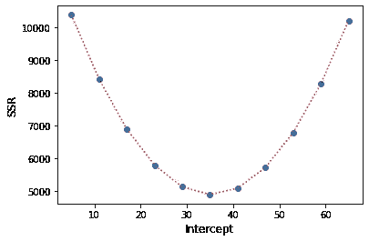

Intercept vs. SSR

# 梯度下降的数学直觉

根据 towardsdatascience.com 的说法，梯度下降是**一种迭代一阶优化算法，用于寻找给定函数的局部最小值/最大值。**

这意味着我们需要找到成本函数的导数，在这种情况下是 SSR，以找到最佳截距和斜率。最佳或最优斜率和截距将能够以最高效率解释线性回归模型。

让我们找出 SSR 相对于截距的一阶导数。让我们看看这个结构会是什么样子:

> **d(SSR)/d(截距)** = d(∑(实际薪资值-预测薪资值))/d(截距)

# SSR 对截距的一阶导数

**== > d(SSR)/d(截距)=**

**d** (20 —(截距+ 1.619 * 10)) / **d(截距)+ d** (30 —(截距+ 1.619 * 10)) / **d(截距)+ d** (45—(截距+ 1.619 * 10)) / **d(截距)+ d** (60 —(截距+ 1.619 * 10)) / **d(截距)+ d** (截距

***通过计算上面的等式，我们得到:***

***d(SSR)/d(截距)=***

*-2(20 —截距+ 1.619*10) -2(30 —截距+ 1.619*12) -2(45—截距+ 1.619*16) -2(60 —截距+ 1.619*18) -2(100 —截距+ 1.619*20) -2(120 —截距+ 1.619*25)。*

现在，让我们将开始时的初始截距值 0 代入上述等式。

***d(SSR)/d(截距)=***

***= =>****-2(20—0+1.619 * 10)-2(30—****0****+1.619 * 12)-2(45—****0****+1.619 * 16)-2(60—****0】***

**= =>**(-72.38)+(-98.856)+(-141.808)+(-178.284)+(-264.76)+(-320.95)

**== > — 1077.038**

因此，当截距为零时，曲线的斜率变为-1077.38

> **斜率 1:**

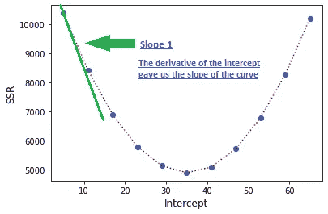

The first derivative gave us the slope of the curve which is -1077.38 at Intercept = 0

梯度下降逐一检查这些斜率，并通过越来越接近斜率 0 *来尝试达到截距的最佳值(因为斜率= 0 意味着线与截距轴水平，这直接转化为最小 SSR)* 。

**根据梯度下降的工作原理，**当我们远离我们的理想斜率值 0 时，我们采取大的步骤来达到最佳截距，当我们接近 0 时，我们采取越来越小的步骤。

我们现在将看到梯度下降的作用！！！

# **梯度下降(步长):**

步长有助于我们向新的截距值收敛

步长=斜率 X 学习率

让我们取学习率为 0.1，并代入上述等式

**步长= -1077.038 X 0.01 =-10.770**

***== >新截距=初始截距—步长***

***== >新截距= 0-(-10.770)= 10.77***

> **坡度 2:**

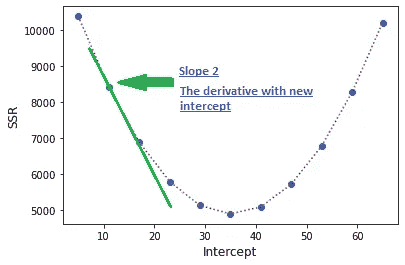

The first derivative with the new intercept of 10.77 gave us the second slope

我们现在将把截距的新值插入到我们的等式中，这里我们从截距值 0 开始

***d(SSR)/d(截距)=***

***= =>****-2(20-****10.77****+1.619 * 10)-2(30****–10.77****+1.619 * 12)-2(45****–0****+1*

**= =>**(-50.84)+(-77.136)+(-120.268)+(-156.744)+(-243.22)+(-299.41)

**== > — 947.798**

我们将重复这些步骤来寻找新的步长和截距！！

步长= **-947.798 X 0.01 = -9.47**

***== >新截距=初始截距—步长***

***== >新截距= 10.77 — (-9.47) = 20.24***

> **斜率 3:**

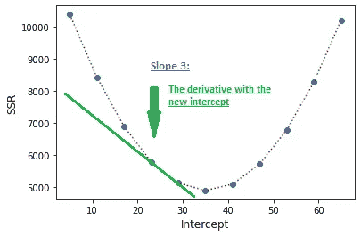

The first derivative with the new intercept of 20.24 gave us the third slope

我们现在将把截距的新值代入我们的方程，在这里我们把 10.77 代入方程

***d(SSR)/d(截距)=***

***= =>****-2(20-****20.24****+1.619 * 10)-2(30****–20.24****+1.619 * 12)-2(45*

**= =>= (-31.90)+(-58.376)+(-101.328)+(-137.804)+(-224.28)+(-280.47)**

**== > — 834.158**

步长=**-834.158 X 0.01 =-8.34**

***== >新截距=初始截距—步长***

***== >新截距= 20.24—(-8.34)= 28.58***

> **斜率 4:**

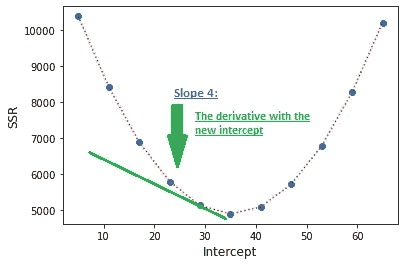

The first derivative with the new intercept of 28.58 gave us the fourth slope

我们现在将把截距的新值代入我们的方程，在这里我们把 20.24 代入方程

***d(SSR)/d(截距)=***

***= =>****-2(20–***)*28.58***(T10)+1.619 * 10)-2(30**–28.58((T16)+1.619 * 12)-2(45(T18)*–0*(T21)*+1.619*****

**= =>**(—15.22)+(—41.696)+(—84.648)+(—121.124)+(—207.6)+(—263.79)

**=>—734.078**

步长= **-734.078 X 0.01 = -7.34**

**=>新截距=初始截距-步长 **

**=>新截距= 28.58— (-7.34) = 35.92**

> **坡度 5:**

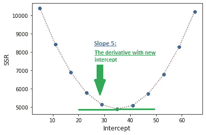

The first derivative with the new intercept of 35.92 gave us the fifth slope

我们可以看到，我们最终达到了一个截距，这个截距为我们提供了最小的 SSR，如果我们继续这个等式，SSR 将开始逐渐增加。

> 因此，35.92 的截距是最佳截距

# 可视化截取如何随每个步长而变化

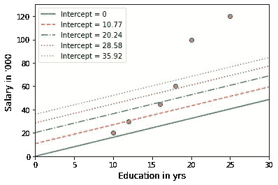

Gradual change in Intercept with respect to various line fits

# 结论:

> 我们将一阶导数的概念应用到成本函数中，以找到最佳的**截距**值。实际上，对于简单的线性回归，我们还需要找到最佳**斜率**值以及截距值。
> 
> 我们应用截距的整个过程对于斜率值是相同的。我们只需要分别求出斜率和截距的导数，并按原样重复步长和学习速率步骤，直到达到最佳斜率和截距值。

*如果您有任何关于数据分析、ML 或数据科学的疑问，请随时与我联系..更多即将到来！！！*

再见。！😊

 [## Mlearning.ai 提交建议

### 如何成为移动人工智能的作者

medium.com](/mlearning-ai/mlearning-ai-submission-suggestions-b51e2b130bfb)