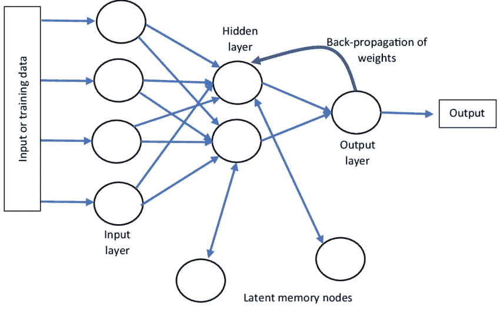
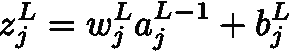
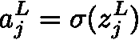
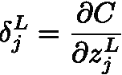
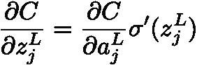
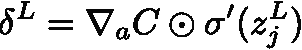
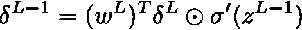
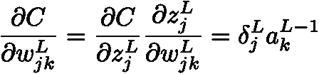
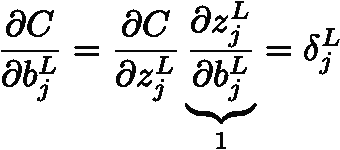

# 理解反向传播的工作原理

> 原文：<https://medium.com/mlearning-ai/understanding-how-backpropagation-works-3ed6c6c96f2e?source=collection_archive---------1----------------------->

反向传播算法是训练神经网络的基本算法之一。它使用链规则方法来找出改变权重和偏差如何影响我们想要最小化的成本函数。

为什么要反向传播？

嗯，当训练神经网络时，我们首先要计算神经元的所有值，并查看它产生的输出层(有时称为前向传递)。当面对实际结果时，我们可以计算损失函数。但是请记住，我们是在训练网络，因此我们实际上是在尽量减少我们的损失分数。在这一步，我们需要回过头来检查权重的微小变化会如何影响结果，并根据其对损失函数的影响信息更新权重。为此，我们需要计算损失函数相对于网络中任何权重和偏差的偏导数。在本文中，将推导和解释计算反向传播所需的所有公式。

对于实现反向传播非常重要的两个假设是:

1.  成本函数被表示为所有数据样本的平均和。这是因为在反向传播中，我们计算单个训练样本的偏导数，然后对所有梯度进行平均以形成一个步长。
2.  成本函数是神经网络输出的函数

我们将在本文的其余部分使用神经元的符号:

*z* 值是神经元的预激活输出，权重是 *w* ，而 *b* 是该神经元的偏置。激活函数是 sigmoid 函数。

层 L 中神经元 j 的误差定义为:

c 是成本函数。这个表达式将用于计算重量的偏导数。

我们知道:

因为我们定义了成本函数，所以相对于网络输出的偏导数是容易计算的。

我们现在可以将错误重写为:

这里我们使用 elementwise 产品。

让我们现在开始。

为了确定成本函数相对于任何预激活输出的偏导数(这实际上是我们定义的误差),我们仅应用链式法则:

我们已经可以看到，我们可以使用第 L 层的误差来计算第(L-1)层的误差，以基于矩阵的形式写成如下:

利用这个公式，从最后一层开始，我们可以计算任何一层的误差。

**成本相对于任何重量的变化率为:**

j-k 符号意味着它是连接从层 L-1 的第 k 个神经元到层 L 的第 j 个神经元的权重。

**成本函数相对于偏差的变化率:**

因为我们知道如何计算误差，我们已经完成了。

这些方程适用于反向传播。它们适用于每一个激活函数，因为我们使用的规则不是特定于函数的，但是要经常检查你的模型是否满足开头所述的假设。

 [## Mlearning.ai 提交建议

### 如何成为 Mlearning.ai 上的作家

medium.com](/mlearning-ai/mlearning-ai-submission-suggestions-b51e2b130bfb)