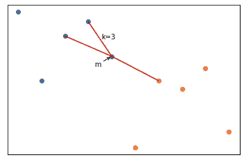
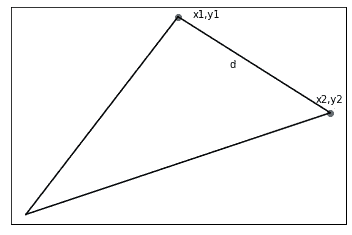
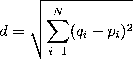
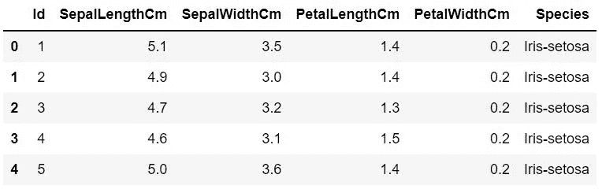
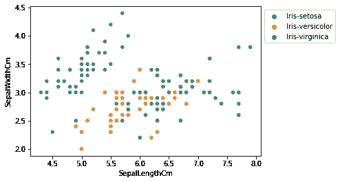

# 理解 K-最近邻算法——概念和实施指南

> 原文：<https://medium.com/mlearning-ai/understanding-k-nearest-neighbors-algorithm-concept-and-implementation-guidance-98126505fe8c?source=collection_archive---------4----------------------->

本文将解释 K-最近邻分类器算法背后的基本概念及其在 Python 编程语言中的实现。


Photo by [Breno Assis](https://unsplash.com/@brenoassis?utm_source=unsplash&utm_medium=referral&utm_content=creditCopyText) on [Unsplash](https://unsplash.com/s/photos/neighborhood?utm_source=unsplash&utm_medium=referral&utm_content=creditCopyText)

## 目录 **s**

1.  **监督机器学习分类器**
2.  **K-最近邻算法**
3.  **KNN 白手起家**
4.  **KNN 与 Scikit-learn**
5.  **关闭**

## 监督机器学习分类器

监督机器学习分类器的主要任务是根据新输入对已知输出进行分类。创建受监督的机器学习分类器就是建立一个模型，用于基于特征对标签进行分类。标签的类型是离散值，而特征可以是离散或连续的数字

举个简单的例子，想象一下幼儿园的孩子们学习猫的样子。他们的老师会给他们看不同的动物图片，有些是猫，有些可能是狗、马等等。

孩子们学会区分不同的图片是机器学习的一个简单定义。它们被“编程”来从一张新图片中识别一只猫，这是从过去给定的图片中学习来的。当他们看到一只猫时，他们说“猫！”如果不是猫，他们会说“不是猫！”。老师给他们看的图片是已知输出。术语“猫”和“不是猫”是标签*和动物图像是特征*。*他们试图猜测一张图片是否是猫图片，这是一项分类任务。那就是监督分类机器学习。*

## k-最近邻算法

K-最近邻算法——排序的 KNN——是机器学习领域中最简单的分类模型之一。简单性在于以下概念:



Image by the **Author**

看一下上图。这里有两个标签。我们给它们贴上**蓝色**和**橙色**的标签吧(可以是猫也可以不是猫，或者别的什么)。

让我们关注点**米**。不考虑其颜色，如何对点 **m** 进行分类？它是蓝色的还是橙色的？仔细看看这个图，相似的点往往彼此靠近，蓝点坐在其他蓝点旁边，同样的条件也适用于绿点。KNN 算法基于这一假设工作。

相似性的概念是通过两点之间的距离来实现的。再看一下这个图，有三条线代表点 **m** 到它所有三个邻居**的距离(k=3，因此 K 代表 KNN 的距离)**。从图中，你可以推断出点 **m** 是**一个蓝色**标签，因为它到最近的**蓝点的距离比最近的绿点短。**

如何测量两点之间的距离？有许多方法可以计算两点之间的距离。最流行和最熟悉的是欧几里德距离。



Image by the **Author**

在二维中，点被定义为两个变量(x，y)的对，两点之间的距离由下式给出:


Image by the **Author**

在 N 维空间中，一个点被定义为一对 N 个变量(q1，q2，…，qN)，两点 q 和 p 之间的距离由下式给出:



Image by the **Author**

假设，你有一个已知特征和标签(x 旧，y 旧)的数据集**，你想预测一个新特征(x)** 的标签(y)**，这就是 KNN 分类器的工作原理:**

> KNN 分类器会给你一个 ***标签****(****y)**的一个*****新的*******特征通过计算它与数据集中所有 ***已知特征和标签* *(x 旧，y 旧)*** 的距离，然后***

***可以推断出 ***标签***(***y)***的一个 ***新的*** ***特征(x)是已知特征和标签*******(x 旧，y 旧)中 k 最短距离内最常见的标签(y 旧)。*******

## ****KNN 从零开始****

****是时候用 Python 写 KNN 算法的实现了。Python 编程语言因其简单性和大量用于机器学习和科学的模块而广受欢迎。流行的选择是 **scikit-learn** 库，通常用于机器学习和数据分析。****

****为了提高您对机器学习领域的理解水平，特别是 KNN 算法，我们限制使用 **scikit-learn** 来分割数据集，以便仅训练和测试数据集。稍后，我们将向您展示如何使用 **scikit-learn** 机器学习模块来完全实现一个机器学习模型。好了，让我们从导入模块开始****

```
**import numpy as np
import pandas as pd

from sklearn.model_selection import train_test_split
from collections import Counter**
```

****上面导入的模块是:****

1.  ****[**NumPy**](https://numpy.org/) ，对于向量和矩阵的数值计算，也提供了像求平方根这样的内置数学函数。****
2.  ****[**Pandas**](https://pandas.pydata.org/) **、**用于将各种来源(文件、web 等)的数据集加载到一个称为 data-frame 的表状数据结构中，还提供了一堆统计分析工具。****
3.  ******S******
4.  ******计数器**是 Python 标准库中的一个内置模块，就像它的名字一样，它将用于对集合数据结构中的元素进行计数。****

****我们鼓励你使用面向对象的编程范式写下一个模型。因此，您不必在每次问题发生变化时都重写代码。KNN 类的模型模板可能如下所示。****

```
**class KNNClassifier:

    # Python constructor, k is number of neighbors
    def __init__(self,k=3):
        pass
    # fit the data to a model
    # X is the features, y is the labels
    def fit(self,X,y):
        pass
    # predict the labels from features X    
    def predict(self,X):
        pass
    # to calculate the accuracy of current prediction
    def accuracy(self,test,pred):
        pass**
```

****现在你必须完成这个模板中的每一部分代码。对于构造函数:****

```
**def __init__(self,k=3):
    self.k=k**
```

****您将 k(邻居的数量)设置为某个整数，k 的默认值是 3。当您实例化这个类时，您将编写:****

```
**knn=KNNClassifier() # default k=3
# or
knn=KNNClassifier(k=5) # k set to 5**
```

****要完成拟合方法，只需将参数中的 X 和 y 作为训练(已知要素和标注)传递给要素和标注的数据集。****

```
**def fit(self,X,y):
    self.X_train=X
    self.y_train=y**
```

****KNN 算法的工作原理是计算特征点到数据集中每个训练点的距离，离它最近的点或最短的距离将给出类别标签。所以，写一个计算欧几里德距离的方法****

```
**def _euclidean_distance(self,x1,x2):        
    return np.sqrt(np.sum((x1-x2)**2))**
```

****在将所有要素数据集应用于预测之前，您将测试单个要素点的预测，您不希望在尝试预测整个数据集时陷入 **for… loops** 的锅炉中。****

```
**def _predict_one_feature(self,x):    
   # calculate all the training features againt x    
   distances=[self._euclidean_distance(x,x_train) for x_train in self.X_train]    
   # sort the distance ascendingly then get the of top k points index number    
   k_idx=np.argsort(distances)[:self.k]
   # infere the label from array of k index     
   k_labels=[self.y_train[i] for i in k_idx]    
   # the output is the most common label
   most_common=Counter(k_labels).most_common(1)    
   return most_common[0][0]**
```

****要素数据集中所有点的预测方法如下所示****

```
**def predict(self,X):
    predictions=[self._predict_one_feature(x) for x in X]
    return np.array(predictions)**
```

****最后一个是精度法。这种方法将计算模型在预测某些标签时的准确性。它会将预测的标注与训练数据集中的标注进行比较，这两个标注之间相等标注的总和除以训练标注的数量****

```
**def accuracy(self,y_true, y_pred):
    accuracy = np.sum(y_true == y_pred) / len(y_true)
    return accuracy**
```

****现在 KNN 模型已经完成，是时候把你的 KNN 模型付诸行动了，这是你的最终模型。****

****为了测试你的模型，你将使用来自 [UCI 机器学习库](https://archive.ics.uci.edu/ml/datasets/iris)的 *Iris* Flower 数据集，或者如果你需要 CSV 版本，你可以从 [Kaggle](https://www.kaggle.com/uciml/iris) 下载。下载数据集并将其保存到 datasets 文件夹中，之后您将加载数据集****

```
**df=pd.read_csv("datasets/Iris.csv")**
```

****上面的脚本会将数据集加载到 Pandas 数据框中，加载完数据后，您可能想稍微浏览一下数据****

****要找到数据的形状，您需要编写以下脚本****

```
**df.shape # output: (150, 6)**
```

****数据帧包含 150 行和 6 列****

****现在您想看看这个数据框中有什么，但是渲染 150 行数据会浪费时间，您只是想从数据框的顶部查看它的数据****

```
**df.head()
# df.tail() to peek data from the bottom**
```

****输出将如下所示****

********

****image by the **Author******

****从输出来看，特性是以下列；“SepalLengthCm”、“SepalWidthCm”、“PetalLengthCm”和“PetalWidthCm”，标签是“物种”栏。然后，您可能想知道模型将预测多少个可能的标签****

```
**df.value_counts("Species")Species
Iris-virginica     50
Iris-versicolor    50
Iris-setosa        50
dtype: int64**
```

****将从您的模型中预测三个标签。****

****在使用这些数据集运行模型之前要做的最后一件事是可视化，您将获得关于数据集中的点以及它们之间的相似性的提示，为了实现这一点，导入可视化模块: **Matplotlib** 和 **Seaborn******

```
**import seaborn as sns
import matplotlib.pyplot as plt**
```

****比方说，您想要绘制“SepalLengthCm”与“SepalWidthCm”的图形，以查看它们之间的关系****

```
**sns.scatterplot(x='SepalLengthCm', y='SepalWidthCm',
                hue='Species', data=df, )
plt.legend(bbox_to_anchor=(1, 1), loc=2)**
```

********

****image by **Author******

****从图中，你可以看出:****

1.  ****刚毛鸢尾的萼片宽度较大，长度较小****
2.  ****鸢尾-海滨鸢尾具有较长的萼片长度和较短的萼片长度****
3.  ****杂色鸢尾的萼片长度和宽度适中****
4.  ****绿色鸢尾和杂色鸢尾略有相似，这两个种的作图数据似乎更接近****

****现在，您已经有了通过研究数据集获得的信息，是时候运行您的模型了。第一步是通过从数据框中提取数据，将数据框划分为要素和标注数据集。对于特征值，我们从“SepalLengthCm”、“SepalWidthCm”、“PetalLengthCm”和“PetalWidthCm”列中提取数据。为此，只需从数据框中删除“Id”和“Species”列，原始数据框保持不变。对于标签值，只需提取“物种”列。这些数据集然后被转换成 numpy 数组。****

```
**X=np.array(df.drop(['Id','Species'],axis=1))# features
y=np.array(df['Species'])#labels**
```

****要从数据集中获取训练和测试数据，必须使用 Sklearn 模块中的 train_test_split 函数。这将把原始数据集的 20%(或您想要的任何百分比)分割成测试数据集(X_test，y_test)，剩余的 80%将成为训练(X_train，y_train)集。****

```
**X_test,X_train,y_test,y_train=train_test_split(X,y,test_size=0.2,random_state=1234) #random state ensure you'll get same result every time you re-run this script**
```

****不要对这些变量的命名感到困惑，它们是这样的:****

```
**X_test => Acted as new features (x)
X_train => Acted as known features (x_old)
y_test => kept for the measurement of accuracy
y_train=> Acted as known label (y_old) of known features (x_old)
later on..
predictions=> Acted as predicted labels (y) of new features (x)**
```

****现在是你的模型执行预测的时候了****

```
**clf=KNNClassifier()
clf.fit(X_train,y_train)
predictions=clf.predict(X_test)**
```

****让我们看看你的模型有多精确:****

```
**accuracy=clf.accuracy(y_test,predictions)
accuracy0.9416666666666667**
```

****精度 0.94，挺好的。当然，你已经看到了来自*鸢尾数据集*的一些非常相似的特征，鸢尾-绿色鸢尾和鸢尾-杂色鸢尾之间的距离非常接近，所以错误可能来自试图预测这些物种的模型。****

****恭喜你。你做到了！你创造了你自己的 KNN 模型。这是您的完整代码****

## ******KNN 与 Scikit-learn******

****要使用 Scikit-learn 实现 KNN 算法，您必须从 sklearn 模块导入和 **KNeighborsClassifier******

```
**from sklearn import neighbors** 
```

****其余的步骤与您已经完成的类似****

```
**clf=neighbors.KNeighborsClassifier(n_neighbors=3)
clf.fit(X_train,y_train)
predictions=clf.predict(X_test)**
```

****现在，让我们看看准确性****

```
**clf.score(X_test,y_test)0.9416666666666667**
```

****sklearn 实现的精度等于你的模型。****

## ****关闭****

****通过理解距离的概念，你已经成功地实现了 KNN 算法。您还将结果与常用的机器学习模块 Scikit-Learn 进行了比较。尽管结果相当令人满意，但本指南的目的是让您对 KNN 算法的工作原理有一个基本的了解，而不是验证您创建的模型的正确性。您的模型在某些情况下可能无法执行，然后您会尝试寻找分类问题的其他解决方案，如 SVM 算法或朴素贝叶斯分类器。****

****[](/mlearning-ai/mlearning-ai-submission-suggestions-b51e2b130bfb) [## Mlearning.ai 提交建议

### 如何成为 Mlearning.ai 上的作家

medium.com](/mlearning-ai/mlearning-ai-submission-suggestions-b51e2b130bfb)****