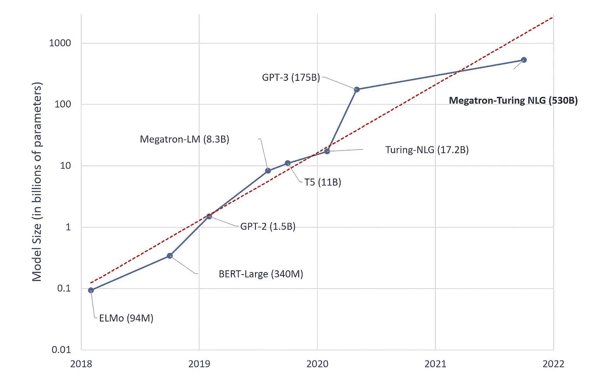
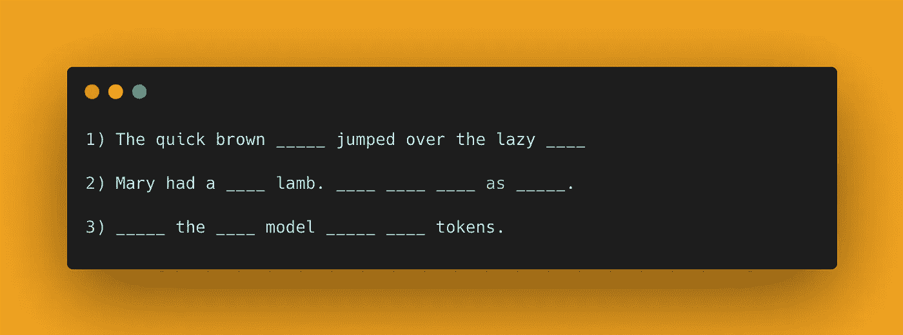

# 理解大型语言模型

> 原文：<https://medium.com/mlearning-ai/understanding-large-language-models-6664be71988e?source=collection_archive---------1----------------------->

看看生产力 Youtuber Ali Abdaal 的 Twitter 帖子:

乍一看，没什么不对的，而且从表面上看，这似乎是一个非常受欢迎的主题。这就是问题所在——它几乎完全是由一个冒充他的大型语言模型(LLM)编写的。事实上，它做得非常好，在发布后不久就获得了超过 100 万的浏览量和近 25000 次参与。

如果你的第一反应是“这是否意味着人工智能将取代我们的工作？”，放心吧。它不完全在那里。还没有。

写阿里线程的模型叫 GPT-3(生成式预训练变压器)。没有他的个性背景，除了他输入的几个词开始之外，它很快就产生了一个我们大多数人可能会感到自豪的 twitter 帖子。

由 OpenAI 于 2020 年 7 月推出的 GPT-3 可能是最知名的 LLM，因为它已经变得如此广泛，但有一整个家族的这些模型一样有能力，如果不是更多的话。例如，[谷歌在其搜索引擎中使用了其中的一个](https://blog.google/products/search/search-language-understanding-bert/)。没错。如果你今天谷歌了一些东西，你利用了一个叫做 BERT(来自变压器的双向编码器表示)的 LLM 的能力。我记得在某处读到过，自从谷歌开始使用它以来，特定的搜索结果提高了 7%。百度在其在线产品和服务中使用了另一种叫做[厄尼](https://arxiv.org/abs/1905.07129)的物种。

我能感觉到你心中的许多疑问——“为什么这些被称为大型语言模型？”，“它们是如何工作的？”，最重要的是，“为什么他们让我想起芝麻街？”。在接下来的几节中，我将尝试对这些进行分解。是的，芝麻街的问题也是。

# 什么是 LLM？

大型语言模型是基于 2017 年一项特定突破的神经网络，《变形金刚》(没有双关语)。它们之所以大，是因为 a)它们的大小是几千兆字节，b)它们是在巨大的(千兆字节规模)数据集上训练的。这些模型有数十亿个参数。想想像旋钮这样的参数，模型可以调整这些参数来学习东西。因此，它拥有的旋钮越多，它可以学习的复杂表示就越多。随着时间的推移，这些模型变得越来越大，功能也变得更加强大。

The rise of transformers

所以我们知道为什么它们被称为大型语言模型。他们真的这么重要吗？嗯，算是吧。他们可以在有限或没有监督的情况下做任何事情，从写文章、创建图表到写代码(是的，很可怕)。不过，从根本上说，它们被训练做的只是预测句子中的下一个单词——是的，类似于你手机上的自动完成功能。那么，为什么你需要一个大的模型和数据集来处理这些琐碎的事情呢？接下来让我们来看看。

# 为什么它们很大？

想象你有一只神奇的鼠标(我说的是想象)。通过向它展示你想要完成的 5 个任务的例子，不管有多困难或不同，你都可以训练它成为世界级的专家。不需要举很多例子。几个就够了。那该多棒啊。

现在想象你有一头神奇的奶牛。这只牛可以做和你的神奇老鼠一样的 5 个任务，但是更好。此外，它还能完成鼠标无法完成的 5 项新任务。更好，对吗？

再逗我一次，想象一下上帝赐予你一只神奇的恐龙。这可以超越奶牛(现在是吗啡时间了)，甚至在奶牛能做的 10 项任务中做得更好，并做另外 5 项新任务。你明白我的意思了吗？

LLM 之所以引人注目，是因为一个模型可以用于多项任务。随着模型的大小(参数)增加，它可以学习更复杂的表示，因此可以比较小的模型做得更好。更重要的是，他们可以从少数例子中学习新的任务。这些任务可以是我之前提到的任何事情，甚至更多！这就是为什么研究人员试图扩大这些模型的规模。

接下来出现的自然问题是这些模型究竟是如何学习的。

# 他们是如何学习的？

这些模型分两个阶段学习——预训练和微调。

# 预训练

在预训练阶段，目标是通过向模型展示大量示例(想想几十亿个)来教会模型语言的语义、结构和语法。和机器学习的情况一样，我们只是简单地向模型展示例子，让它自己学习规则。

预训练是学习过程中时间最长、计算量最大的部分。一个模型被一遍又一遍地展示例子，最终学会了规则。那么，它是如何学习的呢？

以下是目前实践中常用的几种预培训方法:

*   **下列句子中接下来是什么？**

这就是 GPT 模型家族的训练方式。给定一个不完整的句子，他们必须预测句子中的下一个单词，然后是下一个，以此类推。即使我们可能有一个完整的句子，我们可以展示模型，但我们没有。这可以防止模型作弊并查看句子中可能出现的下一组单词。

*   **在下面的句子中填空**

你可能很幸运地猜出了前两个，但第三个可能很棘手。这就是所谓的屏蔽语言建模。在这种方法中，我们随机地在一个句子中删去单词，让模型猜测这些单词可能是什么。与前面的方法不同，我们向模型呈现一个完整的(但被空白的)句子，这样它就可以从空白两边的单词中学习。像 BERT 这样的模型使用这种方法进行预训练。

通过在一个大得离谱的数据集上反复这样做，这些模型学习了丰富的语言表示。但是如果它不能投入实际应用，那又有什么用呢？

这就是微调的用武之地。

# 微调

在微调阶段，我们可以采用预先训练的模型，并向它展示我们希望它解决的任务的示例。这可以是问题回答(尼尔·阿姆斯特朗是谁？)、情感分析(那条推文有意思吗？)，谈话，等等。与预训练阶段相比，这一阶段通常需要更少的时间和数据，这就是为什么这些预训练模型是非常宝贵的。

但这也提出了一个问题——“你从哪里获得这些数据来进行预训练？”

# 他们从中学到了什么？

如果你把世界上所有的书，所有的维基百科，所有你能从网上获取的文本都拿来，并吸收这些知识，你会有多聪明？嗯，这些模特就是这么喂的。在预训练阶段，这些模型在所有这些数据集上进行训练(相当于人类的集体意识)。这是它们设计得很大的另一个原因。较小的模型能学到的东西有限。在微调阶段，使用与您的应用相关的较小的内部数据集。

# 我们将何去何从？

尽管 LLM 有一些限制。首先，只有少数资金充足的组织可以训练这些模型，因为它们需要如此多的计算(数十万美元)。其次，它们并不环保，因为训练这些模型所需的能量相当于你几年的电费。更重要的是，这些模型是根据互联网上的信息进行训练的。这意味着他们可能会有偏见，学习有毒的东西，等等。鉴于他们擅长写作，虚假信息的传播是一个大问题。令人欣慰的是，全球的研究人员正在致力于解决这些问题。

这就是你的 ELI5 版本的 LLMs。最后，我还没有告诉你芝麻街的联系。嗯，[给你](https://www.theverge.com/2019/12/11/20993407/ai-language-models-muppets-sesame-street-muppetware-elmo-bert-ernie)。

# 🤖💪想要更多的想法成为一个多产的 ML 从业者？

每周，我都会发送一份时事通讯，提供实用的技巧和资源，以提升自己作为机器学习从业者的水平。 [**免费加入这里→**](https://newsletter.artofsaience.com)

 [## Mlearning.ai 提交建议

### 如何成为 Mlearning.ai 上的作家

medium.com](/mlearning-ai/mlearning-ai-submission-suggestions-b51e2b130bfb)