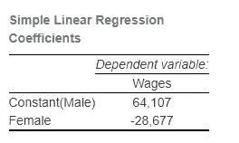
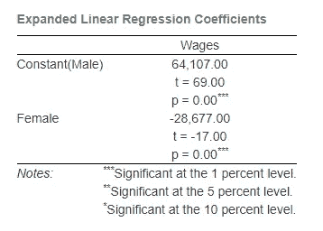

# 理解线性回归非常简单，经理也能做到

> 原文：<https://medium.com/mlearning-ai/understanding-linear-regression-is-so-simple-a-manager-could-do-it-b8df36f9dc8c?source=collection_archive---------6----------------------->

好吧，我承认这个标题是刻薄和不公平的，但它只是停留在我的脑海里，所以我去了。

在新雇主那里开始工作后不久，我向我的主管提出了一个研究项目，其中包括一个线性回归模型。主管解释说，我不能按照设计进行项目，因为我所在的小组没有提供预测或预言。我的建议是使用回归模型来理解变量之间的关系，而不是预测或预言。但是由于对这个小组来说相对较新，我没有进一步推动这个问题，而是改变了研究方案。

这让我意识到，学者们——至少当我最后一次在教室时——经常教授线性回归作为预测工具。但是，如何描述线性回归模型以帮助理解数据的想法一直困扰着我，直到我在数据科学背景下查看回归分析解释时发现了“啊哈”时刻。我希望下面的讨论也能为你提供一个“啊哈”的时刻(我希望我在学习计量经济学的时候就发现了这一点！)并将帮助您更好地理解线性回归，更好地向他人解释结果。

注意:我将讨论线性回归模型的几个简单例子，其中因变量“性别”和“婚姻状况”是只有两个值的二项式:0 或 1。我将只关注从数据中提取组均值，不会讨论线性回归假设。这里的目标是对回归分析建立一个简单而实用的理解。

# 一个天真的模型:平均值

利用密歇根大学收入动态小组研究的数据，我们将研究调查中与户主工资相关的几个因素。

对我们的因变量“工资”的最基本理解是集中趋势(即均值、中值、众数等)的度量。).由于人脑几乎不可能查看 6000+的工资列表并处理任何有意义的信息，因此我们经常想知道平均工资是多少，以至少对我们正在考虑的数据有一个基本的了解。计算一组工资的平均值(工资总额/工资数)被认为是一个幼稚的模型。这是天真的，因为我们绝对没有对数据的分布或其对任何其他数据的依赖性做出任何假设。目前我们只知道我们数据中的平均工资是 55，460 美元。

# 一元线性回归模型:控制性别

除了平均工资，数据中还有其他信息需要考虑，所以让我们从男性和女性的平均工资开始:

总和(工资，**男性** ) /男性**数量**工资= 64107 美元，以及

总和(工资，**女性** /女性**人数**工资= 35431 美元。

在这种情况下，我们计算两个天真的模型，每个性别一个，而不是整个样本只有一个。但是，我们也可以使用一个简单的单变量线性回归模型来得出男性和女性的平均工资(在此讨论中，我将放弃模型的学术规范，因为有几本学术教科书和在线资源提供了这样的讨论，而是专注于模型结果和解释):

从模型中得到的系数允许我们计算每个组的平均工资。将性别变量“性别”定义为因子，线性回归模型将性别解释为虚拟变量，其中 0 =男性，1 =女性。

如果你上过关于线性回归模型的统计学课程，你可能还记得简单的一元线性回归公式: *ywage=β0+βsex+ϵ.*这现在可以表现为工资= $64，107 + $-28，677(性别)。该常数与男性的平均工资相同。解这个等式，女性的性别=1，我们得到女性的平均工资是 35431 美元。

与仅仅考虑两个群体的平均值相比，我们可以使用统计软件包生成的线性回归结果来了解更多关于男女工资差异的信息。在这里，平均值的差异相当大，在数据集中有 6，815 人，我们希望它在统计上是显著的，而不仅仅是因为收集数据时的随机误差。我们可以通过查看线性回归输出中计算的 t 值来确认这一点。

在这种情况下，t 值的解释非常简单。计量经济学的基准是，t 值概率“Pr(>|t|)”小于 0.05 的系数具有统计显著性。但是从什么方面来说有统计学意义呢？好吧，回想一下，常数是我们数据中男性的平均工资，真实人口平均值= 0 的概率小于 1%。然而，这对女性来说没有 t 值概率重要。这个概率测试女性的工资在统计上是否不同于男性的工资。在这个模型中，由于随机因素，女性平均工资低于男性平均工资的概率小于 1%。

我们可以用这些信息来解释数据的几个方面。平均而言，男性的工资比女性的平均工资高 28 677 美元。此外，工资的性别差异是由随机误差造成的可能性非常低。我们可以相当自信地说，调查数据的差异存在于更广泛的人群中。

# 扩展到多元线性回归模型:控制婚姻状况

同样的理解也可以应用到一个多变量模型中，这个模型有一组更复杂的因素用来描述工资:婚姻状况。

在这里，除了调查对象是男性还是女性之外，我们还有几个对工资的潜在影响。与前面的单变量线性回归模型不同，这里使用的模型将是多变量模型，但同样的概念也适用。

与单变量回归模型类似，多变量模型有一个常数，表示平均工资为 74，207 美元的已婚受访者。每个婚姻状况类别的平均系数值是其与已婚受访者的常数平均值之差，即从未结婚的受访者平均比已婚受访者少挣 36，431 美元，丧偶者少挣 38，218 美元，以此类推。在这个模型中，了解常量值的含义是很重要的，因为大多数软件程序不会包含“已婚”标签(我手动添加的)，而只会将其称为“常量”或“截距”值。t 值概率解释类似于上面的单变量模型。在这个多元模型中，每个个体的婚姻状况平均工资在统计上是不同的(而且低得多！)从我们的基本案例——已婚受访者——的平均工资得出。请记住，这个模型没有告诉我们从未结过婚的受访者和丧偶的受访者之间的平均工资差异是否具有统计学意义，这两者非常相似。

最后一点。你可能听说过回归模型讨论中使用的术语“其他条件相同”或“其他条件相同”。这仅仅意味着我们只是将单个婚姻状况组与我们的基本婚姻状况进行比较。在这里，它具有直观的意义，因为每个回答者一次只能属于这些类别中的一个。

总而言之，理解线性回归结果就像理解一组数字的平均值一样简单。要从回归模型中计算其中一组的平均值，只需求解线性回归方程。与计算一组的简单平均值不同，大多数统计包的线性回归输出还包含一些信息，可用于指导我们确定平均值之间的差异是否是由随机机会造成的。