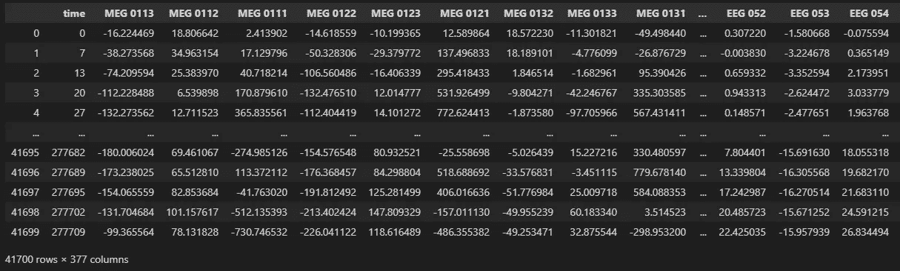
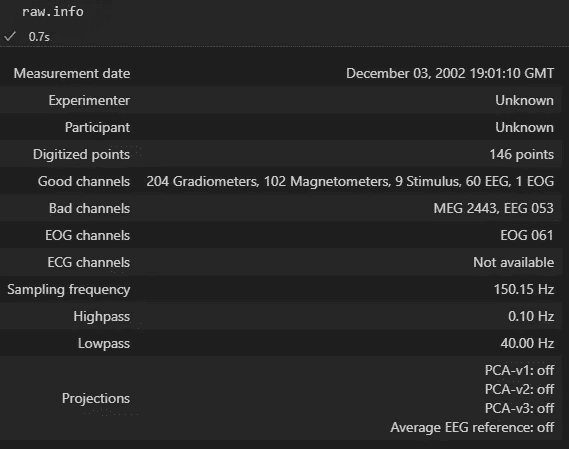
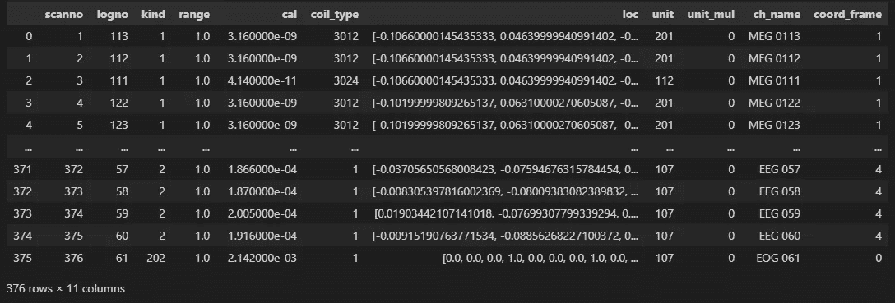

# 理解脑磁图/脑电图——python-MNE 初探

> 原文：<https://medium.com/mlearning-ai/understanding-meg-eeg-initial-exploration-with-python-mne-c5fb7f26c680?source=collection_archive---------5----------------------->

脑磁图和脑电图是神经科学研究中两种常见的高维数据来源，在这里我们试图对它们是什么以及它们如何在公共数据集中出现有一个初步的了解。

Photo Credit: Wikipedia

# 定义

> **脑磁图** ( **梅格**)是一种[功能性神经成像](https://en.wikipedia.org/wiki/Functional_neuroimaging)技术，通过记录[大脑](https://en.wikipedia.org/wiki/Human_brain)中自然产生的[电流](https://en.wikipedia.org/wiki/Electric_current)产生的[磁场](https://en.wikipedia.org/wiki/Magnetic_field)，使用非常灵敏的[磁力计](https://en.wikipedia.org/wiki/Magnetometer)来绘制大脑活动。 [SQUIDs](https://en.wikipedia.org/wiki/SQUID) (超导量子干涉器件)阵列是目前最常见的磁力计，而 [SERF](https://en.wikipedia.org/wiki/SERF) (自旋交换无弛豫)磁力计正在研究中，用于未来的机器。脑磁图的应用包括对感知和认知大脑过程的基础研究，在手术切除之前定位受病理影响的区域，确定大脑各部分的功能，以及[神经反馈](https://en.wikipedia.org/wiki/Neurofeedback)。这可以应用在临床环境中以发现异常的位置，也可以应用在实验环境中以简单地测量大脑活动。
> 
> **脑电图** ( **EEG** )是一种记录[头皮](https://en.wikipedia.org/wiki/Scalp)上电活动的[电图](https://en.wikipedia.org/wiki/Electrogram)的方法，该电图已被证明代表下面[大脑](https://en.wikipedia.org/wiki/Brain)表层的宏观活动。它通常是非侵入性的，电极[沿着头皮](https://en.wikipedia.org/wiki/Electrode)[放置](https://en.wikipedia.org/wiki/Scalp)。[皮层脑电图](https://en.wikipedia.org/wiki/Electrocorticography)，涉及侵入性电极，有时被称为颅内脑电图。(维基百科)

# 设置

由于我们将主要使用 Python 进行未来的分析， [MNE](https://mne.tools/stable/index.html) 将是我们处理脑磁图/脑电图数据集的首选工具。为了安装 MNE，我们在工作区中运行以下程序

随着软件包的安装，可以在这里找到一个全面的介绍，但是我们将从一个稍微不同的角度，尝试理解底层数据是什么样子的，以及我们可以用它做什么。为了获得示例数据集，我们运行以下代码

示例数据集以`.fif`文件格式存储，但也支持其他格式，更多选项见[此处](https://mne.tools/stable/overview/implementation.html#data-formats)。数据现在被加载并保存在`[Raw](https://mne.tools/stable/generated/mne.io.Raw.html#mne.io.Raw)` [对象](https://mne.tools/stable/generated/mne.io.Raw.html#mne.io.Raw)中。

# 探测

现在我们已经将原始数据加载到了一个`Raw`对象中，我们仔细看看它的[文档](https://mne.tools/stable/generated/mne.io.Raw.html#mne.io.Raw)。我们发现了一个名为`[**to_data_frame**](https://mne.tools/stable/generated/mne.io.Raw.html#mne.io.Raw.to_data_frame)([picks, index, scalings])`的方法，它的[文档](https://mne.tools/stable/generated/mne.io.Raw.html#mne.io.Raw.to_data_frame)表明这是我们检查底层数据的一个很好的起点，所以我们做了以下事情

Captured in VS Code for Jupyter

因此，我们得出了 375 个脑磁图和脑电图通道的读数(时间+1 列，眼电图(EOG)1 列，用于去除眼球运动的偏置)。很好很容易！然而，频道名称似乎没有告诉太多，所以我们开始想知道他们在空间位置方面的真正含义。不出所料，体贴的 MNE 包已经在`Raw`对象的`info`属性中提供了该信息，因此，如下所示，我们可以获得关于频道的信息。

Capture in VS Code for Jupyter

为了获得更详细的描述，我们可以进一步运行

Capture in VS Code for Jupyter

# 结论

在这个阶段，我们已经获得了长度为 41700 和 376 个特征的时间序列的脑磁图/脑电图数据，并提取了一些关于特征的基本元数据，非常简单，这要归功于 MNE 和源脑磁图/脑电图。对于接下来的步骤，根据具体的研究兴趣，可以计算描述性统计数据，并执行时间序列分析，以从这些数据集中获得进一步的见解。

 [## Mlearning.ai 提交建议

### 如何成为 Mlearning.ai 上的作家

medium.com](/mlearning-ai/mlearning-ai-submission-suggestions-b51e2b130bfb)