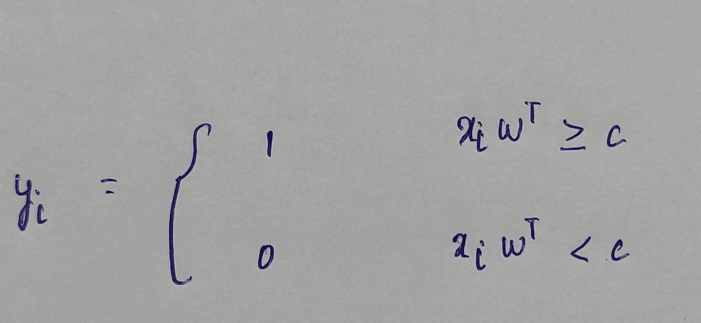
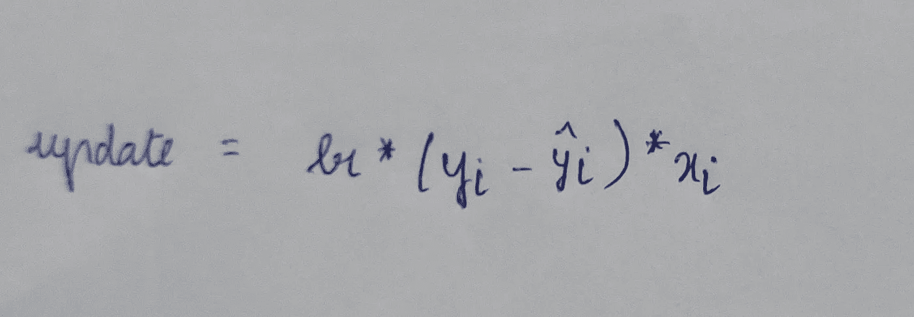
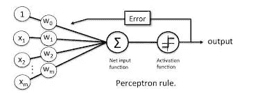
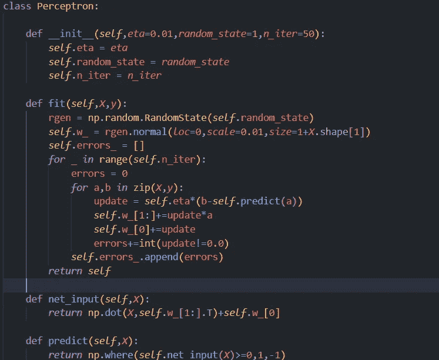
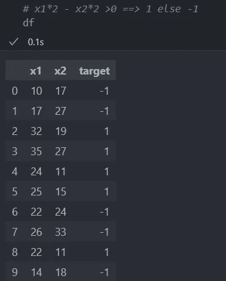
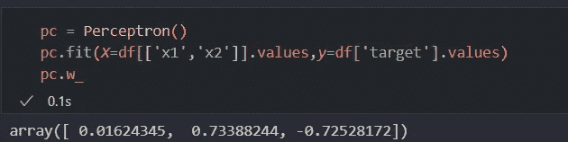
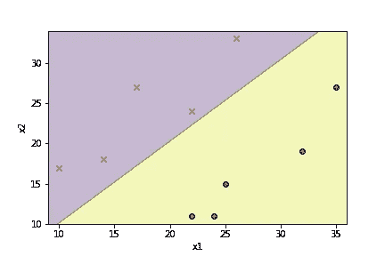

# 理解感知器

> 原文：<https://medium.com/mlearning-ai/understanding-perceptron-8e82a5a97ea?source=collection_archive---------6----------------------->

在本文中，我们来看看机器学习中最古老的分类算法之一——感知器。

贡献者:Sathya Krishnan Suresh， [Shunmugapriya](http://Priya Suresh on Medium https://medium.com/@pshunmugapriya) P

git hub Link:[https://git hub . com/sathyakrishnan 1211/undermination _ 感知器](https://github.com/SathyaKrishnan1211/understanding_perceptron)

**感知器算法**

让我们假设有一组 50 名学生参加一次体检。根据每个人在各种项目中的体检分数，他们被分配到第一组(线下)或第二组(线上)。考试的及格分数是 50 分，这是所有考试的累积分数。因此，如果一个人的分数低于 50 分，他将被分配到第二组或第一组。
这正是我们体内神经元的工作方式。对于发送信号的神经元，应达到阈值(在上述示例中为 50)。如果不符合阈值，信号将不会被触发。感知器算法的工作方式也与模仿神经元的**相同。**它可以预测一个学生属于二元分类中的第一组或第二组。当涉及到多个类别时，感知器使用一对其余(Ovr)方法对样本进行分类。

**感知器后面的数学**

当您用一定数量的特征拟合数据集时，感知器模型会尝试为每个特征找到 r **权重或影响**。这就像找到直线的斜率。每个特征的权重决定了相应特征对分类的**影响程度**。

假设“x”是一个样本数据集，目标标签是 y。w 是每个要素的权重向量。每当 xi 大于“c”时，yi 就是 1。这里 c 是阈值。

我们可以将公式左侧的“c”设为 0。在大多数机器学习模型中，这个“c”被称为“偏差单位”，表示为 w0。

您可能想知道权重是如何获得或初始化的。嗯，当您开始培训模型时，它们并不容易获得。最初，我们
给权向量取任意值。但是任意值以 0 为中心，标准偏差为 0.01(标准偏差为 0.01)，因为我们不希望权重在不知道数据集中值的范围的情况下取大值。).每当感知器模型错误地对样本行进行错误分类时，通过重复迭代通过数据集和**惩罚权重**获得**权重。**

这是在我们的模型每次预测一个结果之后将被添加到权重中的更新函数。这里 lr 是学习率，它是一个重要的参数，决定了我们希望我们的模型多快达到误差函数的全局最小值。yi 是 xi 的目标标签，而“yi cap”是我们的模型的类别预测。如果预测是正确的,“更新”函数将为零，我们不会更新我们的权重，但如果预测是错误的，我们将更新权重。在这里，样本行“xi”被相乘，因为我们想要根据错误的程度来惩罚我们的模型**。**

感知器模型的最终工作流程如下所示

**建立感知机模型**

在这一节中，让我们尝试基于上一节中讨论的数学来构建一个感知器模型。

这里给出的是 1v1 感知器模型的 python 实现。

让我们先讨论“适合”功能。“拟合”函数接受特征向量和目标标签。前两行函数初始化权重向量，其值以 0 为中心，标准偏差为 0.01。这里需要注意的重要一点是矢量的**形状。它比列数多一个值。这个**额外值就是偏置单位。**‘fit’函数有一个误差变量，用于查看在多次迭代后误差是增加还是减少。现在我们只是在感知器工作流程中反复循环 **n_iter** 次，这是在使用模型时必须指定的。内部 for 循环中的前三行构成感知器算法的核心。这些线的数学形式在上一节已经讨论过了。另一个需要注意的重要事项是，**偏差项不与任何东西**相乘，或者概括一下等式，我们可以假设它与 x0 相乘，其中 x0 始终为 1。**

“net_input”函数执行权重向量的转置和样本向量之间的点积。“预测”函数根据“net_input”函数的输出预测类。

**测试模型**

让我们用人工准备的数据集来测试这个模型。

上面人工准备的数据集有两个要素和一个目标标注，该标注有两个值- 1 和-1。‘x1’的系数是 2，而‘x2’的系数是-2。

观察权重向量的第二个和第三个值**。它们的绝对值几乎相等。原始系数也遵循该模式。现在我们来看看偏置单元。**偏差单位非常接近零**，因为该数据集的阈值为 0。这就是为什么偏置单位非常接近于零。权重向量的所有值都遵循我们在数学部分讨论过的数学公式。**

感知器模型就是这样划分训练行的。感知器的缺点之一是它的**只对线性可分的**数据有效。当训练数据不是线性可分的感知器时**将不能**收敛到特征的适当权重。

**结论**

在本文中，我们看到了感知器算法的数学和代码实现。这里的代码是针对 1v1 分类的，但是同样的概念也适用于对多个类问题进行分类。尽管该算法看起来很简单，但是多年来已经构建了该算法的许多高级版本，并且已经构建了许多基于该模型的高级模型。感知器算法只是起点。

 [## Mlearning.ai 提交建议

### 如何成为 Mlearning.ai 上的作家

medium.com](/mlearning-ai/mlearning-ai-submission-suggestions-b51e2b130bfb)