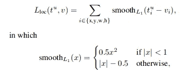
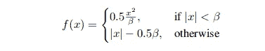
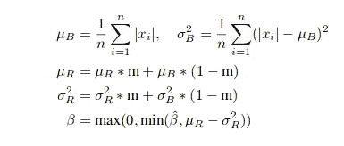
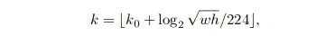
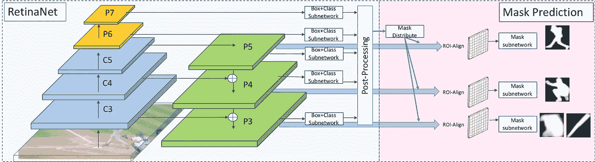
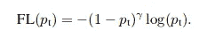
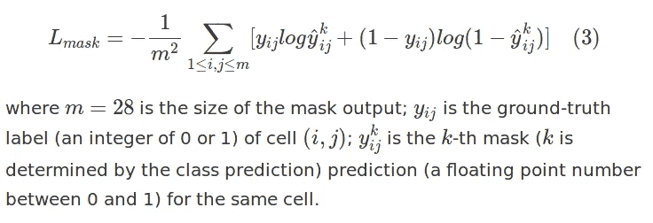
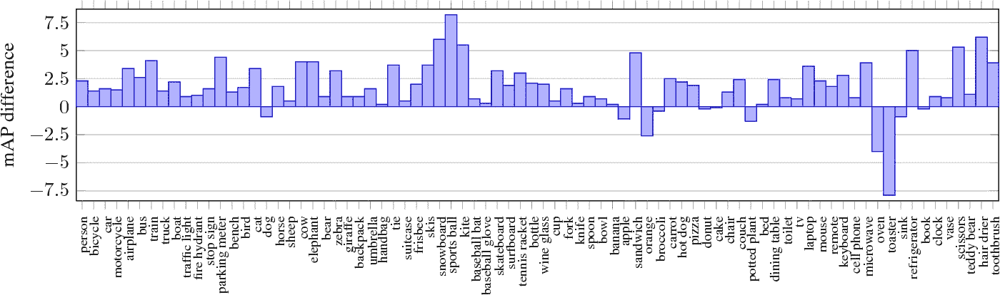

# 了解视网膜掩膜

> 原文：<https://medium.com/mlearning-ai/understanding-retinamask-e6f6feb814e5?source=collection_archive---------4----------------------->

# 介绍

***为什么***

单次检测器的精度与两级检测器相当，单次检测器在速度和计算资源是重要设计考虑因素的应用中非常受欢迎。

***如何***

这是通过从三个方面改进对最先进的单次检测器 RetinaNet 的培训来实现的:

1.  在训练期间向单触发视网膜检测器添加新的实例掩模预测头。
2.  一种新的自调整损失函数，提高了训练期间的鲁棒性。
3.  在训练中包括更多的正面例子，甚至是重叠度低的例子。

RetinaMask 具有与原始 RetinaNet 相同的计算速度成本，但更精确。此外，可以仅评估视网膜掩膜的检测部分。

# 模型

RetinaMask 建立在 RetinaNet 的基础上，对基线设置进行了三项修改。这三项修改是

1.  最佳匹配策略
2.  自调节平滑 L1 损耗
3.  掩模预测模块

**最佳匹配策略**

在边界框匹配阶段，RetinaNet 策略如下。所有与基础事实对象的交集(IOU)重叠大于 0.5 的锚定框都被视为正面示例。如果重叠小于 0.4，锚定框被分配一个负标签。重叠在 0.4 和 0.5 之间的所有锚都不用于训练

但是一些地面真实物体的长宽比和异常值，一边比另一边长得多。因此，没有锚盒可以匹配到那些根据 RetinaNet 策略的锚盒。

因此，RetinaMask 放松重叠 IOU 阈值以获得它们。具有任何非零重叠的最佳匹配锚给出最佳准确度。

**自调节平滑 L1 损耗**

平滑 L1 损失最初是在 [Fast R-CNN](https://arxiv.org/pdf/1504.08083.pdf) (第 3 页)中提出的，目的是通过取代过于严格的 L2 损失，使边界框回归更加稳健

RetinaMask 论文中定义的参数为β的平滑 L1 损失函数:-

它用于将轴分为两部分:L2 损失用于范围[0，Beta]内的目标，L1 损失用于超出范围的目标，以避免过度惩罚异常值。控制点(β)的选择通常通过超参数搜索来完成。

在自调整平滑 L1 损失中，用 momentum 0.9 记录运行迷你批次平均值和绝对损失方差，以计算β。β被选择为等于运行均值和运行方差之间的差值，并且该值被限制在一个范围内:-

使用削波是因为在训练期间运行均值是不稳定的，因为每批中的正样本的数量是不同的。

**掩码预测模块**

单次检测预测被视为屏蔽建议。在运行 RetinaNet 进行边界框预测后，我们提取前 N 个得分预测。然后，我们根据以下等式将这些掩膜建议分配给 FPN 相应图层的样本要素

其中常数= 4，w 和 h 分别是检测的宽度和高度。

我们使用{P3，P4，P5，P6，P7}(与 [FPN](https://arxiv.org/pdf/1612.03144.pdf) 和 [RetinaNet](https://arxiv.org/pdf/1708.02002.pdf) 中的定义相同)要素图层进行边界框预测，使用{P3，P4，P5}要素图层进行掩膜预测。

**整体网络**

上图显示了该模型的高级概述。在[特征金字塔网络](https://arxiv.org/pdf/1612.03144.pdf)设置之后，添加额外的层(P6 和 P7)并形成自上而下的连接(P5、P4 和 P3)。边界框分类头由 4 个卷积层(conv3x3(256) + ReLU)组成，并使用 1 个具有逐点 sigmoid 非线性的卷积(conv3x3(锚的数量*类的数量))。对于包围盒回归，采用类别不可知的设置。我们还运行 4 个卷积层(conv3x3(256)+ ReLU)和 1 个输出层(conv3x3(锚点数量* 4))来细化锚点。预测边界框后，我们将它们聚集起来并分布到要素金字塔图层，如上所述。ROI-Align 操作在指定的特征层执行，产生 14x14 分辨率的特征，这些特征被馈送到 4 个连续的卷积层(conv3x3)和一个变换卷积层(convtranspose2d 2x2 ),后者将地图上采样到 28x28 分辨率。最后，应用预测卷积层(conv1x1)。我们预测特定类别的掩码。

# 培训点

锚盒跨越 5 种比例和 9 种组合(3 种长宽比[0.5，1，2]和 3 种尺寸[20，21/3，22/3])。在 P3 到 P7 的特征金字塔等级上，基础锚尺寸的范围从 322 到 5122。每个锚定框匹配不超过一个基本事实边界框。具有大于 0.5 的地面真值框的交集/并集重叠的锚点被视为正面示例。另一方面，如果重叠小于 0.4，则这样的锚被视为反面例子。然后，我们使用建议的最佳匹配策略，如第 3 节所述，它只能添加正面的例子。

对于训练期间的每个图像，我们还运行预测框的抑制和前 100 个选择(在推断期间应用与单次检测器相同的处理)。然后，我们将基础事实框添加到建议集中，并运行掩码预测模块。因此，在训练期间，掩码提议的数量是(100+Gt)。

**损失**

最终损失函数是三个损失之和:盒子分类损失+盒子回归损失+掩模损失

在哪里，

1.  盒分类损失作为焦点损失，如 [RetinaNet](https://arxiv.org/pdf/1708.02002.pdf) :-

2.盒回归损失作为自调整平滑 L1，将控制点限制在[0，0.11]范围内

3.掩模损失可以定义为平均二进制交叉熵损失，如这里描述的:-

# 结果

*(注意研究论文中用于训练的数据集是 COCO 数据集，它提供了包围盒和分割掩膜标注。他们遵循常见的做法，使用 COCOtrainval135k 分割(2014train 80k 和 2014val 40k 的 35k 图像的子集)进行训练，使用 minival(2014 val 40k 的剩余 5k 图像)进行评估。)* **与 RetinaNet** 的比较

平均精度的每类差异:-

注意 toaster 类，它的 mAP 减少了 7.9 点(从 28.9 到 21.0)，在验证集中只有 9 个地面真实对象。

RetinaNet 和 RetinaMask 之间的定性结果:-

1.  具有大纵横比(如 1.1)的类的改进。Tie 1.2 没有多次检测。更好地回忆天空
2.  更少的假阴性
3.  更少的失败案例

RetinaMask 与 RetinaNet 在不同主干网络和输入分辨率上的比较(在 COCOtest-dev 上的*):-*

RetinaMask 显示了主干网选择和分辨率的所有组合的更好的准确性。它显示了与 RetinaNet 相比，在输入比例为 800 时，ResNet-50 和 ResNet-101 上的 1.84 地图和 1.3 地图改进。

**与最先进方法的比较**

参见[这里的](https://arxiv.org/pdf/1901.03353.pdf)(第 8 页)的实施细节

在 COCOtest-dev 上与最先进的方法进行了比较。与 RetinaNet 相比，基于 ResNet-101-FPN 的 RetinaMask 要好于 2.6 mAP。与 Mask R-CNN 相比，它显示了基于 ResNet-101-FPN 的 3.5 倍地图改进

**与 Mask R-CNN 在实例屏蔽预测上的比较**

为了与 Mask R-CNN 在 COCOminival 上使用 ResNet-101 进行掩模预测进行比较，RetinaMask 模型以与 [MaskRCNN](https://arxiv.org/pdf/1703.06870.pdf) 中的+e2e 训练非常相似的方式进行训练。掩模 R-CNN 在掩模预测上仍然表现出更好的准确性，但差异仅在 1.2 mAP 左右。