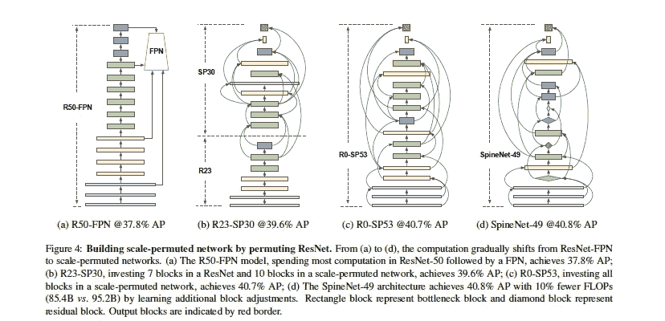
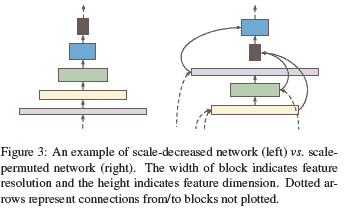
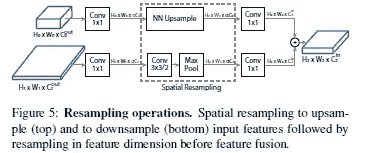
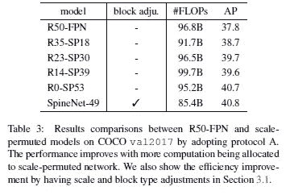
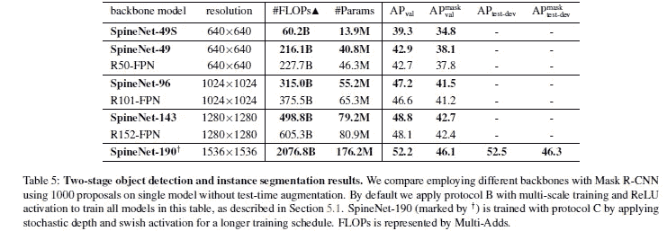
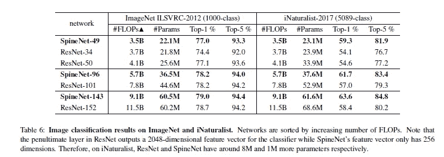

# 理解脊柱网络。谷歌对计算机视觉的最新贡献

> 原文：<https://medium.com/mlearning-ai/understanding-spine-net-googles-newest-contribution-to-computer-vision-3353d60cf80b?source=collection_archive---------1----------------------->

## 物体检测和定位的卓越性能。分类中的顶级性能。这是给你的吗？

为了帮助我了解您[请填写此调查(匿名)](https://forms.gle/7MfQmKhEhyBTMDUD7)

计算机视觉是一个蓬勃发展的领域。它有许多应用，从疾病检测到自动驾驶汽车。这些不同的问题伴随着它们独特的挑战和相应的挑战。《T2 spine net:识别和定位的学习规模置换主干》的作者试图解决该领域最大的挑战之一。许多标准的图像分类体系结构与目标检测和定位斗争。谷歌的研究为这种情况提出了一个可能的解释。他们还提出了解决这个问题的架构。在这篇文章中，我将谈谈论文。到最后，你将能够理解下面的图片，并对像缩放置换主干这样的术语有更好的理解。

If I showed you this image with no context, what do you think it would represent?

# 背景

那么图像分类网络的问题是什么呢？引用论文作者的话，“*直观地说，规模减小的主干通过下采样丢弃了空间信息，使得通过解码器网络恢复
具有挑战性。*“什么是尺度降低的脊梁？简单地说，这是一个网络，你越深入，数据的分辨率就越低。这是大多数图像分类网络的标准做法。

Scale decreased vs scale permuted networks

虽然这种方法适用于分类，但不适用于检测。这是因为“*可能需要高分辨率来检测特征*的存在”。因此，作者提出了一种尺度置换网络，在这种网络中，我们在层中既有向下采样又有向上采样。这应该更适合捕捉较小的物体和具有挑战性的特征。

# 塑造维度

你可能想知道他们是如何不停地改变维度的。由于主干不像规模缩小的网络那样是固定的，它会很快变得混乱。为了解决这个问题，作者做了以下工作

This combination allows them to feed features into different layers.

3.2 节有一个很好的例子来解释这个过程。如果你很难理解这个数字，请检查一下。简单地说，它们运行一系列函数，这些函数的细节由父块和目标块动态决定。

# 遍历不同的可能架构

既然我们已经了解了如何从不同的块中对要素进行重新采样以创建按比例排列的网络，我们就遇到了下一个问题。我们如何选择最佳配置？显然有多种选择。

这就是神经架构搜索的用武之地。这是一种自动设计神经网络的方法。虽然这听起来很令人兴奋，但要很好地使用它，还有很多细微的差别。为了更好地理解这个概念，[点击这里链接的 YouTube 播放列表](https://www.youtube.com/watch?v=PgR2VE6nND4&list=PLJH1O6to9s5ZcJcltFhJwI85Oancojn_l)。我制作它是为了帮助人们更好地理解这个话题。我会不断更新它，所以如果你对此感兴趣(或其他机器学习主题)，请订阅。

需要注意的是，NAS 可能非常昂贵。作者使用了基于递归神经网络的控制器。然而，通过设置约束条件和选择较小的比例因子，他们能够将成本控制在可控范围内。

# 结果

现在是我们期待已久的细节。这种新架构的表现如何？事实上非常好。

与 ResNet 架构相比，我们看到 Spine-Net 49 具有更高的 AP(平均精度)和更少的 flops 使用数量。这是以更低的成本获得更高的性能。总结该表，“*与 R50-FPN 基线相比，R0-SP53 使用相似的构建模块，并通过学习规模排列和跨规模连接获得 2:9%的 AP。SpineNet- 49 型号通过减少 10%的触发器进一步提高了效率，同时通过增加比例和模块类型调整实现了与 R0-SP53 相同的精度。*

在不同任务/数据集上的更多实验显示了相似的结果

当我们尝试将 SpineNet 转移到图像分类任务上时，我们再次看到以较低的成本获得了出色的性能。

所有这些都非常令人兴奋。我当然会关注更多脊柱置换的实验。当我做到的时候，我一定会分享。如果你们遇到任何有趣的实现，一定要和我分享。

如果你喜欢这篇文章，看看我的其他内容。我定期在 Medium、YouTube、Twitter 和 Substack 上发帖(所有链接都在下面)。我专注于人工智能、机器学习、技术和软件开发。如果你正在准备编码面试，看看:[编码面试变得简单](https://codinginterviewsmadesimple.substack.com/)。

为一次性支持我的工作，以下是我的 Venmo 和 Paypal。任何数额都值得赞赏，并有很大帮助:

https://account.venmo.com/u/FNU-Devansh

贝宝:[paypal.me/ISeeThings](https://www.paypal.com/paypalme/ISeeThings)

# 向我伸出手

如果那篇文章让你对联系我感兴趣，那么这一部分就是为你准备的。你可以在任何平台上联系我，或者查看我的其他内容。如果你想讨论家教，发短信给我。如果你想支持我的工作，请使用我的免费 Robinhood 推荐链接。我们都有免费的股票，对你没有风险。所以不使用它就等于失去了免费的钱。

查看我在 Medium 上的其他文章。:【https://rb.gy/zn1aiu 

我的 YouTube:【https://rb.gy/88iwdd 

在 LinkedIn 上联系我。我们来连线:[https://rb.gy/m5ok2y](https://rb.gy/f7ltuj)

我的 insta gram:[https://rb.gy/gmvuy9](https://rb.gy/gmvuy9)

我的推特:[https://twitter.com/Machine01776819](https://twitter.com/Machine01776819)

如果你正在准备编码/技术面试:[https://codinginterviewsmadesimple.substack.com/](https://codinginterviewsmadesimple.substack.com/)

获得罗宾汉的免费股票:[https://join.robinhood.com/fnud75](https://www.youtube.com/redirect?redir_token=QUFFLUhqa0xDdC1jTW9nSU91WXlCSFhEVkJ0emJvN1FaUXxBQ3Jtc0ttWkRObUdfem1DZzIyZElfcXVZNGlVNE1xSUc4aVhSVkxBVGtHMWpmei1lWWVKNzlDUXVJR24ydHBtWG1PSXNaMlBMWDQycnlIVXNMYjJZWjdXcHNZQWNnaFBnQUhCV2dNVERQajFLTTVNMV9NVnA3UQ%3D%3D&q=https%3A%2F%2Fjoin.robinhood.com%2Ffnud75&v=WAYRtSj0ces&event=video_description)

 [## Mlearning.ai 提交建议

### 如何成为 Mlearning.ai 上的作家

medium.com](/mlearning-ai/mlearning-ai-submission-suggestions-b51e2b130bfb) 

# 纸

在这里阅读我对这篇论文的注释