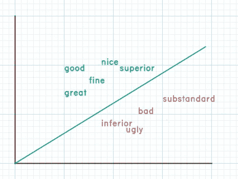
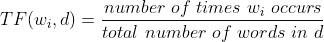
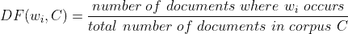
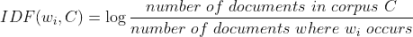
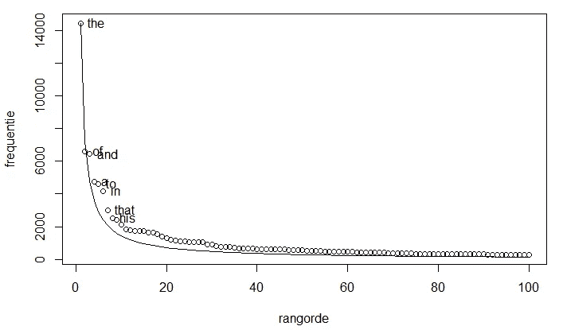

# 了解 NLP 中的 TF-IDF

> 原文：<https://medium.com/mlearning-ai/understanding-tf-idf-in-nlp-8a2931c017e3?source=collection_archive---------0----------------------->

这篇文章收集了一些关于为什么 TF-IDF 作为一种文本矢量化方法有效的结构化问题，首先是为什么首先需要它的原始问题。

## 为什么我们需要文本矢量化？

*   第一，计算机只理解数字。在最低层(字节码)输入到计算机的任何输入都是一系列二进制数，这意味着为了能够解释有声语言的文本，我们需要用数字来表示它们。
*   第二，文本的向量表示允许我们利用线性代数的能力进行不同的运算(*点/叉积、平面、垂线、法线等*)。这有助于探索性数据分析(EDA)、几何直觉、问题的可视化(1 维、2 维和 3 维)以及将线性代数方法外推至更高维度(> 3 维)。

## 将文本转换成矢量的规则是什么？

如英语中的三个单词 *(w1，w2，w3)* ，分别有了矢量表示法 *(v1，v2，v3)* 。那么，简单地说，这个规则就是:

*“如果(w1，w2)在语义上比(w1，w3)更多的***，那么(v1，v2)向量之间的距离应该小于(v1，v3)向量之间的距离”**

*例如，词语(*好的*、*伟大的*)在意义上比(*好的*、*坏的*)关系密切，所以 [*欧几里得*](https://en.wikipedia.org/wiki/Euclidean_distance) *距离**(****V****(好的)****V***【T44)*

## *为什么相似的词一定要几何接近？*

*在训练机器学习模型时，该模型试图学习和定义等式(或条件)来对不同的组进行分类。如果相似的点在几何上接近，那么在不同的组之间分类就更容易。下图通过正面、负面和基于性别/性别中性词的示例，帮助您可视化不同数据标签之间的决策界限。*

***

Grouping of similar words leads to easier decision boundaries* 

# *TF-IDF*

*TF-IDF 是对文档中的单词进行文本矢量化的臭名昭著的方法之一。*

> *文档:代表单个数据点的一组单词、文本或句子
> 语料库:文档的集合*

***TF** 代表 ***词频*** ，代表该词在文档中出现的概率。*

**

*类似于上面的定义，我们可以定义*文档频率*，它*

**

*表示在语料库的文档中找到该单词的概率。*

***IDF** 代表 ***逆文档频率*** 。这代表*文档频率*的**逆**，除了文档频率逆的变化——**对数**变换。*

**

*IDF 为我们提供了一个衡量单词在整个语料库(或数据集)中的重要性的方法。换句话说，在语料库的不同文档中很少出现的单词被赋予更高的重要性。*

*请注意，该等式使用文档频率倒数的对数变换。这就引出了下一个问题。*

## *为什么我们使用对数标度来计算 IDF？*

*我们可以试着从理论和实践两个方面进行推理。*

*一种**理论上的**解释，一种语言(如*英语*)中词的出现频率遵循[齐夫定律](https://en.wikipedia.org/wiki/Zipf%27s_law)，表述为*给定一些* [*语料库*](https://en.wikipedia.org/wiki/Text_corpus)*[*自然语言*](https://en.wikipedia.org/wiki/Natural_language) *的话语，任何词的出现频率都与* [*成反比*](https://en.wikipedia.org/wiki/Inversely_proportional)**

****

**Source: [phys.org](https://phys.org/news/2017-08-unzipping-zipf-law-solution-century-old.html) — Early frequency distributions for the words in English**

**由于英语的这一特性，词频的概率分布遵循 [*幂律*](https://en.wikipedia.org/wiki/Power_law) 分布。现在，许多机器学习算法在变量的*高斯*分布下表现更好。为了将数据从*幂律*分布转换为*高斯*分布，我们可以使用具有**对数**性质的 [*Box-Cox*](https://en.wikipedia.org/wiki/Power_transform#Box%E2%80%93Cox_transformation) 变换。这可能解释了为什么在研究论文[中建议对 IDF 进行对数变换。](https://citeseerx.ist.psu.edu/viewdoc/summary?doi=10.1.1.115.8343)**

**其次，一个更**实用的**直觉是缩小 IDF 的范围，使其与 TF 相对可比，这样当这两个数在 TF-IDF 中相乘时，产生的结果值具有两者的可比贡献。**

## **为什么 TF 和 IDF 的射程一定要相对比较？**

**想想英语中的单词*、*和*勤劳的*。我们知道后者有更多的意义，必须被认为是重要的。语料库中单词*‘the’*的 IDF(没有 *log* 变换)可以是 1。*如何*？**

**好吧，考虑一个有 1000 个文档的语料库。如果单词'*'出现在所有 *1000* 文档中，那么根据 IDF 的定义(没有 *log* 变换)就是 *1000/1000 = 1* 。***

**现在，因为'*勤劳的*'是一个很少出现的单词，IDF(没有*日志*转换)可能是 *1000* 。*如何*？**

**考虑与 *1000* 文档相同的语料库。如果单词'*勤劳的*'只出现在**一个**文档中，那么根据 IDF 的定义(没有*日志*变换)就是 *1000/1 = 1000* 。**

**IDF 的值的范围(没有 *log* 变换)现在是*【1，1000】*——由于很少出现单词。然而，通过以*为基数*为 10 的对数变换(为简单起见)，该范围缩小到*【1，3】*。**

**如果我们将 TF 和 IDF 相乘(不使用 *log* 变换)，那么这些值现在会迅速爆炸(由于 IDF 的巨大范围)。需要抑制该产品中 IDF 的影响。**

**为了补偿巨大的范围并抑制这种影响，我们对 IDF 使用对数变换，使得 TF 和 IDF 在 TF-IDF 的数值中的贡献是可比较的，并且在相对范围内。**

## **计算出 TF-IDF 值后接下来会发生什么？**

**对于每个单词，我们都有一个 TF-IDF 值。在文档的向量表示中，与每个单词相关的维度值保存数字 TF-IDF 值。这个向量用于训练、测试和评估模型。**

## **TF-IDF 的缺点是什么？**

**首先，我们可以清楚地看到，可以有两个不同的词，具有相同的 TF-IDF 值。因为，这个度量只考虑了这个词在文档和语料库中出现的次数。**

**第二，它在具有相似含义的单词在语料库中出现相似次数的假设下工作。或者，换句话说，我们也可以说，单词的语义是通过这种方法来解释的。比如:*好吃*和*好吃*是两个意思相同的词。但是，我们不能保证这些词的 TF-IDF 值是相对的和相似的。**

**那么，这些缺点可以通过使用 2013 年提出的算法 [***Word2Vec***](https://arxiv.org/pdf/1301.3781.pdf) 来克服——这被证明是一种最先进的文本矢量化技术。将这一技巧留到下一篇文章中。**

**希望这有所帮助:)**

** [## Mlearning.ai 提交建议

### 如何成为 Mlearning.ai 上的作家

medium.com](/mlearning-ai/mlearning-ai-submission-suggestions-b51e2b130bfb)**