# 理解扩散模型及其背后的理论

> 原文：<https://medium.com/mlearning-ai/understanding-the-diffusion-model-and-the-theory-tensorflow-cafcd5752b98?source=collection_archive---------0----------------------->

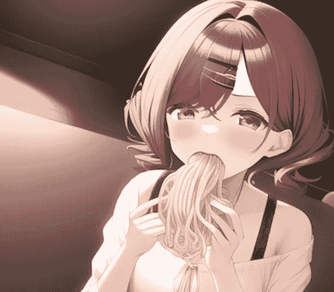

Image generated from novel AI ([source](https://twitter.com/umecha1128/status/1582572128880115712?ref_src=twsrc%5Etfw%7Ctwcamp%5Etweetembed%7Ctwterm%5E1582572128880115712%7Ctwgr%5E6cd14f8776cdf327b562f45858b0a6a88951f363%7Ctwcon%5Es1_&ref_url=https%3A%2F%2Fgame.ettoday.net%2Farticle%2F2362451.htm))

AI 图像生成是一项在艺术和深度学习(DL)领域备受热议的技术。你一定听说过人工智能艺术生成器，如 [**Dall-E 2**](https://openai.com/dall-e-2/) 或 [**NovelAI**](https://novelai.net/) ，这是一种从给定的文本序列中生成逼真图像的 DL 模型。

为了更深入地探索这项技术，我们需要在生成模型中引入一个新的类，称为'**扩散'**，首先由 Sohl-Dickstein 等人(2015 年)提出，旨在使用**反向去噪过程**从噪声中生成图像。

迄今为止，已有几种生成模型，包括**[**【VAE】**](https://arxiv.org/abs/1312.6114)**基于流程的模型**。它们中的大多数都可以生成高质量的图像，如当前最先进的图像生成模型 [**StyleGAN-XL**](https://github.com/autonomousvision/stylegan_xl) 。然而，每一种都有其自身的局限性。**

> **众所周知，GAN 模型具有潜在的不稳定训练，并且由于其对抗性的训练性质，在一代中多样性较低。VAE 依赖于替代损失。流动模型必须使用专门的架构来构建可逆转换(Lilian Weng，2021)**

**扩散模型在将噪声转换成图像时提供了一个缓慢的迭代过程。这使得扩散模型比 GAN 模型更具有可扩展性。此外，由于扩散模型的目标是预测输入噪声，这是**监督学习，**我们可以预期扩散模型的训练将比 GAN ( **非监督学习**)更加**稳定**。**

> **本文的实现将基于 [**去噪扩散概率模型**](https://arxiv.org/abs/2006.11239) (何等，2021)【】[**去噪扩散隐式模型**](https://arxiv.org/abs/2010.02502) (宋等，2021)、**
> 
> **数学公式来自**

# ****什么是扩散模型？****

****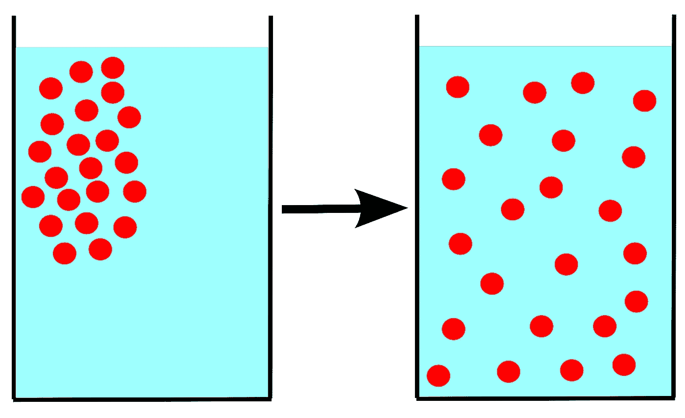****

****the diffusion process of the particle in water ([**source**](https://en.wikipedia.org/wiki/Diffusion))****

****单词**扩散**被定义为任何物质从较高浓度区域到较低浓度区域的**运动**。****

****受这个概念的启发，扩散模型定义了**马尔可夫链**来缓慢地给图像添加随机噪声。**马尔可夫链**可以看作是**扩散，**和**加噪声**的过程就是**运动。** *因此，我们的目标是找到添加到图像中的噪声(运动)并反转这个过程。*****

****扩散模型主要由两个过程组成**正向去噪**和**反向去噪；**这可以被认为是不断地**将噪声**添加到图像中，而不是**反转**这个过程。😈 😈****

# ******正向噪声******

****在 DDPM 的论文中，作者将正向过程定义为:****

****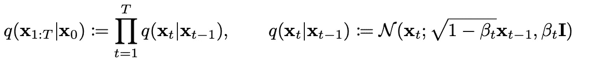****

****Eq. 1: Definition of the **Markov chain** in Forward noising****

****以上是一个**马尔可夫链**其中每一个时间步 **t** 只依赖于前一步 **t-1** 。我们使用方差表 ***β*** 来控制均值和方差，*其中β*₀*t64】β*₁<…<t44】βt .****

****我们将从 x0(从真实数据分布 q(x)中采样)开始，然后重新计算 x0 的均值和方差以生成 x1。最后，到最后的状态 xT，这是一个**高斯噪声。**该过程可以被视为迭代地推出图像，直到它离开真实数据分布并变成噪声。****

****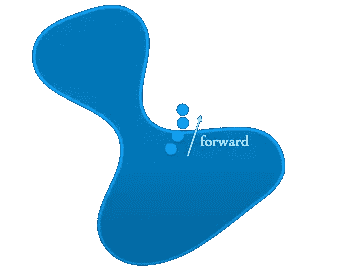****

****The figure describes the forward process ([source](https://www.youtube.com/watch?v=fbLgFrlTnGU))****

****在开始编码之前，让我先介绍一下扩散模型中的两个重要性质。****

## ******属性 1:重新参数化技巧******

****在扩散模型中，我们会有很多值需要从一个分布中抽样，例如 z ~ N(z；μ, σ2).然而，我们不能通过网络执行**反向传播**，因为我们不能对随机变量进行**求导**。****

****因此，**重新参数化技巧**提供了另一种形式的采样过程。而不是从 N(Z；μ，σ2)我们可以将其重写为:****

****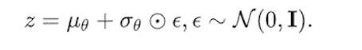****

****Eq. 2: **reparameterization of Normal distribution******

****现在我们**把随机性转移到从高斯分布中采样的随机变量 *∈*** 。这使得该过程可微分，因为我们可以在训练期间获得值 *∈* 。💛****

## ******性质 2:任意时间步长的 Xt 可以用 X0 和*β*来表示******

****为了获得噪声图像 **Xt，**，我们需要遍历马尔可夫链，直到到达**时间步长 t** 。显然这个过程非常**低效**，尤其是在 **DL 训练**中，会有一堆输入同时进行。****

****由于**重新参数化技巧**，我们现在可以通过输入**初始图像 X0** 和相应的时间步长 **t，**得到**噪声图像 Xt** ，公式如下:****

****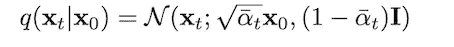****

****Eq. 3: Distribution of q after applying **reparameterization trick******

*****(详细的推导过程，我放在本节末尾)*****

****最后，让我们基于**属性 2 来编码前向探测过程😄******

****上面显示了两种不同版本的扩散时间表，**离散**和**连续。**这个实现将集中在前一个上。****

****关于**连续**扩散时间表的更多信息，我推荐阅读 DDIM 模型的 [**Keras 范例**](https://keras.io/examples/generative/ddim/) 。****

****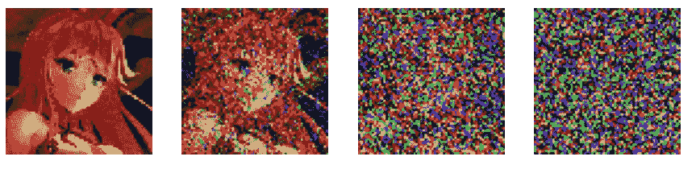****

****Image created by the author****

## ******性质 2** 的数学证明****

********

****Eq. 4: the noising process****

****我们的最终目标是获得 xT。通过遍历多个高斯条件概率**q(XT | XT 1)**。****

****首先，我们重新定义**阿尔法和贝塔**如下:****

****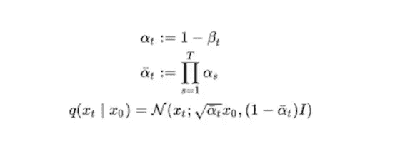****

****Eq. 5: refine **alpha and beta******

****使用**重新参数化技巧，我们可以将**q(XT | XT 1)重写为:****

****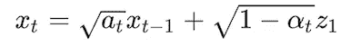****

****Eq. 6: Gaussian conditional probability **q(xt|xt−1)******

****其中 z1 ~ N(0，I)****

****展开 **xt** 我们可以得到:****

****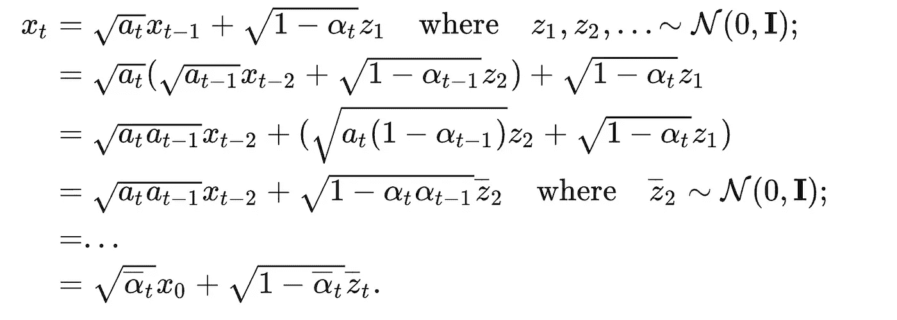****

****Eq. 6: calculation of Xt****

******既然两个高斯的合并也是一个高斯也就是******

****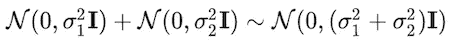****

****Eq. 7: merge of two Gaussians is also a Gaussians****

****合并后的标准差为****

****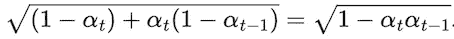****

****Eq. 8: merged standard deviation****

****最后，利用该结果可以得到任意时间步长的含噪图像。****

********

****Eq. 9: Distribution of q after applying **reparameterization trick******

****🥀 🥀 🥀 🥀 🥀🥀 🥀 🥀 🥀 🥀🥀 🥀 🥀 🥀 🥀🥀 🥀 🥀 🥀 🥀🥀 🥀 🥀🥀🥀🥀🥀🥀****

# ******反向去噪******

****如果说正向过程是添加噪声的过程，那么反向过程就是去除噪声。****

****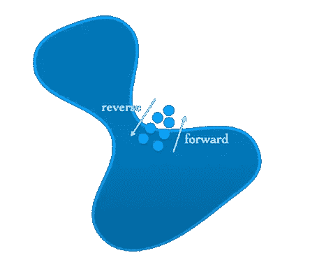****

****The figure describes the backward process ([source](https://www.youtube.com/watch?v=fbLgFrlTnGU))****

****如果我们可以找到逆分布 q(xT 1 | xT ),就可以从高斯噪声 xT ~ N(0，I)中重建真实图像。由于 q(XT | XT 1)是高斯函数，如果 *βt* 足够小，q(XT 1 | XT)也将是高斯函数。****

****然而，我们不能简单地估计 ***q*** ，因为它需要估计整个数据分布；这样，我们就学习一个模型 ***P*** 来近似这个条件概率。**p(XT 1 | XT)**的分布写为:****

****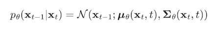****

****Eq. 10: reverse distribution p(xt−1|xt)****

****我们的目标是获得初始状态 X0****

****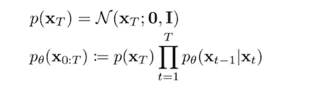****

****Eq. 11: the process to obtain initial state X0****

## ****DDPM****

****在 ddpm 论文中，作者将采样过程定义为:****

****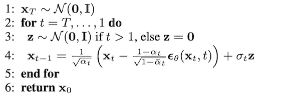****

****Sampling process in DDPM ([source](https://arxiv.org/abs/2006.11239))****

****反向分布**p(XT 1 | XT)**可以写成:****

****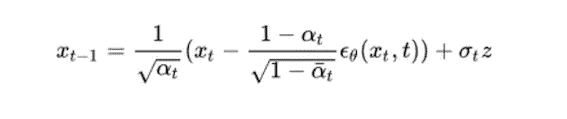****

****Eq. 12: reverse distribution **p(xt−1|xt)** in DDPM****

****我们使用 **U-net** 模型用输入(xt，t)预测**，此外 DDPM 使用**未训练 sigma _*θ**并相信 **sigma_ *θ*** (上图中的 sigma_t)近似为 ***βt************

****让我们对此进行编码！！！~~~ 😙****

****以上是 DDPM 的去噪过程。然而，我更喜欢 DDIM 去噪过程，它基于:****

********

****Eq. 13: Sampling process in DDIM****

****通过将σ设置为 0，我们可以消除采样过程中的随机性，从而减少推断时间。****

## ****逆向过程背后的数学****

****好了，该来点数学了~~😢 😢****

****让我们再次回顾一下取样过程。我们的目标是得到反向条件概率 q(xt1 | XT)。为了使它易于处理，我们首先像这样把一个 X0 放入其中:****

****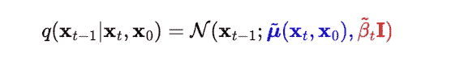****

****Eq. 14: adding x0 into q(xt−1|xt)****

****应用贝叶斯法则后，我们得到:****

****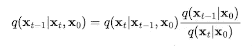****

****Eq. 15: applying Bayes’ rule to q(xt−1|xt, x0)****

****现在，所有的 **q** 都变成了**前进**，这意味着我们可以根据前面提到的**属性 2** 得到 **q** 的**均值**和**方差**。****

****扩展 q 的**标准高斯密度函数**，我们可以得到:****

****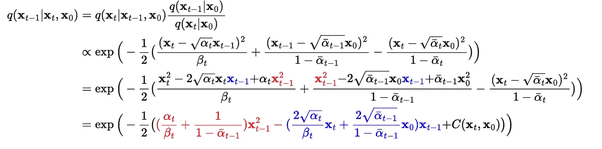****

****Eq. 16: Expanding the **standard Gaussian density function** of q****

****继续扩大我们可以得到:****

****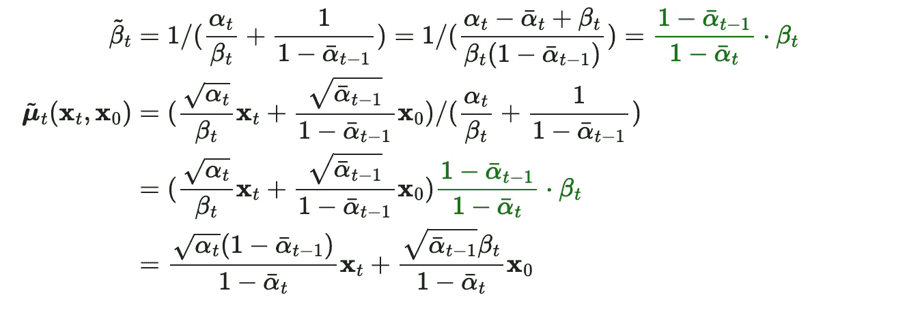****

****Eq. 17: obtain the **mu** and **beta******

****最后，我们只剩下 X0 需要删除。多亏了**重新参数化技巧** ( **属性 1** )，我们可以将其重写为:****

****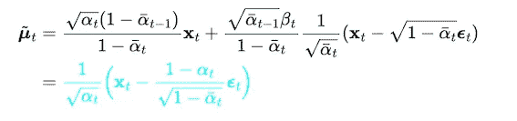****

****Eq. 18: replace **x0** in **mu** using the **reparameterization trick******

****如上图，我们需要去噪的东西是*其中是等于**输入噪声**在正向过程中，神经网络可以预测出来。嗯~~😁 😁*****

# ****模型架构和培训****

****在扩散模型中，我们通过输入 **图像数据 X0** 和**时间步长 t** ，使用 **U 网结构**来预测噪声***【є_t***。****

****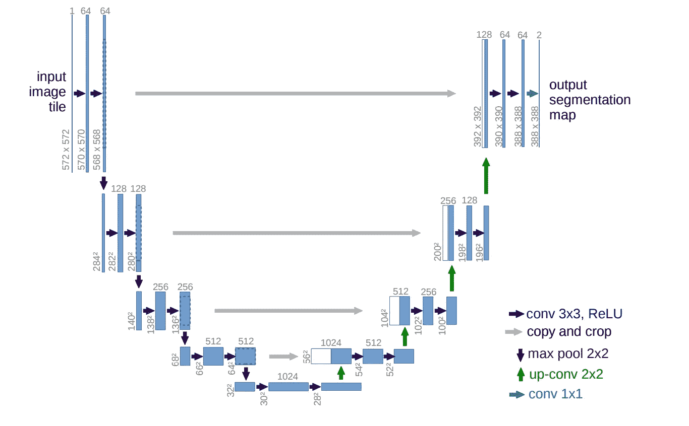****

****image is taken from the official paper of u-net ([source](https://arxiv.org/abs/1505.04597))****

****U-Net 是一种流行的卷积神经网络(CNN)架构，最初是为生物医学**图像分割**开发的。它基于**卷积层**对输入图像进行下采样和上采样，并在具有相同分辨率的层之间添加**跳过连接**。****

> ****这里是 [**u-net**](https://arxiv.org/abs/1505.04597) 官方论文的链接****

****让我们写我们的扩散模型！！~~~ 👐****

*******欢迎访问我的***[***GitHub***](https://github.com/Yukino1010/Diffusion_Model)***。我已经把代码放上去了~~😸*******

## ****u 形网块****

## ****u 网模型****

****为了简单起见，我省略了注意力层，它可以提供更好的全局一致性。另外，我用**批量定额**代替**分组定额**来减少计算量。****

## ****培养****

****我们选择均方误差作为模型优化的损失函数，以计算**噪声**(来自正向过程)和**预测噪声**(来自模型)之间的损失。****

******但是为什么**可以用 MSE 这样简单的函数来优化两个分布， **p** 和 **q** ？****

****为了回答这个问题，我强烈推荐观看阿里·塞夫的视频和 T42 的视频。🥀 🥀****

# ****结果****

****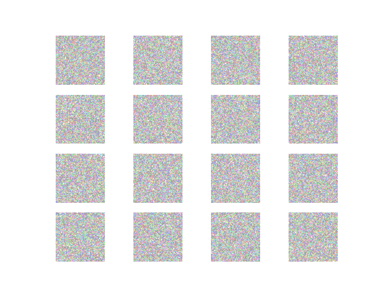********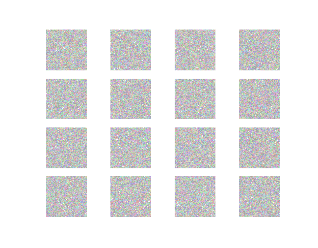****

# ******参考******

1.  ****[***去噪扩散概率模型***](https://arxiv.org/abs/2006.11239)****
2.  ****[***去噪扩散隐式模型***](https://arxiv.org/abs/2010.02502)****
3.  ****[***Keras 示例—去噪扩散隐式模型***](https://keras.io/examples/generative/ddim/)****
4.  ****[***Lil' Log —什么是扩散模型？***](https://lilianweng.github.io/posts/2021-07-11-diffusion-models/)****
5.  ****[***Vedant Jumle——使用 Keras 和 TensorFlow 的扩散模型生成图像***](/@vedantjumle/image-generation-with-diffusion-models-using-keras-and-tensorflow-9f60aae72ac)****

**** [## Mlearning.ai 提交建议

### 如何成为 Mlearning.ai 上的作家

medium.com](/mlearning-ai/mlearning-ai-submission-suggestions-b51e2b130bfb)****