# 了解朴素贝叶斯分类器算法

> 原文：<https://medium.com/mlearning-ai/understanding-the-naive-bayes-classifier-algorithm-b3939fe57243?source=collection_archive---------1----------------------->

解释从贝叶斯定理导出的基于概率的分类算法。


Photo by [Michał Parzuchowski](https://unsplash.com/@mparzuchowski?utm_source=unsplash&utm_medium=referral&utm_content=creditCopyText) on [Unsplash](https://unsplash.com/s/photos/gambling?utm_source=unsplash&utm_medium=referral&utm_content=creditCopyText)

## 贝叶斯定理

在继续讨论贝叶斯定理之前，让我们先讨论一下**条件概率，**贝叶斯定理背后的基本概念。想象从一副牌中挑选一张牌(1 副牌等于 52 张牌，不包括百搭牌)。让我们将 X 和它的概率 P(X)分别定义为从整副牌中抽取红心牌的事件和概率。并且 Y|X 和 P(Y|X)定义为在 X 发生之后，红心牌被挑选的事件和概率。所以，连续两次拿红心牌的概率是

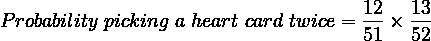

一般来说， *X* 和 *Y* 都发生的几率等于 *X* 发生的概率乘以 *Y* 发生的概率，假设 *X* 已经发生。这种几率被称为条件概率，计算条件概率的规则写成乘法规则:


Equation 1\. Conditional Probability

其中:

p(Y∩X)= Y 和 X 发生的概率

p(Y | X)=给定 X 已经发生，Y 发生的概率。

注意到

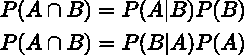

Equation 2\. Conditional Probability is equivalent

条件概率的乘法规则是等价的，因此我们可以求解 P(B|A)并定义:


Equation 3\. Bayes’ Theorem

上面的等式是贝叶斯定理。

其中:

P(B|A) = **后验概率**:假设 B 对观察事件 A 的概率。

P(A|B)= **似然概率**:假设假设的概率为真的证据的概率。

P(B)= **先验概率**:观察证据前假设的概率。

P(A)= **边际概率**:证据的概率。

为了更清楚，让我们看看这个例子。假设 Bob 是一个 35 岁的男人，他因为喉咙痛进了医院。想象你是照顾鲍勃的医生。你可以做一个新冠肺炎测试，但是测试工具已经卖完了。你需要一个准确的方法来确定鲍勃是否感染了新冠肺炎病毒。

假设你所在的城市中 1000 人中有 10 人感染了新冠肺炎病毒。假设 70%的新冠肺炎患者经历过海岸咽喉炎。此外，假设现在是冬天，20%的 30 岁及以上的人患有海岸咽喉炎。现在让我们来定义

1.  **P(新冠肺炎)→P(C19)**=人感染新冠肺炎病毒的概率(10:1000) 10%。这是先验概率
2.  **P(岸喉)→P(ST)**=所有人患岸喉的概率 20%。这是边际概率
3.  **P(海岸喉|covid-10) →P(ST|C19)** =新冠肺炎患者出现海岸喉的概率为 70%。这是可能性概率
4.  **P(新冠肺炎|海岸咽喉)→P(C19 | ST)**=一个人感染新冠肺炎病毒的概率，假设他正在经历海岸咽喉。这是后验概率

让我们用贝叶斯定理计算鲍勃被新冠肺炎感染的概率

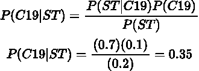

现在你可以看到鲍勃有 35%的机会被新冠肺炎病毒感染。

假设几周后鲍勃出现了另外两种症状:咳嗽和发烧。考虑到这三种症状，我们如何知道鲍勃感染新冠肺炎病毒的几率？

让我们定义

**P(C19 | ST∩C∩F)**=被新冠肺炎感染的概率鉴于岸上已出现咽喉、发烧和咳嗽

**P(ST∩C∩F | C19)**=新冠肺炎患者出现咽喉炎、发热和咳嗽的概率

贝叶斯定理现在的形式是:

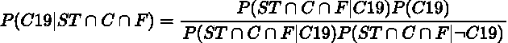

现在看起来很麻烦。看一下提名者术语

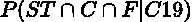

要计算一名受感染的新冠肺炎患者出现咽喉炎、咳嗽和发烧这三种症状的确切概率实际上很麻烦。因为每种症状都可能相互影响。海岸喉咙会让你咳嗽，而咳嗽会让你发烧。换句话说，这些症状是有条件地相互依赖的。

现在，我们需要一些假设来简化计算。如果这些症状有条件地相互独立呢？我们可以天真地说，咽喉炎、咳嗽和发烧互不相关，但仍有条件地与新冠肺炎相关。因此得名**朴素贝叶斯。提名者可以用以下形式书写**

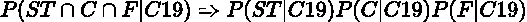

对于分母我们覆盖了所有可能的情况，因为我们只有两类“被新冠肺炎感染”和“未被新冠肺炎感染”的所有概率之和

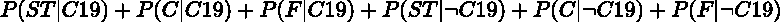

用了被称为否定的符号，并解释为没有被新冠肺炎感染的情况。注意所有可能情况的分母都是常数，所以可以省略。所以条件概率现在可以写成如下的近似值:


一般来说，给定多个条件事件发生的情况下，事件发生的概率是:

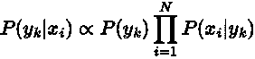

Equation 4\. Approximation of Conditional Probability

哪里；

p(yk | xi)=给定 Xi 发生的条件事件，具有 k 类的事件 y 的后验概率。

p(yk)=具有 k 类的事件 y 的先验概率

p(xi | yk)=给定类别为 k 的事件 y 发生 Xi 事件的可能性。

用类 k 预测事件 y，我们所要做的就是计算最大后验概率如下

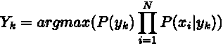

Equation 5\. Maximum value of conditional probability

现在让我们检查这个假想的新冠肺炎数据集。

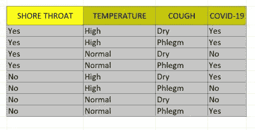

Table 1\. Imaginary Covid-19 Table

假设鲍勃出现症状:咽喉痛，体温正常，干咳。鲍勃的样本的特点是

**X = {岸喉=是，体温=正常，咳嗽=干咳}**

主要目标是使用等式 5 预测鲍勃被新冠肺炎感染的最大概率。现在让我们计算每种症状的频率和比率:

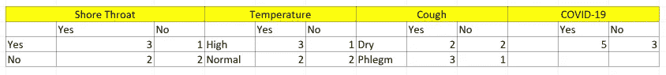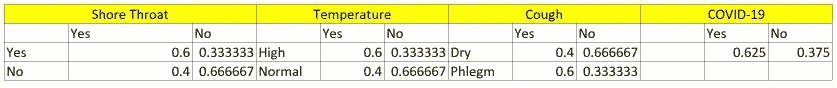

我们试图预测的特征是:

**X = {岸喉=是，体温=正常，咳嗽=干咳}**

简称:X = { ST =是，T =正常，C =干}

所以我们会计算

p(y1 =被新冠肺炎感染)→是的，还有

p(y2 =未被新冠肺炎感染)→否

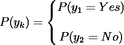

对于 k = 1→y1 =是，我们得到

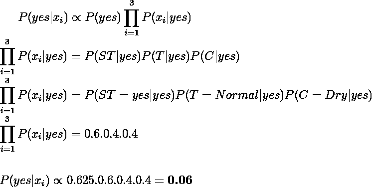

对于 k = 2→y2 =否，我们得到

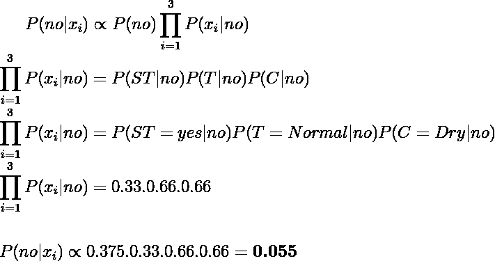

因为 P(yes|x) > P(no|x)并且通过使用等式 5，我们可以预测鲍勃将被新冠肺炎病毒感染。

我们在处理朴素贝叶斯的离散值变量。对于连续值，从高斯分布中对特征进行采样，因此似然概率遵循以下等式

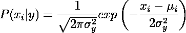

Equation 6\. Gaussian Distribution Function

这种分类器被称为**高斯朴素贝叶斯**分类器

**实施**

我们将使用以下内容:

*   [Scikit-learn m](https://scikit-learn.org/stable/index.html) 模块，用于将数据拆分为[训练测试](https://scikit-learn.org/stable/modules/generated/sklearn.model_selection.train_test_split.html?highlight=train_test_split#sklearn.model_selection.train_test_split)样本，构建[朴素贝叶斯](https://scikit-learn.org/stable/modules/naive_bayes.html#categorical-naive-bayes)模型，以及[模型评估](https://scikit-learn.org/stable/modules/generated/sklearn.metrics.classification_report.html?highlight=classification_report#sklearn.metrics.classification_report)
*   乳腺癌数据集，由 Scikit-learn 提供
*   [Numpy](https://numpy.org/) 用于数据操作

让我们导入所有的库

```
from sklearn.model_selection import train_test_split
from sklearn import datasets
from sklearn.naive_bayes import GaussianNB
from sklearn.metrics import accuracy_score
```

加载数据集

```
X,y = datasets.load_breast_cancer(return_X_y=True)
```

拆分为训练和测试数据集

```
X_train, X_test, y_train, y_test = train_test_split(
        X, y, test_size=0.2, random_state=1234
    )
```

创建朴素贝叶斯模型

```
model=GaussianNB()
```

拟合和预测输出

```
model=GaussianNB()
model.fit(X_train,y_train)
predictions=model.predict(X_test)
```

让我们看看模型的准确性

```
accuracy_score(y_test,predictions)
```

分数是 0.903。

让我们看看当使用混淆矩阵预测测试数据集时，模型有多好

```
from sklearn.metrics import confusion_matrixconfusion_matrix(y_test,predictions)
```

混淆矩阵是

```
array([[36,  9],
       [ 2, 67]], dtype=int64)
```

这表明 36 个预测为真正的恶性，67 个预测为真正的良性。但该模型未能预测 9 例恶性为良性，2 例良性为恶性。

## 结论

在本文中，我们了解到:

1.  贝叶斯定理中的条件概率概念
2.  朴素贝叶斯算法作为一种从贝叶斯定理导出的分类算法
3.  实现朴素贝叶斯算法。

[](/mlearning-ai/mlearning-ai-submission-suggestions-b51e2b130bfb) [## Mlearning.ai 提交建议

### 如何成为 Mlearning.ai 上的作家

medium.com](/mlearning-ai/mlearning-ai-submission-suggestions-b51e2b130bfb)