# 理解需求问题的模式(第 1 部分)

> 原文：<https://medium.com/mlearning-ai/understanding-the-patterns-of-a-demand-question-f5b34362249?source=collection_archive---------1----------------------->

## 傅立叶变换、频谱分析和谐波

在这篇博文中，我将讨论我在预测模型方面的工作，以预测来电和电子邮件的数量，从而告知可靠运行服务中心所需的人员数量。数据是商业的，所以我不能分享，但无论如何让我们开始。我会尽量做到透明。

```
library(readr)
library(DataExplorer)
library(dplyr)
library(ggplot2)
library(lubridate)
library(data.table)
library(tsibble)
library(fable)
library(fabletools)
library(forecast)
library(timetk);interactive <- FALSE
library(tidymodels)
library(modeltime)
library(modeltime.ensemble)
library(parsnip)
library(gt)

library(doParallel);parallelCluster <- makeCluster(6, type = "SOCK", methods = FALSE)
```

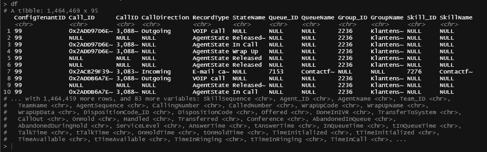

The dataset. Since it is commercial I cannot share it with you but I can try and show you, as best as possible, what the data is all about.

服务中心接收两种类型的来电——通过 VOIP 和电子邮件。当然后者并不是真正的需求，但它仍然是需求。正如你所看到的，在过去的一年中，已经收集了相当多的数据。这是每分钟捕获的传统时间序列数据。

```
> dim(df)
[1] 1464469      95
> str(df)
spec_tbl_df [1,464,469 x 95] (S3: spec_tbl_df/tbl_df/tbl/data.frame)
 $ ConfigTenantID      : chr [1:1464469] "99" "99" "99" "99" ...
 $ Call_ID             : chr [1:1464469] "0x2ADD97D6E87F0039" "NULL" "0x2ADD97D6E87F0039" "0x2ADD97D6E87F0039" ...
 $ CallID              : chr [1:1464469] "3,08879E+18" "NULL" "3,08879E+18" "3,08879E+18" ...
 $ CallDirection       : chr [1:1464469] "Outgoing" "NULL" "NULL" "NULL" ...
 $ RecordType          : chr [1:1464469] "VOIP call" "AgentState" "AgentState" "AgentState" ...
 $ StateName           : chr [1:1464469] "NULL" "Released In Call" "In Call" "Wrap Up" ...
 $ Queue_ID            : chr [1:1464469] "NULL" "NULL" "NULL" "NULL" ...
 $ QueueName           : chr [1:1464469] "NULL" "NULL" "NULL" "NULL" ...
 $ Group_ID            : chr [1:1464469] "2236" "2236" "2236" "2236" ...
 $ GroupName           : chr [1:1464469] "Klantenservice" "Klantenservice" "Klantenservice" "Klantenservice" ...
 $ Skill_ID            : chr [1:1464469] "NULL" "NULL" "NULL" "NULL" ...
 $ SkillName           : chr [1:1464469] "NULL" "NULL" "NULL" "NULL" ...
 $ SkillSequence       : chr [1:1464469] "NULL" "NULL" "NULL" "NULL" ...
 $ Agent_ID            : chr [1:1464469] "21412" "21412" "21412" "21412" ...
 $ AgentName           : chr [1:1464469] "Christiaan Silanoe" "Christiaan Silanoe" "Christiaan Silanoe" "Christiaan Silanoe" ...
 $ Team_ID             : chr [1:1464469] "NULL" "NULL" "NULL" "NULL" ...
 $ TeamName            : chr [1:1464469] "NULL" "NULL" "NULL" "NULL" ...
 $ AgentSequence       : chr [1:1464469] "1" "NULL" "NULL" "NULL" ...
 $ CallingNumber       : chr [1:1464469] "31887082000" "NULL" "NULL" "NULL" ...
 $ CalledNumber        : chr [1:1464469] "31681893134" "NULL" "NULL" "NULL" ...
 $ WrapUpCode          : chr [1:1464469] "3491" "NULL" "NULL" "NULL" ...
 $ WrapUpName          : chr [1:1464469] "geen Wrap-up" "NULL" "NULL" "NULL" ...
 $ WrapUpData          : chr [1:1464469] NA "NULL" "NULL" "NULL" ...
 $ DispositionCode_ID  : chr [1:1464469] "0" "NULL" "NULL" "NULL" ...
 $ DispositionCode     : chr [1:1464469] "Other" "NULL" "NULL" "NULL" ...
 $ Offered             : chr [1:1464469] "1" "NULL" "NULL" "NULL" ...
 $ DoneInIVR           : chr [1:1464469] "0" "NULL" "NULL" "NULL" ...
 $ TransferToSystem    : chr [1:1464469] "0" "NULL" "NULL" "NULL" ...
 $ CallOut             : chr [1:1464469] "1" "NULL" "NULL" "NULL" ...
 $ OnHold              : chr [1:1464469] "0" "NULL" "NULL" "NULL" ...
 $ Handled             : chr [1:1464469] "1" "NULL" "NULL" "NULL" ...
 $ Transferred         : chr [1:1464469] "0" "NULL" "NULL" "NULL" ...
 $ Conference          : chr [1:1464469] "0" "NULL" "NULL" "NULL" ...
 $ AbandonedInQueue    : chr [1:1464469] "0" "NULL" "NULL" "NULL" ...
 $ AbandonedDuringHold : chr [1:1464469] "0" "NULL" "NULL" "NULL" ...
 $ ServiceLevel        : chr [1:1464469] "0" "NULL" "NULL" "NULL" ...
 $ AnswerTime          : chr [1:1464469] "1" "NULL" "NULL" "NULL" ...
 $ tAnswerTime         : chr [1:1464469] "0.0000115700" "NULL" "NULL" "NULL" ...
 $ InQueueTime         : chr [1:1464469] "0" "NULL" "NULL" "NULL" ...
 $ tInQueueTime        : chr [1:1464469] "0.0000000000" "NULL" "NULL" "NULL" ...
 $ TalkTime            : chr [1:1464469] "25" "NULL" "NULL" "NULL" ...
```

一如既往，最好是展示数据一窥究竟。在这里，您可以看到传入的 VOIP 呼叫被发送到代理。

```
df%>%
  filter(RecordType == "VOIP call" & CallDirection=="Incoming" & 
           DoneInIVR==0 & AgentSequence==1)%>%
  group_by(Date, Month)%>%
  filter(Hour >= 8 & Hour <=17)%>%
  count()%>%
  tidyr::drop_na()%>%
  mutate(dayname = weekdays(Date, abbreviate = TRUE))%>%
  mutate(dayname = factor(dayname,levels=c("Mon", "Tue", "Wed",
                                           "Thu","Fri","Sat","Sun")))%>%
  ggplot(., aes(x=Date, y=n, fill=factor(dayname)), alpha=0.5)+
  geom_bar(stat="identity")+
  theme_bw()+
  labs(x="Date", 
       y="Telephone calls", 
       fill="Dayname",
       title="Actual telephone calls between 8am and 5 pm for each day of the week")
```

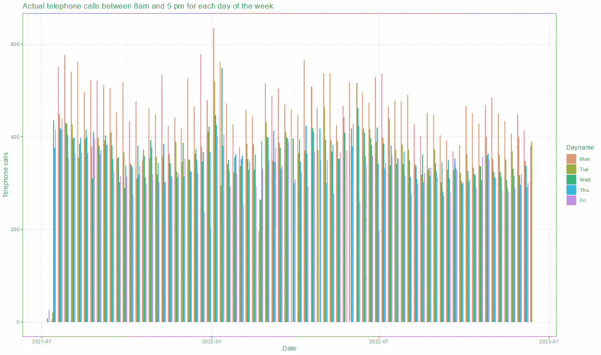

Thats quite a lot of calls. There is a very discernable pattern here, which is not immediately clear because of the amount of data but I will zoom in to show.

```
df%>%
  filter(RecordType == "VOIP call" & CallDirection=="Incoming" & 
           DoneInIVR==0 & AgentSequence==1)%>%
  group_by(Date, Month)%>%
  filter(Hour >= 8 & Hour <=17)%>%
  count()%>%
  tidyr::drop_na()%>%
  ggplot(., 
         aes(x=Date, y=n))+
  geom_bar(stat="identity")+
  facet_wrap(~Month, scales="free_x")+
  theme_bw()

df%>%
  group_by(RecordType, Date, Month)%>%
  filter(!RecordType %in% c("AgentState", "Callback call"))%>%
  filter(Hour >= 8 & Hour <=17)%>%
  filter(CallDirection=="Incoming" & 
           DoneInIVR==0 & AgentSequence==1)%>%
  count()%>%
  tidyr::drop_na()%>%
  ggplot(., 
         aes(x=Date, y=n, fill=RecordType))+
  geom_bar(stat="identity", position="dodge")+
  facet_wrap(~Month, scales="free_x")+
  theme_bw()
```

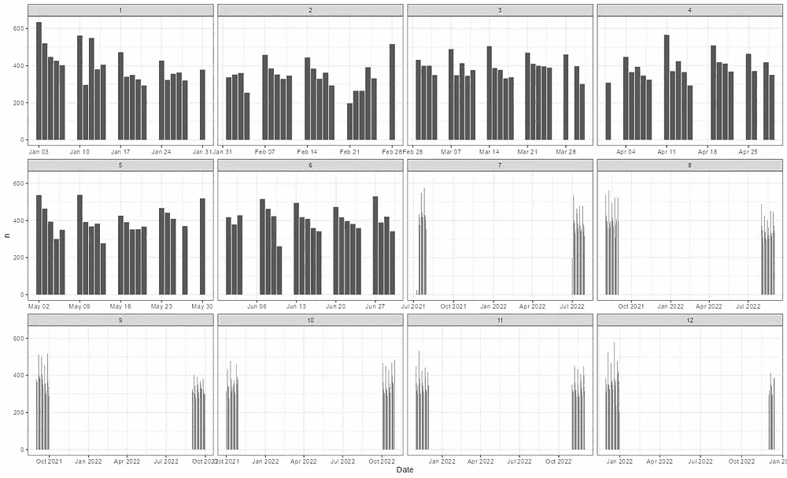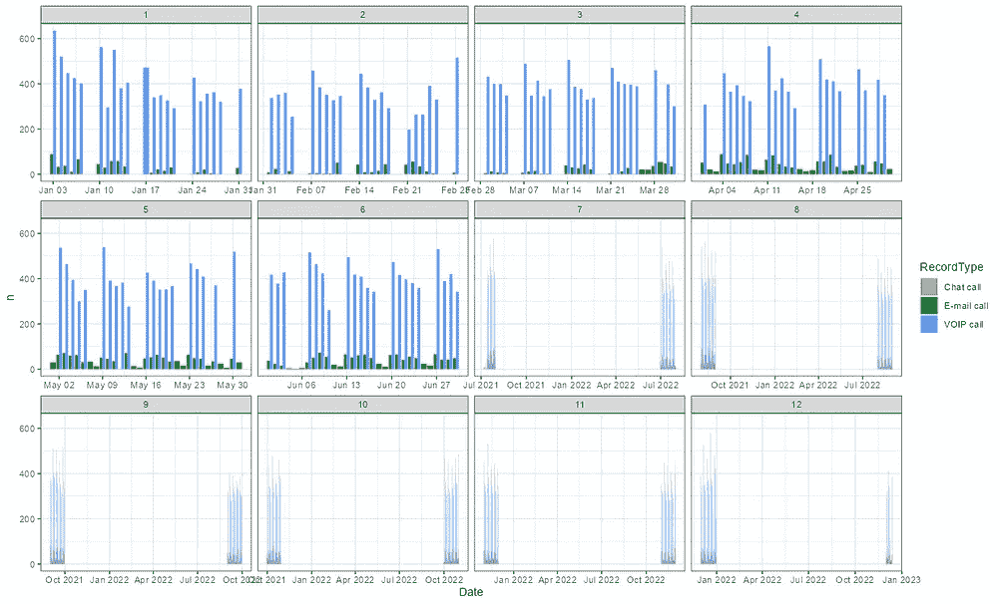

For some months I have data across two years — for the majority I have only one year. Also, the majority of the incoming calls are VOIP, some are e-mails.

让我们看看是否能更好地展示这种模式。

```
df%>%
  group_by(RecordType, Date, Month)%>%
  filter(!RecordType %in% c("AgentState", "Callback call"))%>%
  filter(Hour >= 8 & Hour <=17)%>%
  filter(CallDirection=="Incoming" & 
           DoneInIVR==0 & AgentSequence==1)%>%
  count()%>%
  tidyr::drop_na()%>%
  ggplot(., 
         aes(x=Date, y=n, color=RecordType))+
  geom_point()+
  geom_line()+
  facet_wrap(~Month, scales="free_x")+
  theme_bw()

df%>%
  group_by(RecordType, Date, Month)%>%
  filter(!RecordType %in% c("AgentState", "Callback call"))%>%
  filter(Hour >= 8 & Hour <=17)%>%
  filter(CallDirection=="Incoming" & 
           DoneInIVR==0 & AgentSequence==1)%>%
  count()%>%
  tidyr::drop_na()%>%
  ggplot(., 
         aes(x=Date, y=n, color=RecordType))+
  geom_point()+
  geom_line()+
  theme_bw()
```

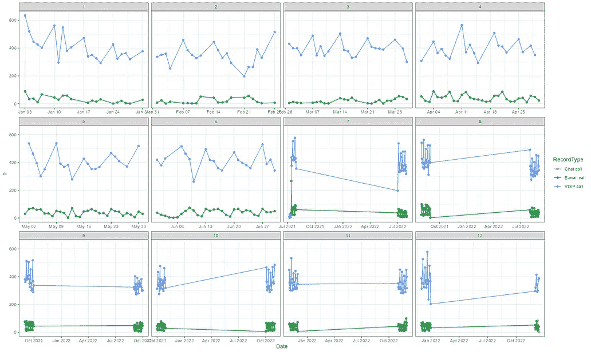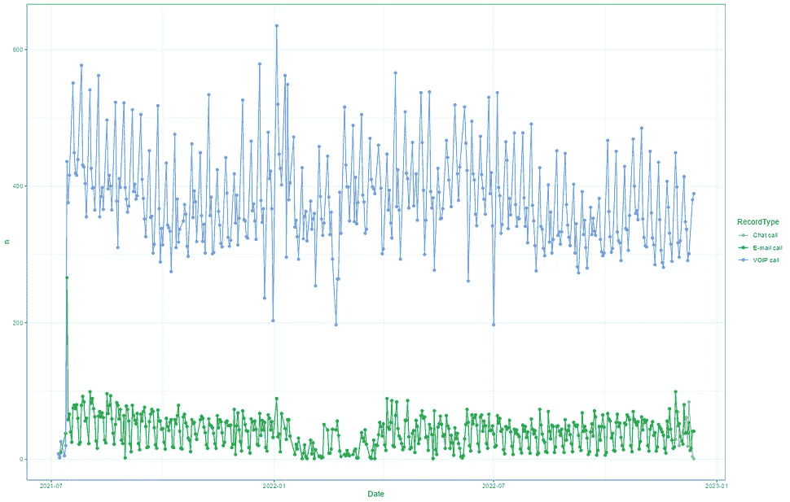

The pattern by zooming in a bit. It is highly cyclical and if you have cyclical data, that's when you need to start thinking about Fourier transforms and spectral analysis.

如果我们不仅仅着眼于几天，而是直接进入一刻钟——这是这种特殊情况下首选的预测水平。

```
df%>%
  dplyr::mutate(newdate = with(., ymd(Date) + hms(QuarterHour)))%>%
  group_by(RecordType, newdate, Month)%>%
  filter(!RecordType %in% c("AgentState", "Callback call"))%>%
  filter(CallDirection=="Incoming" & 
           DoneInIVR==0 & AgentSequence==1)%>%
  count()%>%
  tidyr::drop_na()%>%
  ggplot(., 
         aes(x=newdate, y=n, color=RecordType))+
  geom_point()+
  geom_line()+
  facet_wrap(~Month, scales="free_x")+
  theme_bw()
```


The graphs becomes practically unusable. To heavy in detail it does not add anything.

如果我们绘制每一刻钟、每天和每月的数据呢？

```
df%>%
  group_by(RecordType, Month, Day, QuarterHour)%>%
  filter(!RecordType %in% c("AgentState", "Callback call", "E-mail call"))%>%
  filter(Hour >= 8 & Hour <=17)%>%
  filter(CallDirection=="Incoming" & 
           DoneInIVR==0 & AgentSequence==1)%>%
  count()%>%
  tidyr::drop_na()%>%
  ggplot(., 
         aes(x=QuarterHour, y=n, color=factor(Month)))+
  geom_point()+
  geom_line()+
  facet_wrap(~Day, scales="free_x")+
  theme_bw()
```

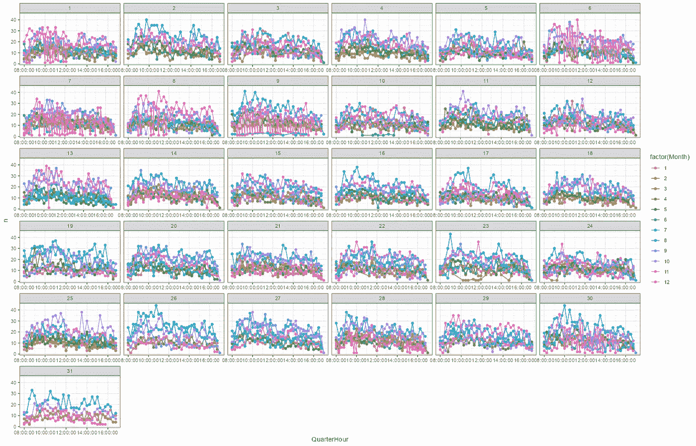

A lot of things going on but the cyclical pattern that we saw per day has disappeared into much more volatile data. This is fun data to model but not easy.

在高粒度数据中寻找模式的一个很好的方法是使用热图，热图具有以方格模式转换时间序列数据的天然能力。

```
df%>%
  group_by(RecordType, Month, Day, QuarterHour)%>%
  filter(!RecordType %in% c("AgentState", "Callback call", "E-mail call"))%>%
  filter(Hour >= 8 & Hour <=17)%>%
  filter(CallDirection=="Incoming" & 
           DoneInIVR==0 & AgentSequence==1)%>%
  count()%>%
  tidyr::drop_na()%>%
  ggplot(., 
         aes(x=QuarterHour, fill=n, y=factor(Month)))+
  geom_tile()+
  scale_fill_viridis_c(option="turbo")+
  facet_wrap(~Day, scales="free_x")+
  theme_bw()

df%>%
  group_by(RecordType, Month, Day, QuarterHour)%>%
  filter(!RecordType %in% c("AgentState", "Callback call", "E-mail call"))%>%
  filter(Hour >= 8 & Hour <=17)%>%
  filter(CallDirection=="Incoming" & 
           DoneInIVR==0 & AgentSequence==1)%>%
  count()%>%
  tidyr::drop_na()%>%
  ggplot(., 
         aes(y=QuarterHour, fill=n, x=factor(Month)))+
  geom_tile()+
  scale_fill_viridis_c(option="turbo")+
  facet_wrap(~Day, scales="free_x")+
  theme_bw()
```

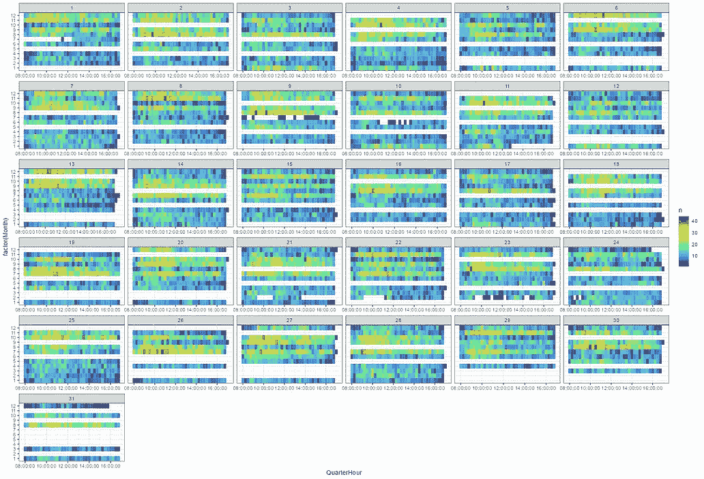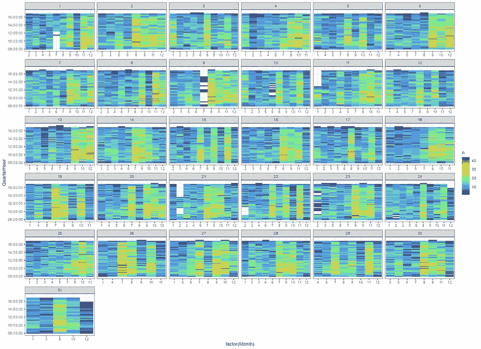

The same data plotted using different axes — you can clearly see patterns across days and time. The presence of such patterns will make the time-series analysis more easy to conduct.

好的，这肯定给了我们额外的信息。它并不完美，但它突出了模式(这也是我们在前面的情节中看到的)。

```
df%>%
  group_by(RecordType, MonthName, Day, QuarterHour)%>%
  filter(!RecordType %in% c("AgentState", "Callback call", "E-mail call"))%>%
  filter(Hour >= 8 & Hour <=17)%>%
  filter(CallDirection=="Incoming" & 
           DoneInIVR==0 & AgentSequence==1)%>%
  count()%>%
  tidyr::drop_na()%>%
  ggplot(., 
         aes(y=QuarterHour, fill=n, x=factor(Day)))+
  geom_tile()+
  scale_fill_viridis_c(option="turbo")+
  facet_wrap(~MonthName, scales="free_x")+
  theme_bw()
```

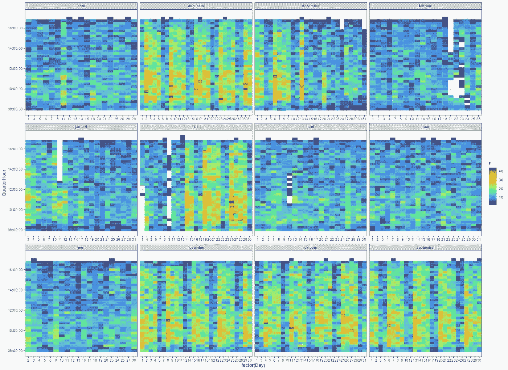

Per quarter hour, hour, day, and month you can see the number of incoming VOIP calls. It is very easy to discern patterns here, especially when using a specific heatmap collouring with a wide range of possibilities.

我知道大多数电话会在早上 8 点到下午 5 点之间，所以现在让我们把重点放在这一点上。

```
df%>%
  group_by(RecordType, Day, Month)%>%
  filter(!RecordType %in% c("AgentState", "Callback call"))%>%
  filter(Hour >= 8 & Hour <=17)%>%
  filter(CallDirection=="Incoming" & 
           DoneInIVR==0 & AgentSequence==1)%>%
  count()%>%
  tidyr::drop_na()%>%
  ggplot(., 
         aes(x=Day, y=n, fill=factor(Month)), col="black")+
  geom_bar(stat="identity", position="dodge")+
  facet_wrap(~RecordType, scales="free_y", ncol=1)+
  theme_bw()
```

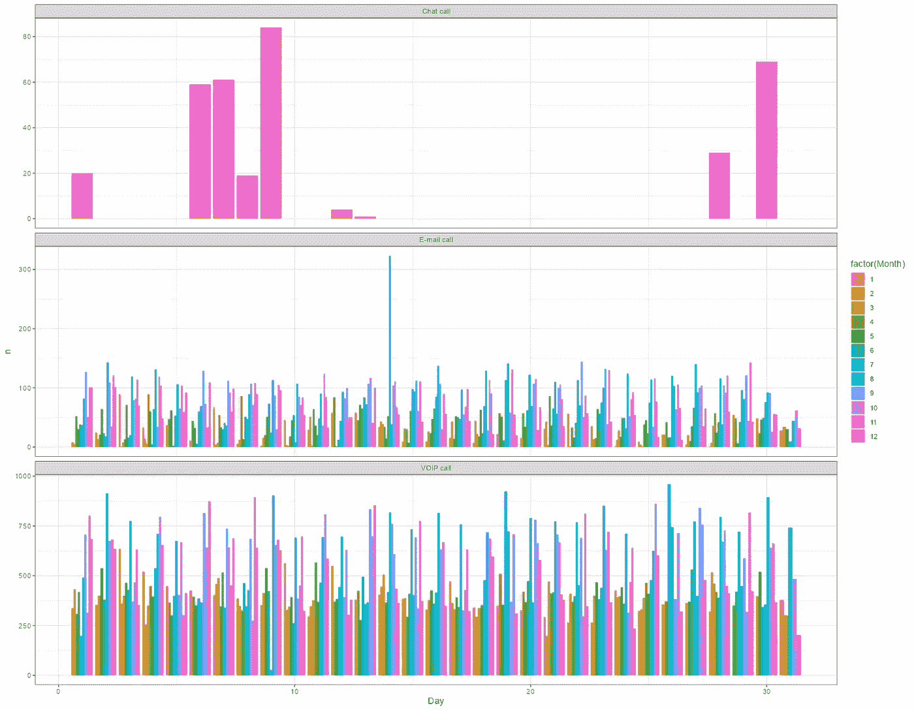

Heavy patterns again, for both VOIP and e-mail calls.

让我们将时间过滤器(上午 8 点到下午 5 点)应用到热图中，并选择一种更复杂的着色方式。由于服务中心关闭，人们也不太可能在周末打电话。因此，我将应用一个额外的过滤器来尝试并关注大部分信息。

```
df%>%
  filter(RecordType == "VOIP call" & CallDirection=="Incoming")%>%
  group_by(Date, Month, Hour)%>%
  filter(Hour >= 8 & Hour <=17)%>%
  filter(!DayName %in% c("Zaterdag", "Zondag"))%>%
  count()%>%
  tidyr::drop_na()%>%
  ggplot(., 
         aes(x=Date, fill=n, y=factor(Hour)))+
  geom_tile()+
  scale_fill_viridis_c(option="magma")+
  facet_wrap(~Month, scales="free")+
  theme_bw()

df%>%
  filter(Hour >= 8 & Hour <=17)%>%
  filter(!DayName %in% c("Zaterdag", "Zondag"))%>%
  filter(CallDirection=="Incoming")%>%
  group_by(Month, Day)%>%
  count()%>%
  tidyr::drop_na()%>%
  ggplot(., 
         aes(x=factor(Day), y=n, fill=factor(Month)))+
  geom_bar(stat="identity", position="dodge")+
  theme_bw()
```

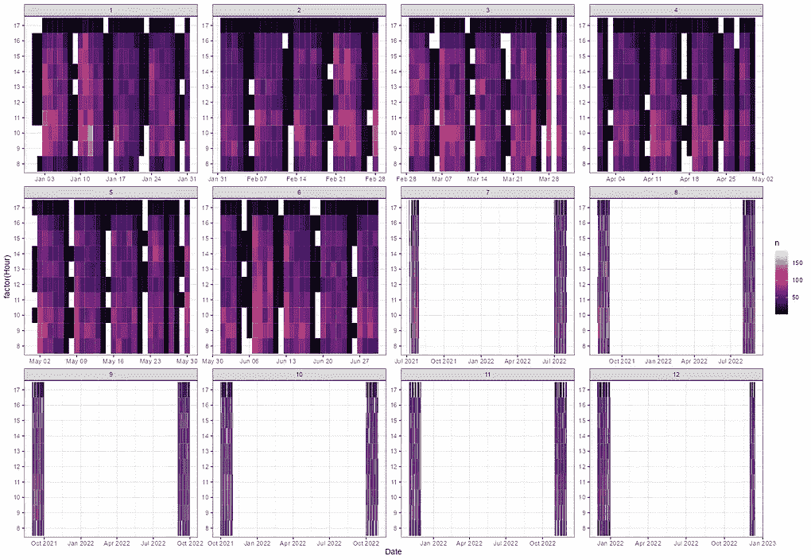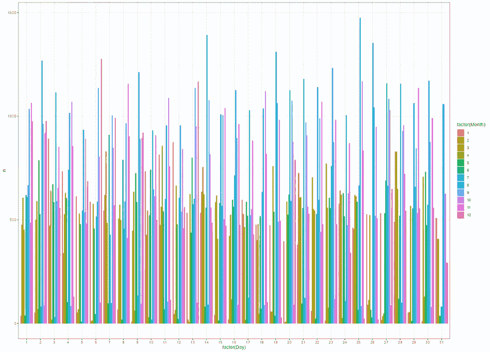

For some months I have more data than for others, and although there are definitely patterns, I am not sure if showcasing it like this is the best possible way forward. Quite some volatility.

试图超越数据波动的一个非常好的方法是使用移动平均线。移动平均线使用移动窗口汇总数据，从理论上讲，移动窗口应该会拾取潜在的信号。下面，我将使用 30 小时和一刻钟的移动平均线。因此，将合计 30 小时或 30/4 = 7.5 小时。

```
roll_avg_30 <- timetk::slidify(.f = tidyquant::AVERAGE, .period = 30, .align = "center", .partial = TRUE)
df%>%
  dplyr::mutate(newdate = with(., ymd(Date) + hms(QuarterHour)))%>%
  group_by(RecordType, newdate)%>%
  filter(!RecordType %in% c("AgentState", "Callback call"))%>%
  filter(CallDirection=="Incoming" & 
           DoneInIVR==0 & AgentSequence==1)%>%
  count()%>%
  group_by(RecordType) %>%
  imputeTS::na_kalman(.) %>%
  mutate(rolling_avg_30 = roll_avg_30(n)) %>%
  tidyr::pivot_longer(cols = c(n, rolling_avg_30)) %>%
  plot_time_series(newdate, value, .color_var = name,
                   .facet_ncol = 2, .smooth = FALSE, 
                   .interactive = FALSE)

df%>%
  dplyr::mutate(newdate = with(., ymd(Date) + hours(Hour)))%>%
  group_by(RecordType, newdate)%>%
  filter(!RecordType %in% c("AgentState", "Callback call"))%>%
  filter(CallDirection=="Incoming" & 
           DoneInIVR==0 & AgentSequence==1)%>%
  count()%>%
  group_by(RecordType) %>%
  imputeTS::na_kalman(.) %>%
  mutate(rolling_avg_30 = roll_avg_30(n)) %>%
  tidyr::pivot_longer(cols = c(n, rolling_avg_30)) %>%
  plot_time_series(newdate, value, .color_var = name,
                   .facet_ncol = 2, .smooth = FALSE, 
                   .interactive = FALSE)
```

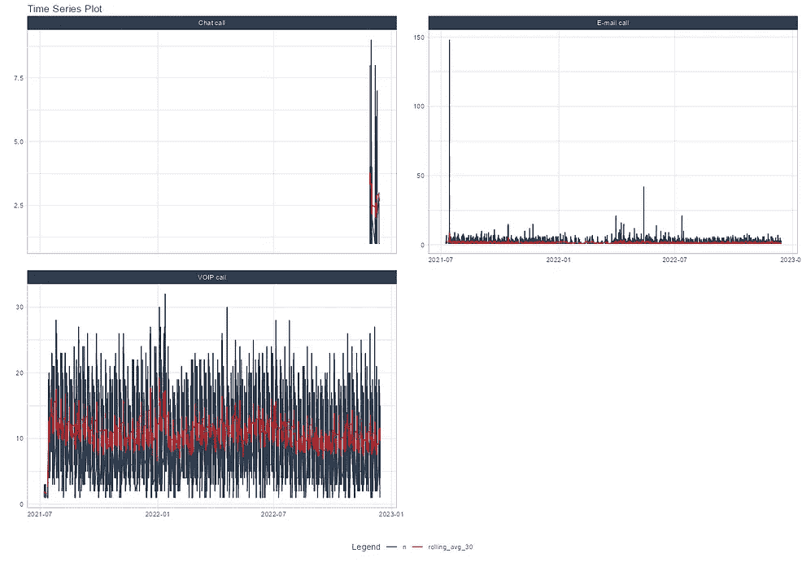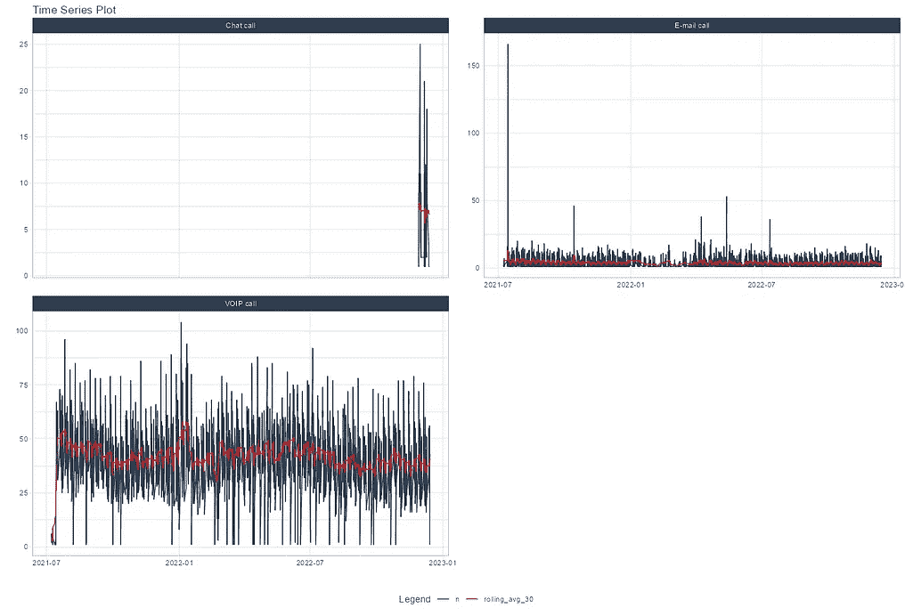

I cannot say that the moving average is really helping me get a better understanding of the data. Highly cyclical, it just deletes the high peaks and valleys but does not really add anything. In fact, to be honest, I find it more confusing and distracting than the original data.

当然，有多种方法可以控制数据，对我来说，分解是最直接的选择。由于几乎所有的计量经济学工具都依赖于某种形式的(统计)分解，这是一个坚实的开端。请注意，没有标准分解这种东西——存在多种分解数据的方式，您的选择取决于您将看到的内容。这就像剥洋葱皮一样。

```
df%>%
  group_by(RecordType, Date)%>%
  filter(!RecordType %in% c("AgentState", "Callback call"))%>%
  filter(CallDirection=="Incoming" & 
           DoneInIVR==0 & AgentSequence==1)%>%
  count()%>%
  group_by(RecordType) %>%
  imputeTS::na_kalman(.) %>%
  plot_time_series_boxplot(Date,
                           n,
                           .facet_ncol = 2,
                           .period = "2 weeks",
                           .smooth = TRUE,
                           .interactive = FALSE)
```

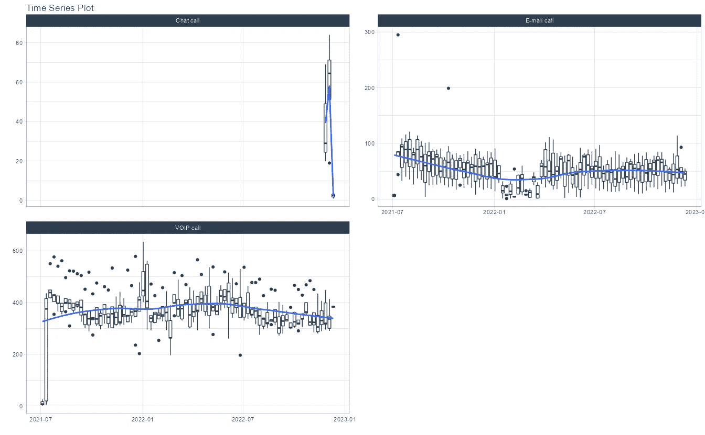

Data aggregated in periods of 2 weeks. Looks quite different all of a sudden.

现在谈谈季节性诊断。

```
df%>%
  group_by(RecordType, Date)%>%
  filter(!RecordType %in% c("AgentState", "Callback call"))%>%
  filter(CallDirection=="Incoming" & 
           DoneInIVR==0 & AgentSequence==1)%>%
  count()%>%
  group_by(RecordType) %>%
  imputeTS::na_kalman(.) %>%
  plot_seasonal_diagnostics(Date,n,.interactive = FALSE)
```

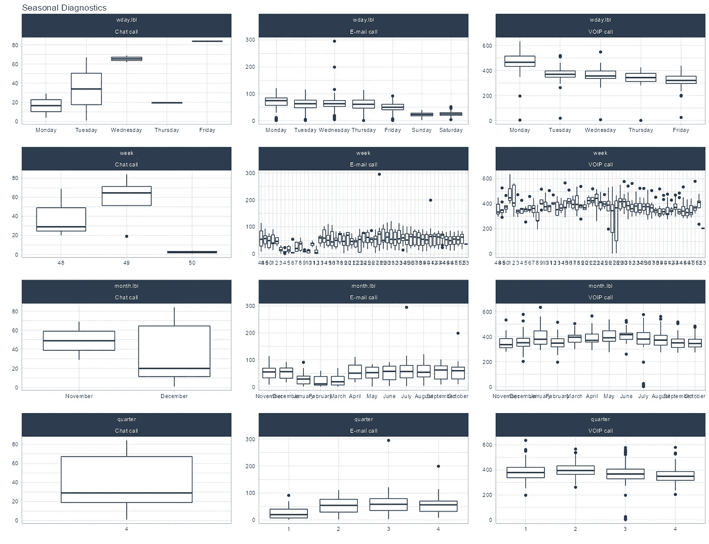

In every part of decomposed time (minutes, hours, day, weeks, months, quarter-months, years) there is something to be gained as you can see. Hence, it would not surprise me at all if a decomposition model will work best when working on a model.

让我们更深入地研究构图。

```
df%>%
  group_by(RecordType, Date)%>%
  filter(!RecordType %in% c("AgentState", "Callback call"))%>%
  filter(CallDirection=="Incoming" & 
           DoneInIVR==0 & AgentSequence==1)%>%
  count()%>%
  group_by(RecordType) %>%
  imputeTS::na_kalman(.) %>%
  plot_stl_diagnostics(Date,n, 
                       .frequency = "auto", 
                       .trend = "auto",
                       .feature_set = c("observed", "season", "trend", "remainder"),
                       .interactive = FALSE)
```

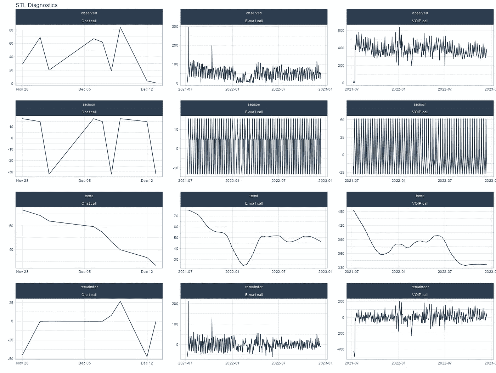

Hmm, cannot say this is helping me more. Some parts are strange, which could be due to having only one-and-a-half years of data, but in minutes.

异常情况呢？

```
df%>%
  group_by(RecordType, Date)%>%
  filter(!RecordType %in% c("AgentState", "Callback call"))%>%
  filter(CallDirection=="Incoming" & 
           DoneInIVR==0 & AgentSequence==1)%>%
  count()%>%
  group_by(RecordType) %>%
  imputeTS::na_kalman(.) %>%
  plot_anomaly_diagnostics(Date, n,.interactive = FALSE)
```

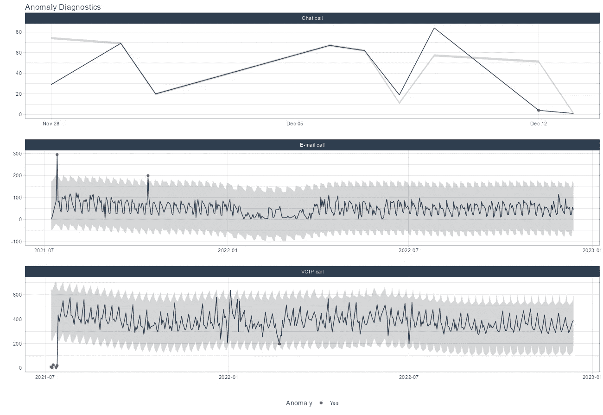

None really to be detected — up and down it goes for both VOIP calls and e-mails. Do take note that these are STATISTICAL anomalies. To me, a tru anomaly is one in which the observation crosses an internal threshold based on internal boundaries and knowledge.

让我们最后一次看一下原始形式的每小时数据。

```
df%>%
  dplyr::mutate(newdate = with(., ymd(Date) + hours(Hour)))%>%
  filter(!RecordType %in% c("AgentState", "Callback call"))%>%
  group_by(RecordType, newdate)%>%
  filter(CallDirection=="Incoming" & 
           DoneInIVR==0 & AgentSequence==1)%>%
  count()%>%
  select(newdate, n)%>%
  as_tsibble(key = RecordType, index = newdate) %>%
  fill_gaps(n = 0, .full = end()) %>%
  autoplot(n) +
  theme_bw()
```

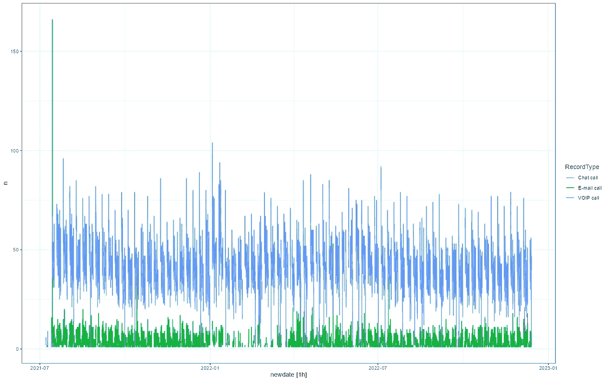

What I need to do is step into the world of spectral analysis.

## 光谱分析

光谱分析是一种研究循环模式的分析形式。使用[科学指导](https://www.sciencedirect.com/topics/agricultural-and-biological-sciences/spectral-analysis#:~:text=Spectral%20analysis%20involves%20the%20calculation,is%20assumed%20to%20be%20constant.)，我们得到以下描述:

> 光谱分析包括对一组有序数据中的波或振荡的计算。这些数据可以作为一个或多个独立变量的函数来观察，例如三个笛卡尔空间坐标或时间。假设空间或时间观察间隔是恒定的。

简而言之，频谱分析寻找时间序列中的周期性重复行为。这就是振荡，通过将时间序列分解成光谱分析，你应该能够找到关键特征，并预测接下来会发生什么。

所以，我想做的是对这种类型的数据进行光谱分析，看看我能否减去时间序列的光谱部分，然后我可以用它来建立一个模型。我将使用与之前相同的数据集。

```
TC_df<-df%>%
  dplyr::mutate(newdate = with(., ymd(Date) + hours(Hour)),
                RecordTpe = factor(RecordType))%>%
  #dplyr::mutate(newdate = with(., ymd(Date)))%>%
  group_by(RecordType, newdate)%>%
  filter(!RecordType %in% c("AgentState", "Callback call"))%>%
  filter(CallDirection=="Incoming" & 
           DoneInIVR==0 & AgentSequence==1)%>%
  count()%>%
  group_by(RecordType) %>%
  imputeTS::na_kalman(.) %>% 
  select(RecordType, newdate, n)%>%
  as_tsibble(key = RecordType, index = newdate) %>%
  fill_gaps(n = 0, .full = end())%>%
  as_tibble()%>%
  arrange(RecordType, newdate)
> str(TC_df)
tibble [25,503 x 3] (S3: tbl_df/tbl/data.frame)
 $ RecordType: chr [1:25503] "Chat call" "Chat call" "Chat call" "Chat call" ...
 $ newdate   : POSIXct[1:25503], format: "2022-11-28 09:00:00" "2022-11-28 10:00:00" "2022-11-28 11:00:00" "2022-11-28 12:00:00" ...
 $ n         : num [1:25503] 9 1 0 0 0 0 11 8 0 0 ...
```

构建一个频谱周期图并不困难，事实上它内置在 r 的 *stats* 函数中，名为 *spec.pgram* ，它允许你使用快速傅立叶变换构建一个周期图。周期图是信号频谱密度的估计值。正如世界上的许多事情一样，如果我展示而不是打字，那是最好的。

```
raw.spec <-TC_df%>%
  filter(RecordType=="VOIP call")%>%
  spec.pgram(., taper=0)
> summary(raw.spec)
          Length Class  Mode     
freq       6400  -none- numeric  
spec      19200  -none- numeric  
coh       19200  -none- numeric  
phase     19200  -none- numeric  
kernel        0  -none- NULL     
df            1  -none- numeric  
bandwidth     1  -none- numeric  
n.used        1  -none- numeric  
orig.n        1  -none- numeric  
series        1  -none- character
snames        3  -none- character
method        1  -none- character
taper         1  -none- numeric  
pad           1  -none- numeric  
detrend       1  -none- logical  
demean        1  -none- logical

plot(raw.spec)
plot(raw.spec, log = "no")
```

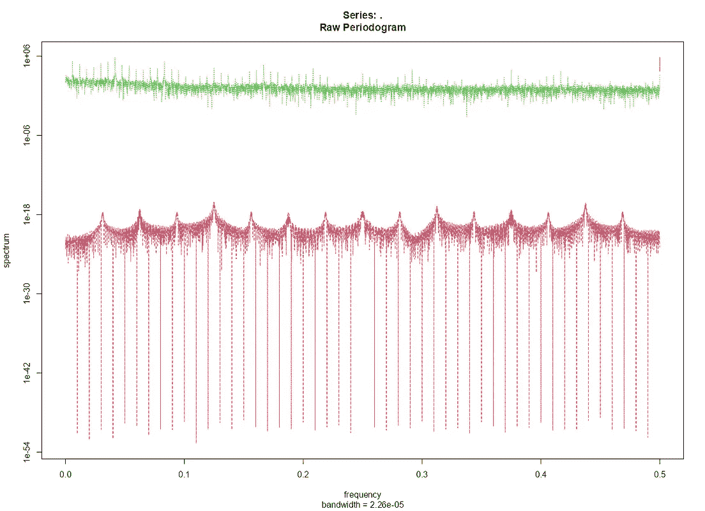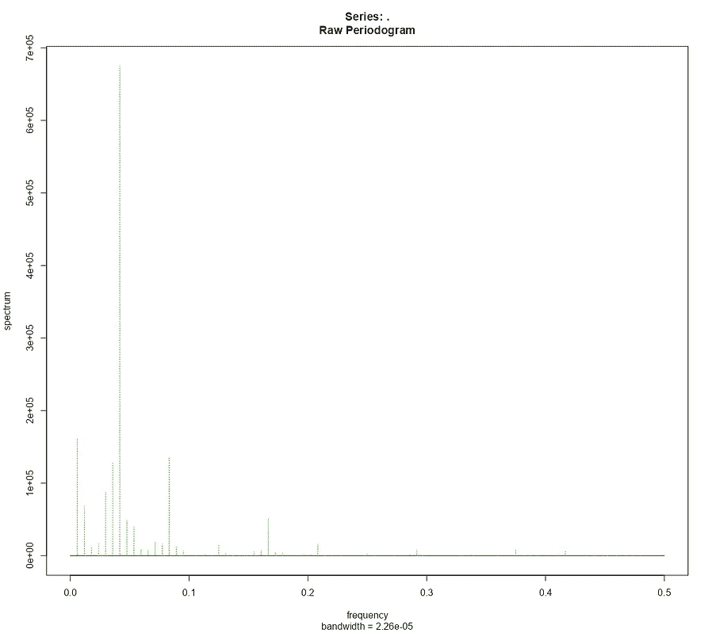

de see a periodogram for the VOIP calls. You can clearly see that there is a pattern to be discerned which becomes even clearer if you let go of the log scale (right plot). The plot to the right has information (the spikes) you can use when building your own Fourier terms, something I will talk about later.

如果数据是静态的，时间序列分析效果最好，这意味着时间成分被排除在外-联合概率分布在随时间移动时不会改变。创建 stationairy 数据的一个简单方法是通过从当前值中减去前一个值来区分时间序列。我想看看如果我这样做，光谱密度会有什么变化。

```
raw.spec <-TC_df%>%
  filter(RecordType=="VOIP call")%>%
  mutate(diff = n-lag(n))%>%
  select(-n)%>%
  drop_na()%>%
  spec.pgram(., taper=0) 
```

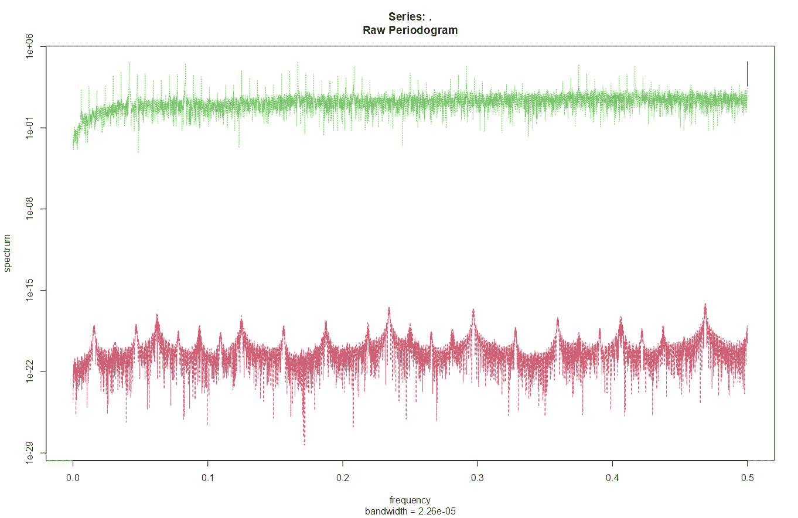

Nothing striking.

记得我说过原始音阶上的周期图是最重要的吗？让我通过构建相同的周期图，并以不同的方式绘制出来，来告诉你为什么。

```
raw.spec <-TC_df%>%
  filter(RecordType=="VOIP call")%>%
  mutate(diff = n-lag(n))%>%
  select(-n)%>%
  drop_na()%>%
  spec.pgram(., taper=0)
spec.df <- data.frame(freq = raw.spec$freq, spec = raw.spec$spec)
hours.period <- rev(c(1/6, 1/5, 1/4, 1/3, 0.5, 1, 3, 5, 10, 100))
hours.labels <- rev(c("1/6", "1/5", "1/4", "1/3", "1/2", "1", "3", "5", "10", 
                    "100"))
hours.freqs <- 1/hours.period * 1/4  #Convert houry period to hourly freq, and then to quarterly freq
spec.df$period <- 1/spec.df$freq
spec.df
           freq spec.1       spec.2       spec.3      period
1   0.000078125      0 3.784085e-25 2.291720e-02 12800.00000
2   0.000156250      0 4.167051e-23 3.888956e-03  6400.00000
3   0.000234375      0 6.253588e-23 2.164362e-03  4266.66667
4   0.000312500      0 1.114799e-22 1.292227e-03  3200.00000
5   0.000390625      0 3.542334e-24 9.934706e-03  2560.00000
6   0.000468750      0 4.301732e-22 2.664525e-03  2133.33333
7   0.000546875      0 2.406620e-23 1.186406e-02  1828.57143
8   0.000625000      0 2.290866e-22 1.499429e-02  1600.00000
9   0.000703125      0 3.062672e-22 5.879470e-03  1422.22222
10  0.000781250      0 4.157089e-22 2.916041e-02  1280.00000
11  0.000859375      0 1.060980e-23 2.073200e-02  1163.63636
12  0.000937500      0 8.569833e-22 3.039029e-02  1066.66667
13  0.001015625      0 6.816308e-23 5.737517e-02   984.61538
14  0.001093750      0 2.918175e-22 2.162401e-02   914.28571
15  0.001171875      0 4.315086e-22 3.156534e-02   853.33333
16  0.001250000      0 1.155874e-22 1.175910e-01   800.00000
17  0.001328125      0 4.506040e-22 5.830660e-03   752.94118
18  0.001406250      0 1.698297e-21 6.192288e-02   711.11111
19  0.001484375      0 6.861074e-22 3.199262e-02   673.68421
20  0.001562500      0 1.461395e-23 1.911038e-02   640.00000
21  0.001640625      0 6.512788e-22 4.708815e-02   609.52381
22  0.001718750      0 1.612486e-22 3.393423e-02   581.81818
23  0.001796875      0 5.432993e-23 5.358052e-03   556.52174
24  0.001875000      0 3.252505e-23 6.003705e-02   533.33333
25  0.001953125      0 4.534174e-23 7.098041e-03   512.00000
26  0.002031250      0 5.903458e-23 3.802192e-02   492.30769
27  0.002109375      0 6.708265e-22 1.427860e-02   474.07407
28  0.002187500      0 1.855928e-26 6.681841e-02   457.14286
29  0.002265625      0 2.287686e-22 1.329557e-02   441.37931
30  0.002343750      0 9.672564e-24 5.055994e-02   426.66667
31  0.002421875      0 1.311867e-22 4.297470e-02   412.90323
32  0.002500000      0 6.719445e-23 1.742689e-02   400.00000
33  0.002578125      0 3.092362e-23 1.419823e-02   387.87879
```

```
g1<-ggplot(data = subset(spec.df)) + 
  geom_line(aes(x = freq, y = spec.3)) + 
  scale_x_continuous("Period (hours)", 
                     breaks = hours.freqs, 
                     labels = hours.labels) + 
  scale_y_continuous()+
  theme_bw()
g2<-ggplot(data = subset(spec.df)) + 
  geom_line(aes(x = freq, y = spec.3)) + 
  scale_x_continuous("Period (hours)",
                     breaks = hours.freqs, 
                     labels = hours.labels) + 
  scale_y_log10() +
  theme_bw()
g3<-ggplot(data = subset(spec.df)) + 
  geom_line(aes(x = freq, y = spec.3)) + 
  scale_x_log10("Period (hours)",
                breaks = hours.freqs, 
                labels = hours.labels) + 
  scale_y_log10()+
  theme_bw()
gridExtra::grid.arrange(g1,g2,g3,ncol=1)
```

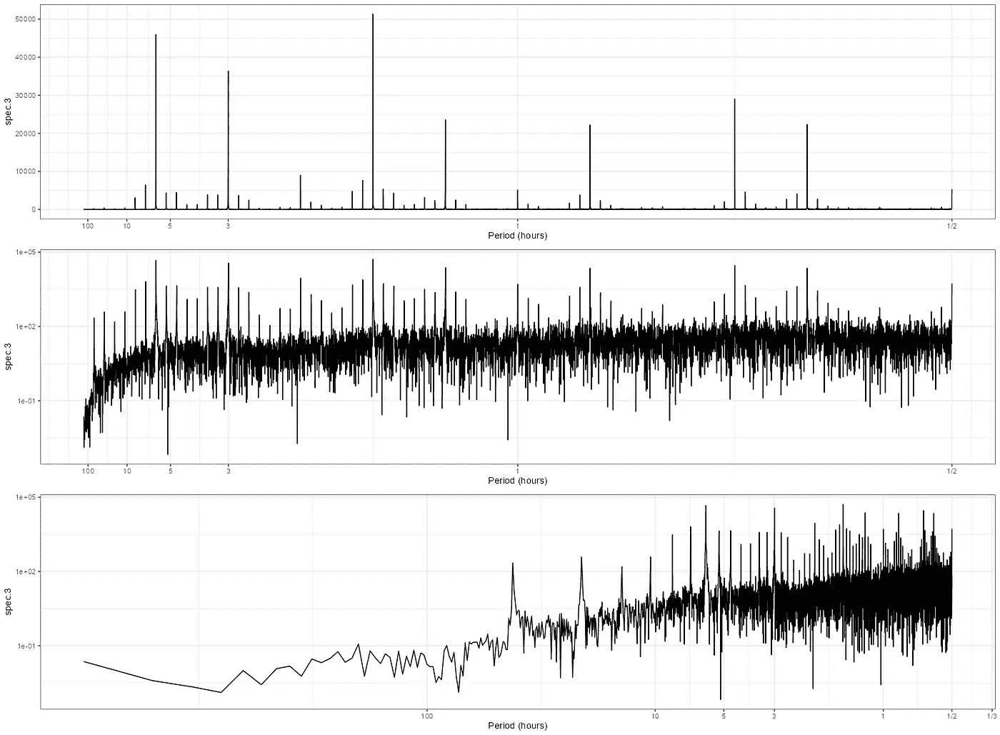

You see the spectral results per hour, in three different ways. What you see, and the top plot is most important, is that there are specific parts of the time-series which stand out. Meaning that there are cycles underlying the time-series. This information can feed a model using Fourier transformations.

上面的三幅图显示了完全相同的东西，但是比例不同(看代码)。我总是发现第一个情节是最有帮助的，因为它显示了突出的周期。每个峰值都与一个频率或一段时间相关联，告诉我这可能是一个周期。如果你认为时间序列是一组具有不同周期(链长)的链，那么你也可以理解谱分析的重要性。我来补充一张我从网上找到的 gif 来突出那个概念。


Here, you see the sine and cosine working, separate, but certainly also together so they are able to create cyclical patterns. The same cycles you can see in time-series. [https://commons.wikimedia.org/wiki/File:Circle_cos_sin.gif](https://commons.wikimedia.org/wiki/File:Circle_cos_sin.gif)

下一个 gif 将结合不同长度和速度的循环。对我来说，它们代表了一个链条，但可能与时钟的内部运作有更多的共同之处。从其内部运作，时间序列是创造了一系列的时期。

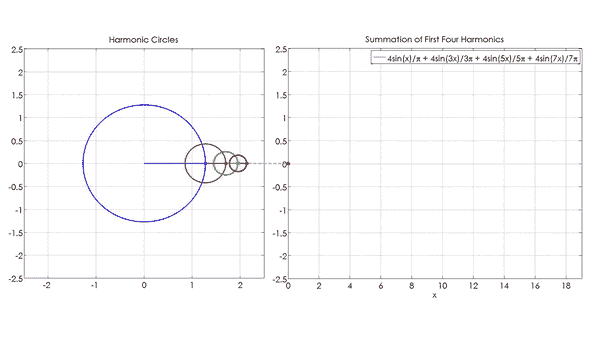

You can see, in the top-right corner of the gif, the formula to create this time-series which is a model made up of sine and cosine functions. [https://fischerbach.medium.com/introduction-to-fourier-analysis-of-time-series-42151703524a](https://fischerbach.medium.com/introduction-to-fourier-analysis-of-time-series-42151703524a)

最后一张 gif 展示了正弦和余弦函数的工作原理。


You can see that each part offers a different cyclical pattern. If you look at spectral analysis as a decomposition method then you should be able to discern now what it is I am looking for. [https://commons.wikimedia.org/wiki/File:Fourier_series_square_wave_circles_animation.gif](https://commons.wikimedia.org/wiki/File:Fourier_series_square_wave_circles_animation.gif)

希望光谱分析的目的变得更加清晰。现在，让我们继续前进。从前面的图中可以看出，尽管周期图的目的是从噪音中过滤信号，但它的噪音很大。我们能做的抵消是使用核估计平滑频谱分析。这里我将使用一个预定义的内核。

```
k = kernel("daniell", c(24, 24, 24))
TC_df<-TC_df%>%
  filter(RecordType=="VOIP call")%>%
  ungroup()
smooth.spec <- spec.pgram(TC_df$n, kernel = k, taper = 0)
spec.df <- data.frame(freq = smooth.spec$freq, 
                      `c(24,24,24)` = smooth.spec$spec)
names(spec.df) <- c("freq", "c(24,24,24)")
# Add other smooths
k <- kernel("daniell", c(24, 24))
spec.df[, "c(24,24)"] <- spec.pgram(TC_df$n, kernel = k, taper = 0, plot = FALSE)$spec
k <- kernel("daniell", c(24))
spec.df[, "c(24)"] <- spec.pgram(TC_df$n, kernel = k, taper = 0, plot = FALSE)$spec
spec.df <- reshape2::melt(spec.df, 
                          id.vars = "freq", 
                          value.name = "spec", 
                          variable.name = "kernel")
spec.df
           freq      kernel      spec
1   0.000078125 c(24,24,24)  318.8043
2   0.000156250 c(24,24,24)  318.5979
3   0.000234375 c(24,24,24)  318.2723
4   0.000312500 c(24,24,24)  319.2094
5   0.000390625 c(24,24,24)  321.4967
6   0.000468750 c(24,24,24)  325.1580
7   0.000546875 c(24,24,24)  330.2003
8   0.000625000 c(24,24,24)  336.6251
9   0.000703125 c(24,24,24)  344.4505
10  0.000781250 c(24,24,24)  353.6930
11  0.000859375 c(24,24,24)  364.3642
12  0.000937500 c(24,24,24)  376.4706
13  0.001015625 c(24,24,24)  390.0240
14  0.001093750 c(24,24,24)  405.0391
15  0.001171875 c(24,24,24)  421.5098
16  0.001250000 c(24,24,24)  439.4497
17  0.001328125 c(24,24,24)  458.8569
18  0.001406250 c(24,24,24)  479.7424
19  0.001484375 c(24,24,24)  502.1111
20  0.001562500 c(24,24,24)  525.9676
21  0.001640625 c(24,24,24)  551.3425
22  0.001718750 c(24,24,24)  578.2441
23  0.001796875 c(24,24,24)  606.6778
24  0.001875000 c(24,24,24)  636.6403
25  0.001953125 c(24,24,24)  668.1353
26  0.002031250 c(24,24,24)  701.1556
27  0.002109375 c(24,24,24)  735.7042
28  0.002187500 c(24,24,24)  771.7751
29  0.002265625 c(24,24,24)  809.3732
30  0.002343750 c(24,24,24)  848.5064
31  0.002421875 c(24,24,24)  889.2045
32  0.002500000 c(24,24,24)  931.4631
33  0.002578125 c(24,24,24)  975.2870
34  0.002656250 c(24,24,24) 1020.6859
35  0.002734375 c(24,24,24) 1067.6608

plot1 <- ggplot(data = subset(spec.df)) + 
  geom_path(aes(x = freq, y = spec,color = kernel)) + 
  scale_x_continuous("Period (hours)", 
                     breaks = hours.freqs,
                     labels = hours.labels) + 
  scale_y_log10()+
  theme_bw()
plot2 <- ggplot(data = subset(spec.df)) + 
  geom_path(aes(x = freq, y = spec,color = kernel)) + 
  scale_x_log10("Period (hours)", 
                breaks = hours.freqs,
                labels = hours.labels) + 
  scale_y_log10()+
  theme_bw()
gridExtra::grid.arrange(plot1, plot2)
```

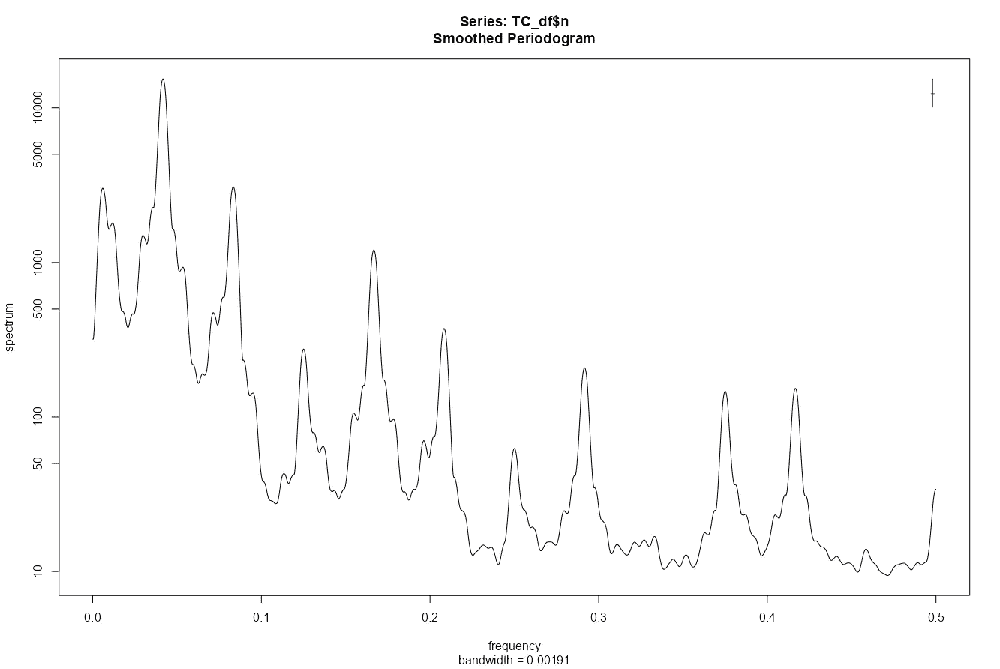

The spectral analysis using the smoothed kernel.

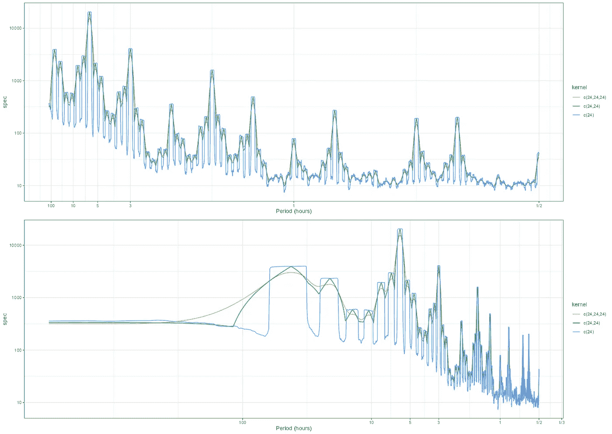

And different plots of different kernels. In the end, it all looks nice, but to me the original periodogram is the most helpful, and so I will use that.

我已经展示了对包含大量循环模式的时间序列数据进行建模的一种有效方法是使用正弦和余弦函数。我现在要做的是建立一个线性回归模型，并添加正弦和余弦函数。但是，我将首先转换日级别的数据，然后将数据分割成组件，并对其进行切片。选择切片的最佳方法是查看周期图的峰值。让我们通过观察数据进行切片、回归和比较拟合。

```
TC_df_wave2<-TC_df%>%
  filter(RecordType=="VOIP call")%>%
  timetk::summarise_by_time(
    .date_var = newdate,
    .by       = "day",
    value  = sum(n))%>%
  mutate(day = as.numeric(yday(newdate)))%>%
  ungroup()
fit <- lm(value~day + sin(2*pi*day/7)+cos(2*pi*day/7)+
            sin(2*pi*day/3)+cos(2*pi*day/3)+
            sin(2*pi*day/6)+cos(2*pi*day/6)+
            sin(2*pi*day/8)+cos(2*pi*day/8)+
            sin(2*pi*day/9)+cos(2*pi*day/9)+
            sin(2*pi*day/100)+cos(2*pi*day/100),
          data=TC_df_wave2)
TC_df_wave2$fitted<-fitted(fit, TC_df_wave2)
ggplot2::ggplot() +
  geom_point(data=TC_df_wave2, aes(x = newdate, y = value), color='black', size=1) +
  geom_line(data=TC_df_wave2, aes(x = newdate, y = fitted), colour = "red", size=1)+
  labs(title="TimeSeries with fitted values", x="Date", y="Incoming Calls") +
  theme(plot.title = element_text(hjust = 0.5, face="bold", size=14),
        axis.text=element_text(size=10),
        axis.title=element_text(size=12),
        legend.title=element_text(size=13, face="bold"),
        legend.text=element_text(size=13))+
  theme_bw()
```

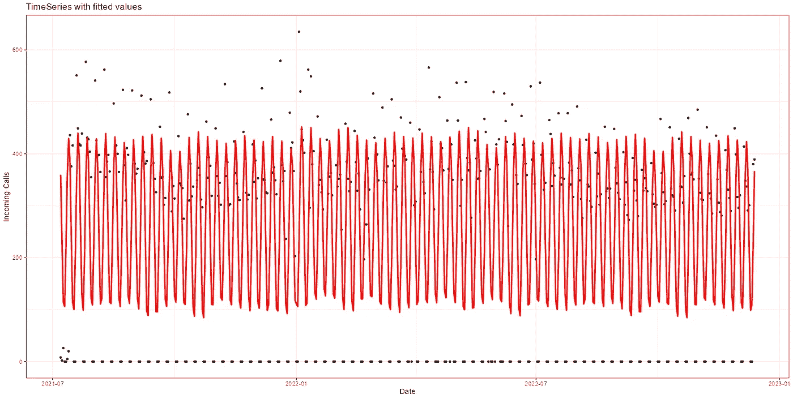

The sine and cosine functions provide a highly cylical pattern, which does capture the main part of the data, but not the boundary nor the peaks. However, for demand data, it is exactly the peaks and valleys that are of importance to me. So we get cycles, but we do not descend nor ascend to the place we need to be.

因此，除了是一个使用线性回归分析时间序列数据的好例子之外，它没有提供我想要的模型。

我可以尝试建立的另一个模型是谐波模型。谐波旨在将数据集分解为一组正弦和余弦函数。因此，它将非常适合，但对未来的预测作用不大。

```
TC_df_wave2<-TC_df%>%
  filter(RecordType=="VOIP call")%>%
  timetk::summarise_by_time(
    .date_var = newdate,
    .by       = "day",
    value  = sum(n))%>%
  mutate(newdate = date(newdate))%>%
  select(newdate, value)%>%
  ungroup()
fitted <- rHarmonics::harmonics_fun(user_vals = TC_df_wave2$value,
                                user_dates = TC_df_wave2$newdate,
                                harmonic_deg = 365)
combined_df <- cbind(TC_df_wave2, fitted)
names(combined_df) <- c("dates", "calls", "fitted")
ggplot2::ggplot() +
  geom_point(data=combined_df, aes(x = dates, y = calls), color='black', size=1) +
  geom_line(data=combined_df, aes(x = dates, y = fitted), colour = "red", size=1)+
  labs(title="TimeSeries with fitted values", x="Date", y="Incoming Calls") +
  theme(plot.title = element_text(hjust = 0.5, face="bold", size=14),
        axis.text=element_text(size=10),
        axis.title=element_text(size=12),
        legend.title=element_text(size=13, face="bold"),
        legend.text=element_text(size=13))+
  theme_bw()
```

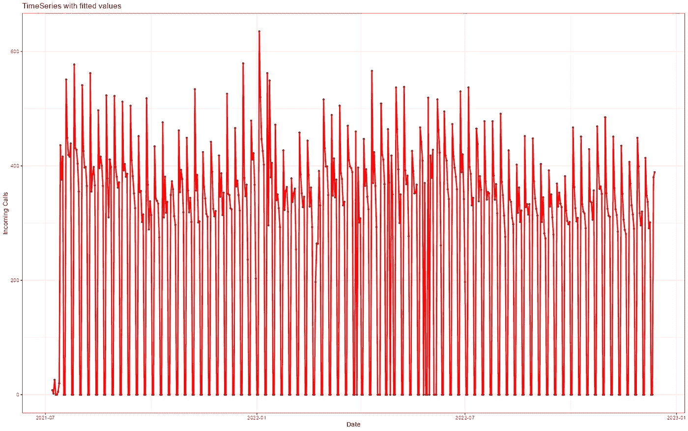

Perfict fit. Overfit once could even say. Sure, I could slice the time-series to construct a model, but there are more straightfoward ways of analyzing cyclical data.

当然，在 R 中有多种方法可以做同样的分析。这里用来进行谐波分析的软件包(*rHarmonics*en*geoTS*)有着稍微不同的目的，但它们确实有助于辨别正弦和余弦函数的大小和位置在可行模型中的使用位置。

```
TC_df_wave2<-TC_df%>%
  filter(RecordType=="VOIP call")%>%
  timetk::summarise_by_time(
    .date_var = newdate,
    .by       = "day",
    value  = sum(n))%>%
  mutate(newdate = date(newdate))%>%
  ungroup()%>%
  as.data.frame()%>%
  as.ts()
fit_harmR <-geoTS::haRmonics(TC_df_wave2$value, 
                             numFreq = round((max(TC_df_wave2$day)/2)-2), 
                             delta = 0.1)
> summary(fit_harmR$a.coef)
   Min. 1st Qu.  Median    Mean 3rd Qu.    Max. 
-15.682  -9.004  -5.735  -6.016  -3.352   4.016 
> summary(fit_harmR$b.coef)
   Min. 1st Qu.  Median    Mean 3rd Qu.    Max. 
 0.7904  4.5014  5.4020  5.7148  7.9489  8.9102 

fitLow_hants <- geoTS::haRmonics(y = TC_df_wave2$value, 
                                 method = "hants", 
                                 numFreq = 7, 
                                 HiLo = "Lo",
                                 low = 0, 
                                 high = 1000, 
                                 fitErrorTol = 5, 
                                 degreeOverDeter = 1,
                                 delta = 0.1)
fitHigh_hants <- geoTS::haRmonics(y = TC_df_wave2$value, 
                                  method = "hants", 
                                  numFreq = 7, 
                                  HiLo = "Hi", 
                                  low = 0, 
                                  high = 1000, 
                                  fitErrorTol = 5, degreeOverDeter = 1, 
                           delta = 0.1)
plot(TC_df_wave2$value, pch = 16, main = "haRmonics fitting")
lines(fit_harmR$fitted ,lty = 4, col = "green")
lines(fitLow_hants$fitted, lty = 4, col = "red")
lines(fitHigh_hants$fitted, lty = 2, col = "blue")
```

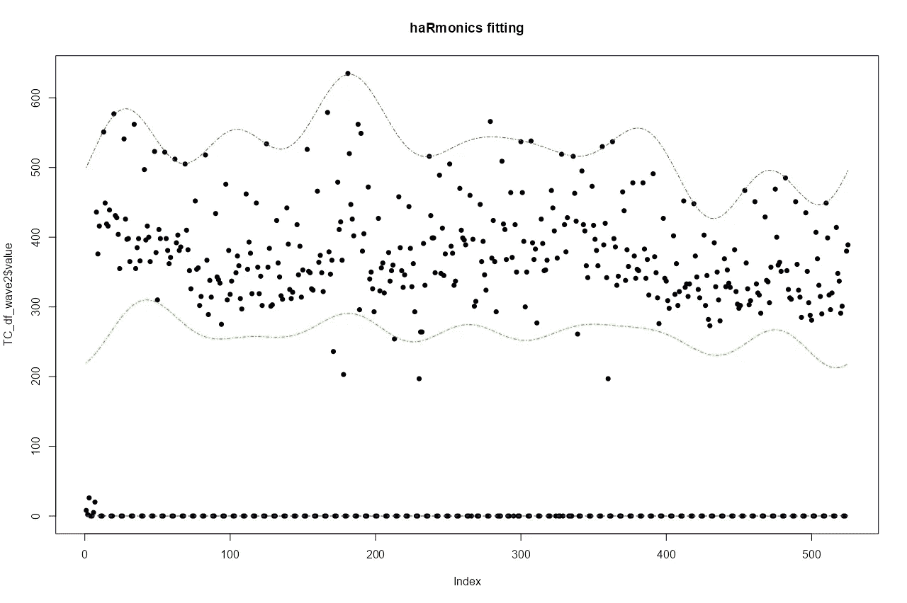

使用 [tidymodels](https://www.tmwr.org/recipes.html) 家族，我还可以构建一个 [*食谱*](https://recipes.tidymodels.org/) ，在其中我使用谐波构建一个步骤。我将应用与之前相同的频谱分解，定义六个循环，每个循环大小为一。他们将一起创建以下模型和输出，然后我可以将其与我观察到的进行比较。

```
TC_df_wave2
findfrequency(TC_df_wave2)
dat <- recipe(value ~ newdate, 
              data = TC_df_wave2) %>%
  step_harmonic(newdate, 
                frequency = c(1/3,1/6,1/7,1/8,1/9,1/100), 
                cycle_size = 1) %>%
  prep() %>%
  bake(new_data = NULL)
fit <- lm(value ~ ., data = dat)
TC_df_wave2$type<-"Observed"
fits <- tibble(
  newdate = TC_df_wave2$newdate,
  value = fit$fitted.values,
  type = "Fitted")
bind_rows(TC_df_wave2, fits) %>%
  ggplot(aes(x = newdate, y = value, color = type)) +
  geom_line()+
  theme_bw()+
  labs(col="", 
       x="Date", 
       y="Incoming calls")
```

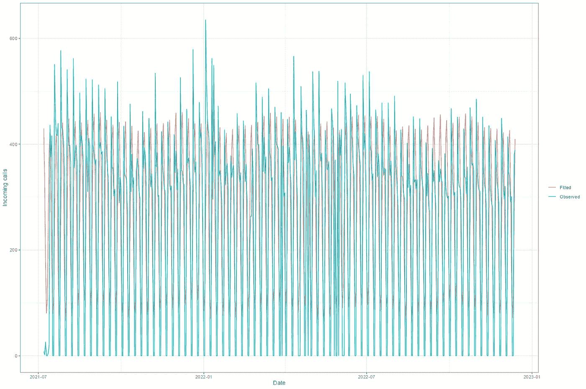

Not bad, but not perfect either. Lets move on.

## 傅立叶变换

是时候进入正题了——傅立叶变换。傅立叶变换到底是什么？这个问题我自己也思考了很久，所以让我们看看维基百科是怎么说的:

> 一个**傅立叶变换** ( **FT** )是一个[数学](https://en.wikipedia.org/wiki/Mathematics) [变换](https://en.wikipedia.org/wiki/Integral_transform)，它将[函数](https://en.wikipedia.org/wiki/Function_(mathematics))分解成频率分量，这些分量由作为频率函数的变换输出来表示。将最常见的[时间](https://en.wikipedia.org/wiki/Time)或[空间](https://en.wikipedia.org/wiki/Space)的函数进行变换，分别输出一个依赖于[时间频率](https://en.wikipedia.org/wiki/Frequency)或[空间频率](https://en.wikipedia.org/wiki/Spatial_frequency)的函数。那个过程也叫做 [*分析*](https://en.wikipedia.org/wiki/Analysis) 。一个示例应用是将音乐[和弦](https://en.wikipedia.org/wiki/Chord_(music))的[波形](https://en.wikipedia.org/wiki/Waveform)分解成其组成[音高](https://en.wikipedia.org/wiki/Pitch_(music))的[强度](https://en.wikipedia.org/wiki/Sound_intensity)。术语*傅立叶变换*指的是[频域](https://en.wikipedia.org/wiki/Frequency_domain)表示和[数学运算](https://en.wikipedia.org/wiki/Operation_(mathematics))，其将频域表示与空间或时间的函数相关联。

这就是我们一直在做的，不是吗？让我们用另一个 gif 把傅立叶变换和周期图放在一起。

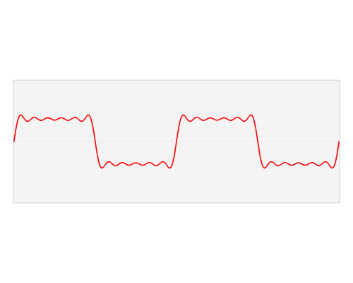

Notice that the beginning is a time-series and that the end is the periodogram. So what I will do is use a periodogram to inform a Fourier function in a time-series model. [https://commons.wikimedia.org/wiki/File:Fourier_transform_time_and_frequency_domains.gif](https://commons.wikimedia.org/wiki/File:Fourier_transform_time_and_frequency_domains.gif)

另一种表达方式是用声音这样的信号来思考，如下图所示。

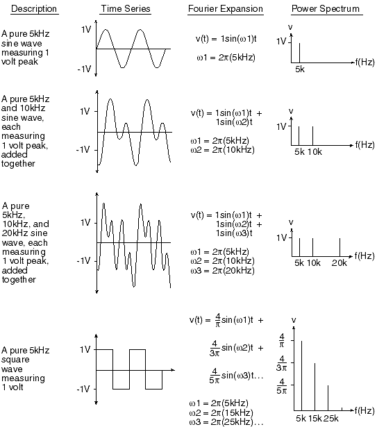

What you can see here, very clearly, is how the time-series, power spectrum and Fourier transform are applied. [https://www.dataq.com/data-acquisition/general-education-tutorials/fft-fast-fourier-transform-waveform-analysis.html](https://www.dataq.com/data-acquisition/general-education-tutorials/fft-fast-fourier-transform-waveform-analysis.html)

我要做的是获取时间序列，制作一个功率谱，并使用该信息通过傅立叶变换建立一个模型。然后我会检查这个模型是否对我观察到的时间序列有意义。换句话说，我是否充分分解了时间序列？让我们从周期图开始，它是功率谱。

```
TC_df<-df%>%
  dplyr::mutate(newdate = with(., ymd(Date)+ hours(Hour)),
                RecordTpe = factor(RecordType))%>%
  filter(!RecordType %in% c("AgentState", "Callback call", "E-mail call"))%>%
  filter(CallDirection=="Incoming")%>%
  group_by(newdate)%>%
  dplyr::select(newdate)%>%
  count()%>%
  ungroup()%>%
  imputeTS::na_kalman(.) %>% 
  as_tsibble()%>%
  tsibble::fill_gaps()%>%
  replace(is.na(.), 0)
TC_ts <- ts(TC_df$n,start = c(2022,1),frequency = 365*24)
ndiffs(TC_ts) # needs differences
TC_ts
ndiffs(diff(TC_ts))
[1] 0
TC_ts_diff=diff(TC_ts)
Time Series:
Start = c(2022, 1) 
End = c(2023, 3824) 
Frequency = 8760 
   [1]   3   7   1   0   0   0   0   0   0   0   0   0   0   0   0   0   0   0   0   0   0   0
  [23]   2   0   0   0   0   0   0   0   0   0   0   0   0   0   0   0   0   0   0  13   2   1
  [45]  12   3   1  10   4   0   0   0   0   0   0   0   0   0   0   0   0   0   0   0   0   0
  [67]   0   0   0   0   0   0   0   0   0   0   0   0   0   0   0   0   0   0   0   0   0   0
  [89]   0   0   0   0   0   0   0   0   0   0   0   0   0   0   0   0   0   0   0   0   0   0
 [111]   0   0   0   0   2   0   0   0   9   0   2   2   0   0   0   0   0   0   0   0   0   0
 [133]   0   0   0   0   0   1   3   3   2   3   0   2   2   1  31   9   0   1   0   0   0   0
 [155]   0   0   0   0   0   1   4  85  77  71  90  62  46  46  56  46  10   2   0   0   1   0
 [177]   0   1   0   0   0   0   0   2   3  51  68  60  63  49  55  54  33  43   6   2   1   0
 [199]   1   0   0   0   0   0   0   0   0   1   0  47  71  75  82  49  58  72  57  39   8   1
 [221]   0   2   0   0   0   0   0   0   0   0   0   0   2   7   5  15  12   5  10   7   5   2
 [243]   0   0   3   1   1   0   0   0   0   0   0   0   0   0   0   0   0   2   3   2   2   2
 [265]   0   1   1   2   0   0   0   0   0   0   0   0   0   0   0   1   2  63 106  89  84  78
 [287]  83  95  88  52  10   2   0   3   0   0   0   0   0   0   0   0   0   0   3  47  60  74
 [309]  86  49  89  61  69  47   5   4   4   3   0   1   0   0   0   0   0   0   0   1   4  51
 [331]  72  91  83  48  88  63  60  62   9   2   1   0   0   0   0   0   0   0   0   0   0   0
 [353]   3  28  66  75  86  44  63  54  46  69  11   5   2   5   0   0   0   0   0   0   0   0
 [375]   0   0   0  31  88 116  89  74  81  65  60  35   5   3   0   1   1   0   0   0   0   0
 [397]   0   0   0   0   0   2  10   9  13  10   3  10   9   4   0   1   0   1   0   0   0   0
 [419]   0   0   0   0   0   0   0   0   0   0   1   2   2   6   1   0   2   0   0   0   0   0
 [441]   0   0   0   0   0   0   0   0   3  63 115 115 101  85  60  84  67  38   7   3   4   2
 [463]   0   0   0   0   0   0   0   0   0   0   3  67  71  86  71  82  64  57  46  45  10   2
 [485]   2   0   0   0   0   0   0   0   0   1   0   0   7  56  74  67  74  55  54  63  71  54
 [507]   7   1   0   0   0   0   0   0   0   0   0   0   0   0   1  42  80  87  77  72  57  49
 [529]  53  48   7   3   2   0   0   0   0   0   0   0   0   0   0   0   1  35  69  62  74  38
 [551]  52  39  27  35   3   3   1   1   0   0   0   0   0   0   0   0   0   0   0   0   4   8
 [573]   3   7  10   0   3   2   2   1   2   0   0   0   0   0   0   0   0   0   0   0   0   0
 [595]   0   1   2   1   0   0   0   0   1   0   1   0   0   0   0   0   0   0   0   0   0   0
 [617]   1  59  92 104  98  52  64  87  65  47  12   1   1   1   0   0   0   0   0   0   0   0
 [639]   0   0   2  39  67  78  58  55  91  45  58  43  10   1   0   0   1   0   1   0   0   0
 [661]   0   0   0   0   3  37  87  69  67  58  54  66  39  32   2   2   2   1   1   0   0   0
 [683]   0   0   0   0   0   0   2  32  73  68  56  58  51  58  54  42   8   0   1   0   1   0
 [705]   0   0   0   0   0   0   0   1   2  37  61  84  72  55  42  39  35  26   8   3   1   1
 [727]   0   0   0   0   0   0   0   0   0   0   0   1  12  10   3   4   6   3   8   5   1   0
 [749]   2   0   0   0   0   0   0   0   0   0   0   0   0   0   0   0   3   3   1   1   2   0
 [771]   0   0   4   0   0   0   0   0   0   0   0   0   0   0   1  65 101 111  94  72  78  72
 [793]  47  41   5   4   0   0   0   0   0   0   0   0   0   0   0   0   3  39  54  60  55  36
 [815]  43  56  47  24   5   2   1   1   0   0   0   0   0   0   0   0   0   0   4  37  52  65
 [837]  64  48  47  63  64  43   8   7   0   0   0   0   0   0   0   0   0   0   0   0   2  50
 [859]  66  66  72  54  40  61  49  49   8   1   3   0   1   0   0   0   0   0   0   0   0   2
 [881]   2  43  74  56  55  45  41  65  60  36   7   1   3   1   0   0   0   0   0   0   0   0
 [903]   0   0   1   3   8  12   4   7   6   2   4   2   2   1   0   2   1   0   0   0   0   0
 [925]   0   0   0   0   0   0   0   0   4   1   0   1   2   0   2   0   1   2   0   0   0   0
 [947]   0   0   0   0   0   0   4  49  78  98  73  75  64  66  60  47   6   0   1   0   0   0
 [969]   0   0   0   0   0   0   0   0   2  33  66  71  47  49  55  75  51  40   7   0   0   1
 [991]   0   1   2   0   0   0   0   0   0   0
 [ reached getOption("max.print") -- omitted 11584 entries ]
p <- TSA::periodogram(TC_ts) 
```

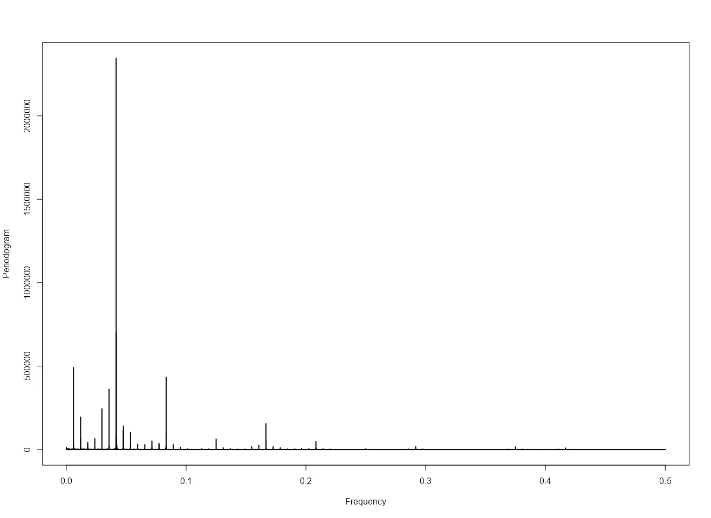

Okay, so now we have our peak frequencies.

让我们看看哪些是正确的。

```
pp<-data.table(period=1/p$freq, spec=p$spec)[order(-spec)][1:10];pp
        period      spec
 1:  24.015009 2345808.7
 2:  23.970037  700813.4
 3: 168.421053  491890.5
 4:  11.996251  433476.7
 5:  28.008753  361109.9
 6:  33.595801  244074.5
 7:  84.210526  194381.6
 8:   6.000938  154977.4
 9:  20.983607  141334.7
10:  21.018062  114253.8
```

这些频率是我可以用来进行傅立叶变换的频率。这些转换是如此的基本和强大，以至于你可以将它们包含在一个标准的时间序列模型中，比如一个 *auto.arima* ，或者你可以将它们作为一个配方添加进去。 *auto.arima* 先来。让我们运行一个没有傅立叶变换的模型，看看哪个 ARIMA 最适合 VOIP 来电的时间序列。

```
fit0 <- auto.arima(TC_ts_diff)
(bestfit <- list(aicc=fit0$aicc, i=0, j=0, fit=fit0))
$aicc
[1] 98410.95

$i
[1] 0

$j
[1] 0

$fit
Series: TC_ts_diff 
ARIMA(3,0,3) with zero mean 

Coefficients:
          ar1      ar2      ar3     ma1     ma2     ma3
      -0.2850  -0.5639  -0.6294  0.4499  0.6607  0.7047
s.e.   0.0357   0.0186   0.0320  0.0332  0.0134  0.0291

sigma^2 = 145.8:  log likelihood = -49198.47
AIC=98410.94   AICc=98410.95   BIC=98463.02
```

我们最终得到一个 ARIMA 模型，它具有 AR(3)和 MA(3)分量，对此不需要进行差分。我还可以做的是建立一个线性回归模型，其中包括几个组件，如趋势和季节。可以用傅立叶变换来逼近周期。 *tslm* 车型可以完成这样的壮举。K 是可以包含的傅立叶项的最大阶数。我已经将 k 设置为 4，这意味着我想包含 4 个更高级的术语。我拥有的项越多，我要做的分解就越多。数量 *k* 肯定是有限的，你可以像在**套索**中找到最优 *k* 一样找到最优*λ*。但是在这里，我只选择了四个，因为根据上面显示的周期图，我已经知道我想要包括多少个。

```
fourier.calls <- tslm(TC_ts ~ trend + season + fourier(TC_ts, K=4), lambda="auto")
summary(fourier.calls)
Call:
tslm(formula = TC_ts ~ trend + season + fourier(TC_ts, K = 4), 
    lambda = "auto")

Residuals:
    Min      1Q  Median      3Q     Max 
-68.689  -0.732   0.000   0.732  68.689 

Coefficients: (7 not defined because of singularities)
                               Estimate Std. Error t value Pr(>|t|)    
(Intercept)                   4.739e+13  4.496e+13   1.054    0.292    
trend                        -2.022e-04  3.726e-05  -5.426 6.11e-08 ***
season2                      -3.657e+07  3.469e+07  -1.054    0.292    
season3                      -9.752e+07  9.252e+07  -1.054    0.292    
season4                      -1.829e+08  1.735e+08  -1.054    0.292    
season5                      -2.926e+08  2.775e+08  -1.054    0.292    
season6                      -4.267e+08  4.048e+08  -1.054    0.292    
season7                      -5.851e+08  5.551e+08  -1.054    0.292    
season8                      -7.680e+08  7.286e+08  -1.054    0.292    
 [ reached getOption("max.print") -- omitted 8569 rows ]
---
Signif. codes:  0 ‘***’ 0.001 ‘**’ 0.01 ‘*’ 0.05 ‘.’ 0.1 ‘ ’ 1

Residual standard error: 14.22 on 3822 degrees of freedom
Multiple R-squared:  0.9009, Adjusted R-squared:  0.6738 
F-statistic: 3.967 on 8761 and 3822 DF,  p-value: < 2.2e-16
```

看上面的输出。看到我省略了多少系数了吗？这个模型中有 8000 多个系数。太疯狂了，这不是我想要的。不过，让我们看看自动检测傅立叶项的模型是如何执行的。

```
TC_df$fitted<-fourier.calls$fitted.values
ggplot()+
  geom_point(data=TC_df, aes(x=newdate, y=n))+
  geom_line(data=TC_df, aes(x=newdate, y=fitted), col="red")+
  theme_bw()
```

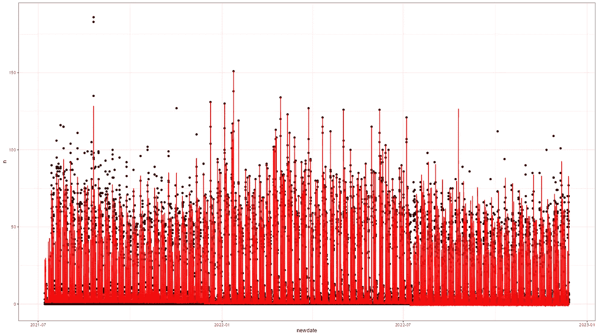

Not bad at all! This is getting somewhere.

现在，我想做一个手动傅立叶变换。我将以必要的形式构建数据，再次显示周期图结果，然后将前六个信号以傅立叶序列相加。

```
y<-df%>%
  dplyr::mutate(newdate = with(., ymd(Date) + hours(Hour)),
                RecordTpe = factor(RecordType))%>%
  filter(!RecordType %in% c("AgentState", "Callback call", "E-mail call"))%>%
  filter(CallDirection=="Incoming" & 
           DoneInIVR==0 & AgentSequence==1)%>%
  group_by(newdate)%>%
  dplyr::select(newdate)%>%
  count()%>%
  ungroup()%>%
  imputeTS::na_kalman(.) %>% 
  as_tsibble()%>%
  tsibble::fill_gaps()%>%
  replace(is.na(.), 0)%>%
  as.data.frame()%>%
  select(n)%>%
  pull(n)

> tail(TC_df)
                  newdate  n
12574 2022-12-13 12:00:00 40
12575 2022-12-13 13:00:00 41
12576 2022-12-13 14:00:00 47
12577 2022-12-13 15:00:00 40
12578 2022-12-13 16:00:00 43
12579 2022-12-13 17:00:00  1
> head(TC_df)
              newdate n
1 2021-07-07 15:00:00 2
2 2021-07-07 16:00:00 6
3 2021-07-07 17:00:00 0
4 2021-07-07 18:00:00 0
5 2021-07-07 19:00:00 0
6 2021-07-07 20:00:00 0

time_index <- seq(from = as.POSIXct("2021-07-07 15:00:00"), 
                  to = as.POSIXct("2022-12-13 16:00:00"), by = "hour")
> length(time_index)
[1] 12579
> length(y)
[1] 12579
TC_ts <- xts::xts(y, order.by = time_index)
TC_ts %>% diff() %>% ggtsdisplay(main="")
TC_ts  %>% ggtsdisplay(main="")
TC_ts_diff <-TC_ts %>% diff()
fit0 <- auto.arima(TC_ts_diff)
fc0 <- forecast(fit0,h=24*7);plot(fc0)
```

```
pp<-data.table(period=1/p$freq, spec=p$spec)[order(-spec)][1:10];pp
        period      spec
 1:  24.015009 2345808.7
 2:  23.970037  700813.4
 3: 168.421053  491890.5
 4:  11.996251  433476.7
 5:  28.008753  361109.9
 6:  33.595801  244074.5
 7:  84.210526  194381.6
 8:   6.000938  154977.4
 9:  20.983607  141334.7
10:  21.018062  114253.8
```

```
f1<-fourier(ts(y, frequency=24.015009 ),K=4)
f2<-fourier(ts(y, frequency=23.970037),K=4)
f3<-fourier(ts(y, frequency=168.421053),K=4)
f4<-fourier(ts(y, frequency=11.996251),K=4)
f5<-fourier(ts(y, frequency=28.008753),K=4)
f6<-fourier(ts(y, frequency=33.595801),K=2)
fit0 <- auto.arima(TC_ts,
                   seasonal=T,
                   xreg=cbind(f1,f2, f3,f4,f5,f6))
Series: TC_ts 
Regression with ARIMA(5,0,3) errors 

Coefficients:
         ar1      ar2      ar3     ar4     ar5     ma1     ma2     ma3  intercept     S1-24    C1-24   S2-24    C2-24    S3-24    C3-24   S4-24   C4-24
      0.3552  -0.4183  -0.1667  0.3341  0.1004  0.4198  0.6706  0.6855    10.9811  -14.5392  -0.6359  0.4722  -3.0621  -0.1633  -0.2072  0.4430  0.9516
s.e.  0.0202   0.0225   0.0256  0.0170  0.0097  0.0186  0.0095  0.0171     0.2505    0.2804   0.2804  0.1978   0.1978   0.1543   0.1542  0.1379  0.1379
       S1-24   C1-24    S2-24   C2-24   S3-24    C3-24    S4-24    C4-24   S1-168  C1-168  S2-168   C2-168   S3-168  C3-168   S4-168   C4-168    S1-12
      7.3421  1.1886  -0.2872  1.6166  0.0199  -0.1927  -0.0823  -0.5817  -5.5891  4.5335  4.5734  -0.7544  -1.4123  0.0766  -0.1935  -0.8260  -1.8855
s.e.  0.2802  0.2802   0.1976  0.1976  0.1541   0.1541   0.1379   0.1379   0.3522  0.3519  0.3457   0.3458   0.3361  0.3359   0.3237   0.3237   0.1977
       C1-12    S2-12    C2-12   S3-12   C3-12    S4-12   C4-12    S1-28   C1-28   S2-28   C2-28   S3-28    C3-28   S4-28   C4-28   S1-34    C1-34
      6.2837  -0.2458  -2.1936  0.0429  0.2067  -0.0745  0.0760  -4.1749  4.8826  2.3110  0.9198  0.1359  -0.2125  0.1023  0.2585  1.2358  -5.1028
s.e.  0.1977   0.1379   0.1379  0.0642  0.0642   0.0732  0.0732   0.2951  0.2950  0.2168  0.2168  0.1691   0.1691  0.1440  0.1440  0.3097   0.3096
        S2-34   C2-34
      -0.4747  1.6580
s.e.   0.2395  0.2395

sigma^2 = 65.09:  log likelihood = -44086.57
AIC=88281.13   AICc=88281.61   BIC=88682.88
```

上面你可以看到所有的正弦和余弦函数都包含在我组合的六个傅立叶函数中。让我们将模型输出与观察值进行比较。

```
TC_df$fitted<-fit0$fitted
ggplot()+
  geom_point(data=TC_df, aes(x=newdate, y=n))+
  geom_line(data=TC_df, aes(x=newdate, y=fitted), col="red")+
  theme_bw()
fc0 <- forecast(fit0, 
                xreg=cbind(f1,f2, f3,f4,f5,f6),
                h=24*7)

plot(fc0)
pred<-fc0%>%as.data.frame()
pred$date<-format(date_decimal(as.numeric(row.names(as.data.frame(pred)))),"%d/%m/%Y %H:%M")
```

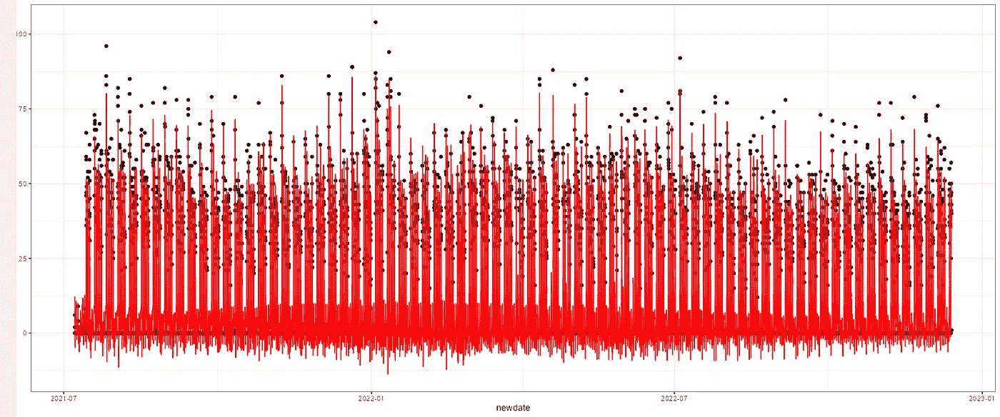

Once again not bad. Could be better, but still not bad.

那么，如果我开始预测呢？我最终会得到什么？

```
fc0 <- forecast(fit0, 
                xreg=cbind(f1,f2, f3,f4,f5,f6),
                h=24*7)

plot(fc0)
pred<-fc0%>%as.data.frame()
pred$date<-format(date_decimal(as.numeric(row.names(as.data.frame(pred)))),"%d/%m/%Y %H:%M")
```

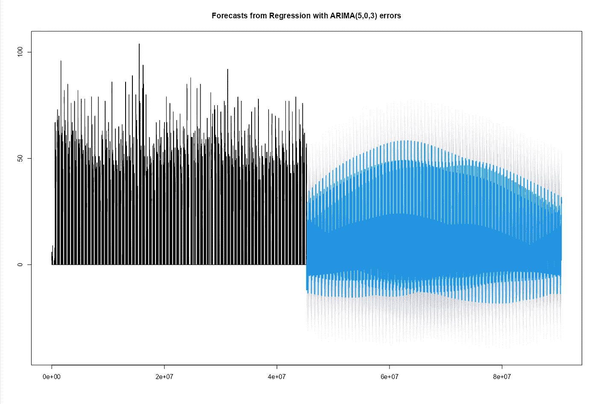

Ouch!! That is NOT what I had expected, and for sure not good. It also looks like I am getting six forecasts combined — one for each **xreg** function.

作为最后一部分，我想将分解傅立叶模型与其他更标准的模型进行比较，如指数平滑和季节性朴素模型。让我们看看会怎样。顺便说一下，下面的代码不仅仅是建模，它们是一个管道的开始，在这个管道中运行多个模型，进行比较，并宣布获胜者。

```
df_tbl<-df%>%
  dplyr::mutate(newdate = with(., ymd(Date)))%>%
  #dplyr::mutate(newdate = with(., ymd(Date)))%>%
  group_by(RecordType, newdate)%>%
  filter(!RecordType %in% c("AgentState", "Callback call"))%>%
  filter(CallDirection=="Incoming" & 
           DoneInIVR==0 & AgentSequence==1)%>%
  count()%>%
  group_by(RecordType) %>%
  imputeTS::na_kalman(.) %>% 
  select(RecordType, newdate, n)%>%
  as_tsibble(key = RecordType, index = newdate) %>%
  fill_gaps(n = 0, .full = end())
train_tbl <- df_tbl %>%
  filter_index(. ~ "2022-10-01")
test_tbl <- df_tbl %>%
  filter_index("2022-10-01" ~ .)
model_table <- train_tbl %>%
  model(
    naive_mod = NAIVE(n),
    snaive_mod = SNAIVE(n),
    drift_mod = RW(n ~ drift()), 
    ses_mod = ETS(n ~ error("A") + trend("N") + season("N"), opt_crit = "mse"),
    hl_mod = ETS(n ~ error("A") + trend("A") + season("N"), opt_crit = "mse"),
    hldamp_mod = ETS(n ~ error("A") + trend("Ad") + season("N"), opt_crit = "mse"),
    arima_mod = ARIMA(n),
    dhr_mod = ARIMA(n ~ PDQ(0,0,0) + fourier(K=2) + 1),
    tslm_mod = TSLM(n ~ 1))
> model_table
# A mable: 2 x 10
# Key:     RecordType [2]
  RecordType  naive_mod snaive_mod     drift_mod      ses_mod       hl_mod    hldamp_mod                arima_mod
  <chr>         <model>    <model>       <model>      <model>      <model>       <model>                  <model>
1 E-mail call   <NAIVE>   <SNAIVE> <RW w/ drift> <ETS(A,N,N)> <ETS(A,A,N)> <ETS(A,Ad,N)> <ARIMA(2,0,1)(1,1,1)[7]>
2 VOIP call     <NAIVE>   <SNAIVE> <RW w/ drift> <ETS(A,N,N)> <ETS(A,A,N)> <ETS(A,Ad,N)> <ARIMA(0,0,0)(2,1,2)[7]>
# ... with 2 more variables: dhr_mod <model>, tslm_mod <model>
```

```
forecast_tbl <- model_table %>%
  fabletools::forecast(test_tbl, times = 0) %>%
  as_tibble() %>%
  select(newdate, RecordType, .model, fc_qty = .mean)
forecast_tbl <- df_tbl %>%
  as_tibble() %>% 
  select(newdate, RecordType, n) %>%
  right_join(forecast_tbl, by = c("newdate", "RecordType")) %>% 
  mutate(fc_qty = ifelse(fc_qty < 0, 0, fc_qty))
> forecast_tbl
# A tibble: 1,332 x 5
   newdate    RecordType      n .model     fc_qty
   <date>     <chr>       <dbl> <chr>       <dbl>
 1 2022-10-01 E-mail call    10 naive_mod    10  
 2 2022-10-01 E-mail call    10 snaive_mod   21  
 3 2022-10-01 E-mail call    10 drift_mod    10.0
 4 2022-10-01 E-mail call    10 ses_mod      46.9
 5 2022-10-01 E-mail call    10 hl_mod       45.3
 6 2022-10-01 E-mail call    10 hldamp_mod   47.7
 7 2022-10-01 E-mail call    10 arima_mod    18.2
 8 2022-10-01 E-mail call    10 dhr_mod      15.9
 9 2022-10-01 E-mail call    10 tslm_mod     48.1
10 2022-10-02 E-mail call    15 naive_mod    10 
```

```
accuracy_tbl <- forecast_tbl %>%
  group_by(RecordType, .model) %>%
  summarise(accuracy_rmsle = Metrics::rmsle(n, fc_qty))
> accuracy_tbl
# A tibble: 18 x 3
# Groups:   RecordType [2]
   RecordType  .model     accuracy_rmsle
   <chr>       <chr>               <dbl>
 1 E-mail call arima_mod           0.629
 2 E-mail call dhr_mod             0.268
 3 E-mail call drift_mod           1.47 
 4 E-mail call hl_mod              0.549
 5 E-mail call hldamp_mod          0.551
 6 E-mail call naive_mod           1.52 
 7 E-mail call ses_mod             0.551
 8 E-mail call snaive_mod          0.756
 9 E-mail call tslm_mod            0.554
10 VOIP call   arima_mod           3.16 
11 VOIP call   dhr_mod             1.45 
12 VOIP call   drift_mod           4.91 
13 VOIP call   hl_mod              3.04 
14 VOIP call   hldamp_mod          3.06 
15 VOIP call   naive_mod           4.91 
16 VOIP call   ses_mod             3.05 
17 VOIP call   snaive_mod          3.12 
18 VOIP call   tslm_mod            3.05 
```

```
suitable_model_tbl <- accuracy_tbl %>%
  ungroup() %>%
  group_by(RecordType) %>%
  filter(accuracy_rmsle == min(accuracy_rmsle)) %>%
  slice(n = 1)
> suitable_model_tbl
# A tibble: 2 x 3
# Groups:   RecordType [2]
  RecordType  .model  accuracy_rmsle
  <chr>       <chr>            <dbl>
1 E-mail call dhr_mod          0.268
2 VOIP call   dhr_mod          1.45 
```

如您所见，包含傅立叶项的模型在电子邮件和 VOIP 预测中都取得了胜利。但是，出于好奇，所有模型的预测看起来如何？

```
forecast_tbl%>%
  filter(RecordType =="VOIP call")%>%
  ggplot()+
  geom_line(aes(x=newdate, y=fc_qty, color=.model))+
  geom_line(data=df_tbl, 
            aes(x=newdate, y=n), alpha=0.2)+
  theme_bw()
```

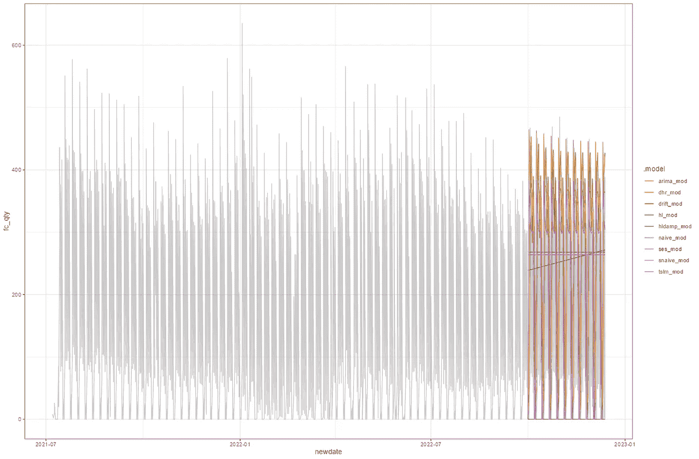

Not a very clear plot.

看起来似乎大多数模型都能够获得数据的模式，但这并不容易。这可能是因为我试图建模的原因是间歇性需求数据，这意味着你也必须预测零。而且断断续续的数据不容易建模。最后，我确实找到了解决方案，使用了我不想使用的模型。你可以在这里找到那篇博文。

[](/mlearning-ai/mlearning-ai-submission-suggestions-b51e2b130bfb) [## Mlearning.ai 提交建议

### 如何成为 Mlearning.ai 上的作家

medium.com](/mlearning-ai/mlearning-ai-submission-suggestions-b51e2b130bfb)