# 理解需求问题的模式(第二部分)

> 原文：<https://medium.com/mlearning-ai/understanding-the-patterns-of-a-demand-question-part-2-9eaaf17d890d?source=collection_archive---------4----------------------->

## 应用我不想应用的模型

因此，在之前的博客文章中，我已经展示了来自服务中心的数据，突出了一年中收到的电话和电子邮件的数量。我还[向](/@marc.jacobs012/understanding-the-patterns-of-a-demand-question-f5b34362249)展示了这个问题是一个间歇性需求问题。因此，我不会重复使用我已经制作的数据或图形，而是快速切换到我从未想要应用但最终还是应用了的模型。

数据由传统的时间序列数据组成，但随后在一刻钟内。看看那些零。他们让我的生活非常非常艰难。

```
df_tbl<-df%>%
  dplyr::mutate(newdate = with(., ymd(Date) + hms(QuarterHour)))%>%
  #dplyr::mutate(newdate = with(., ymd(Date)))%>%
  group_by(RecordType, newdate)%>%
  filter(!RecordType %in% c("AgentState", "Callback call"))%>%
  filter(CallDirection=="Incoming" & 
           DoneInIVR==0 & AgentSequence==1)%>%
  count()%>%
  group_by(RecordType) %>%
  imputeTS::na_kalman(.) %>% 
  select(RecordType, newdate, n)%>%
  as_tsibble(key = RecordType, index = newdate) %>%
  fill_gaps(n = 0, .full = end())
> df_tbl
# A tsibble: 101,999 x 3 [15m] <UTC>
# Key:       RecordType [3]
# Groups:    RecordType [3]
   RecordType newdate                 n
   <chr>      <dttm>              <dbl>
 1 Chat call  2022-11-28 09:30:00     8
 2 Chat call  2022-11-28 09:45:00     1
 3 Chat call  2022-11-28 10:00:00     1
 4 Chat call  2022-11-28 10:15:00     0
 5 Chat call  2022-11-28 10:30:00     0
 6 Chat call  2022-11-28 10:45:00     0
 7 Chat call  2022-11-28 11:00:00     0
 8 Chat call  2022-11-28 11:15:00     0
 9 Chat call  2022-11-28 11:30:00     0
10 Chat call  2022-11-28 11:45:00     0
# ... with 101,989 more rows
```

这里你可以看到我从未想过要应用的模型，但最终还是应用了:先知模型。关于这个模型已经写了很多，所以我不会重写已经有的。我不想使用它的原因和我不想使用 XGboost 的原因是一样的——每个人都在这么做。但是后来我更深入地研究了 Prophet 模型，发现我可以做多少调整。确实有很多调整的可能，并且该模型本质上是一个分解模型。我可以用傅立叶术语来表达。这最终为我处理数据的周期、事件和间歇性质提供了必要的基础。

像大多数模型一样，您可以通过让它们自动找到可能的最佳解决方案来相当简单地部署它们。

```
fit_prophet <- df_tbl%>%
  filter(RecordType =="VOIP call")%>%
  select(newdate, n)%>%
  rename(ds=newdate,
         y=n)%>%
  prophet::prophet()
> str(fit_prophet)
List of 32
 $ growth                 : chr "linear"
 $ changepoints           : POSIXct[1:25], format: "2021-07-24 09:45:00" "2021-08-10 04:15:00" "2021-08-26 22:45:00" "2021-09-12 17:15:00" ...
 $ n.changepoints         : num 25
 $ changepoint.range      : num 0.8
 $ yearly.seasonality     : chr "auto"
 $ weekly.seasonality     : chr "auto"
 $ daily.seasonality      : chr "auto"
 $ holidays               : NULL
 $ seasonality.mode       : chr "additive"
 $ seasonality.prior.scale: num 10
 $ changepoint.prior.scale: num 0.05
 $ holidays.prior.scale   : num 10
 $ mcmc.samples           : num 0
 $ interval.width         : num 0.8
 $ uncertainty.samples    : num 1000
 $ specified.changepoints : logi FALSE
 $ start                  : POSIXct[1:1], format: "2021-07-07 15:15:00"
 $ y.scale                : num 32
 $ logistic.floor         : logi FALSE
 $ t.scale                : num 45279900
 $ changepoints.t         : num [1:25] 0.032 0.064 0.096 0.128 0.16 ...
 $ seasonalities          :List of 2 
```

```
future <- prophet::make_future_dataframe(fit_prophet, periods = 672)
> tail(future)
                       ds
50979 2024-10-10 17:00:00
50980 2024-10-11 17:00:00
50981 2024-10-12 17:00:00
50982 2024-10-13 17:00:00
50983 2024-10-14 17:00:00
50984 2024-10-15 17:00:00

forecast <- predict(fit_prophet, future)
> forecast
                    ds    trend additive_terms additive_terms_lower additive_terms_upper       daily daily_lower
1  2021-07-07 15:15:00 1.333013      4.7732225            4.7732225            4.7732225  3.68798132  3.68798132
2  2021-07-07 15:30:00 1.334092      4.4641217            4.4641217            4.4641217  3.37616930  3.37616930
3  2021-07-07 15:45:00 1.335171      4.0699476            4.0699476            4.0699476  2.97948387  2.97948387
4  2021-07-07 16:00:00 1.336250      3.5940486            3.5940486            3.5940486  2.50127591  2.50127591
5  2021-07-07 16:15:00 1.337329      3.0452312            3.0452312            3.0452312  1.95035390  1.95035390
6  2021-07-07 16:30:00 1.338408      2.4373052            2.4373052            2.4373052  1.34052959  1.34052959
7  2021-07-07 16:45:00 1.339487      1.7882858            1.7882858            1.7882858  0.68981959  0.68981959
8  2021-07-07 17:00:00 1.340566      1.1193054            1.1193054            1.1193054  0.01935782  0.01935782
9  2021-07-07 17:15:00 1.341645      0.4533124            0.4533124            0.4533124 -0.64790649 -0.64790649
10 2021-07-07 17:30:00 1.342724     -0.1863574           -0.1863574           -0.1863574 -1.28863655 -1.28863655
11 2021-07-07 17:45:00 1.343803     -0.7774364           -0.7774364           -0.7774364 -1.88056435 -1.88056435
12 2021-07-07 18:00:00 1.344882     -1.3001123           -1.3001123           -1.3001123 -2.40387714 -2.40387714
13 2021-07-07 18:15:00 1.345961     -1.7382506           -1.7382506           -1.7382506 -2.84244059 -2.84244059
14 2021-07-07 18:30:00 1.347040     -2.0803734           -2.0803734           -2.0803734 -3.18477684 -3.18477684
15 2021-07-07 18:45:00 1.348119     -2.3203270           -2.3203270           -2.3203270 -3.42473282 -3.42473282
16 2021-07-07 19:00:00 1.349198     -2.4575977           -2.4575977           -2.4575977 -3.56179544 -3.56179544
17 2021-07-07 19:15:00 1.350277     -2.4972545           -2.4972545           -2.4972545 -3.60103475 -3.60103475
18 2021-07-07 19:30:00 1.351356     -2.4495272           -2.4495272           -2.4495272 -3.55268160 -3.55268160
19 2021-07-07 19:45:00 1.352436     -2.3290493           -2.3290493           -2.3290493 -3.43137120 -3.43137120
20 2021-07-07 20:00:00 1.353515     -2.1538225           -2.1538225           -2.1538225 -3.25510674 -3.25510674
21 2021-07-07 20:15:00 1.354594     -1.9439726           -1.9439726           -1.9439726 -3.04401598 -3.04401598
22 2021-07-07 20:30:00 1.355673     -1.7203859           -1.7203859           -1.7203859 -2.81898742 -2.81898742
23 2021-07-07 20:45:00 1.356752     -1.5033194           -1.5033194           -1.5033194 -2.60028047 -2.60028047
24 2021-07-07 21:00:00 1.357831     -1.3110805           -1.3110805           -1.3110805 -2.40620508 -2.40620508
25 2021-07-07 21:15:00 1.358910     -1.1588659           -1.1588659           -1.1588659 -2.25196080 -2.25196080
26 2021-07-07 21:30:00 1.359989     -1.0578387           -1.0578387           -1.0578387 -2.14871382 -2.14871382
27 2021-07-07 21:45:00 1.361068     -1.0145046           -1.0145046           -1.0145046 -2.10297311 -2.10297311
28 2021-07-07 22:00:00 1.362147     -1.0304275           -1.0304275           -1.0304275 -2.11630588 -2.11630588
29 2021-07-07 22:15:00 1.363226     -1.1023000           -1.1023000           -1.1023000 -2.18540855 -2.18540855
30 2021-07-07 22:30:00 1.364305     -1.2223612           -1.2223612           -1.2223612 -2.30252414 -2.30252414
31 2021-07-07 22:45:00 1.365384     -1.3791279           -1.3791279           -1.3791279 -2.45617324 -2.45617324
32 2021-07-07 23:00:00 1.366463     -1.5583830           -1.5583830           -1.5583830 -2.63214321 -2.63214321
33 2021-07-07 23:15:00 1.367542     -1.7443506           -1.7443506           -1.7443506 -2.81466253 -2.81466253
34 2021-07-07 23:30:00 1.368621     -1.9209694           -1.9209694           -1.9209694 -2.98767445 -2.98767445
35 2021-07-07 23:45:00 1.369700     -2.0731725           -2.0731725           -2.0731725 -3.13611688 -3.13611688
36 2021-07-08 00:00:00 1.370779     -2.1880808           -2.1880808           -2.1880808 -3.24711549 -3.24711549
37 2021-07-08 00:15:00 1.371858     -2.2560218           -2.2560218           -2.2560218 -3.31100301 -3.31100301
38 2021-07-08 00:30:00 1.372937     -2.2713012           -2.2713012           -2.2713012 -3.32209028 -3.32209028
39 2021-07-08 00:45:00 1.374016     -2.2326683           -2.2326683           -2.2326683 -3.27913189 -3.27913189
40 2021-07-08 01:00:00 1.375095     -2.1434409           -2.1434409           -2.1434409 -3.18545134 -3.18545134
41 2021-07-08 01:15:00 1.376174     -2.0112795           -2.0112795           -2.0112795 -3.04871452 -3.04871452
42 2021-07-08 01:30:00 1.377253     -1.8476225           -1.8476225           -1.8476225 -2.88036564 -2.88036564
43 2021-07-08 01:45:00 1.378332     -1.6668231           -1.6668231           -1.6668231 -2.69476377 -2.69476377
44 2021-07-08 02:00:00 1.379411     -1.4850463           -1.4850463           -1.4850463 -2.50807993 -2.50807993
45 2021-07-08 02:15:00 1.380490     -1.3190045           -1.3190045           -1.3190045 -2.33703236 -2.33703236
46 2021-07-08 02:30:00 1.381570     -1.1846198           -1.1846198           -1.1846198 -2.19754947 -2.19754947
47 2021-07-08 02:45:00 1.382649     -1.0957113           -1.0957113           -1.0957113 -2.10345652 -2.10345652
48 2021-07-08 03:00:00 1.383728     -1.0628003           -1.0628003           -1.0628003 -2.06528115 -2.06528115
49 2021-07-08 03:15:00 1.384807     -1.0921230           -1.0921230           -1.0921230 -2.08926583 -2.08926583
50 2021-07-08 03:30:00 1.385886     -1.1849243           -1.1849243           -1.1849243 -2.17666186 -2.17666186
51 2021-07-08 03:45:00 1.386965     -1.3370892           -1.3370892           -1.3370892 -2.32336081 -2.32336081
52 2021-07-08 04:00:00 1.388044     -1.5391453           -1.5391453           -1.5391453 -2.51989662 -2.51989662 
```

```
> str(forecast)
'data.frame': 50984 obs. of  19 variables:
 $ ds                        : POSIXct, format: "2021-07-07 15:15:00" "2021-07-07 15:30:00" "2021-07-07 15:45:00" "2021-07-07 16:00:00" ...
 $ trend                     : num  1.33 1.33 1.34 1.34 1.34 ...
 $ additive_terms            : num  4.77 4.46 4.07 3.59 3.05 ...
 $ additive_terms_lower      : num  4.77 4.46 4.07 3.59 3.05 ...
 $ additive_terms_upper      : num  4.77 4.46 4.07 3.59 3.05 ...
 $ daily                     : num  3.69 3.38 2.98 2.5 1.95 ...
 $ daily_lower               : num  3.69 3.38 2.98 2.5 1.95 ...
 $ daily_upper               : num  3.69 3.38 2.98 2.5 1.95 ...
 $ weekly                    : num  1.09 1.09 1.09 1.09 1.09 ...
 $ weekly_lower              : num  1.09 1.09 1.09 1.09 1.09 ...
 $ weekly_upper              : num  1.09 1.09 1.09 1.09 1.09 ...
 $ multiplicative_terms      : num  0 0 0 0 0 0 0 0 0 0 ...
 $ multiplicative_terms_lower: num  0 0 0 0 0 0 0 0 0 0 ...
 $ multiplicative_terms_upper: num  0 0 0 0 0 0 0 0 0 0 ...
 $ yhat_lower                : num  1.9493 1.7188 1.4521 0.7926 0.0558 ...
 $ yhat_upper                : num  10.14 10.24 9.56 8.76 8.35 ...
 $ trend_lower               : num  1.33 1.33 1.34 1.34 1.34 ...
 $ trend_upper               : num  1.33 1.33 1.34 1.34 1.34 ...
 $ yhat                      : num  6.11 5.8 5.41 4.93 4.38 ...
```

```
plot(fit_prophet, forecast)
prophet::prophet_plot_components(fit_prophet, forecast)
```

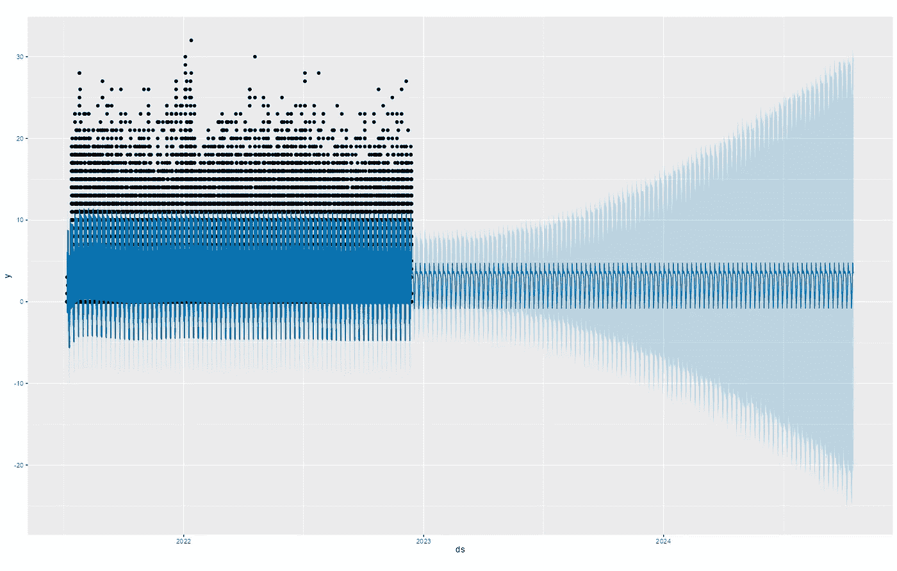

Easy to make, but this is NOT a good model. In fact, this is a horrible fit and forecast. What a rocky start.

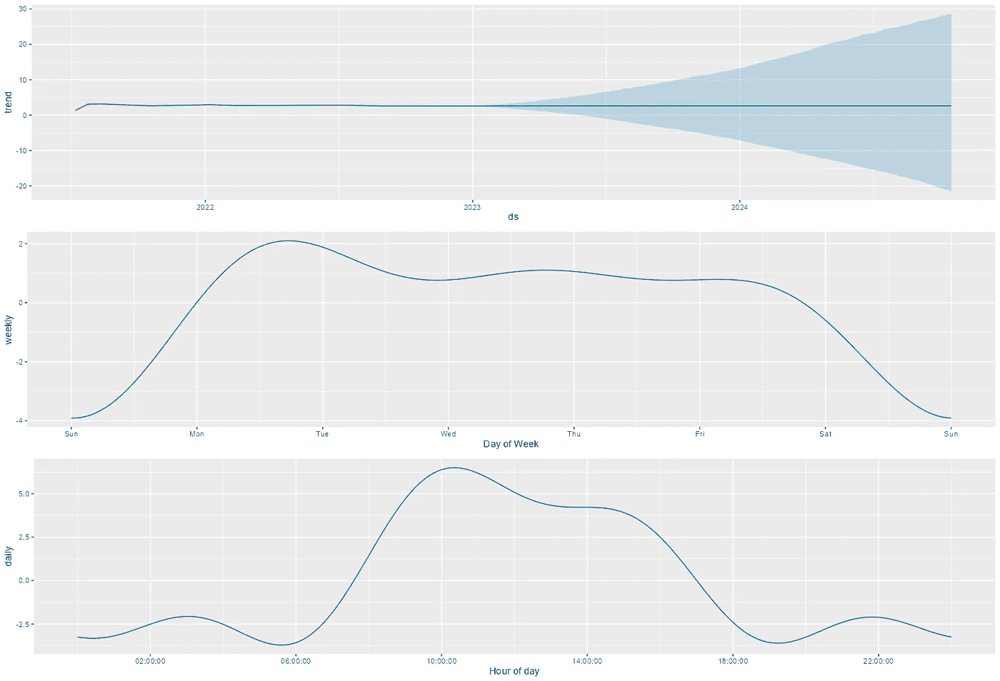

In this plot you can see the components applied in the model. Like I said, the Prophet model is a decomposition model, and here I used the most basic of components. Much more tweaking is needed for me to tackle this model.

我知道一些事件，比如假期，会对需求产生影响。如果某一天服务中心关门了，第二天你会接到更多的电话。让我们加上荷兰国定假日。

```
# Adding holidays 
holiday<-c("Nieuwjaarsdag", "Goedevrijdag", "Paasdag1", "Paasdag2",
           "Koningsdag","Bevrijdsdag","Hemelvaartsdag","Pinksteren1", "Pinkesteren2",
           "Kerstmis1", "Kerstmis2", "Oudjaarsdag")
ds<-c(as.Date('2022-01-01'),
      as.Date('2022-04-15'),
      as.Date('2022-04-17'),
      as.Date('2022-04-18'),
      as.Date('2022-04-27'),
      as.Date('2022-05-05'),
      as.Date('2022-05-26'),
      as.Date('2022-06-05'),
      as.Date('2022-06-06'),
      as.Date('2022-12-25'),
      as.Date('2022-12-26'),
      as.Date('2022-12-31'))
lower_window<-rep(0,12)
upper_window<-rep(1,12)
holidays <- dplyr::bind_cols(holiday, ds, lower_window, upper_window)
colnames(holidays)<-c("holiday", "ds", "lower_window", "upper_window")
> holidays
# A tibble: 12 x 4
   holiday        ds         lower_window upper_window
   <chr>          <date>            <dbl>        <dbl>
 1 Nieuwjaarsdag  2022-01-01            0            1
 2 Goedevrijdag   2022-04-15            0            1
 3 Paasdag1       2022-04-17            0            1
 4 Paasdag2       2022-04-18            0            1
 5 Koningsdag     2022-04-27            0            1
 6 Bevrijdsdag    2022-05-05            0            1
 7 Hemelvaartsdag 2022-05-26            0            1
 8 Pinksteren1    2022-06-05            0            1
 9 Pinkesteren2   2022-06-06            0            1
10 Kerstmis1      2022-12-25            0            1
11 Kerstmis2      2022-12-26            0            1
12 Oudjaarsdag    2022-12-31            0            1
```

```
fit_prophet <- df_tbl%>%
  filter(RecordType =="VOIP call")%>%
  select(newdate, n)%>%
  rename(ds=newdate,
         y=n)%>%
  prophet::prophet(., holidays=holidays)
future <- prophet::make_future_dataframe(fit_prophet, 
                                         periods = 672, 
                                         freq = 900)
forecast <- predict(fit_prophet, future)
plot(fit_prophet, forecast)
prophet::prophet_plot_components(fit_prophet, forecast)
```

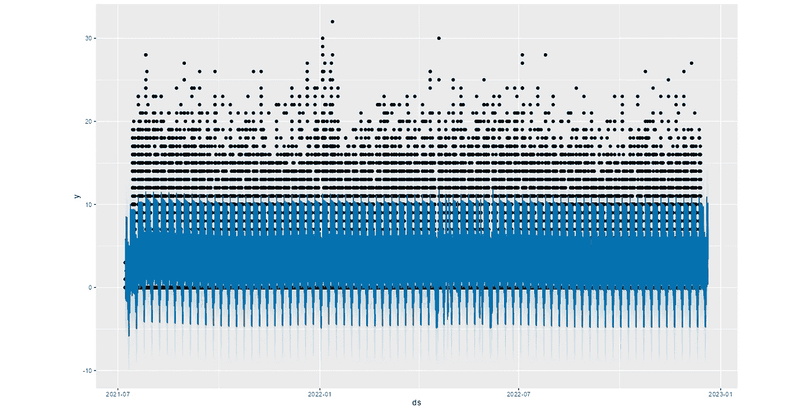

Cannot say it looks better.

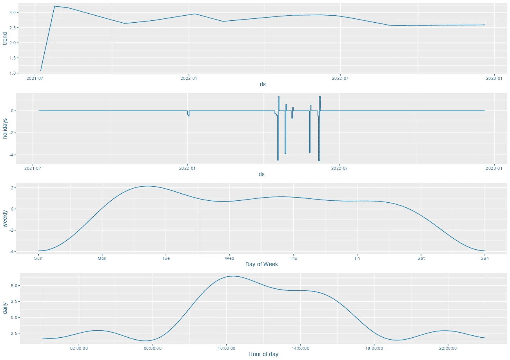

The holidays are now a component in the decomposed model.

我想看看每小时和每天我实际得到了什么样的预报。它们有意义吗？

```
forecast_week<-forecast%>%
  filter(ds>max(df_tbl$newdate))%>%
  select(ds, yhat)%>%
  mutate(yhat=round(yhat))
forecast_week%>%
  mutate(yhat = if_else(yhat<0, 0, yhat), 
         day = factor(weekdays(ds), 
                      level=c("Monday", "Tuesday", "Wednesday",
                              "Thursday", "Friday", "Saturday", "Sunday")))%>%
  arrange(day, ds)%>%
  ggplot(., 
         aes(x=ds, y=yhat))+
  geom_bar(stat="identity")+
  theme_bw()+
  facet_wrap(~day, 
             scales="free", 
             ncol=2)+
  labs(x="Date & Time", 
       y="Incoming calls per quarterhour")
```

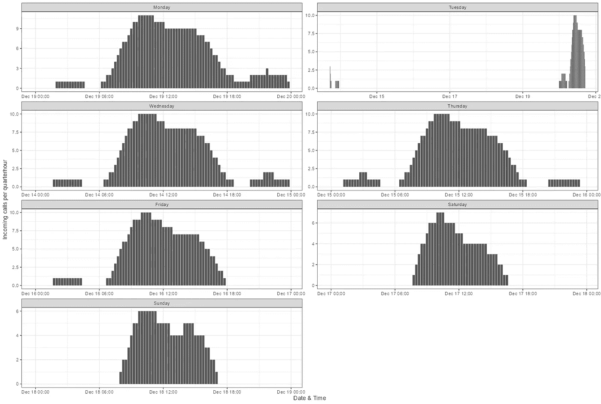

Well, it does make sense. I am not predicting any calls in the evening or at night.. The pyramid form also seems to be okay to me.

让我们将预测汇总成每小时的数据。

```
forecast_week%>%
  timetk::summarise_by_time(
    ds, .by="hour",
    n=sum(yhat))%>%
  mutate(n = if_else(n<0, 0, n), 
         day = factor(weekdays(ds), 
                      level=c("Monday", "Tuesday", "Wednesday",
                              "Thursday", "Friday", "Saturday", "Sunday")))%>%
  arrange(day, ds)%>%
  ggplot(., 
       aes(x=ds, y=n))+
  geom_bar(stat="identity")+
  theme_bw()+
  facet_wrap(~day, 
             scales="free_x", 
             ncol=2)+
  labs(x="Date & Time", 
       y="Incoming calls per hour")
```

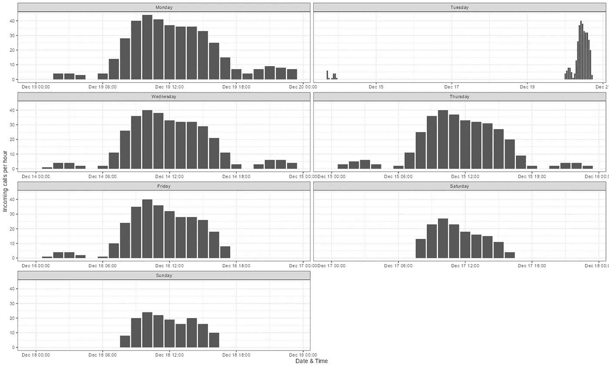

Looking okay to me again — Monday has the highest amount of calls which makes sense after the weekend. We see the pyramid form again and each day we have periods with no expected calls.

如果我每天总结，这样我就有一个完整的星期，看起来怎么样？

```
forecast_week%>%
  timetk::summarise_by_time(
    ds, .by="day",
    n=sum(yhat))%>%
  mutate(n = if_else(n<0, 0, n), 
         day = factor(weekdays(ds), 
                      level=c("Monday", "Tuesday", "Wednesday",
                              "Thursday", "Friday", "Saturday", "Sunday")))%>%
  arrange(day, ds)
# A tibble: 8 x 3
  ds                      n day      
  <dttm>              <dbl> <fct>    
1 2022-12-19 00:00:00   403 Monday   
2 2022-12-13 00:00:00    17 Tuesday  
3 2022-12-20 00:00:00   337 Tuesday  
4 2022-12-14 00:00:00   344 Wednesday
5 2022-12-15 00:00:00   334 Thursday 
6 2022-12-16 00:00:00   287 Friday   
7 2022-12-17 00:00:00     4 Saturday 
8 2022-12-18 00:00:00    11 Sunday 
```

看起来不错，除了 13 号星期二。不知道那里发生了什么，但它可能不是一个完整的时间范围。这就解释了上面周二奇怪的图表。但总的来说，在我看来整体还不错。同样，本周的高峰是在周一，然后我们有一个下降，直到周五，周末几乎没有电话预测。

如果我应用 ARIMA 模型，预测会是什么样的呢？只是为了好玩，也因为我需要比较先知模型和另一个模型。 *auto.arima* 是一个简单而强大的建模功能。除此之外，我还会附赠季节性朴素模型。

```
df_tbl%>%
  filter(RecordType =="VOIP call")%>%
  auto.arima %>% 
  forecast(h=672) %>% autoplot+theme_bw() 
df_tbl%>%
  filter(RecordType =="VOIP call")%>%
  auto.arima %>% 
  checkresiduals(test=FALSE)+theme_bw()

arima_model<-df_tbl%>%
  filter(RecordType =="VOIP call")%>%
  auto.arima %>% 
  forecast(h=672)

> arima_model
         Point Forecast       Lo 80     Hi 80       Lo 95     Hi 95
2545.597              0  -5.9371424  5.937142  -9.0800758  9.080076
2545.608              0  -5.9371424  5.937142  -9.0800758  9.080076
2545.618              0  -5.9371424  5.937142  -9.0800758  9.080076
2545.629              0  -5.9371424  5.937142  -9.0800758  9.080076
2545.639              0  -5.9371424  5.937142  -9.0800758  9.080076
2545.649              0  -5.9371424  5.937142  -9.0800758  9.080076
2545.660              0  -5.9371424  5.937142  -9.0800758  9.080076
2545.670              0  -5.9371424  5.937142  -9.0800758  9.080076
2545.681              0  -5.9371424  5.937142  -9.0800758  9.080076
2545.691              0  -5.9371424  5.937142  -9.0800758  9.080076
2545.702              0  -5.9371424  5.937142  -9.0800758  9.080076
2545.712              0  -5.9371424  5.937142  -9.0800758  9.080076
2545.722              0  -5.9371424  5.937142  -9.0800758  9.080076
2545.733              0  -5.9371424  5.937142  -9.0800758  9.080076
2545.743              0  -5.9371424  5.937142  -9.0800758  9.080076
2545.754              0  -5.9371424  5.937142  -9.0800758  9.080076
2545.764              0  -5.9371424  5.937142  -9.0800758  9.080076
2545.774              0  -5.9371424  5.937142  -9.0800758  9.080076
2545.785              0  -5.9371424  5.937142  -9.0800758  9.080076
2545.795              0  -5.9371424  5.937142  -9.0800758  9.080076
2545.806              0  -5.9371424  5.937142  -9.0800758  9.080076
2545.816              0  -5.9371424  5.937142  -9.0800758  9.080076
2545.827              0  -5.9371424  5.937142  -9.0800758  9.080076
2545.837              0  -5.9371424  5.937142  -9.0800758  9.080076
2545.847              0  -5.9371424  5.937142  -9.0800758  9.080076

fit_snaive <- df_tbl%>%
  filter(RecordType =="VOIP call")%>%
  snaive(.,h=672) 
plot(fit_snaive)
fit_snaive<-fit_snaive%>%
  as.data.frame()%>%
  slice_tail(., n=672) 
```

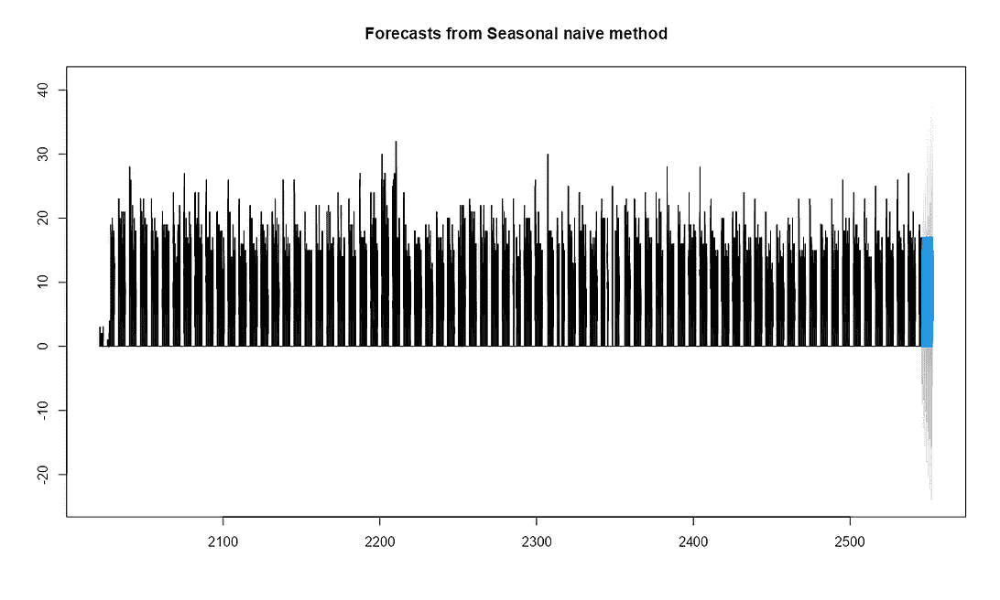

They look okay, these models, but in fact are not. They are not picking up the pyramid form the Prophet model did pick up.

ARIMA 的残差显示了一个周期和相当多的长尾-这相当于基础数据的波峰和波谷。

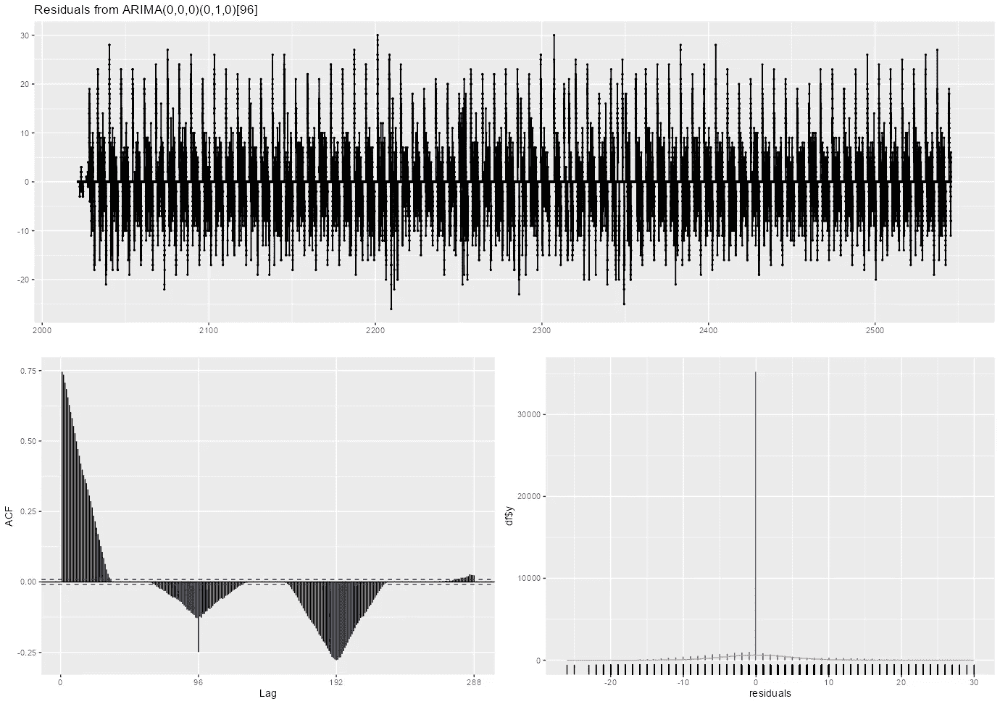

Autocorrelation is still present.

那么，如果我们比较这三种模式呢？哪个看起来最擅长针对数据？

```
forecast%>%
  filter(ds>max(df_tbl$newdate))%>%
  select(ds, yhat)%>%
  mutate(n_prophet = round(yhat))%>%
  mutate(n_arima   = as.numeric(round(arima_model$mean)))%>%
  mutate(n_snaive  = as.numeric(round(fit_snaive$`Point Forecast`)))%>%
  select(-yhat)%>%
  mutate(n_prophet = if_else(n_prophet<0,0, n_prophet),
         n_arima   = if_else(n_arima<0,  0, n_arima),
         n_snaive  = if_else(n_snaive<0, 0, n_snaive),
         day = factor(weekdays(ds), 
                     level=c("Monday", "Tuesday", "Wednesday",
                             "Thursday", "Friday", "Saturday", "Sunday")))%>%
  arrange(day, ds)%>%
  ggplot(.)+
  geom_line(aes(x=ds, y=n_prophet, color="Prophet Model"))+
  geom_line(aes(x=ds, y=n_arima, color="ARIMA Model"))+
  geom_line(aes(x=ds, y=n_snaive, color="Seasonal NAIVE Model"))+
  theme_bw()+
  facet_wrap(~day, 
             scales="free", 
             ncol=2)+
  labs(x="Date & Time", 
       y="Incoming calls per quarterhour")
```

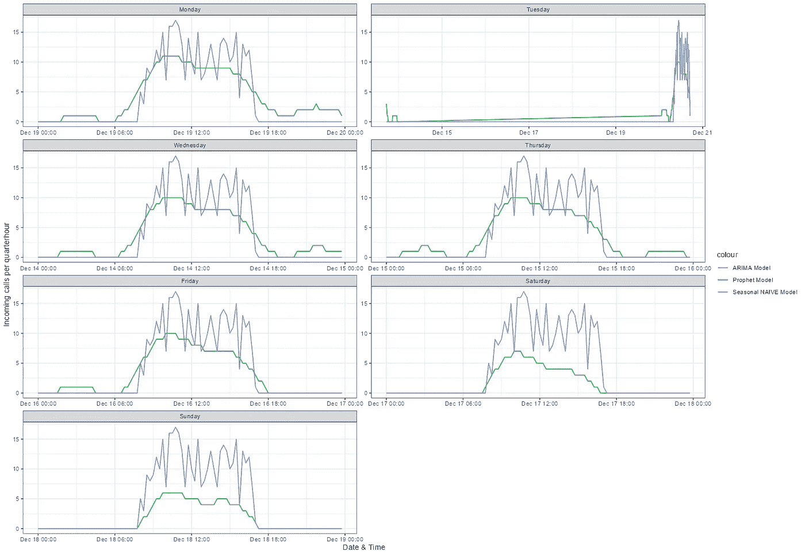

The ARIMA seems lost, or it is completely in agreement with the seasonal naïve model. I am not really sure at this point. Also, I find the seasonal naïve model to be very unwieldy, going up and down. The Prophet model seems more stable in terms of steps.

当然，上面的图对于决定使用哪个模型并没有真正的帮助，因为您也希望在图中有底层数据。如果我们放大呢？

```
 forecast%>%
  filter(ds>max(df_tbl$newdate))%>%
  select(ds, yhat)%>%
  mutate(n_prophet=round(yhat))%>%
  mutate(n_arima = as.numeric(round(arima_model$mean)))%>%
  select(-yhat)%>%
  timetk::summarise_by_time(
    ds, .by="hour",
    n_prophet=sum(n_prophet),
    n_arima=sum(n_arima))%>%
  mutate(hour=hour(ds))%>%
  filter(hour>=8 & hour<=17)%>%
  mutate(n_prophet = if_else(n_prophet<0, 0, n_prophet),
         n_arima = if_else(n_arima<0, 0, n_arima),
         day = factor(weekdays(ds), 
                      level=c("Monday", "Tuesday", "Wednesday",
                              "Thursday", "Friday", "Saturday", "Sunday")))%>%
  arrange(day, ds)%>%
  ggplot(.)+
  geom_line(aes(x=ds, y=n_prophet, color="Prophet Model"))+
  geom_line(aes(x=ds, y=n_arima, color="ARIMA Model"))+
  theme_bw()+
  facet_wrap(~day, 
             scales="free", 
             ncol=2)+
  labs(x="Date & Time", 
       y="Incoming calls per hour")
```

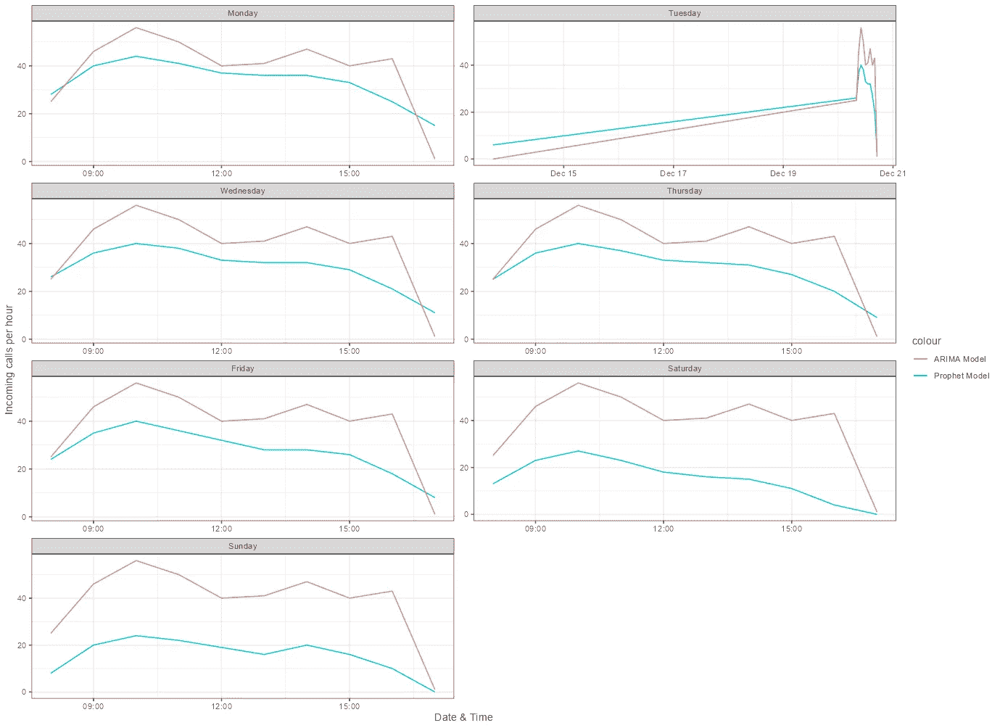

At the very least, the ARIMA model did provide forecasts. Once again, you cannot really see which model is best using plots like these, but you can see how they stack up. The problem with demand forecasting is that the room for error is very limited. And here the ARIMA model is continuously predicting higher than the Prophet model.

如果您总结一整周每天的数据，这一点就变得很清楚了。事实上，ARIMA 模型每天都给出完全相同的需求预测。

```
forecast%>%
  filter(ds>max(df_tbl$newdate))%>%
  select(ds, yhat)%>%
  mutate(n_prophet=round(yhat))%>%
  mutate(n_arima = as.numeric(round(arima_model$mean)))%>%
  select(-yhat)%>%
  timetk::summarise_by_time(
    ds, .by="hour",
    n_prophet=sum(n_prophet),
    n_arima=sum(n_arima))%>%
  mutate(hour=hour(ds))%>%
  filter(hour>=8 & hour<=17)%>%
  mutate(n_prophet = if_else(n_prophet<0, 0, n_prophet),
         n_arima = if_else(n_arima<0, 0, n_arima),
         day = factor(weekdays(ds), 
                      level=c("Monday", "Tuesday", "Wednesday",
                              "Thursday", "Friday", "Saturday", "Sunday")))%>%
  arrange(day, ds)%>%
  timetk::summarise_by_time(
    ds, .by="day",
    n_prophet=sum(n_prophet),
    n_arima=sum(n_arima))

# A tibble: 8 x 3
  ds                  n_prophet n_arima
  <dttm>                  <dbl>   <dbl>
1 2022-12-13 00:00:00         6       0
2 2022-12-14 00:00:00       298     389
3 2022-12-15 00:00:00       290     389
4 2022-12-16 00:00:00       275     389
5 2022-12-17 00:00:00       150     389
6 2022-12-18 00:00:00       155     389
7 2022-12-19 00:00:00       335     389
8 2022-12-20 00:00:00       288     389
```

从这一刻起，我专注于先知模型，但不是因为 ARIMA 表现不好，而是因为我如何对待它。因为我可以很容易地调整 ARIMA 模型，甚至包括傅立叶项，我将进入先知模型。

使用 Prophet 模型的真正潜在原因是因为我还可以添加边界，这允许我通过添加事件和完全分解数据来处理数据的间歇部分。让我告诉你怎么做。

```
TC_df<-df%>%
  #dplyr::mutate(newdate = with(., ymd(Date) + hms(QuarterHour)),
                #RecordTpe = factor(RecordType))%>%
  dplyr::mutate(newdate = with(., ymd(Date) + hours(Hour)),
                RecordTpe = factor(RecordType))%>%
  group_by(RecordType, newdate)%>%
  filter(!RecordType %in% c("AgentState", "Callback call"))%>%
  filter(CallDirection=="Incoming" & 
           DoneInIVR==0 & AgentSequence==1)%>%
  count()%>%
  group_by(RecordType) %>%
  imputeTS::na_kalman(.) %>% 
  select(RecordType, newdate, n)%>%
  as_tsibble(key = RecordType, index = newdate) %>%
  fill_gaps(n = 0, .full = end())%>%
  as_tibble()%>%
  arrange(RecordType, newdate)%>%
  ungroup()%>%
  select(RecordType, newdate, n)
TC_df%>%
  mutate(dayname = weekdays(newdate, abbreviate = TRUE))%>%
  mutate(dayname = factor(dayname,levels=c("Mon", "Tue", "Wed",
                                           "Thu","Fri","Sat","Sun")))%>%
  dplyr::filter(newdate>"2022-10-10 00:00:00" & newdate<"2022-10-23 23:00:00")%>%
  ggplot(., aes(x=newdate, y=n, fill=factor(dayname)), alpha=0.5)+
  geom_bar(stat="identity")+
  theme_bw()+
  facet_grid(rows=vars(RecordType), scales="free_y")+
  labs(x="Date", 
       y="Incoming need", 
       fill="Dayname",
       title="Actual calls between 8am and 5 pm for each day of the week")
```

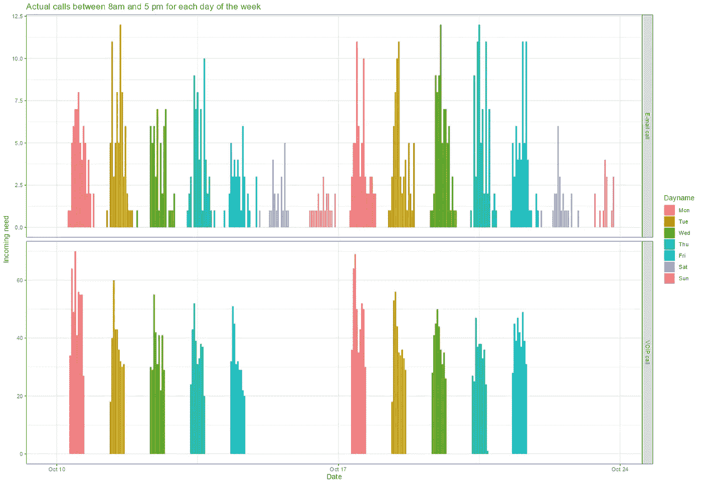

Here you see the actual incoming telephone calls and number of e-mails received between 8 am and 5 pm for each day of the week in a range of 2 weeks.

我会再加上假期。

```
holiday<-c("Kerstmis1", "Kerstmis2", "Oudjaarsdag", 
           "Nieuwjaarsdag", "Goedevrijdag", "Paasdag1", "Paasdag2",
           "Koningsdag","Bevrijdsdag","Hemelvaartsdag","Pinksteren1", "Pinkesteren2",
           "Kerstmis1", "Kerstmis2", "Oudjaarsdag",
           "Nieuwjaarsdag", "Goedevrijdag", "Paasdag1", "Paasdag2",
           "Koningsdag","Bevrijdsdag","Hemelvaartsdag","Pinksteren1", "Pinkesteren2",
           "Kerstmis1", "Kerstmis2", "Oudjaarsdag")
ds<-c(as.Date('2021-12-25'),
      as.Date('2021-12-26'),
      as.Date('2021-12-31'),
      as.Date('2022-01-01'),
      as.Date('2022-04-15'),
      as.Date('2022-04-17'),
      as.Date('2022-04-18'),
      as.Date('2022-04-27'),
      as.Date('2022-05-05'),
      as.Date('2022-05-26'),
      as.Date('2022-06-05'),
      as.Date('2022-06-06'),
      as.Date('2022-12-25'),
      as.Date('2022-12-26'),
      as.Date('2022-12-31'),
      as.Date('2023-01-01'),
      as.Date('2023-04-07'),
      as.Date('2023-04-09'),
      as.Date('2023-04-10'),
      as.Date('2023-04-27'),
      as.Date('2023-05-05'),
      as.Date('2023-05-18'),
      as.Date('2023-05-28'),
      as.Date('2023-05-29'),
      as.Date('2023-12-25'),
      as.Date('2023-12-26'),
      as.Date('2023-12-31'))
lower_window<-rep(0,length(ds))
upper_window<-rep(1,length(ds))
df_holiday <- dplyr::bind_cols(holiday, ds, lower_window, upper_window)
colnames(df_holiday)<-c("holiday", "ds", "lower_window", "upper_window")
df_holiday
# A tibble: 27 x 4
   holiday        ds         lower_window upper_window
   <chr>          <date>            <dbl>        <dbl>
 1 Kerstmis1      2021-12-25            0            1
 2 Kerstmis2      2021-12-26            0            1
 3 Oudjaarsdag    2021-12-31            0            1
 4 Nieuwjaarsdag  2022-01-01            0            1
 5 Goedevrijdag   2022-04-15            0            1
 6 Paasdag1       2022-04-17            0            1
 7 Paasdag2       2022-04-18            0            1
 8 Koningsdag     2022-04-27            0            1
 9 Bevrijdsdag    2022-05-05            0            1
10 Hemelvaartsdag 2022-05-26            0            1
11 Pinksteren1    2022-06-05            0            1
12 Pinkesteren2   2022-06-06            0            1
13 Kerstmis1      2022-12-25            0            1
14 Kerstmis2      2022-12-26            0            1
15 Oudjaarsdag    2022-12-31            0            1
16 Nieuwjaarsdag  2023-01-01            0            1
17 Goedevrijdag   2023-04-07            0            1
18 Paasdag1       2023-04-09            0            1
19 Paasdag2       2023-04-10            0            1
20 Koningsdag     2023-04-27            0            1
21 Bevrijdsdag    2023-05-05            0            1
22 Hemelvaartsdag 2023-05-18            0            1
23 Pinksteren1    2023-05-28            0            1
24 Pinkesteren2   2023-05-29            0            1
25 Kerstmis1      2023-12-25            0            1
26 Kerstmis2      2023-12-26            0            1
27 Oudjaarsdag    2023-12-31            0            1
```

现在，开始真正有趣的事情。接下来，您将看到我删除模型的一些标准部分，并替换它们。如您所见，我将删除自动的每日、每周和每年季节性，将季节性设置为乘法，将增长设置为逻辑，并输入假期。

从线性增长转变为逻辑增长使我能够更有效地处理边界问题。通过删除自动成分，我可以输入我自己的成分，包括傅立叶项——每小时、每天、每周、每月、每季度和每年。让我们看看我的结局。

```
m1 <- prophet::prophet(weekly.seasonality=FALSE,
                       yearly.seasonality=FALSE,
                       daily.seasonality=FALSE,
                       growth="logistic",
                       seasonality.mode = 'multiplicative',
                       holidays=df_holiday,
                       changepoint.prior.scale = 0.5)
                       #mcmc.samples=100)
m1 <- prophet::add_seasonality(m1, name='monthly', 
                               period=30.5, 
                               fourier.order=20)
m1 <- prophet::add_seasonality(m1, name='hourly', 
                               period=1/24, 
                               fourier.order=20)
m1 <- prophet::add_seasonality(m1, name='daily', 
                               period=1, 
                               fourier.order=20)
m1 <- prophet::add_seasonality(m1, name='weekly', 
                               period=7, 
                               fourier.order=20)
m1 <- prophet::add_seasonality(m1, name='yearly', 
                               period=365.25, 
                               fourier.order=20)
m1 <- prophet::add_seasonality(m1, name='quarterly', 
                               period=(365.25/4), 
                               fourier.order=20)
```

接下来，我将设置地板和天花板标高，并将其添加到模型中。然后，我将对 VOIP 通话时间序列运行模型，并从我设置的预测窗口中获取我的预测。

```
TC_df$cap <- 100
TC_df$floor <- 0
fit <- TC_df%>%
  filter(RecordType=="VOIP call")%>%
  select(newdate,n, cap, floor)%>%
  rename(ds=newdate, y=n)%>%
  select(ds,y, cap, floor)%>%
  prophet::fit.prophet(m1,.)
saveRDS(fit, file="ProphetVOIPmodel.RDS")  # Save model
fitVOIP <- readRDS(file="ProphetVOIPmodel.RDS")           # Load model
future <- prophet::make_future_dataframe(fit,periods=7*24*4, 
                                         freq= 3600, 
                                         include_history = TRUE)
future$cap <- 100
future$floor <- 0
forecast <- predict(fit, future)
plot(fit, forecast)
```

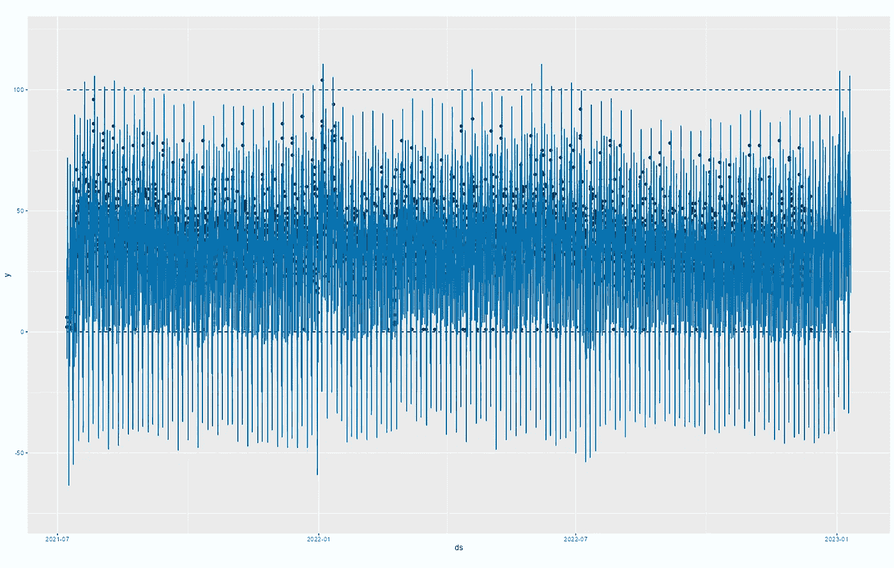

This looking much much better. Okay, the bottom is being neglected at all it seems, but I am seeing the patterns I want to see.

让我们看看组件。

```
prophet::prophet_plot_components(fit, forecast)
```

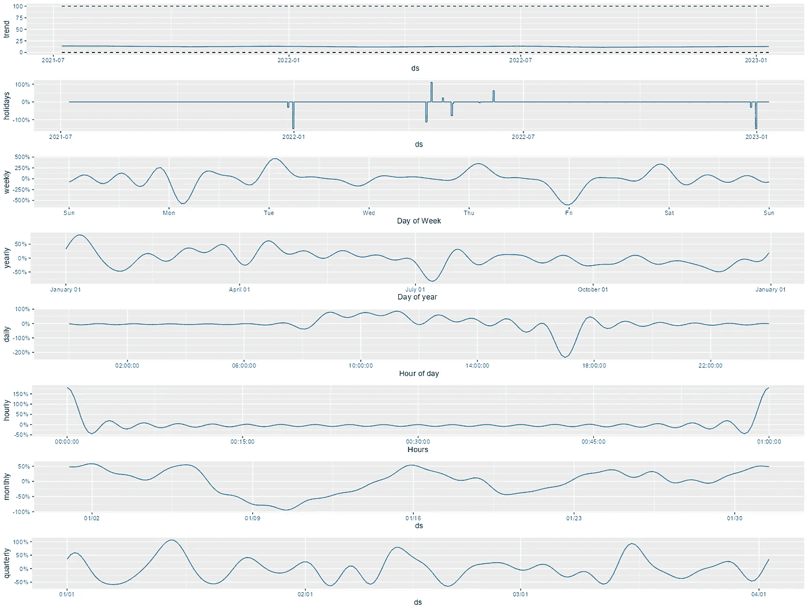

Quite some components included. Good to remember that all these components make up the model predictions. Hence, the time-series is first decomposed and then assessed for its ability to reproduce what it has observed. Maximum Likelihood in a nutshell.

我的预测看起来怎么样？

```
forecast%>%
  dplyr::select(ds, 
         yhat, 
         yhat_lower, 
         yhat_upper)%>%
  dplyr::filter(ds>"2022-12-11")%>%
  mutate(hour = hour(ds), 
         day=day(ds))%>%
  dplyr::filter(hour>=8 & hour<=17)%>%
  ggplot(., aes(x=ds, y=yhat))+
  geom_point()+
  geom_ribbon(aes(x=ds, y=yhat, ymin=yhat_lower, ymax=yhat_upper), 
              fill="black",alpha=0.2)+
  theme_bw()
```

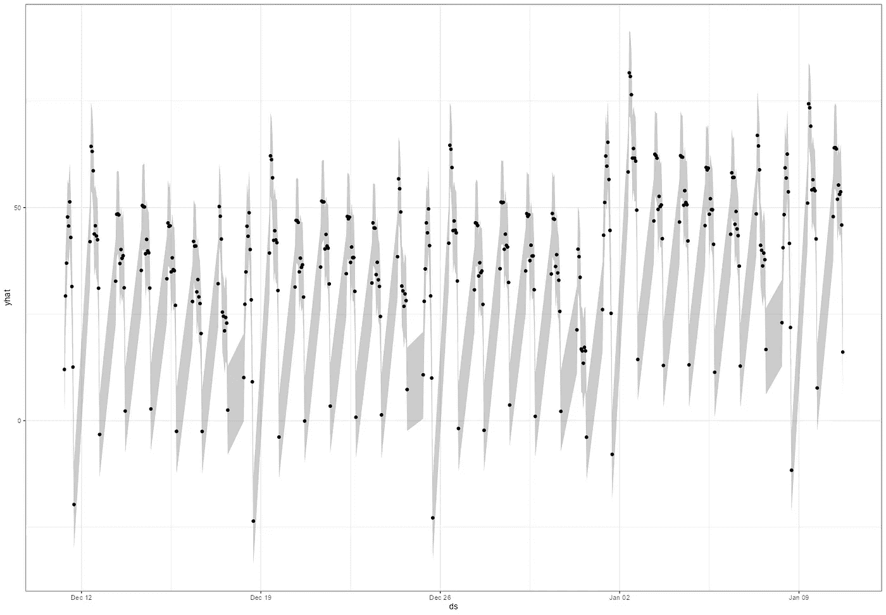

Looks good to me!

```
forecast%>%
  dplyr::select(ds, 
                yhat, 
                yhat_lower, 
                yhat_upper)%>%
  dplyr::filter(ds>"2022-12-31")%>%
  mutate(hour = hour(ds), 
         day=day(ds), 
         date=date(ds))%>%
  dplyr::filter(hour>=8 & hour<=17)%>%
  mutate(dayname = weekdays(ds, abbreviate = TRUE))%>%
  mutate(dayname = factor(dayname,levels=c("Mon", "Tue", "Wed",
                                           "Thu","Fri","Sat","Sun")))%>%

  filter(!dayname %in% c("Sat", "Sun"))%>%
  ggplot(., aes(x=hour, y=yhat, label=round(yhat)))+
  geom_point()+
  geom_ribbon(aes(x=hour, y=yhat, ymin=yhat_lower, ymax=yhat_upper, 
              fill=dayname),alpha=0.2)+
  geom_text(check_overlap = TRUE,hjust = 1, vjust=-1,nudge_x = 0.05, size=4)+
  theme_bw()+
  facet_grid(~date, scale="free_x")+
  scale_x_continuous(breaks = seq(8,17, by = 1))
```

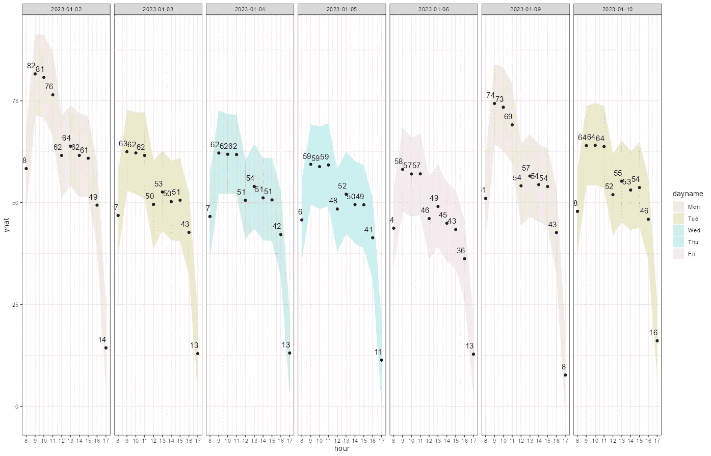

And the predictions shown as a function of time and date. What I am looking for is an early steep rise in calls and then a soft decline towards the end of the day. I am also looking for that spike on Monday.

让我们缩小一点，看看我是否真的得到了那个模式。

```
forecast%>%
  dplyr::select(ds, 
                yhat, 
                yhat_lower, 
                yhat_upper)%>%
  dplyr::filter(ds>"2022-12-11")%>%
  mutate(hour = hour(ds))%>%
  dplyr::filter(hour>=8 & hour<=17)%>%
  summarise_by_time(ds, 
                    .by = "day", 
                    .type = "round", 
                    value = sum(yhat))%>%
  mutate(dayname = weekdays(ds, abbreviate = TRUE))%>%
  mutate(dayname = factor(dayname,levels=c("Mon", "Tue", "Wed",
                                           "Thu","Fri","Sat","Sun")))%>%
  filter(!dayname %in% c("Sat", "Sun"))%>%
  ggplot(., aes(x=ds, y=value, fill=factor(dayname)), alpha=0.5)+
  geom_bar(stat="identity")+
  theme_bw()+
  labs(x="Date", 
       y="Telephone calls", 
       fill="Dayname",
       title="Predicted telephone calls between 8am and 5 pm for each day of the week")
```

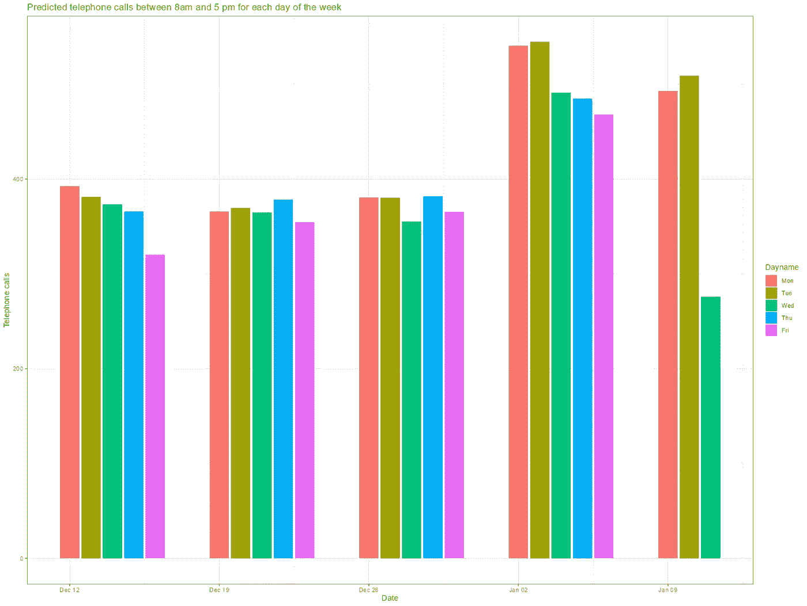

Yes I do.

让我们来看看概率。

```
forecast%>%
  dplyr::select(ds, 
                yhat, 
                yhat_lower, 
                yhat_upper)%>%
  dplyr::filter(ds>"2022-12-12")%>%
  mutate(hour = hour(ds), 
         day=day(ds), 
         date=date(ds))%>%
  dplyr::filter(hour>=8 & hour<=17)%>%
  mutate(dayname = weekdays(ds, abbreviate = TRUE))%>%
  mutate(dayname = factor(dayname,levels=c("Mon", "Tue", "Wed",
                                           "Thu","Fri","Sat","Sun")))%>%
  filter(!dayname %in% c("Sat", "Sun"))%>%
  select(ds, yhat, yhat_lower, yhat_upper)%>%
  mutate(ds=round(ds),
         yhat=round(yhat),
         yhat_lower=round(yhat_lower), 
         yhat_upper=round(yhat_upper))%>%
  rename(date=ds, 
         VOIP_predicted=yhat, 
         VOIP_predicted_lower=yhat_lower, 
         VOIP_predicted_higher=yhat_upper)

                   date VOIP_predicted VOIP_predicted_lower VOIP_predicted_higher
1   2022-12-12 08:00:00             42                   32                    51
2   2022-12-12 09:00:00             64                   54                    75
3   2022-12-12 10:00:00             63                   53                    73
4   2022-12-12 11:00:00             59                   49                    68
5   2022-12-12 12:00:00             44                   34                    55
6   2022-12-12 13:00:00             46                   36                    55
7   2022-12-12 14:00:00             43                   34                    53
8   2022-12-12 15:00:00             42                   32                    52
9   2022-12-12 16:00:00             31                   21                    41
10  2022-12-12 17:00:00             -3                  -13                     6
11  2022-12-13 08:00:00             33                   23                    43
12  2022-12-13 09:00:00             48                   38                    58
13  2022-12-13 10:00:00             49                   39                    59
```

对我来说，这些数字看起来不错。由于模型是概率，我们将提供一系列数字。但出于某种原因，尽管最低值为零，该模型还是预测到了负数。我将不得不在未来对此进行进一步的评估。

为了评估模型的有效性，我可以应用交叉验证。在这里，我将要求以 30 天为周期分割数据。

```
TC_df.cv <- prophet::cross_validation(fit, initial = 30, period = 30, horizon = 30, units = 'days')
prophet::plot_cross_validation_metric(TC_df.cv, metric = 'mape')
TC_df.cv
# A tibble: 3,039 x 6
       y ds                     yhat yhat_lower yhat_upper cutoff             
   <dbl> <dttm>                <dbl>      <dbl>      <dbl> <dttm>             
 1    48 2021-08-23 08:00:00  14.4         6.75      21.9  2021-08-20 17:00:00
 2    77 2021-08-23 09:00:00  34.7        27.3       42.1  2021-08-20 17:00:00
 3    57 2021-08-23 10:00:00  30.0        22.8       37.0  2021-08-20 17:00:00
 4    62 2021-08-23 11:00:00  21.7        14.5       29.3  2021-08-20 17:00:00
 5    61 2021-08-23 12:00:00  -0.240      -7.48       6.93 2021-08-20 17:00:00
 6    62 2021-08-23 13:00:00  -1.50       -9.06       6.09 2021-08-20 17:00:00
 7    56 2021-08-23 14:00:00  -5.02      -12.1        2.76 2021-08-20 17:00:00
 8    58 2021-08-23 15:00:00 -14.0       -21.4       -6.63 2021-08-20 17:00:00
 9    42 2021-08-23 16:00:00 -29.9       -36.7      -22.3  2021-08-20 17:00:00
10    39 2021-08-24 08:00:00 -24.5       -32.1      -17.3  2021-08-20 17:00:00
# ... with 3,029 more rows
```

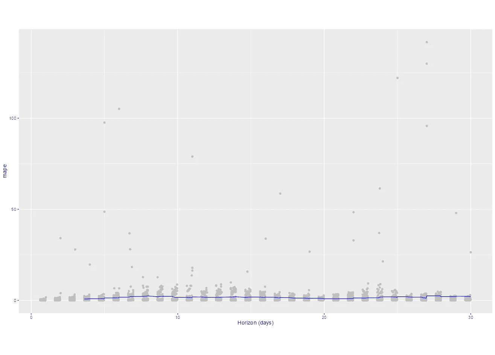

Looking good over time. The outliers are mostly events I have not modelled yet. Something for the future.

```
TC_df.p <- prophet::performance_metrics(TC_df.cv)
TC_df.p
      horizon        mse      rmse      mae      mape     mdape     smape  coverage
1    87 hours   827.3958  28.76449 20.35292 0.7142706 0.3594042 0.6124057 0.3663366
2    88 hours   884.7252  29.74433 21.15144 0.7301427 0.3838585 0.6372713 0.3557756
3    89 hours   943.8874  30.72275 21.97208 0.7452976 0.3965911 0.6628596 0.3392739
4    90 hours   991.3885  31.48632 22.62120 0.7573581 0.3992891 0.6833342 0.3372937
5    91 hours  1044.0739  32.31213 23.27287 0.7748281 0.4054236 0.7074297 0.3359736
6    92 hours  1085.8181  32.95175 23.90657 0.7899180 0.4126654 0.7288895 0.3267327
7    93 hours  1129.4854  33.60782 24.44831 0.8046231 0.4274603 0.7466365 0.3227723
8    94 hours  1169.2230  34.19390 25.04196 0.8151764 0.4335314 0.7568633 0.3156316
9    95 hours  1186.1815  34.44099 25.21167 0.8302762 0.4378025 0.7647722 0.3165317
10   96 hours  1183.3540  34.39991 25.19690 0.8937962 0.4378025 0.7689431 0.3156316
11  111 hours  1241.9208  35.24090 25.60396 0.9087479 0.4485662 0.7787953 0.3180318
12  112 hours  1298.6121  36.03626 26.08307 0.9197898 0.4485662 0.7870496 0.3162316
13  113 hours  1326.8614  36.42611 26.33218 0.9237472 0.4485662 0.7881559 0.3129313
14  114 hours  1373.9662  37.06705 26.73836 0.9302271 0.4417954 0.7913998 0.3096310
15  115 hours  1427.0944  37.77690 27.21232 0.9438990 0.4649363 0.7978453 0.3039304
16  116 hours  1473.2762  38.38328 27.65111 0.9576387 0.4724837 0.8039432 0.2955296
17  117 hours  1503.6625  38.77709 27.89451 0.9590604 0.4724837 0.8029143 0.2916292
18  118 hours  1526.2041  39.06666 27.97210 0.8396388 0.4511389 0.7897167 0.2948295
19  119 hours  1545.1412  39.30828 27.96781 0.8489682 0.4500697 0.7915213 0.2978548
20  120 hours  1577.3210  39.71550 28.28425 1.3285633 0.4500697 0.8007789 0.2962046
21  135 hours  1664.4476  40.79764 28.86563 1.3454675 0.4649363 0.8098595 0.2937294
22  136 hours  1722.3524  41.50123 29.33171 1.3693806 0.4516746 0.8138840 0.2931793
23  137 hours  1761.7773  41.97353 29.52384 1.3710233 0.4511389 0.8084394 0.2915292
24  138 hours  1837.7364  42.86883 29.98473 1.3796956 0.4385938 0.8036610 0.2838284
25  139 hours  1909.4537  43.69730 30.47415 1.3983215 0.4385938 0.8046136 0.2772277
26  140 hours  1973.7674  44.42710 30.87739 1.4144755 0.4306182 0.8027825 0.2717272
27  141 hours  2050.6867  45.28451 31.31982 1.4234553 0.4306182 0.8006392 0.2698020
28  142 hours  2104.4469  45.87425 31.62569 1.4238621 0.4258125 0.7939464 0.2706271
29  143 hours  2180.6383  46.69730 31.98080 1.3437806 0.4170105 0.7895738 0.2764026
30  144 hours  2205.8794  46.96679 32.14368 1.7070054 0.4211839 0.7964796 0.2780528
31  159 hours  2377.8927  48.76364 32.88574 1.7325492 0.4170105 0.7945434 0.2849285
32  160 hours  2532.7136  50.32607 33.66352 1.7564765 0.4170105 0.7919632 0.2945545
33  161 hours  2668.3920  51.65648 34.42589 1.8835151 0.4170105 0.7908198 0.3003300
34  162 hours  2802.9861  52.94323 35.24607 1.9811052 0.4170105 0.7886301 0.2926293
35  163 hours  2995.5727  54.73183 36.35064 2.0170405 0.4211839 0.7901189 0.2871287
36  164 hours  3224.9815  56.78892 37.56338 2.0377829 0.4258125 0.7919723 0.2882288
37  165 hours  3388.1239  58.20759 38.57397 2.1084925 0.4336581 0.7943699 0.2816282
38  166 hours  3631.8703  60.26500 39.84352 2.1232605 0.4322039 0.7962240 0.2698020
39  167 hours  3851.3188  62.05899 41.07109 2.0939748 0.4336581 0.7979080 0.2596260
40  183 hours  4076.1588  63.84480 42.18438 2.1616346 0.4322039 0.8018336 0.2541254
41  184 hours  4312.0095  65.66589 43.42222 2.1938510 0.4336581 0.8067529 0.2486249
42  185 hours  4633.1511  68.06725 45.10975 2.2234641 0.4487351 0.8186872 0.2355236
43  186 hours  4915.7172  70.11218 46.48087 2.2466009 0.4582281 0.8240190 0.2359736
44  187 hours  5224.6978  72.28207 47.85008 2.2728217 0.4582281 0.8288225 0.2343234
```

我们可以看到，误差随着视界的增加而增加。现在，MAPE ( *平均绝对百分比误差*)并不是一个真正用于需求数据的好值，因此从这个意义上说，我们可以使用 RMSE *(均方根误差)*或平均绝对误差( *mae)* 。mae 为 20 意味着我对特定时间段的预测绝对差 20 点。这是相当大的，但主要取决于你希望预报多远，这里是提前 87 小时。

本质上，先知模型给了我第一个模型一个很好的基础。我没有将其与基线模型或任何类似的东西进行比较，这是我开始构建 ML Ops 部分后的未来工作。正是在这里，模型将自动运行，消化数据，生成预测并检查准确性。

就目前而言，我很高兴建立了一个模型，它能够足够充分地处理间歇数据，并能检测出这一时间序列中固有的模式。

[](/mlearning-ai/mlearning-ai-submission-suggestions-b51e2b130bfb) [## Mlearning.ai 提交建议

### 如何成为 Mlearning.ai 上的作家

medium.com](/mlearning-ai/mlearning-ai-submission-suggestions-b51e2b130bfb)