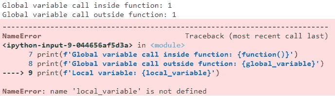
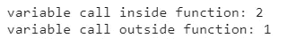
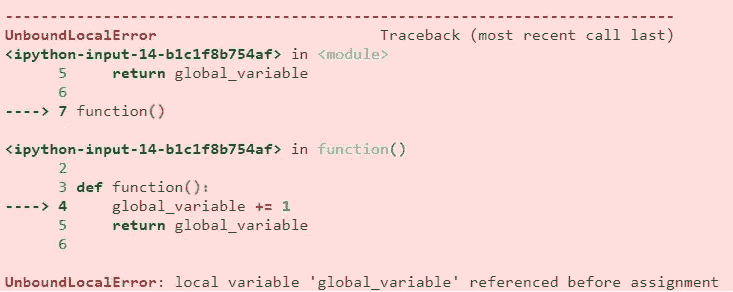
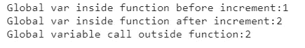
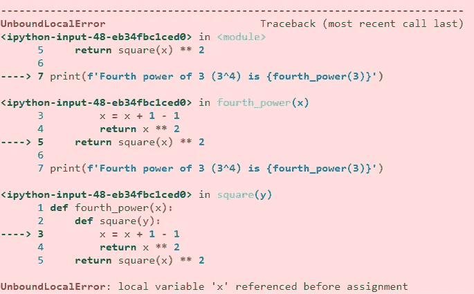

# 理解 Python 中变量的范围

> 原文：<https://medium.com/mlearning-ai/understanding-the-scope-of-the-variables-in-python-d83a95b73d90?source=collection_archive---------5----------------------->

## 本文讨论 Python 中变量的范围，这是 Python 编程的基本概念之一。


Image by [Chris Ried](https://unsplash.com/@cdr6934?utm_source=medium&utm_medium=referral) on [Unsplash](https://unsplash.com/?utm_source=medium&utm_medium=referral)

变量的作用域是代码中变量可用/可访问的区域。在函数外部(即代码的主区域)声明的变量称为全局变量，在函数内部声明的变量称为该函数的局部变量。

```
##################
 GLOBAL VARIABLES
##################def x:
    ################
     LOCAL VARIABLE
    ################
```

让我们看一个例子来更好地理解它。在下面的例子中，我们在代码的主要部分声明了一个名为“global_variable”的变量，并在函数中声明了一个名为“local_variable”的变量。

```
global_variable = 1def function():
    local_variable = 2
    return global_variableprint(f'Global variable call inside function: {function()}')
print(f'Global variable call outside function: {global_variable}')
print(f'Local variable: {local_variable}')
```



Image by author

“global_variable”可以从代码中的任何地方访问。而在函数内部声明的“local_variable”只能从该函数内部访问。我们无法从函数外部访问它。在下一个例子中，我们将在局部和全局范围内创建一个同名的变量。

```
variable = 1def function():
    variable = 2
    return variableprint(f'variable call inside function: {function()}')
print(f'variable call outside function: {variable}')
```



Image by author

从函数内部调用的“变量”返回 2，而从函数外部调用的变量返回 1。这是因为 Python 首先在局部范围内搜索变量，然后在全局范围内搜索。这里，在函数内部声明的“变量”是局部变量，并且只在函数内部可用。

可以从程序的任何地方访问全局变量。虽然我们可以从函数中访问全局变量，但是我们不能修改它。让我们在下一个例子中看到它。

```
global_variable = 1def function():
    global_variable += 1 #Modifying a global variable
    return global_variablefunction()
```



Image by author

当我们试图从函数中递增“global_variable”时，出现了一个错误。为了避免这个错误并从函数内部修改全局变量，我们需要使用关键字' global '。我们将在下一个例子中看到它。

```
glob_var = 1def function():
    global glob_var #Using global keyword

    print(f'Global var inside function before increment:{glob_var}') glob_var += 1

    print(f'Global var inside function after increment:{glob_var}') function()
print(f'Global variable call outside function:{glob_var}')
```



Image by author

在函数中使用“global”关键字声明全局变量后，我们能够在函数中修改它。

让我们看看嵌套函数中变量的作用域。我们将创建一个名为“fourth_power”的函数和一个名为“square”的嵌套函数。函数“fourth_power”接受一个输入参数，并将其传递给嵌套函数“square ”,后者对输入参数求平方。然后，函数“fourth_power”返回嵌套函数“square”返回的输出的平方。

```
def fourth_power(x):
    def square(y):
        return x ** 2 #x is accessed from fourth_power
    return square(x) ** 2print(f'Fourth power of 3 (3^4) is {fourth_power(3)}')
```


我们可以看到，函数 square 接受一个输入参数“y”，但返回“x**2”。但是没有错误，这是因为，最初 Python 在“square”的局部范围内搜索变量“x”，但是没有找到。因此，它在函数‘fourth _ power’的范围内搜索变量‘x’并使用它。因此，函数' square '返回(3 ** 2)。函数的四次方返回(3 ** 2 ** 2)即 81。

类似于我们之前的一个例子，如果我们试图修改一个没有在函数的局部范围内声明的变量，我们会得到一个错误。我们将在下一个例子中看到它。

```
def fourth_power(x):
    def square(y):
        x = x + 1 - 1 # Modifying non-local variable
        return x ** 2
    return square(x) ** 2print(f'Fourth power of 3 (3^4) is {fourth_power(3)}')
```



Image by author

当我们试图修改一个未在函数“square”的局部范围内声明的变量时，出现了一个错误。我们可以使用关键字“非本地”来避免这个错误。因为变量“x”不在全局范围内，所以我们不能使用“global”关键字。

```
def fourth_power(x):
    def square(y):
        nonlocal x #Using nonlocal keyword
        x = x + 1 - 1
        return x ** 2
    return square(x) ** 2print(f'Fourth power of 3 (3^4) is {fourth_power(3)}')
```


使用关键字' nonlocal '，我们可以修改没有在函数的局部范围内声明的变量。因为，我们将变量递增 1，递减 1，所以变量的值保持不变。

这就把我们带到了本文的结尾，我们讨论了 Python 中变量的作用域，以及使用“全局”和“非局部”关键字来修改没有在函数的局部作用域中声明的变量。