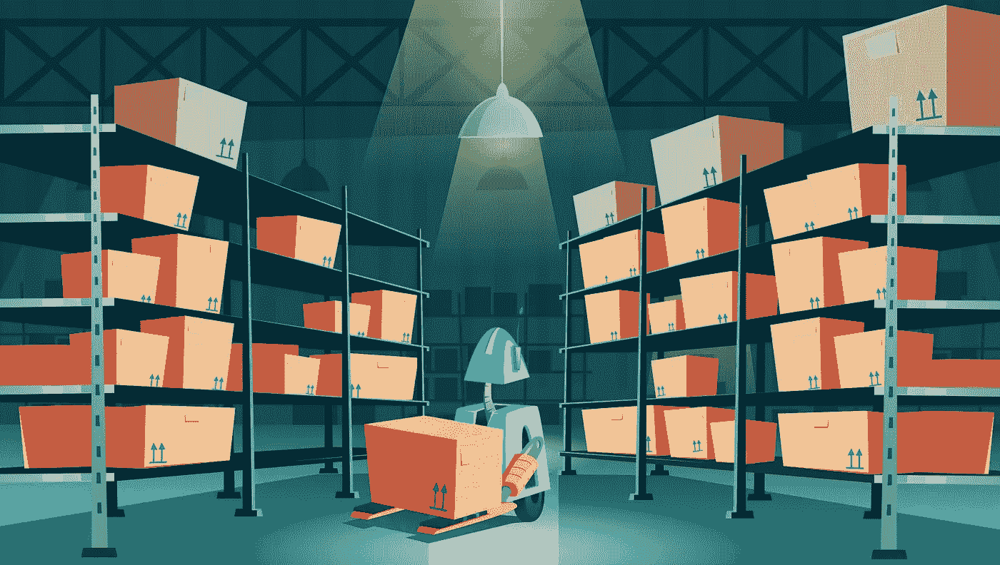
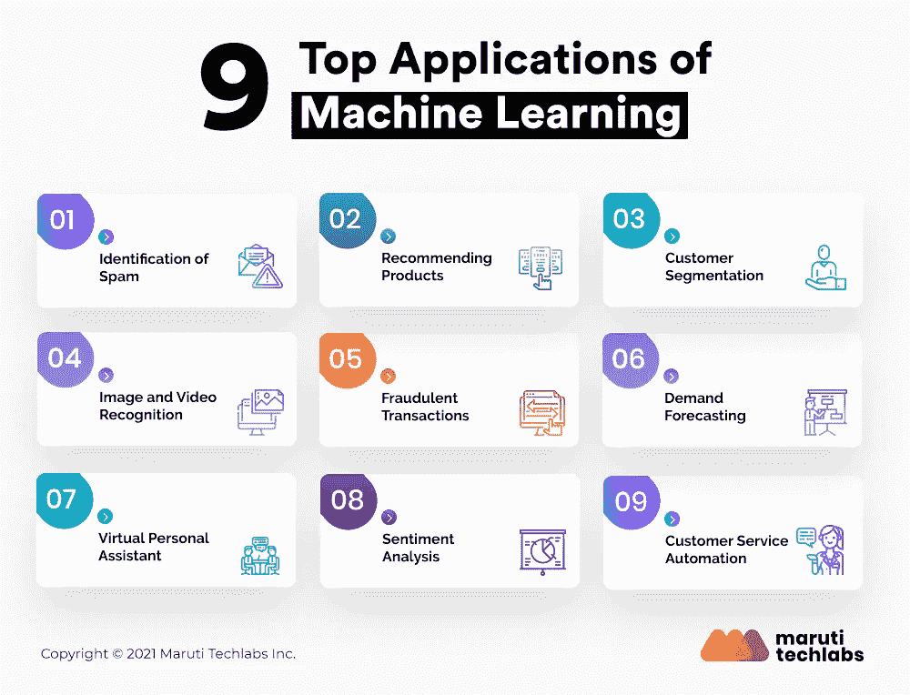

# 了解商业机器学习的三大用例

> 原文：<https://medium.com/mlearning-ai/understanding-top-3-use-cases-of-machine-learning-for-business-e456c7dac7b8?source=collection_archive---------3----------------------->

鉴于其解决复杂问题的能力，机器学习在过去几年中获得了极大的关注。如今，可以在许多行业中观察到机器学习的实施来解决现实生活中的情况。

例如，电子邮件提供商利用机器学习来检测垃圾邮件，而脸书将其用于图像标记。

这篇博客文章确定了机器学习产生影响的三个突出领域，使企业能够准确地利用他们的数据。

但首先，让我们更详细地理解机器学习:

# **什么是机器学习？**

它是人工智能的一个子集，用于独立寻找复杂问题的解决方案。机器学习算法可以根据大型数据库中的模式预测未来的结果。

它可以发现文字、数字、图像等的模式。 [**面向商业的机器学习**](https://marutitech.com/machine-learning-services/?utm_source=medium&utm_medium=content_promotion&utm_campaign=Use_Cases_of_ML_for_Business) 与传统编程的不同之处在于，后者使用人工创建的程序。

输入数据被送到这个手动程序以产生输出。另一方面，输出和输入数据都被提供给机器学习算法来创建程序。

这个程序能够自己学习和适应。

# ***可以用机器学习解决的现实问题***

> 以上是一个关于该话题的短视频。不到 2 分钟，总结了**机器学习如何在日常生活中使用**？我们希望这有助于您了解更多信息并节省您的时间。干杯！

要学习如何将 [**机器学习应用到商业问题**](https://marutitech.com/contact-us/?utm_source=medium&utm_medium=content_promotion&utm_campaign=Use_Cases_of_ML_for_Business) 中，你首先需要识别所有耗时的流程，并且需要手工劳动。

它通常在部署后需要持续改进的业务领域中实现。

以下是三大使用案例:

**1。识别垃圾邮件**

如果没有机器学习，我们的电子邮件收件箱就会充满垃圾邮件或不请自来的邮件。想象一下手动清除那些大量不需要的电子邮件？没人有那么多时间。

更不用说这类邮件固有的安全风险了。这就是为什么电子邮件提供商利用机器学习来自动过滤垃圾邮件。

神经网络可以根据发件人内容和主题中确定的共同特征成功地挑出垃圾邮件。

**2。推荐产品**

推荐系统是机器学习在商业中的普遍应用。它被移动和网络应用程序、娱乐平台(如网飞和 Google Play)、电子商务网站(如亚马逊和易贝)和搜索引擎所使用。

机器学习算法记录各种参数和行为数据，包括浏览历史、上下文数据(设备、语言和位置)、商品详细信息(类别、价格)、购买、页面浏览量、商品浏览量、点击量等。，提出建议。

这反过来使企业能够提高利润，增加用户参与度，提高流量，降低流失率。

**3。客户细分**

在市场营销中也发现了机器学习解决现实生活问题的实现。客户终身价值(LTV)、流失预测和客户细分是这一领域的常见挑战。

使用机器学习，营销人员可以在他们的活动中做出数据驱动的决策，同时消除任何猜测。此外，它鼓励客户参与品牌，从而提高早期的转化率。

想了解更多面向商业的机器学习用例吗？

点击阅读完整博客[。](https://marutitech.com/problems-solved-machine-learning/?utm_source=medium&utm_medium=content_promotion&utm_campaign=Use_Cases_of_ML_for_Business)