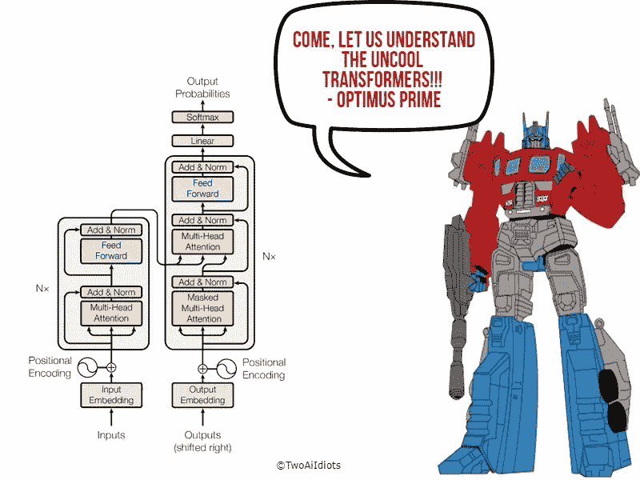
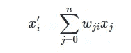
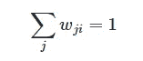
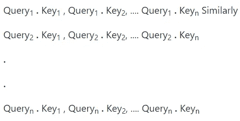
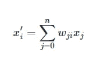
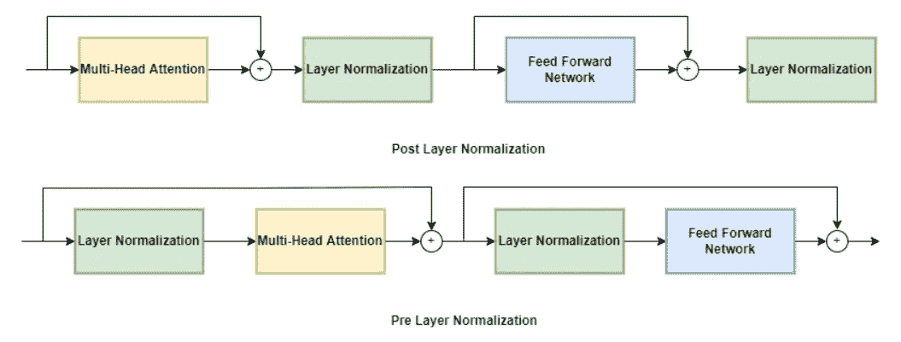

# 了解变形金刚，让它变得不再酷

> 原文：<https://medium.com/mlearning-ai/understanding-transformer-and-making-it-uncool-again-92cc210de2f4?source=collection_archive---------3----------------------->

# 作者

纳巴伦·巴鲁阿

[Git](https://github.com/nabarunbaruaAIML)/[LinkedIn](https://www.linkedin.com/in/nabarun-barua-aiml-engineer/)/[towards data science](/@nabarun.barua)

阿尔琼·库姆巴卡拉

[Git](https://github.com/arjunKumbakkara)/[LinkedIn](https://www.linkedin.com/in/arjunkumbakkara/)/[towards data science](/@arjunkumbakkara)

> 这项工作的灵感来自杰伊·阿拉玛的博客和刘易斯·汤斯顿的书。这些在技术上和经验上都是灵感的巨大来源。

T 早先发表的最初的 [Transformer 论文](https://arxiv.org/pdf/1706.03762.pdf)具有用于翻译的编码器&解码器架构，从那以后，Transformer 走过了漫长的道路，并且最近发表了多种 Transformer 架构。目前已经出版的变压器大致可以分为三类**编码器、解码器&编码器—解码器。**

**编码器:**在编码器架构中，有多个堆叠的编码器。每个编码器都有多头自关注层，后面是全连接的前馈网络，在自关注&全连接层之间，有一个跳过连接的机制&执行层标准化。因为神经网络只理解整数(而不是数字表示)。)，我们在添加特殊记号(在 BERT 的情况下为 CLS & SEP)、将记号转换为单词嵌入以及最后添加位置嵌入(在基于 BERT 的变换器的情况下也是如此)之后，将句子转换为记号。这些字嵌入被馈送到编码器，重要的是要注意编码器的输出也与输入具有相同的大小。编码器的主要职责是将上下文信息添加到输入序列中，这意味着在通过编码器后，例如，假设单词“Apple”在手机品牌上下文中的嵌入不同于在水果上下文中的嵌入。

既然我们已经了解了基础知识，让我们更深入地了解编码器。**自我关注**作为一种机制，允许神经网络为特定序列中的每个元素分配不同的权重或“关注”。简单地说，它的主要目的是确保每个令牌不会以相同的固定嵌入结束。相反，我们可以使用整个序列来计算每个嵌入的加权平均值。

表述这一点的另一种方式是说给定一个令牌嵌入序列 x₁….,xₙ的自我关注产生了一系列新的嵌入 x'₁….,x'ₙ，其中每个 xᵢ是所有 xⱼ:的线性组合

系数 wⱼᵢ被称为 ***注意力权重*** 并且被归一化，使得

让我们用一个例子来理解这一点

第一句:“我爱苹果 iphone”

句子 2:“我爱吃苹果”

在第一句中，单词“Apple”表示一家电话公司，而在第二句中，Apple 表示一种水果。因此，苹果的固定嵌入在这里无法工作，所以如果我们可以创建一个“苹果”的表示，通过以不同的比例组合所有的令牌嵌入来合并伴随的上下文，也许是通过将 weightsⱼᵢ分配给“iphone”的令牌嵌入，这是一个好主意。以这种方式生成的嵌入被称为上下文化嵌入。

现在，我们已经从理论上理解了编码器中自我注意机制的作用，让我们更深入地看看在引擎盖下发生了什么:

*   我们首先将单词嵌入投影到三个向量中，这三个向量是(1)查询向量，(2)关键字向量和(3)值向量。现在，为了获得这些向量，我们必须将单词嵌入与三个矩阵相乘，这三个矩阵分别是查询矩阵、键矩阵和值矩阵。
*   这里我们计算一下注意力得分。我们对我们要评分的各个令牌的查询和关键向量进行点积(乘)，即

注意力分数，即相似的查询和关键字将具有大的点积。这里的主要目标是找到相似的组合，在这种情况下，点积是一个相似性函数。

*   因为点积可以产生非常大的数值。因此，我们必须将其正常化，否则，它会破坏训练过程的稳定。因此，我们用关键矩阵维数的平方根除关注分数，然后用 softmax 将其归一化，以确保所有列值的总和为 1。得到的 *n* × *n* 矩阵现在包含了所有的注意力权重，wⱼᵢ.
*   既然我们已经获得了注意力权重，那么是时候通过将价值向量与注意力权重相乘来更新令牌嵌入了。

现在，最初，我们已经阅读了多头自我注意，而上述过程只是单个自我注意。事实上，在一个层次中有多个这样的自我注意，帮助我们聚焦于序列的不同语义方面。但是，如果你仍然有一个问题，为什么我们需要一个以上的注意力头？简单的答案是，一个头部的 softmax 倾向于主要关注相似性的一个方面。拥有几个头部允许模型同时关注几个方面。这类似于 CNN，在一个 CNN 层中，我们将有多个过滤器同时学习不同的东西。

现在我们已经了解了多头注意力，是时候了解前馈网络了。每个编码器堆栈都有多头关注，后跟前馈网络。前馈网络是两层完全连接的神经网络。该网络不将完整的嵌入序列作为单个向量来处理，而是单独处理每个嵌入。根据经验，第一层的输出大小是输入大小的四倍，GELU 是这些层中最常用的激活函数。这是将大多数参数添加到网络的地方。

变压器架构也有层规范化和跳过连接。归一化层将批处理中的每个输入归一化，使其具有零均值和单位方差。现在可以用两种方式来定位层归一化，即层后归一化和层前归一化

*   **层后标准化:**这种类型的布置出现在变压器研究论文中，该论文将层标准化置于跳跃连接之间。这种安排很难从头开始训练，因为梯度可能会分散。这是通过使用学习率预热来控制的，其中学习率在训练期间从一个小值逐渐增加到某个最大值。
*   **预图层归一化:**在这种类型的排列中，图层归一化在跳过连接的跨度内执行。这导致稳定的训练，你可能不需要任何学习率热身。

另一方面，跳过连接的工作方式与“Resnet”架构完全相同。它将一个张量传递给模型的下一层而不进行处理，并将其添加到已处理的张量中。

单词的位置和顺序是任何语言的重要组成部分。它们定义了语法，从而定义了句子的实际语义。作为**编码器主题**的最后一件事，我们将讨论位置嵌入，它适用于从令牌生成的嵌入。简单的想法是在标记嵌入中添加位置信息，因为整个句子是并行处理的，因此模型对于哪个标记先出现没有任何意义。

可用于位置嵌入的方法。

*   最流行的方法是可学习的位置嵌入。它的工作方式类似于令牌嵌入，但是使用位置索引而不是令牌 ID 作为输入。这种方法是对在预训练期间学习到的记号的位置进行编码的有效方式。两个嵌入最终被相加，使得位置信息被添加到令牌嵌入中。可学习的位置嵌入易于实现并被广泛使用。
*   另一种方法是绝对位置嵌入，这里变换器模型使用由调制的正弦和余弦信号组成的静态模式来编码记号的位置。

例子:伯特，迪夫伯特，罗伯塔，XLM，XLM-罗伯塔，阿尔伯特，伊莱克特拉，德贝塔等。

**解码器:**在解码器端，整体机制与编码器相同，唯一不同的是解码器在解码器栈中有两个注意力子层。

*   掩蔽多头自关注层:该层的任务是确保当前预测令牌始终基于过去的输出生成。
*   编码器-解码器关注层:解码器堆栈中的这一层从顶部编码器获得输出，即键和值向量，并且在每个解码器堆栈中，这一层从顶部编码器获得该键和值向量。这里，解码器的中间表示(来自掩蔽的多头自关注层的值)充当查询。就像编码器一样，查询、键和值向量用于计算以获得上下文嵌入，并且像在编码器的情况下一样，前馈网络用于进一步处理以给出最终嵌入。

例如:GPT、GPT-2、控制中心、GPT-3、GPT-近地天体/GPT-J-6B 等。

**编码器-解码器:**这种类型的转换器模型被用于我们需要像序列到序列生成这样的任务的地方。例如，文本生成、翻译、摘要&等。以上在编码器&解码器部分学到的知识在这里结合使用。

例如:T5、BART、BigBird、Pegasus 等。

如果你喜欢这篇博文，请表达你的爱，给我们竖起大拇指，给我们加星，如果不喜欢，请在评论区给我们反馈。希望你在理解变形金刚的过程中获得了乐趣！

为了合作，帮助和一起学习-

## 加入我们的不和谐服务器:【https://discord.gg/Z7Kx96CYGJ】T4

一路平安！

 [## Mlearning.ai 提交建议

### 如何成为 Mlearning.ai 上的作家

medium.com](/mlearning-ai/mlearning-ai-submission-suggestions-b51e2b130bfb)