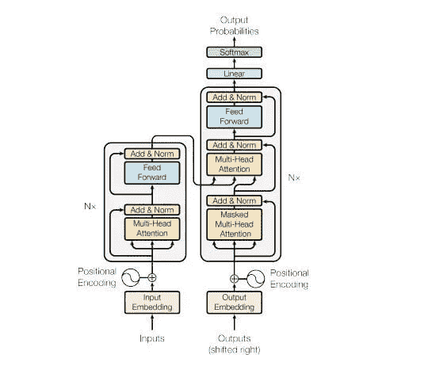
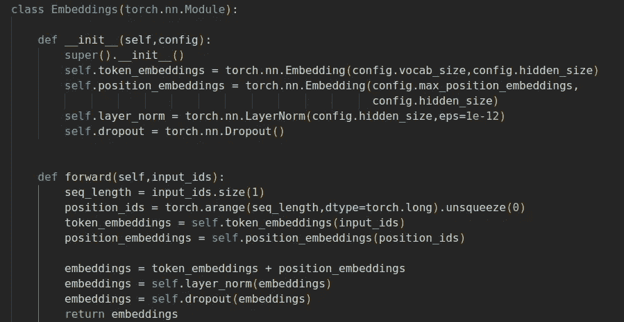
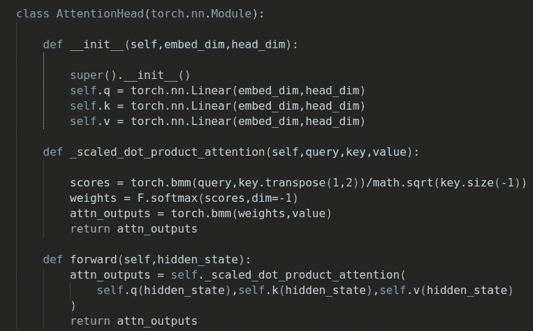
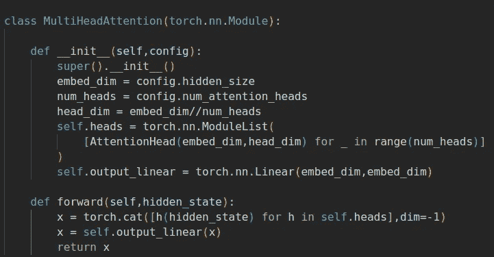
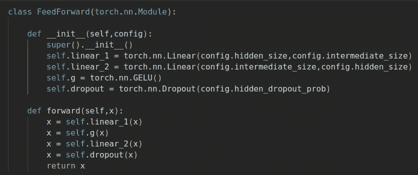
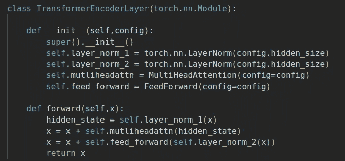
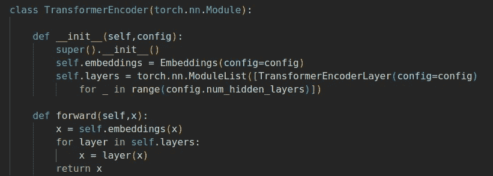

# 了解变压器—编码器

> 原文：<https://medium.com/mlearning-ai/understanding-transformers-encoder-1f269b1cc943?source=collection_archive---------2----------------------->

萨提亚·克里希南·苏雷什

变压器于 2017 年推出，此后，与变压器架构相关的高级模型数量激增，这些模型的使用真正增加了自然语言处理的重要性。变压器已经能够以最高的效率解决 NLP 的大多数常见任务，并且研究人员正在发现越来越多可以应用变压器的问题。有了这个介绍，我们来谈谈转换器架构，主要是架构的编码器部分。文章的代码在[这里](https://github.com/SathyaKrishnan1211/Low-key-ML/blob/master/Notebooks/transformers_encoder.ipynb)给出。

**转换器架构:**
转换器由一个编码器和一个解码器组成，最初是为机器翻译、问答等序列到序列任务而设计的。这里给出了[原变压器型号](https://arxiv.org/abs/1706.03762)的架构。

Transformer architecture

左边的整个灰色圆形框是编码器，同样，右边是解码器。编码器接收规则嵌入和位置嵌入之和的嵌入，并输出相同形状的张量，但是这些张量中编码了许多信息-上下文含义、词性、单词位置等。编码器输出的张量通常被称为*隐藏状态*。这些张量被馈送到解码器，它们根据它必须解决的任务和它的预训练目标来解码隐藏状态。

架构可能看起来很复杂，但是让我们一层一层地分解它，并自下而上地构建架构。

**嵌入** :
我们拥有的原始文本数据不能用于训练变压器模型，因为它们只理解数字。像标记化和一键编码这样的标准操作在早期使用过，但是它们都不能将文本中的信息完全编码到数字中。嵌入是第一个将可理解的信息编码到这些数字中的方法，或者正确的说法是向量。因此，不是将令牌传递给编码器，而是传递它的嵌入。但是一个主要的问题是编码关于单词在嵌入中的位置的信息。标准嵌入只是将每个标记映射到一个 n 维向量，但它从不编码位置信息。

为了编码记号的位置信息，可以使用另一种称为位置嵌入的嵌入。在位置嵌入中，我们输入每个句子的位置 id 或索引作为输入，而不是输入单词的标记。这使得位置嵌入层能够给出位置的有用表示。嵌入层的最终输出是通过将标记嵌入和位置嵌入相加并对结果应用归一化来生成的，因此没有巨大的值。下面给出了嵌入层的代码。

**自我关注** :
提供给编码器的嵌入是静态的，其中编码了一定量的信息。但是自我关注层考虑了一个句子或一组句子中的单词或标记的上下文，并且也将这些信息编码到它们各自的嵌入中。

将上下文编码到嵌入中是一项重要的任务，因为段落中的同音异义词将被映射到相同的嵌入中。例如，考虑一段包含术语“蝙蝠”的文章。文章中的 Bat 既可以表示哺乳动物的意思，也可以表示游戏者玩的棍子的意思，也可以两种意思都用。馈送到编码器的嵌入对于两种感觉将具有相同的嵌入值，但是我们不希望这样。当自我关注层完成传递给它的嵌入时，获得的嵌入将在其中编码它们的上下文。例如，“蝙蝠”将有更多的哺乳动物的感觉，而不是棍子的感觉，如果它被用于像“蝙蝠住在洞穴里”这样的段落中。

自我注意通过使用三个张量——**查询、键和值**——以及与这些张量相关的一些数学运算来对上下文进行编码。张量是通过使用传递给层的嵌入的可学习线性投影来生成的。这些张量的意义可以用一个简单的例子来理解。当你在谷歌搜索“无限战争”时，你输入的搜索文本被称为查询。谷歌的服务器会有类似查询的散列关键字，这些关键字与查询相匹配，以找到相似性得分。那些散列键是讨论中的键。最后，返回给用户的内容就是值。

在标准的注意机制中，查询来自解码器，而密钥、值对由编码器提供。但是在自我关注机制中，查询也来自编码器。查询和关键张量之间的矩阵乘法给出了一个记号(单词)与所有其他记号(单词)的相似性分数。由于矩阵乘法产生的值可能很大，因此 softmax 应用于得分矩阵，最后与值矩阵相乘以生成该层的输出。下面是 PyTorch 中注意力层的代码。

Self-attention code

**多头注意力** :
基本上，多头注意力是由若干个自我注意力单元组成的。这是因为每一个注意力焦点都会集中在文本的某个特定特征上。一个人可以专注于主语和动词的关系，另一个人可以专注于文章的时态等等。这类似于在单个卷积层中使用多个滤波器，正如我们从集成中了解到的，多个模型通常会产生良好的结果。

通常，在多头注意力中，最后一个维度(嵌入维度)在注意力头之间平均分割以实现可扩展性，注意力头的输出被连接，并且对这些输出应用线性变换以获得最终输出。应用线性变换，使得生成的输出将适合于随后被传递到的前馈层。这一层的代码如下所示。这里重要的一点是要注意头部维度，并将它们连接起来。

**前馈层:** 前馈层是由两个线性层组成的简单层，一个 GELU 层和一个 dropout 层。在这一层中，嵌入彼此独立地被处理，并且认为这是大部分信息存储发生的层。因此，每当变压器模型按比例放大时，通常前馈层是按比例放大最多的层。

**Transformer 编码器层:** 编码器层所需的所有层都已开发完成，现在只需将它们整合到一个模型中。但是，在盲目地遵循上面给出的架构图之前，我们应该考虑跳过层和规范化层的定位。

根据规范化图层的位置，有两种类型的规范化-图层后规范化和图层前规范化。在前一种类型中，在两个跳过连接之间应用层标准化，并且上面给出的原始架构遵循这种类型。在后一种类型中，在跳过连接的范围内应用层规范化(当您查看代码时，这一点就很清楚了)。现在使用的大多数架构遵循后者，因为在后层归一化中，权重和梯度发散，并且随后训练变得非常困难。下面给出的代码也遵循后一种类型的规范化。

**变压器编码器** :
我们拥有实现架构编码器部分所需的一切。首先，我们从给定的输入令牌生成嵌入，然后将这些嵌入传递给上面讨论的编码器层堆栈。代码也很简单，如下所示。

仅通过在编码器块的顶部添加合适的任务依赖体，该编码器层就可以用作许多任务的独立模型，如文本分类、屏蔽语言建模等。

**结论:**
编码器层的完整结构在本文中已经讨论过了。解码器层将在下一篇文章中讨论。我希望你读这篇文章的时候和我写的时候一样开心。

 [## Mlearning.ai 提交建议

### 如何成为 Mlearning.ai 上的作家

medium.com](/mlearning-ai/mlearning-ai-submission-suggestions-b51e2b130bfb)