# Python 中单变量、双变量和多变量数据分析

> 原文：<https://medium.com/mlearning-ai/univariate-bivariate-and-multivariate-data-analysis-in-python-341493c3d173?source=collection_archive---------0----------------------->

> 保持冷静，学会数据分析


Photo by [Myriam Jessier](https://unsplash.com/@mjessier?utm_source=medium&utm_medium=referral) on [Unsplash](https://unsplash.com?utm_source=medium&utm_medium=referral)

贝宝的联合创始人麦克斯·拉夫琴曾经说过- *“这个世界现在充斥着大量的数据，我们可以以更加清晰的方式来看待消费者。”*这句话如此简单却又如此意味深长。在互联网世界中，数据无处不在，在电子表格中，在社交媒体平台上，在电子商务网站上，等等。组织花费大量资源收集数据，并从分析收集的数据中获益。

简而言之，清理、转换、可视化和分析数据以获得有价值的见解从而做出更有效的商业决策的过程被称为**数据分析**。

在这篇文章中，我们将尝试研究数据分析技术，看看哪些技术可以用于什么样的变量。具体来说，我们将理解:

1.  **单变量、双变量和多变量数据分析**含义
2.  **单变量分析**为**连续变量和**分类变量
3.  **连续变量与连续变量、分类变量与分类变量的双变量分析**
4.  **数值-数值-分类变量的多变量分析**
5.  创建**权变**表**表**
6.  解释分析结果

那么让我们开始吧

为了理解数据分析中涉及的定义和步骤，我们将导入一个数据集，我们将在其上实现数据分析操作。

**导入库**

```
import numpy as np
import pandas as pd
import matplotlib.pyplot as plt
%matplotlib inline
import seaborn as sns
import math
```

**导入数据集**

这里，我们将使用 Kaggle 上的[信用卡审批](https://www.kaggle.com/datasets/samuelcortinhas/credit-card-approval-clean-data)。

```
card_approval_df=pd.read_csv(<PATH TO CSV FILE>)
print(card_approval_df.head())
```

*输出:*

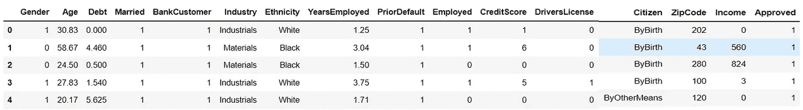

Head of the DataFrame having the card approval data

现在，让我们使用 dataframe 的 info 方法获得数据摘要。

```
print(card_approval_df.info())
```

*输出:*

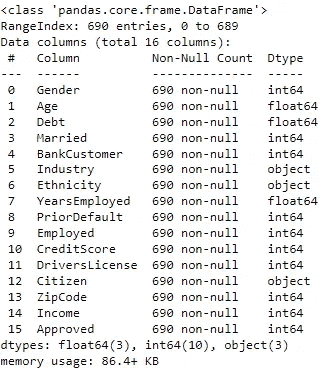

我们可以看到数据帧有 690 个条目和 16 列。同样，对于每一列，非空计数是 690，这意味着没有列包含空值。

此外，我们调用 pandas 数据帧的 duplicated 方法来查看是否有重复的行。

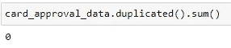

No duplicate rows

现在让我们来看看哪些列保存分类数据，哪些列保存连续数据

**列保存分类数据**:性别、已婚、银行客户、行业、道德、优先违约、就业、驾驶执照、公民、批准
、列保存连续数据:年龄、债务、就业年限、信用评分、收入

**注意**:我已经删除了 ZipCode 列，因为该列对分析没有帮助。

好吧！！！现在我们开始对数据集进行分析。我们将从单变量分析开始。

**单变量分析**是数据分析技术的最基本形式。当我们想了解仅由一个变量包含的数据，并且不想处理因果关系时，就使用单变量分析技术。

**连续变量的单变量分析**

首先，我们将对连续变量进行**单变量分析。我们将首先使用 describe 函数来获得连续变量的描述性统计数据。**

```
card_approval_data[[‘Age’,’Debt’,’YearsEmployed’,’CreditScore’,’Income’]].describe()
```

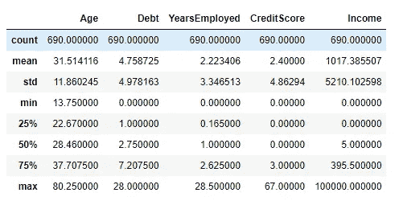

通过对所选列使用 describe 函数，我们获得了这些列的平均值、标准差、最小值、最大值、第 25 个百分点值、第 50 个百分点值和第 75 个百分点值。我们可以看到申请人的最小年龄是 13.75 岁。此外，YearsEmployed 列的最小值为 0。这说明没有任何工作经历的人也申请了信用卡。在其它连续柱中可以看到类似的观察结果。

现在，我们将绘制连续列的直方图，以查看列值的频率分布。

使用下面一行代码可以绘制出 ***年龄*** 列的直方图

```
sns.histplot(card_approval_data.Age,kde=True)
```

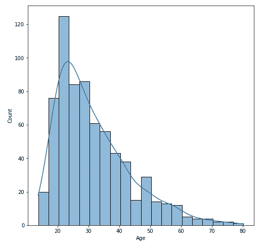

Histogram for the Age column

通过分析上面的情节，我们发现很少有人在过了 50 岁之后申请信用卡。此外，与其他群体相比，20-40 岁之间的人应用最多。这给我们提供了一个见解，人们倾向于在他们生命的早期申请信用卡。因此，信用卡发行公司可以瞄准 20-40 岁年龄组的人。

“使用年数”列的直方图如下所示。

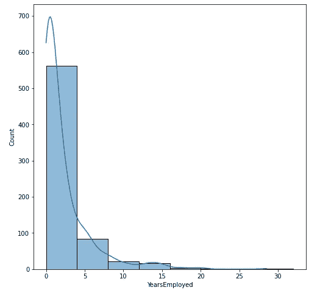

Frequency distribution for YearsEmployed Column

上面的柱状图表明，人们倾向于在职业生涯的早期申请信用卡。10 YOE 以上地区的频率较低，可能是因为人们在职业生涯的早期申请信用卡。因此，当他们有专业经验时，他们拥有信用卡(> 10 YOE)。因此，他们不需要在那个阶段申请卡。

现在我将开始分类变量的单变量分析。但是，您可以随意绘制其他连续列的直方图！！！

**分类变量的单变量分析**

首先我们将绘制分类图的计数图。

```
# plot count plot for the gender column
sns.countplot(card_approval_data.Gender)
```

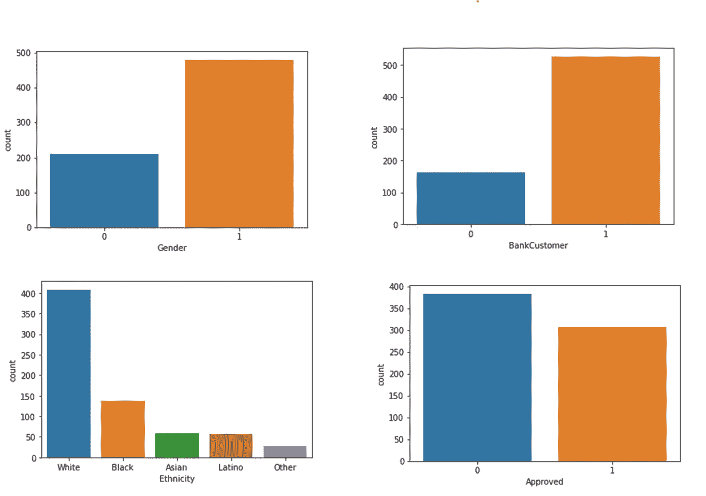

Count Plots of Some Categorical Features

***观察:***

1.  男性(性别-1)比女性(性别-0)申请的多。
2.  有银行账户的人比没有银行账户的人申请的多。这不足为奇。
3.  种族的趋势可能是由于数据收集的地区。
4.  大多数申请被拒绝，即不到 50%的申请被批准。

**双变量分析**

**双变量分析**比单变量分析更具分析性。当数据集包含两个变量并且研究人员的目标是在两个数据集之间进行比较时，双变量分析是正确的分析技术。

**连续变量的二元分析:**

在连续变量之间进行双变量分析的第一步是计算它们之间的相关性。使用 *corr* 函数构建相关矩阵。

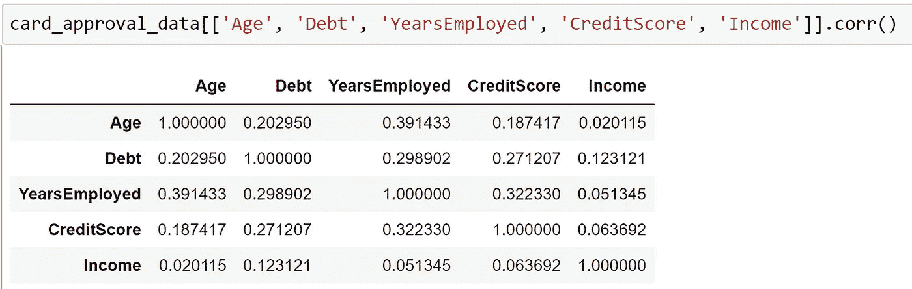

Correlation Matrix

虽然在这个数据集中，我们没有看到任何两个连续变量之间的任何强相关性，但在一些数据集中，连续变量可能是强相关的，并且一个变量的值可能依赖于其他变量。

我们也可以画出线图和散点图来观察两个连续变量之间的关系。

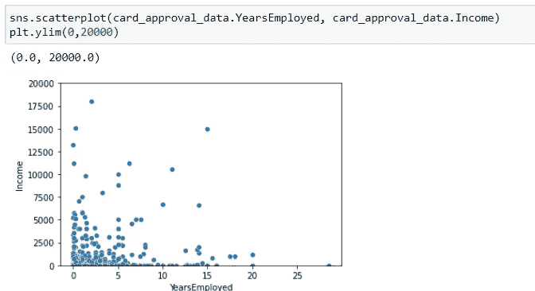

Scatter PLot

上面散点图中的点不遵循任何特定的模式。这可能是因为申请信用卡的人来自不同的职业，工资水平也不同。

**分类变量与连续变量的二元分析:**

现在，我们将尝试了解连续变量的值对于不同的分类变量的值是如何表现的。

我们将使用数据的*‘已批准’*列作为我们分析的分类变量。将“已批准”列与其他列进行比较，可以为我们提供一些有用的见解。

**GroupBy:** 首先，我们将对连续变量执行 **GroupBy** 操作。Groupby 允许我们将数据分成不同的组来执行计算，以便进行更好的分析。

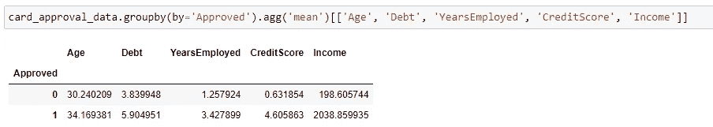

Group By operation on data

在上表中，我们可以看到得到批准的人的平均*信用评分*比没有得到批准的人多。对于 ***收入*** 和 ***年雇佣*** 列，观察到相同的模式。这是非常可以理解的，因为公司不会给信用评分低、收入低的人发信用卡。此外，公司更喜欢体面的就业历史来发行信用卡。

**带色调的 KDE 图:**核密度估计(KDE)图是一种可视化数据集中观察值分布的方法，类似于直方图。KDE 使用一维或多维的连续概率密度曲线来表示数据。

我们将绘制连续变量的 KDE 图，其色调为“批准”

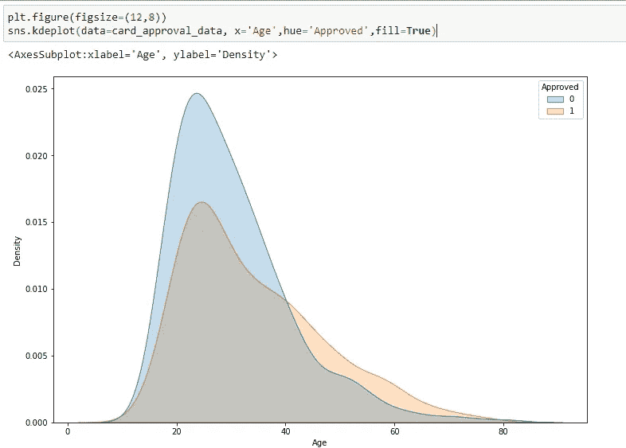

KDE Plot for ‘Age’ Column wiht Code to plot it

类似地，我们可以为 *CreditScore 和*years employeed 列绘制 KDE 图。

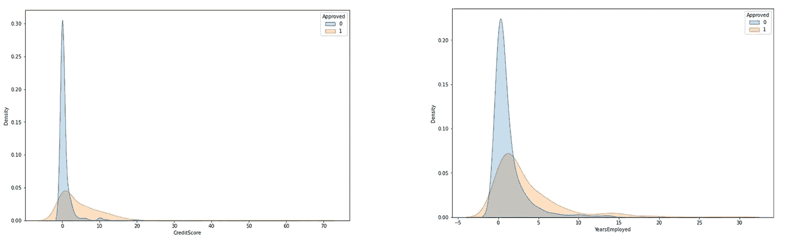

KDE Plots

在上面的图中，我们可以看到“*批准*和“*拒绝*的情况下变量的分布是如何分别表现的。

**分类变量与分类变量的二元分析:**

现在，我们将尝试了解分类变量之间的关系。同样，我们将保持' ***已批准的*** '列不变，并将它与其他列进行比较。

**带色调的计数图:**我们将绘制分类变量的计数图，色调=‘已批准’

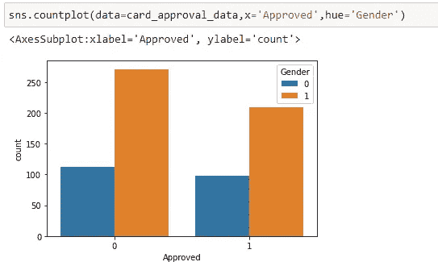

Gender Countplot with Hue

看上面的情节，似乎并没有把申请人的性别 作为审批申请的一个标准。

我们也可以绘制一个列联表来得到实际的数字

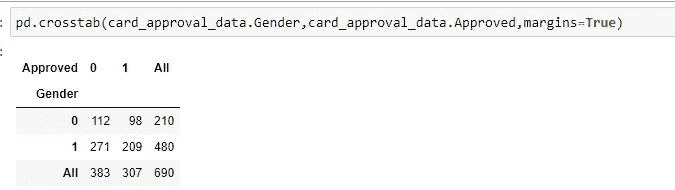

Contingency Table

要查看百分比，我们可以运行如下所示的代码

```
all=pd.crosstab(card_approval_data.Gender,card_approval_data.Approved,margins=True)[‘All’]
pd.crosstab(card_approval_data.Gender,card_approval_data.Approved).divide(all,axis=0).dropna()
```

这给出了:

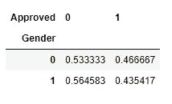

Percentages

在上表中，我们可以看到男女的接受率非常接近(53%接近 56.4%)。因此，似乎不存在任何性别歧视。

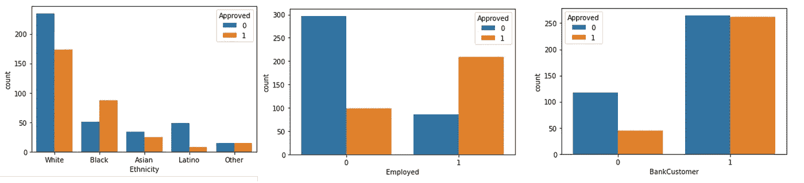

Count Plots with Hue

在上面三个图表中的第一个图表中，我们看到对于**‘拉丁裔’**种族，大多数申请都被拒绝。那么对他们有歧视吗？让我们试着找出答案。

首先，我们对数据进行分组操作。


Group By on continuous features

然后，我们使用***ethnic ity = Latino***过滤行，并取所需列值的平均值。

```
card_approval_data[card_approval_data.Ethnicity==’Latino’][[‘Age’,’Debt’,’YearsEmployed’,’CreditScore’,’Income’]].agg(‘mean’)
```

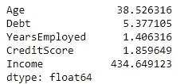

Aggregation

现在，如果我们将拉丁裔的平均信用分数(1.85)与所有被批准的申请的平均信用分数(4.60)进行比较，我们会发现拉丁裔的信用分数低于申请被批准的人群。同样的情况也可以在**收入**一栏中看到，拉美裔的平均收入为。收入为 434.64 英镑，其中批准的申请的平均收入为 434.64 英镑。收入 2000 以上。根据这一观察，我们可以说不太可能存在对拉丁裔群体的歧视。歧视他们？让我们试着找出答案。

**多元分析**

多元分析是一种更复杂的统计分析技术，当数据集中有两个以上的变量时使用。

这里，我们将尝试查看连续变量和'**批准的**'列之间的关系。为了做到这一点，我们将绘制一个配对图，色调为批准。

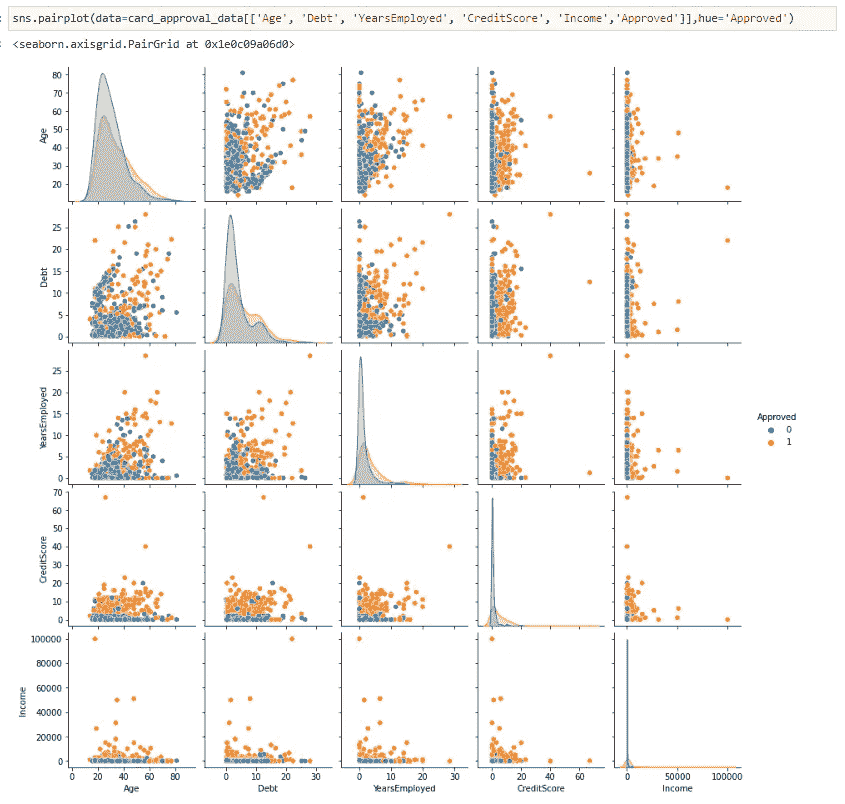

Pair Plot

我们在配对图中看不到任何模式。但是，这也可以用来查看两个连续的特征对于不同的类是如何表现的。

**结论**

在本文中，我们看了单变量、双变量和多变量分析的定义。我们还研究了在 python 中执行这种分析的一些方法。我们用一些图来确定变量之间的关系。我们也知道如何解释这种分析的结果。对于这篇文章来说足够了。下一篇文章再见！！！

[](/mlearning-ai/mlearning-ai-submission-suggestions-b51e2b130bfb) [## Mlearning.ai 提交建议

### 如何成为 Mlearning.ai 上的作家

medium.com](/mlearning-ai/mlearning-ai-submission-suggestions-b51e2b130bfb)