# 基于 FBProphet 的单变量时间序列预测

> 原文：<https://medium.com/mlearning-ai/univariate-time-series-forecasting-using-fbprophet-ad9ad68e59bc?source=collection_archive---------2----------------------->

今天，我们将讨论开发一个模型的最简单的方法，该模型将帮助我们使用脸书广泛提供的库(即 FBProphet)来预测单变量的时间序列。我觉得这是开发预测模型的最可靠和最简单的方法之一。看起来，这是最简单的方法之一，我们必须跟进一些我将在下面展示给你的过程。

在这篇特别的文章中，我们将尝试考虑一个具有年度趋势的数据集，我们将尝试在现有的数据集上训练我们的模型，然后预测未来日期的预测。让我向您展示样本数据集及其外观。

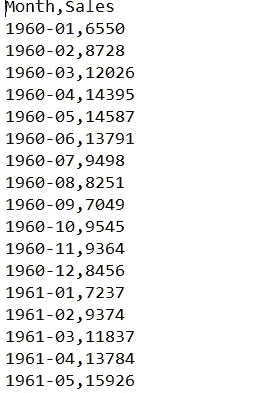

Top Head Data

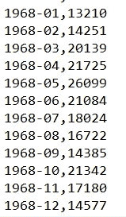

Tail Dataset

上述数据包含从 1960 年 1 月到 1968 年 12 月每个月发生的周期销售信息。我计划将数据集分为训练和测试数据集，我将尝试为 1960 年 1 月到 1967 年 12 月的数据集训练模型，并尝试预测 1968 年周期的销售值。这是因为它将帮助我将预测值与实际值进行比较，并了解我的模型是否工作正常。希望听起来不错。让我们深入研究编码，理解它是如何如此快速地实现的。

让我们尝试导入非常基本的模块:

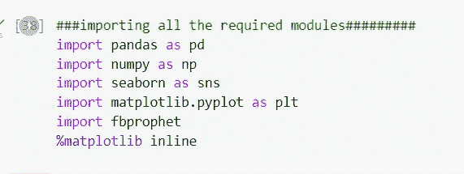

Importing the basic modules

读取 csv 并将数据集分成训练和测试数据集。由于我们的主要重点是学习 FBProphet 的实现，这就是为什么我选择了一个简单的数据集，在这里我不必处理数据集的清理和标准化。按照计划，96 条记录由 8 年的数据集组成，将用于训练我们的模型，该模型又将用于预测 1968 年的销售额。

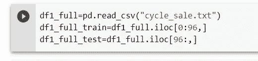

检查数据框的形状，并对其进行观察和感受。

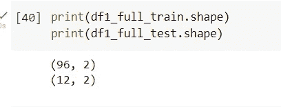

测试数据框的一瞥。

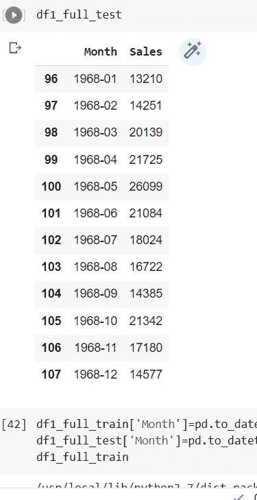

需要小心的重要一步。日期列必须转换为熊猫数据框中的日期时间。然后，日期列必须重命名为 ds，预测列可以重命名为 y。这是强制性的，如果您想使用 FBProphet 模型，必须遵循。

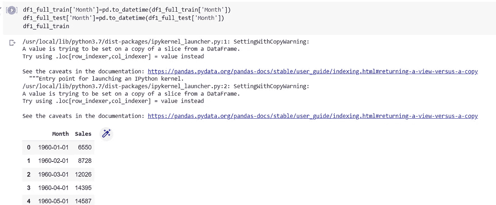

Ignore the warnings please :-)

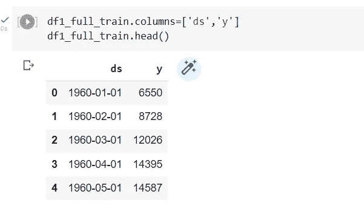

Renamed my column as discussed

为我们试图预测的值绘制图表，以了解季节性趋势。

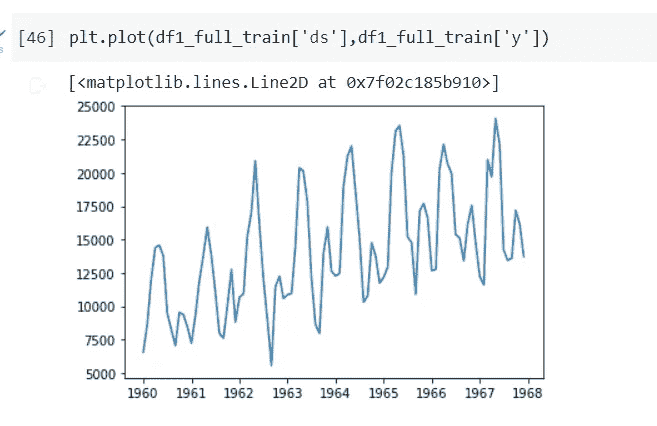

predicted with time value

从图表中我们可以看出，趋势是向上的，季节性在本质上是每年一次的。

让我们应用 FBProphet 模型，将年度趋势设为真。

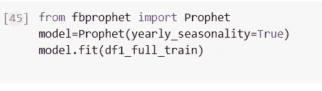

我们的模型已经训练好了，现在我们必须创建一个数据框，并在其上应用我们的模型。数据框必须仅包含列名为“ds”的预测日期。希望你得到它。

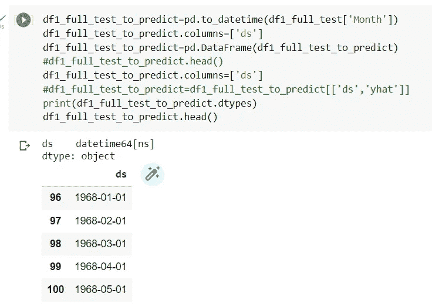

Looks Good the date columns were extracted for each month

使用相同的模型来预测新预测日期的销售额。这就是必须要做的事情:

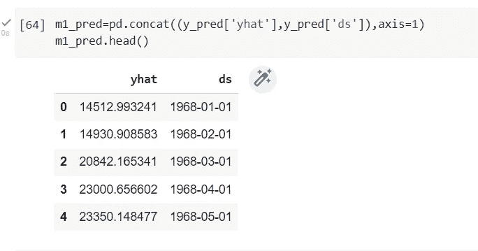

ds-represents the monthly values for year 1968, yhat-predicted values for sales

尝试合并两个不同的数据框架，这将有助于我们比较实际值和预测值。

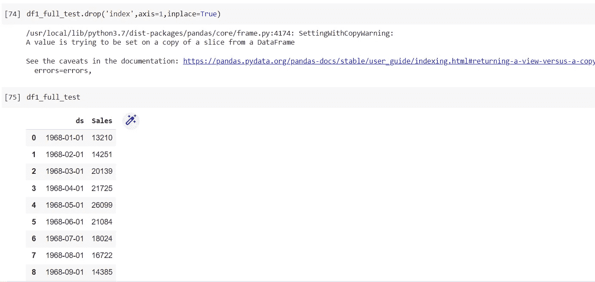

Actual Test Dataframe

尝试合并预测数据框和实际数据框，以并排检查它们对应的值。让我们来看看:

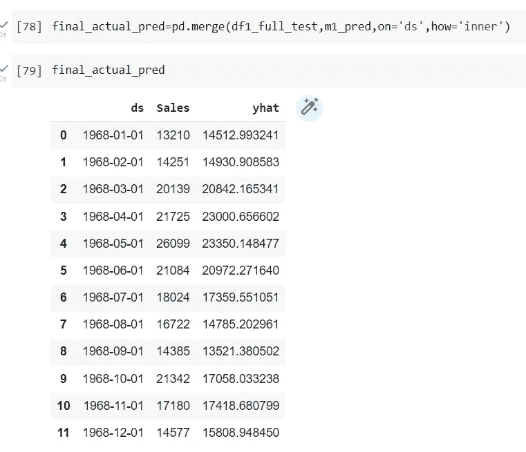

让我们想象一下 1968 年每个月的销售额。

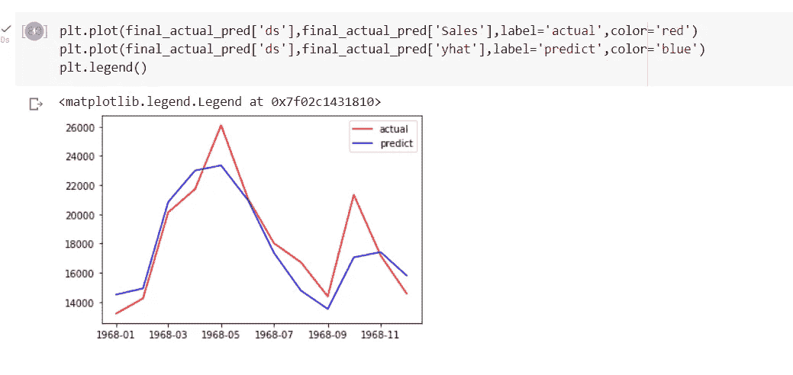

My blue follows Red very well except in few unexceptional spikes

希望，你喜欢我的博客使用 FB Prophet 软件包解决单变量时间序列问题。如果你想给我提供反馈，请在评论中提供。谢谢大家！！！

我将很快使用 FBProphet 发布多元时间序列预测。

 [## Mlearning.ai 提交建议

### 如何成为 Mlearning.ai 上的作家

medium.com](/mlearning-ai/mlearning-ai-submission-suggestions-b51e2b130bfb)