# 使用 RNN(LSTM)的单变量时间序列预测

> 原文：<https://medium.com/mlearning-ai/univariate-time-series-forecasting-using-rnn-lstm-32702bd5cf4?source=collection_archive---------0----------------------->

在这篇文章中，我们将讨论使用 LSTM 方法的单变量时间序列预测，这种方法在预测少数时间序列问题时似乎更准确。我的帖子也将帮助大家理解问题和模型实现的基础。

让我们从编码开始。

导入 python 的基本模块对训练数据集进行分析。

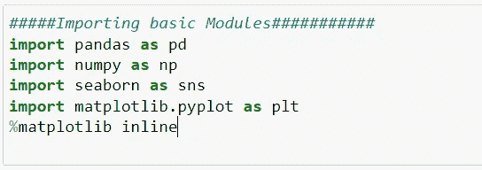

importing basic modules

有两个数据集训练数据集和测试数据集。我们必须在训练数据集上拟合我们的 LSTM 模型，然后尝试在测试数据集上预测股票价值。让我们来看一下测试数据集样本，它有 6 列，我们将只使用一列“ **Open** ”进行测试。下面的示例数据视图:

让我们尝试使用 python 来分析训练数据集上的数据趋势。

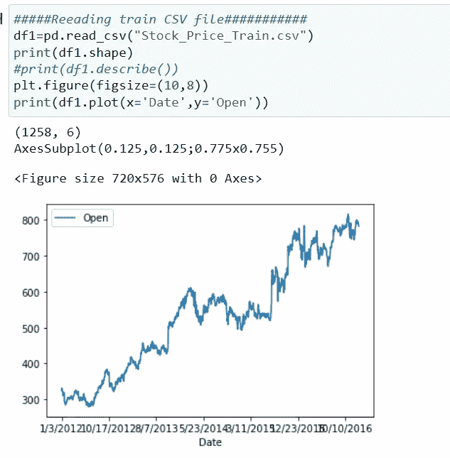

Trend : Price is going upward

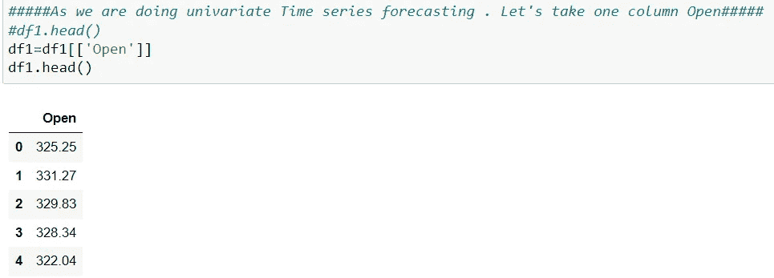

One column-Univariate Time Series

因为该列的分布类型不是高斯分布类型。因此我使用了最小最大缩放器。虽然我觉得 StandardScaler 也可以很好地工作。请尝试一下，让我知道它是否比这个更好。

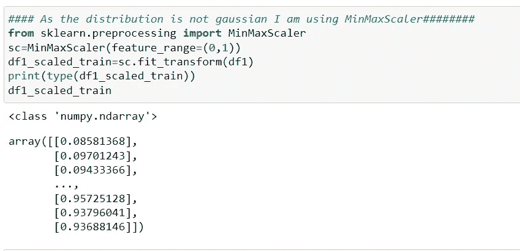

Feature Ranges from 0–1

下面是关于时间序列预测的最重要的部分。我们必须回顾股票价格以前的值，它可能以不同的方式跳跃，可能是 3，6，9，12，30，60，90 任何值。让我用一个简单的列表例子来解释它。让我们考虑下面的时间序列列表:

a1=[10，20，30，40，50，60]

在上面的例子中，如果我们试图看到前 3 个值，并试图预测下一个值，那么我们的数据集如下所示。

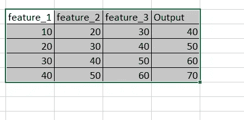

Seems quite easy right now

以编程方式应用以下内容:

Hopping is 60

total count reduced by 60(1258–60). Considering the last 3 months data as every month has 20 working days.

下面我们来看看 RNN-LSTM 模型:

从 Keras 导入必要的模块。

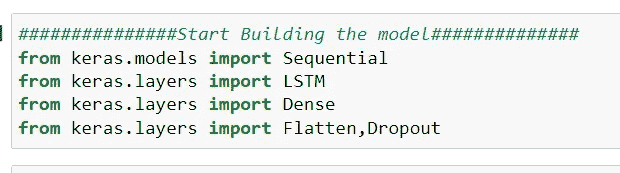

我已经创建了两个 LSTM 层，每个层有 50 个单位，并将它们与密集层连接起来。我还添加了 Dropout 层，使模型不会过拟合。我已经放弃了 20%的单位，以确保我的模型不会过度拟合。我还使用了 ADAM optimizer，因为我可以使用 RMSPROP 或任何其他优化器。请尝试与其他优化，让我知道结果。

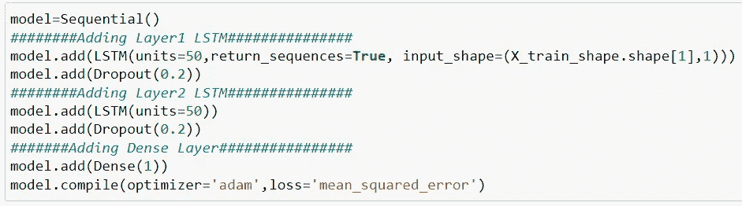

让我们在训练数据集上拟合模型，并让模型被训练并熟悉数据集。你可以看到，经过 75 个周期后，MSE 误差没有进一步减小。希望我们的重量调整正确，模型训练完美。

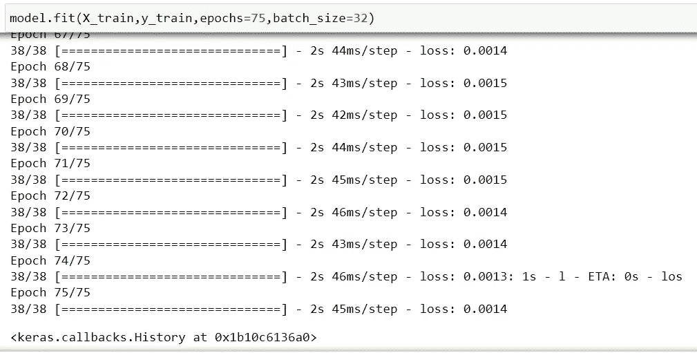

**现在该准备测试数据集并尝试预测相同的值了。**

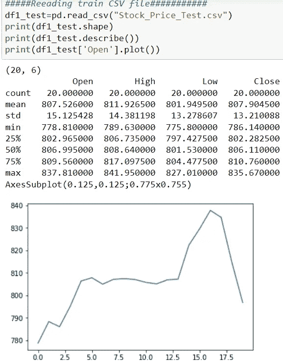

请确保应用缩放转换并重塑测试数据集。这是因为我们在训练数据集上做了同样的事情。

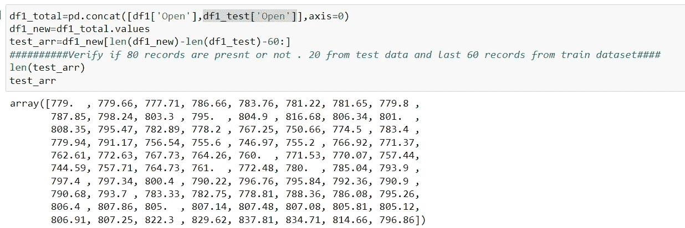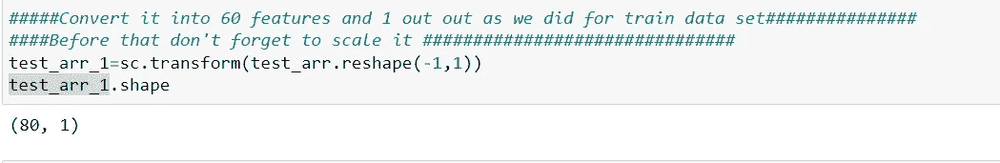

希望您理解我们为什么从训练数据集中提取最后 60 条记录，因为我们试图收集前几天的 60 个不同值，并试图预测下一个值。

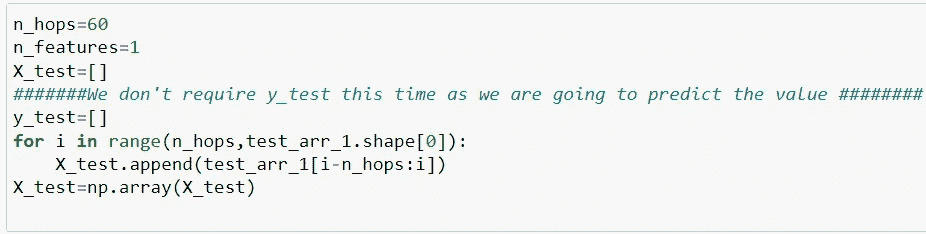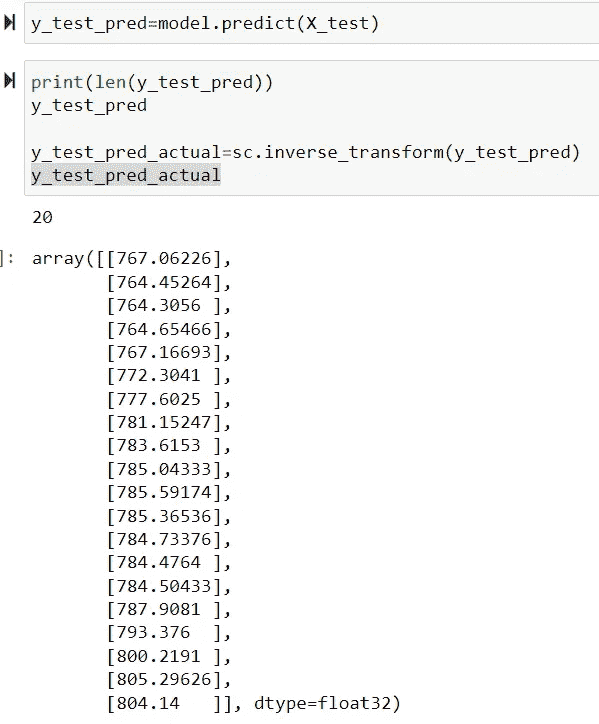

将两个值连接成一个数据帧。

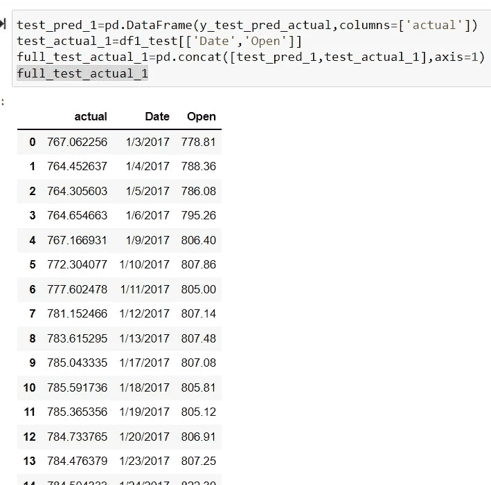

在图表上绘制预测值和实际值。当我研究它时，我发现结果相当不错。它能够识别实际图表中的下降和增长，并能够跟踪趋势。

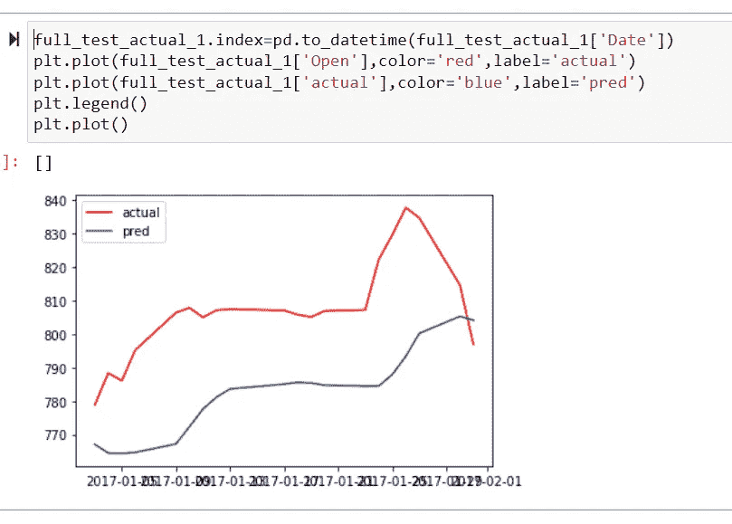

Trend is captured in prediction

我觉得现在你必须清楚如何使用 LSTM 进行单变量时间序列预测。如有任何疑问，请随时在下面评论。我将很快提出下一个帖子，我们将尝试使用 LSTM 模型进行多元预测。快乐深度学习。

 [## Mlearning.ai 提交建议

### 如何成为 Mlearning.ai 上的作家

medium.com](/mlearning-ai/mlearning-ai-submission-suggestions-b51e2b130bfb)