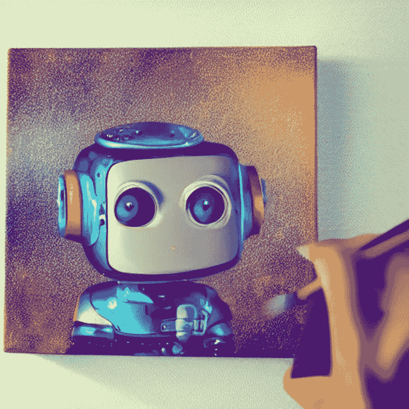
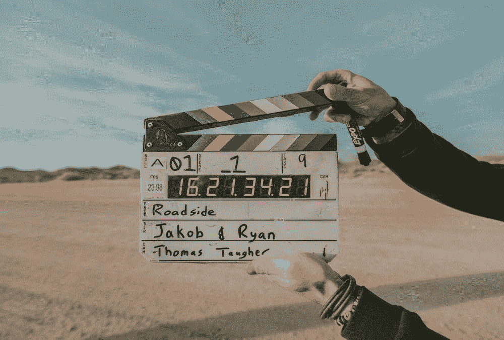
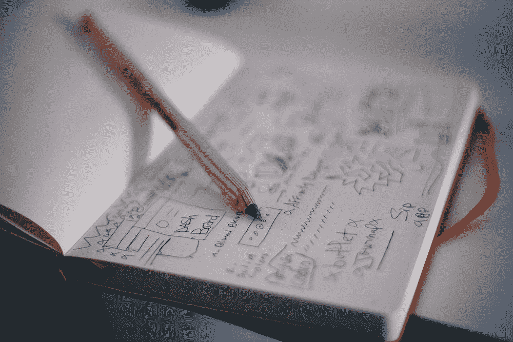
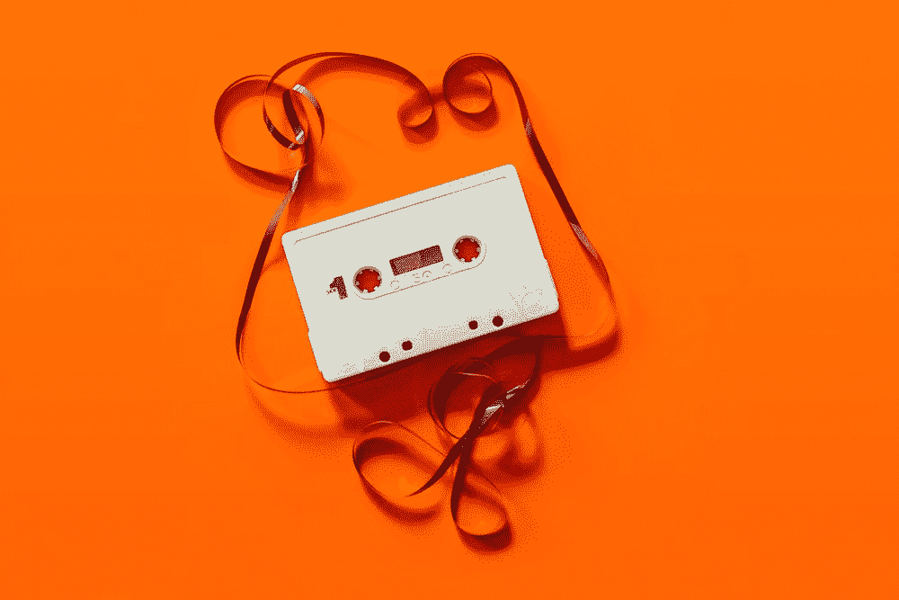
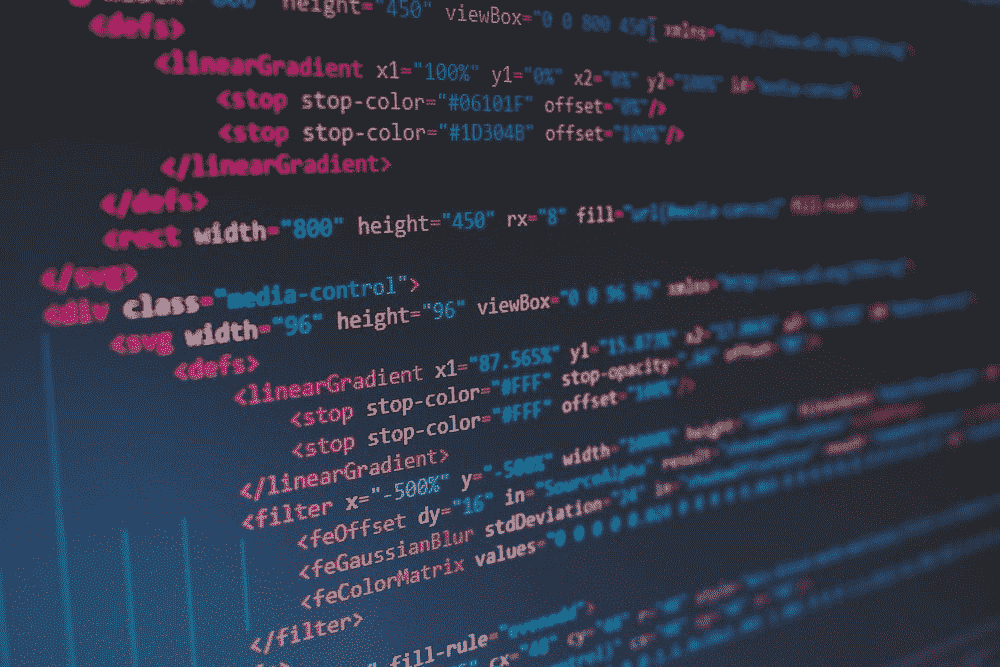

# 释放生成人工智能的力量:最终列表

> 原文：<https://medium.com/mlearning-ai/unleashing-the-power-of-generative-ai-the-definitive-list-13988d422c16?source=collection_archive---------2----------------------->

探索人工智能技术的最新进展，以及它们如何让你受益

image created by the author using stable diffusion

生殖人工智能是一个快速发展的领域，有可能彻底改变企业的运营方式。通过利用机器学习算法的力量，生成式人工智能可以自动化和优化广泛的任务，从数据生成和分析到内容创建等等。在本文中，我们将探索不同场景的服务和模型

# **文本到图像**

image by [Daria Tumanova](https://unsplash.com/@tumanova_photo) at unsplash.com

OpenAI DALL-E 向世界展示了人工智能可以通过文本生成图像。简而言之，你可以给人工智能模型提供一个文本提示，它会以你喜欢的风格生成图像。从那时起，稳定扩散开始出现，现在有许多基于它的应用。这里我给出了一个服务列表，您可以在其中从文本生成图像。查看[吉姆克莱德蒙奇](https://medium.com/u/819323b399ac?source=post_page-----13988d422c16--------------------------------)关于如何在你的个人电脑上运行稳定扩散的教程。

[**DALL-E**](https://openai.com/dall-e-2/) 是第一个展示如何通过文本生成图像的模型。现在，你也可以用它来改变和编辑图像。您拥有商业权利，您可以获得免费的信用来尝试，然后您可以为生成或编辑的每个图像使用信用(15 美元 15 个信用)。

[**starry . ai**](https://www.starryai.com/)**是一项免费服务，可以让你创作艺术品。该服务授予您所有权。**

**[**蜡笔**](https://www.craiyon.com/) 是一个从文本生成图像的免费服务(虽然不是生成更大图像的最佳选择)**

**[**NightCafe**](https://nightcafe.studio/)**是一个允许你生成图像的服务(允许一些定制为不同的风格和分辨率。免费代是有限的，然后你需要订阅。****

****[**art breader**](https://www.artbreeder.com/)**是一个允许你生成图像、创建拼贴画和操作图像的服务。你可以免费试用，但需要订阅。******

******[**wombo.ai**](https://dream.ai/create) 是一项免费服务，允许你创建不同风格的图像(大约 40 种不同的可能性)。******

****[**mid journey**](https://midjourney.com/)**是一个允许你通过 Discord 服务器生成图像的服务(允许定制)。他们提供一些免费图片供测试，但之后你必须选择一个订阅计划。******

****** [## 融合人工智能的力量和诗歌的细腻

### 人工智能现在能够从文本中生成图像，如果我们给它们提供伟大诗人的话语会怎么样？梦幻之旅…

towardsdatascience.com](https://towardsdatascience.com/blending-the-power-of-ai-with-the-delicacy-of-poetry-3671f82d2e1)  [## 艾重新想象世界上最美丽的 20 个词

### 无法翻译的单词怎么翻译？

medium.com](/mlearning-ai/ai-reimagines-the-worlds-20-most-beautiful-words-cd07090ea59b) 

# **文本转视频**

image by [Jakob Owens](https://unsplash.com/@jakobowens1)

这个领域正在快速发展，以前你只能从文本提示中获取图像，现在不同的模型和服务允许你从文本中生成视频。此外，人工智能还可以帮助编辑你的视频，加快过程。

[**synth ESIA**](https://www.synthesia.io/)**是一项允许你从文本生成视频的服务，允许定制和 60 多种语言的服务(该服务是免费的，但如果你想定制，你需要按月付费)。**

**[**lumen 5**](https://lumen5.com/)**是一款基于演示文稿创建视频的工具，允许你也进行一些定制(免费但分辨率有限，否则包月)。****

****[**flix clip**](https://www.flexclip.com/)**是一款支持视频创作(编辑、添加文件和翻译、背景修改)的 AI 工具。你可以免费做 12 个项目，然后你必须订阅。******

******[**Elai**](https://elai.io/)**是一款文字转视频的工具，可以让你将一篇博文转换成视频。********

******[**veed . io**](https://www.veed.io/)**是一个视频生成器，也允许编辑(背景情感、添加翻译等等)。这是免费的高达 250 MB 的上传，否则每月订阅********

****** [## Meta 的新模型可以将文本提示转化为视频

### 制作视频——生成艺术的新突破

medium.com](/geekculture/metas-new-model-can-turn-text-prompt-into-videos-b6dadb94ab3b) 

# **设计发电机**

image by [Med Badr Chemmaoui](https://unsplash.com/@medbadrc)

生成式人工智能不仅限于图像和视频，还可以在创作过程的各个方面提供帮助。无论你是需要为你的网站找到合适的调色板，还是需要从头开始创建网站，你都有一个人工智能来帮助你。

[**Khroma**](http://khroma.co/) 是一项免费服务，可以让你创建自己的个性化调色板。

[**Uizard**](https://uizard.io/) 是一项让你画草图的服务，它帮助你为网站、手机应用和登陆页面进行设计。三个项目免费，然后每月计划。

[**Colormind**](http://colormind.io/)**是另一款免费工具，可以让你创建自己的个性化调色板**

******是一个生成 logos 和横幅的服务。该服务为您提供模板、编辑和定制(30 天免费试用，然后每月收费 29 美元)。******

******[**Fronty AI**](https://fronty.com/)**是一款创建网站的工具，它针对移动设备和 SEO 索引进行了优化(有限的免费服务但你可以升级到一个月的 pro 包)。********

# ********文本到音频********

************

******image by [C D-X](https://unsplash.com/@cdx2)******

******文本到音频 AI 生成是一种使用自然语言处理和机器学习算法将书面文本转换为口语单词的技术。这项技术有着广泛的应用，包括使视觉障碍者更容易获得书面内容，创建书籍和文章的音频版本，以及使虚拟助理和聊天机器人能够用自然的声音说话。******

******[**复刻**](https://replicastudios.com/) 是一个将文本转换为语音的服务(可以选择不同的 AI 生成的语音)。这项服务最多 30 分钟是免费的，然后你要按次付费******

********speech ify 是另一种文本到语音的服务，它也提供编辑的可能性(免费生成有限数量的语音，然后按月订阅)。********

******[**Murf**](https://murf.ai/) 是另一个文本到语音转换服务，允许你生成不同的声音并编辑它们(你可以选择上下文，改变速度，等等)。你拥有商业权利(免费获取有限数量的生成语音，然后按月订阅)。******

****[**play . ht**](https://play.ht/)**是另一种文本到语音转换服务，可以让你生成不同的语音(100 多种语言)。免费获取有限数量的生成语音，然后按月订阅******

******[**Lovo . ai**](https://www.lovo.ai/)**是另一个文本到语音的服务，可以让你生成不同的声音并进行编辑(情绪等等)。限量免费下载，然后按月订阅********

****** [## 谷歌的 Audiolm:通过听一首歌的片段来产生音乐

### 无论是音乐还是语音，谷歌的新模式都可以继续播放所听到的内容。

pub.towardsai.net](https://pub.towardsai.net/googles-audiolm-generating-music-by-hearing-a-song-s-snippet-c9512a9290cd) 

# **音乐生成器**

image by [Daniel Schludi](https://unsplash.com/@schluditsch)

音乐 AI 生成是一种使用机器学习算法创作原创音乐的技术。通过利用音乐人工智能生成的力量，企业可以为各种目的生成独特的高质量音乐，例如视频的背景音乐，游戏和应用程序的配乐，以及流媒体服务的个性化播放列表。此外，这些服务中有许多专注于创作免版税的音乐。

****是一个生成不同风格音乐的服务。您拥有生成内容的版权(免费限量生成，更多内容按月订阅)****

****[**Amper AI**](https://www.ampermusic.com/)**是另一个生成不同流派音乐的服务(可以选择乐器，用长度和其他参数演奏)。您只拥有付费版本中生成内容的版权。******

******[**点唱机**](https://openai.com/blog/jukebox/) 是另一个生成不同流派音乐的服务(也可以生成歌词)。您只拥有付费版本中生成内容的版权。您需要联系供应商获取免费或付费许可证。******

****[**Soundraw**](https://soundraw.io/) 是另一项生成不同流派音乐的服务(你可以免费试用，但需要按月订阅)。****

****[**唤起**](https://evokemusic.ai/music) 是另一种生成不同流派音乐的服务(你有 14 天的免费试用期，但之后要包月)。****

**** [## 用人工智能生成钢琴盖

### 一个新的模型从一首流行歌曲中生成了一个钢琴封面:它是如何工作的？你如何能尝试它？

medium.com](/mlearning-ai/generate-a-piano-cover-with-ai-f4178bc9cb30)  [## 微软的 Museformer:人工智能音乐是新的前沿

### AI 艺术正在爆发，音乐可以是下一个。

medium.com](/mlearning-ai/microsofts-museformer-ai-music-is-the-new-frontier-8dc5cb24459c) 

# **文本生成器**

image by [Patrick Fore](https://unsplash.com/@patrickian4) at unsplash.com

GPT3 已经席卷了内容写作世界，并为其未来积聚了一片乌云。AI 写作模型可以在几秒钟内生成文章。不要害怕他们，他们正在取代你的工作，但是现在他们只是你的助手。

[**Frase Io**](https://www.frase.io/)**是一个文本生成器工具，用于创建标题、标语、文章和产品描述(没有免费试用，只提供 5 天 1 美元的服务)**

**[**pepper type**](https://www.peppertype.ai/)**是一个文本生成器服务，用于创建文章、电子邮件和产品描述(报价模板)。你可以免费试用，然后按月订阅。****

****[**Rytr**](https://rytr.me/)**是一个文本生成器服务，用于创建文章、博客帖子和产品描述(针对 SEO 索引进行了优化)。你有一个免费版本(高达 10 k 字符/月)，然后按月订阅。******

******Jasper 是一个用来写博客文章等的文本助手，它还提供模板和协作，并且有 20 种语言版本。您可以免费试用(5 天)，然后按月订阅。******

****[**copy . ai**](https://www.copy.ai/)**是一款写博客等内容的文本助手，它还提供模板和协作功能，有 25 种语言版本。你可以免费试用(2 字 000)，然后按月订阅(专业版每月 40k)。******

******[**ChatGPT**](https://openai.com/blog/chatgpt/) 是一个聊天机器人(使用 GPT 3.5 作为引擎)，可以用来写代码、博客、s 和文章。目前免费，但可能很快就会按使用付费。******

**** [## 人工智能可以成为数据科学家吗？

### OpenAI 的 ChatGPT 让数据科学家们大吃一惊。它会偷走他们的工作吗？

medium.com](/mlearning-ai/can-an-ai-be-a-data-scientist-2d4d9b6c5d5)  [## 不能承受的被聊天之轻

### 与时下最受关注的聊天机器人进行伦理讨论

medium.com](/mlearning-ai/the-unbearable-lightness-of-being-chatgpt-95a4d9b48ed1) 

# **编码生成器**

image by [Florian Olivo](https://unsplash.com/@florianolv)

GitHub Copilot 正面临程序员们的诉讼。虽然编码助理在不久的将来不会取代数据科学家和程序员，但他们可以帮助完成代码和发现错误。

[**tab nine**](https://www.tabnine.com/)**是一个代码助手，提供代码补全(它也学习用户代码模式)。您可以免费试用(14 天)，然后按月订阅。**

**[**K-Explorer**](https://k-explorer.com/)**是一个代码助手，提供代码补全(也提供建议)。您需要联系供应商获取免费或付费许可证。****

****[**py charm**](https://www.jetbrains.com/pycharm/features/coding_assistance.html)**是一款提供代码补全、代码修正、自动化重构的代码助手。有免费版和每月专业版。******

******[**Kite**](https://www.kite.com/blog/product/kite-is-saying-farewell/)**是一款提供代码补全的代码助手，它还提供建议，有不同语言版本。它是免费的。********

******[**open ai Codex**](https://openai.com/blog/openai-codex/)**是一款将自然语言翻译成代码的代码助手。您需要联系供应商获取免费或付费许可证。********

******[**GitHub Copilot**](https://github.com/features/copilot)**是一款提供代码补全的代码助手，它还提供建议。这是 VS 代码扩展，你需要一个月订阅********

********N.B.** 我将来会在这个列表中添加新的服务，我计划在 GitHub 存储库中收集这些和其他信息。******

# ****如果你觉得有趣:****

****你可以寻找我的其他文章，你也可以 [**订阅**](https://salvatore-raieli.medium.com/subscribe) 在我发表文章时得到通知，你也可以在**[**LinkedIn**](https://www.linkedin.com/in/salvatore-raieli/)**上连接或联系我。**感谢您的支持！******

****这是我的 GitHub 知识库的链接，我计划在这里收集代码和许多与机器学习、人工智能等相关的资源。****

**** [## GitHub - SalvatoreRa/tutorial:关于机器学习、人工智能、数据科学的教程…

### 关于机器学习、人工智能、数据科学的教程，包括数学解释和可重复使用的代码(python…

github.com](https://github.com/SalvatoreRa/tutorial)  [## Mlearning.ai 提交建议

### 如何成为 Mlearning.ai 上的作家

medium.com](/mlearning-ai/mlearning-ai-submission-suggestions-b51e2b130bfb)******************************