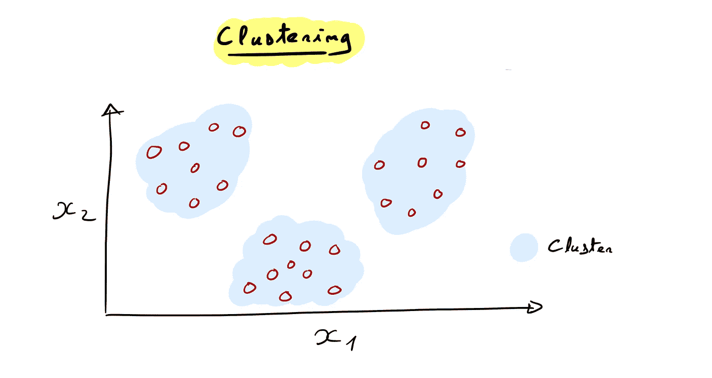
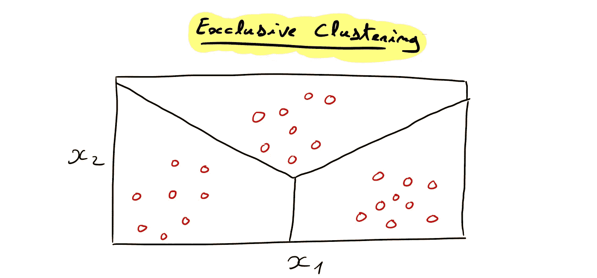
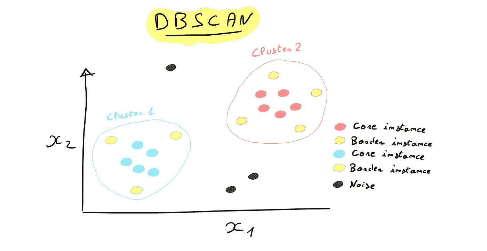
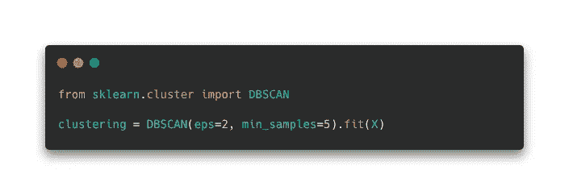
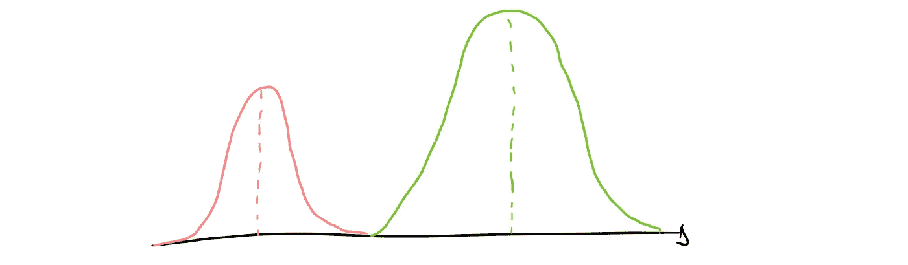
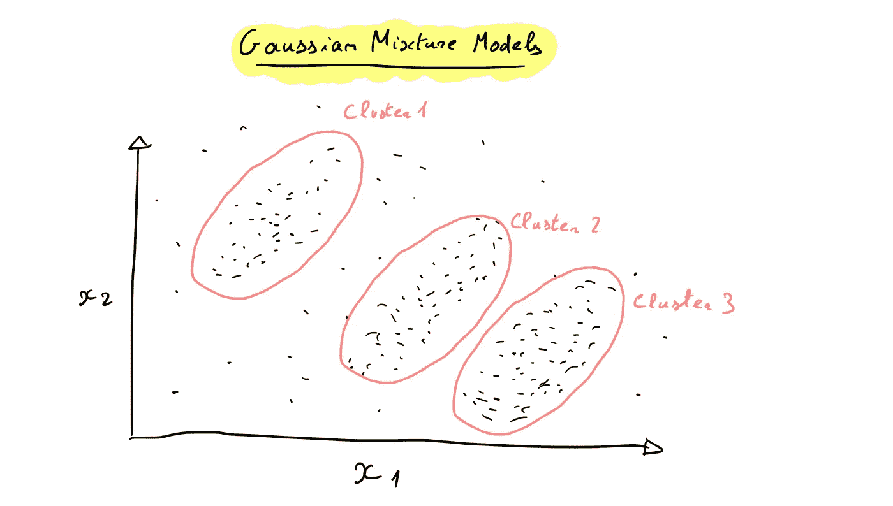
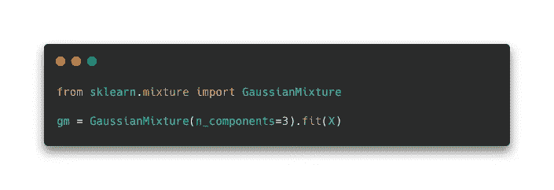

# 无监督学习——让算法自己去发现

> 原文：<https://medium.com/mlearning-ai/unsupervised-learning-let-the-algorithm-find-by-itself-8ef0628dac9?source=collection_archive---------9----------------------->

在本文中，我将讨论**无监督学习**的重要性及其实用性，并强调主导该领域的方法和算法。

Photo by [Maria](https://unsplash.com/@mariashanina?utm_source=medium&utm_medium=referral) on [Unsplash](https://unsplash.com?utm_source=medium&utm_medium=referral)

引入**无监督** **学习**总是比引入**有监督学习**更容易。实际上，它们都使用机器来训练基于算法的模型，然而，在监督学习的情况下，这些机器是被引导的。正如我在最近的一些文章中所说的那样([众所周知的回归](/mlearning-ai/the-well-known-regression-what-is-it-6dbe5e0b2cd1)——它是什么？或[在不到 5 分钟的时间内理解分类问题](/mlearning-ai/understand-classification-problems-in-less-than-5-minutes-712244d259c8))，训练模型执行监督学习任务在于给出机器示例(输入和输出变量)并告诉它从这些示例中学习。然后，将通过最小化成本/损失函数来优化模型，该函数最能描述预测中的误差。

无监督学习不使用任何目标，因为这不是那种机器学习的目的。相反，该模型将再次基于一种算法，试图理解输入变量，但没有****输出**变量。它将基本上**创建** **组**，这些组由**相似的** **观察**组成。其想法是更好地理解数据集，并使用机器来识别观察结果之间的区别。**

**让我们看看无监督学习的一些具体用例:**

*   ****客户细分**是应用无监督学习的经典用例之一。该模型将从描述客户特征的所有示例中学习，并创建收集相似客户的组(集群)。目标是更好地了解想在商店购买产品或服务的人，并为他们提供最好的体验，以便他们购买和消费。**
*   ****异常** **检测**是一个用例，其中的想法并不是真正找到聚类，而是找到倾向于与其他聚类隔离的观察。为了发现这些异常，该模型创建聚类，并将这些聚类中没有发现的太远的观测值声明为异常。最著名的用例是银行业中的欺诈检测。**
*   ****降维** **降维**，正如我在上一篇文章([降维——对抗你的模型复杂性](/mlearning-ai/dimensionality-reduction-fight-your-model-complexity-b80143b60b48))中谈到的，可以利用聚类，主成分分析(PCA)显然就是这种情况。**
*   ****数据** **分析**也在使用无监督学习，因为数据可以在新的组中进行总结，然后用另一种视觉进行分析。**

**现在我们清楚地看到了无监督学习是什么，让我们谈谈主要的方法和算法…**

# **方法和算法**

**存在不同的方法来分离数据集或识别可以对立的结构，让我们看看一些最重要的方法；**

## **排他和重叠聚类的 k-均值**

**首先，**聚类**是一种倾向于在不同特征的不同组中收集数据观察值的技术。如果您在二维空间上表示数据集，您可以看到**簇**:**

****

****排他**或**非** **重叠** **聚类**是一种倾向于将每个数据点与单个组相关联的聚类技术。下图是一个带有线性决策边界的 **Voronoi 图**:**

****

****K-Means** 算法是应用最广泛的无监督算法之一，因为它的性能和易于解释。事实上，K-Means 旨在找到 K 个聚类的质心或中面，并将每个数据点分配给它们。这通常通过排他聚类来完成，也称为**硬** **聚类**，但是**软** **聚类**也是可能的(数据点将根据属于一个组的概率和分数的相似性被分成几个组)。**

**它是如何工作的？**

**k-表示进行 **3 步**:**

1.  **质心的随机初始化**
2.  **将每个数据点分配到聚类中(基于质心)，并计算聚类中所有观察值与质心的平均距离。**
3.  **根据之前计算的平均距离更新质心作为新质心。**

**这些步骤一直进行到形心不再移动为止。**

**K-Means 有**一些限制**:**

*   **它需要多次迭代。**
*   **知道潜在聚类的数量。**
*   **它不能很好地处理复杂的数据结构(非线性决策边界)。**

**如果您想尝试 K-Means， **Scikit-Learn** 在其库中提供了一个实现:**

****

**它有很多超参数，可以大大提高模型性能，找到更好的聚类(这里的 doc 是[这里的](https://scikit-learn.org/stable/modules/generated/sklearn.cluster.KMeans.html))。**

## **基于密度聚类的 DBSCAN**

****基于密度的聚类**假设聚类以其密度而非质心为特征。其思想是，聚类是由附近的数据观察形成的，而不是像 K-Means 那样由决策边界分隔。**

****DBSCAN** (基于密度的带噪声应用聚类)是该方法背后的通用算法。**

**它是如何工作的？**

1.  **计算各点之间的距离: **ε** 。这个距离是固定的，因此一个数据点可以基于ε在其周围有最大的观察值。**
2.  **如果一个数据点周围的观察计数在一个固定数以上，则意味着这个点是一个**核心** **实例**(被许多其他数据点包围)。与核心实例相关联的所有点形成唯一的集群。**
3.  **核心实例也可以是其他核心实例的数据点，因此，核心实例的所有数据点一起形成一个唯一的(更大的)集群。**

**所有聚类被低密度区域分隔开，不在聚类中的数据点是异常值或噪声。**

****

**DBSCAN 也可以在 **Scikit-Learn** 中获得:**

****

## **概率聚类的高斯混合模型**

****概率** **聚类**是另一种聚类和无监督学习的方法，它在基于组的基础上寻找数据点；**

> **关于他们属于特定分布的**可能性**([无监督学习——IBM](https://www.ibm.com/cloud/learn/unsupervised-learning))。**

**概率聚类**支持的主要算法，高斯混合模型**，是一种假设数据点遵循各种高斯分布的技术。每个星团都呈椭圆形。**

> **GMM 是一种无监督聚类技术，它基于使用期望最大化的概率密度估计来形成椭圆形聚类。伊娃·帕特尔**

**高斯分布关于平均值对称，它们的形状由平均值和标准差描述:**

****

****GMMs** 和 **K-Means** 之间的一个很大的区别是，GMMs 给出了关于簇的大小、形状和方向的信息，这与 K-Means 的情况不同(不使用协方差矩阵)。**

**为了能够创建聚类，GMM 可以使用期望最大化(EM ),该期望最大化基于初始化的权重给出数据点属于聚类的估计概率。**

****

**当 GMMs 对所有分布采用单一协方差类型时，效果最好，速度最快。这意味着每个星团都有相同的形状和大小。**

**与其他模型一样，高斯混合模型在 **Scikit-Learn** 中可用:**

****

## **无监督学习的其他方法**

**无监督学习还有其他技术，我们来看看。**

*   ****层次聚类:**通过聚集(凝聚聚类)或分割(分割聚类)找到聚类。第一种方法将每个数据点视为一个唯一的聚类，并根据它们之间的关系合并它们，最终得到更大的聚类。相反，分裂聚类从一个唯一的聚类(所有数据点)开始，并根据观察值之间的差异将其分开(就像决策树一样)。**
*   ****关联规则:**这种技术基本上是通过数据点的相似性(例如 2 个客户)来比较数据点，并承认对于接近的数据点，一个数据点的特征也表征另一个数据点的特征(特别用于推荐系统)。Apriori 是关联规则的主要算法。**

# **结论**

****无监督学习**是机器学习的一个分支，用于获得关于所有类型数据集的见解。它还可用于数据集缺少标注的半监督问题。
存在许多方法，每种方法都有其优点和缺点。**自动编码器**是一种新的编码器，它正在彻底改变这个领域，因为它是基于神经网络的力量。**

**感谢你学习文章，希望你学到了一些关于无监督学习的趣事！**

## **资源**

** [## 什么是无监督学习？

### 了解无监督学习如何工作，以及如何使用它来探索和聚类数据

www.ibm.com](https://www.ibm.com/cloud/learn/unsupervised-learning)  [## 基于层次和密度的聚类

### K-Means 是一个伟大的算法，对于某些特定的情况下，依赖于距离质心的距离作为一个定义…

ryanwingate.com](https://ryanwingate.com/intro-to-machine-learning/unsupervised/hierarchical-and-density-based-clustering/)  [## 集群云工作负载:K 均值与高斯混合模型

### 由于大数据、物联网和业务数据分析等多样化的云工作负载而导致的日益增长的异构性，需要…

reader.elsevier.com](https://reader.elsevier.com/reader/sd/pii/S1877050920309820?token=CF46A69AAD80C153FD85E5876FB3C32EC09F96C9D92F67A1EC86949F356D6A80F547CEF82063513C7EA0F234BA9C90CF&originRegion=eu-west-1&originCreation=20220710075052)  [## 使用 Scikit-Learn、Keras 和 TensorFlow 进行机器实践学习，第二版

### 通过最近的一系列突破，深度学习推动了整个机器学习领域。现在，甚至…

www.oreilly.com](https://www.oreilly.com/library/view/hands-on-machine-learning/9781492032632/)  [## Mlearning.ai 提交建议

### 如何成为 Mlearning.ai 上的作家

medium.com](/mlearning-ai/mlearning-ai-submission-suggestions-b51e2b130bfb)**