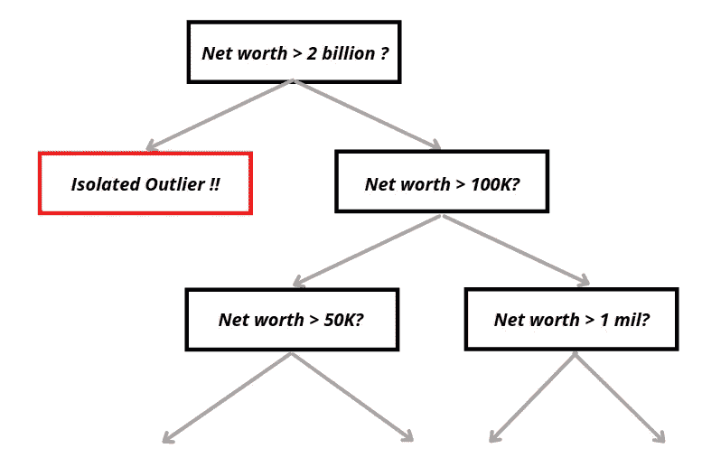
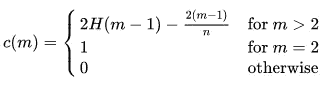
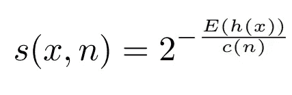
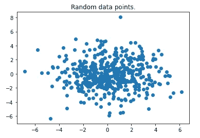
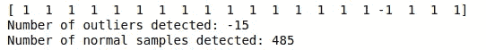
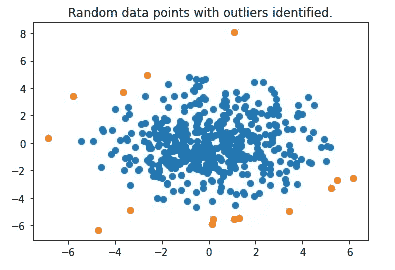
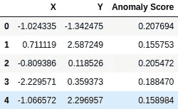
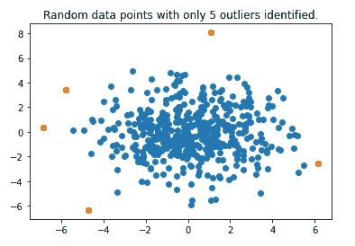

# 基于隔离森林的无监督孤立点检测

> 原文：<https://medium.com/mlearning-ai/unsupervised-outlier-detection-with-isolation-forest-eab398c593b2?source=collection_archive---------0----------------------->

## **隔离森林** -一种无监督的异常检测算法，可以以令人难以置信的速度检测数据集中的异常值。


Photo by [veeterzy](https://unsplash.com/@veeterzy?utm_source=medium&utm_medium=referral) on [Unsplash](https://unsplash.com?utm_source=medium&utm_medium=referral)

***隔离森林*** 是一个简单却难以置信的算法，它能够**非常快速地发现数据集中的异常值或异常**。我应该说理解这个工具对于任何有抱负的数据科学家来说都是必须的。在本文中，我将简要介绍算法背后的理论和实现。

它的 Python 实现来自于 ***Scitkit Learn*** ，由于它的功能和易用性，已经获得了极大的欢迎。但是在我们开始实现之前。对我们来说，研究它的用例及其背后的理论总是最好的做法。但是，可以直接跳到下面的实现部分！

# 一些理论

## **首先，什么是异常？**

异常值(离群值)可以描述为数据集中与其他数据或观察值明显不同的数据点。发生这种情况有几个原因:

*   异常值可能表明**坏数据**是不正确的，或者实验可能没有正确运行。
*   一个异常值可能是由于**随机变化**或者可能表明一些**科学上有趣的事情。**


Photo by [Will Myers](https://unsplash.com/@will_myers?utm_source=medium&utm_medium=referral) on [Unsplash](https://unsplash.com?utm_source=medium&utm_medium=referral)

这是异常现象的简化版本。然而，这两个事件都是数据科学家想要理解和深入研究的。

## 为什么要进行异常检测？

我们之所以想更深入地探究异常现象，是因为这些数据点要么会把你搞得一团糟，要么会让你发现一些有意义的东西。

在简单线性回归的情况下，一个坏的异常值会增加我们模型中的方差，并进一步降低我们模型掌握数据的能力。离群值会导致回归模型(尤其是线性模型)对离群值有一个扭曲的理解。

# 隔离林工作原理概述

传统上，其他方法一直试图构建**正常数据的分布图**，然后进一步识别哪些不符合分布图的数据点为异常。

隔离森林的高明之处在于，它可以使用**隔离**(一个数据点到其余数据有多远)直接检测异常。这意味着该算法可以像其他距离相关模型(如 K-最近邻模型)一样以线性时间复杂度 T31 运行。

该算法的工作原理是基于离群值最明显的属性:

*   只会有 ***几个*** 离群值
*   有离群值就会有 ***不同的***

隔离森林通过引入**二叉树**(的集合)来实现这一点，二叉树通过随机选择一个特性，然后随机选择该特性的分裂值，递归地生成**分区**。分割过程将继续，直到将所有数据点与其余样本分开。

因为从每个树的实例中只选择了一个特征。我们可以说决策树的最大深度实际上是 1。事实上，隔离林的基本估计值实际上是对各种数据子集的极其随机的决策树(ExtraTrees)。

下面是一个孤立森林中一棵树的例子。



Decision Tree image by author

给定上面提到的异常值的属性，我们可以观察到，与正常样本相比，异常值平均需要更少的分区才能被隔离。然后，每个数据点将根据其在 X 轮后被隔离的难易程度得到一个分数。具有异常分数的数据点将被标记为异常。

## 细节

更正式的说法是，我们通过随机选择一个属性 q 和一个分割值 p(在属性 q 的最小最大值内)递归地分割每个数据实例，直到它们都被完全隔离。然后，隔离林将根据路径长度提供反映每个数据实例异常程度的排名。排名或分数被称为异常分数，其计算如下:

H(x):直到数据实例 x 被完全隔离的步骤数。

E[H(x)]:隔离树集合中 H(x)的平均值。

这些指标很有意义，但一个问题是，iTree 的最大可能步长以 n 的数量级增长，而同时平均步长仅以 log n 的数量级增长。这将导致步长无法直接比较的问题。因此，需要引入一个随 n 变化的归一化常数。

c(n)，路径长度归一化常数，公式如下:



Equation Image by author

其中 H(i)为谐波数，可由 ln(i) + 0.5772156649(欧拉常数)估算。

异常分数的完整等式:



Equation Image by author

因此，如果我们通过隔离林运行整个数据集，我们可以获得它的异常分数。使用异常分数 s，我们可以推断出每当存在异常分数非常接近 1 的实例时是否存在异常。任何低于 0.5 的分数都将被视为正常情况。

***注:***

**在 sklearn 的实现中，异常分值与原始论文中定义的异常分值相反。**它们再减去常数 0.5。这是为了轻松识别异常(负分用异常识别)[阅读更多](https://github.com/scikit-learn/scikit-learn/blob/37ac6788c9504ee409b75e5e24ff7d86c90c2ffb/sklearn/ensemble/_iforest.py#L345)

# 隔离林的实施

所有的理论都说完了吗？让我们确定一些异常值。

首先，我们快速导入一些我们稍后会用到的有用模块。我们使用 make_blobs()函数生成一个包含随机数据点的数据集。

```
import numpy as np
import pandas as pd
import matplotlib.pyplot as plt
from sklearn.datasets import make_blobsdata, _ = make_blobs(n_samples=500, centers=1, cluster_std=2, center_box=(0, 0))
plt.scatter(data[:, 0], data[:, 1])
plt.show()
```



Scatterplot by author

我们很容易发现一些异常值，因为这只是一个二维用例。这是一个很好的选择，证明算法是可行的。注意，该算法可以毫无问题地用于具有多个特征的数据集。

我们通过调用 isolation forest()来初始化隔离林对象。

这里用到的超参数多是原纸默认推荐的。

> 树的数量控制集合的大小。我们发现路径长度通常在 t = 100 之前很好地收敛。除非另有说明，我们将使用 t = 100 作为实验中的默认值。
> 
> 根据经验，我们发现将子集样本设置为 256 通常可以提供足够的细节来跨大范围的数据执行异常检测
> 
> —费托尼刘，婷(原论文《隔离森林》作者)

*   这里的 N_estimators 代表树的数量，这里的 max sample 代表每一轮中使用的子集样本。
*   Max_samples ='auto '将子集大小设置为 min(256，num_samples)。
*   这里的污染参数代表数据集中异常值的比例。默认情况下，异常分数阈值将与原始论文中的一样。但是，如果我们有任何先验知识，我们可以手动修正数据中异常值的比例。出于演示目的，我们在这里将其设置为 0.03。

然后我们拟合并预测整个数据集。它返回由[-1 或 1]组成的数组，其中-1 代表异常情况，1 代表正常情况。

```
iforest = IsolationForest(n_estimators = 100, contamination = 0.03, max_samples ='auto)
prediction = iforest.fit_predict(data)print(prediction[:20])
print("Number of outliers detected: {}".format(prediction[prediction < 0].sum()))
print("Number of normal samples detected: {}".format(prediction[prediction > 0].sum()))
```



Code output by author

然后，我们将绘制隔离林检测到的异常值。

```
normal_data = data[np.where(prediction > 0)]
outliers = data[np.where(prediction < 0)]
plt.scatter(normal_data[:, 0], normal_data[:, 1])
plt.scatter(outliers[:, 0], outliers[:, 1])
plt.title("Random data points with outliers identified.")
plt.show()
```



Scatterplot by author

我们可以看到，它工作得很好，并确定了边缘周围的数据点。

我们还可以调用 decision_function()来计算每个数据点的异常得分。这样我们就可以了解哪些数据点比较异常。

```
score = iforest.decision_function(data)
data_scores = pd.DataFrame(list(zip(data[:, 0],data[:, 1],score)),columns = ['X','Y','Anomaly Score'])display(data_scores.head())
```



Code output by author

我们使用异常分数挑选出前 5 个异常，然后再次绘制。

```
top_5_outliers = data_scores.sort_values(by = ['Anomaly Score']).head()
plt.scatter(data[:, 0], data[:, 1])
plt.scatter(top_5_outliers['X'], top_5_outliers['Y'])
plt.title("Random data points with only 5 outliers identified.")
plt.show()
```



Scatterplot by author

# 外卖

**隔离森林**是一个完全不同的异常检测模型，可以快速隔离异常。它具有线性时间复杂度，这使它成为处理大容量数据集的最佳方法之一。

它基于这样一个概念，即由于异常点是“少数且不同的”，因此与正常点相比，它们更容易被隔离。它的 Python 实现可以在[sk learn . ensemble . isolation forest](https://scikit-learn.org/stable/modules/generated/sklearn.ensemble.IsolationForest.html)找到。

感谢您在百忙之中抽出更多的时间和我一起坐下来，欣赏这个美丽的算法。

# 参考

[隔离森林](https://cs.nju.edu.cn/zhouzh/zhouzh.files/publication/icdm08b.pdf?q=isolation-forest)由费托尼刘，汀吉普斯兰信息技术学院。

[](/mlearning-ai/mlearning-ai-submission-suggestions-b51e2b130bfb) [## Mlearning.ai 提交建议

### 如何成为 Mlearning.ai 上的作家

medium.com](/mlearning-ai/mlearning-ai-submission-suggestions-b51e2b130bfb)