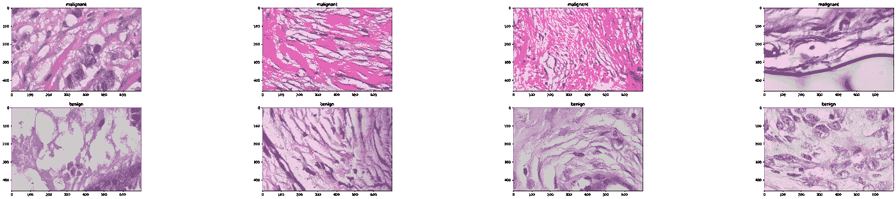
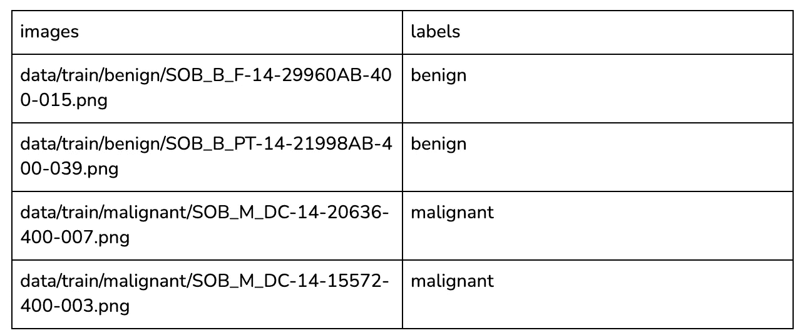
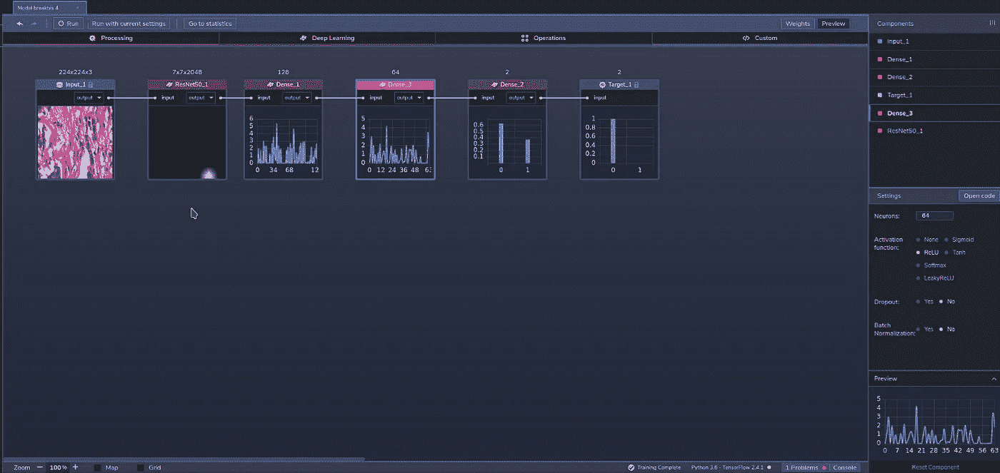
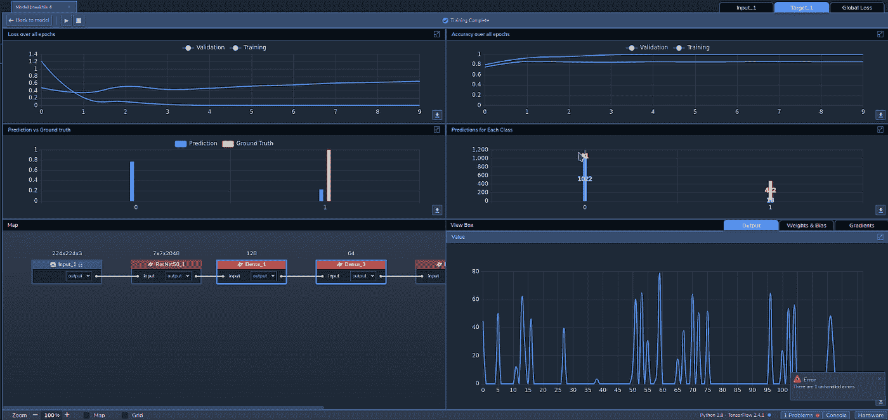
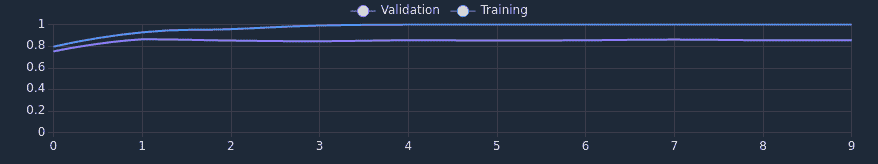

# 用例:乳腺癌检测

> 原文：<https://medium.com/mlearning-ai/use-case-breast-cancer-detection-aa0f080aff31?source=collection_archive---------4----------------------->

[Image Source](https://unsplash.com/photos/nJv6xnlpNaA).

在世界范围内，乳腺癌是最常见的侵袭性癌症，影响全球七分之一的女性。与肺癌一样，乳腺癌是最常见的诊断癌症，2018 年各有 209 万例。

受医疗保健中越来越多使用 ML 的启发，我们决定在针对恶性和良性显微活检图像训练的[感知实验室](https://www.perceptilabs.com/)中建立一个图像识别模型。使用这样的 ML 模型可以帮助医生、乳房 x 光检查者、研究人员和其他医疗从业者更容易地对乳腺癌进行分类和检测。

**数据集**

为了训练我们的模型，我们从 [Kaggle](https://www.kaggle.com/) 获取了 [BreaKHis 400X](https://www.kaggle.com/forderation/breakhis-400x) 数据集，其中包含良性和恶性乳腺肿瘤的显微活检图像。

*Figure 1: Examples of images from the dataset.*

数据集包括 400 倍光学变焦的 1146 幅恶性图像和 547 幅良性图像。每个图像都是 700x460 像素的. png 文件。

我们创建了一个. csv 文件( *dataset.csv* )来将图像文件映射到它们各自的标签(*良性*和*恶性*)，以便在使用 PerceptiLabs 的[数据向导](https://docs.perceptilabs.com/perceptilabs/references/ui-overview/data-wizard)加载数据时使用。

下面是一个部分的例子。csv 文件看起来:

*Example of the .csv file to load data into PerceptiLabs that maps the image files to their associated labels.*

**型号总结**

我们的模型由四个[组件](https://docs.perceptilabs.com/perceptilabs/references/components)组成:

组件 1: [ResNet50](https://keras.io/api/applications/resnet/) ，include_top=false，pretrained=imagenet

成分 2:密集，激活= [ReLU](https://machinelearningmastery.com/rectified-linear-activation-function-for-deep-learning-neural-networks/) ，神经元=128

成分 3:密集，激活= [ReLU](https://machinelearningmastery.com/rectified-linear-activation-function-for-deep-learning-neural-networks/) ，神经元=64

组件 4:密集，激活= [Softmax](https://en.wikipedia.org/wiki/Softmax_function) ，神经元=2

*Figure 2: Topology of the model in PerceptiLabs.*

**训练和结果**

*Figure 3: PerceptiLabs’ Statistics View during training.*

训练时间刚刚超过 256 秒，**我们能够实现 100%的训练准确率和 85.5%的验证准确率。**在下面来自 PerceptiLabs 的截图中，您可以看到在第一个时期，训练和验证精度如何快速上升，之后验证精度保持相当稳定。训练精度继续攀升，直到大约第三个时期才稳定在 100%:

Figure 4: Accuracy Plot.

**垂直应用**

像这样的模型可能有助于增加医疗从业者进行诊断的数量。特别是，它可以帮助丢弃真正的阴性病例，只留下阳性和假阴性病例供医生辨别。

这样的项目也可以被医学学生或寻求建立下一代基于 ML 的医疗技术的从业者使用。该模型本身也可以用作[转移学习](https://blog.perceptilabs.com/when-to-use-transfer-learning-in-image-processing/)的基础，以创建用于在其他类型的医学扫描/成像中检测肿瘤的其他模型。

**总结**

这个用例是一个简单的例子，说明了如何使用 ML 通过图像识别来识别疾病。如果你想建立一个类似这样的深度学习模型，[运行 PerceptiLabs](https://docs.perceptilabs.com/perceptilabs/getting-started/quickstart-guide) 并从 [GitHub](https://github.com/PerceptiLabs/breakhis-400x) 中抓取一份我们预处理过的数据集。