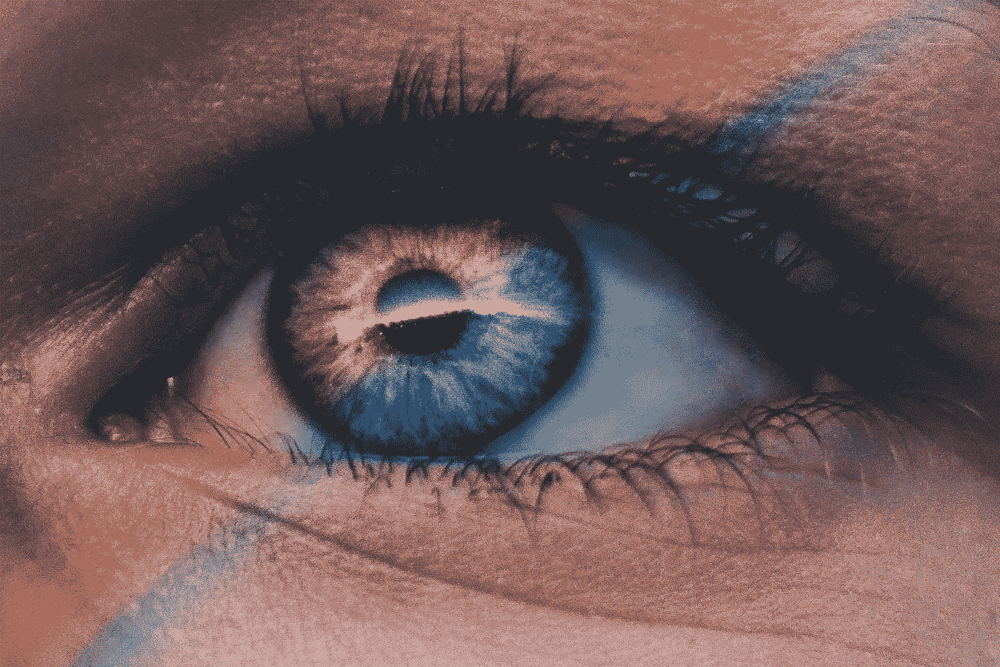
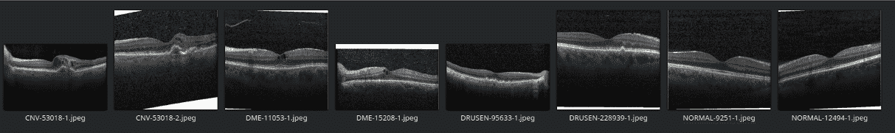
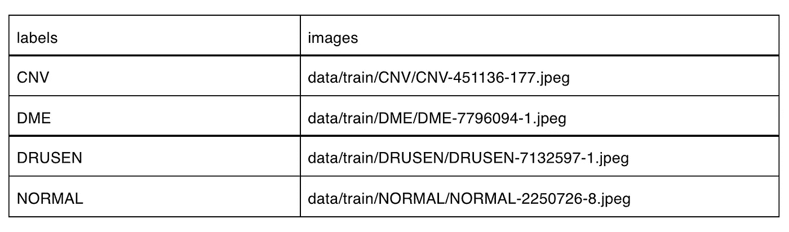
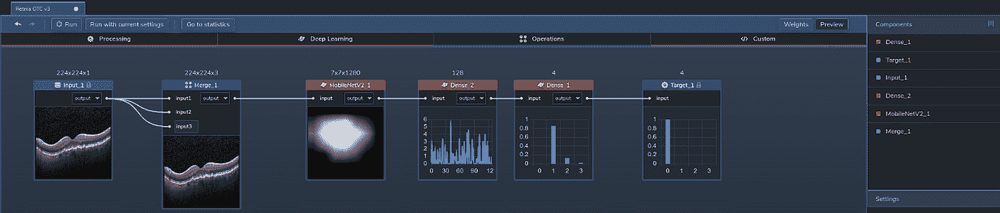
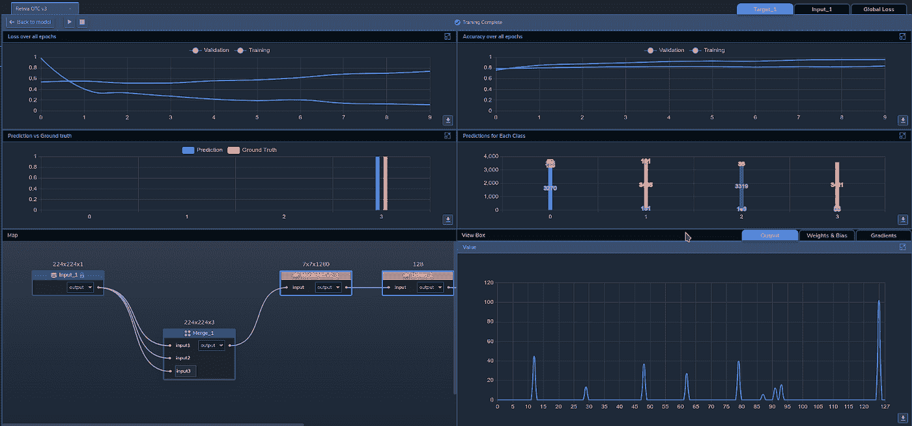
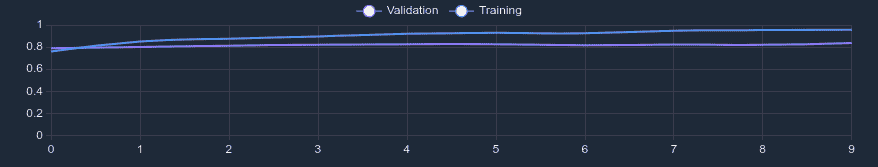
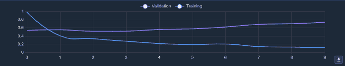

# 用例:视网膜 OCT

> 原文：<https://medium.com/mlearning-ai/use-case-retinal-oct-24cc75e314fc?source=collection_archive---------3----------------------->

[Image Source](https://unsplash.com/photos/G1iYCeCW2EI).

人眼是一个复杂的感觉器官，它对光做出反应，为我们提供观察周围世界的视野。保护我们的眼睛是我们整体医疗保健的一个重要方面。然而，我们的眼睛容易受到一些疾病的影响，其中一些疾病可以归因于其他疾病，甚至只是因为衰老。

医疗从业者用来检测这些问题的一种方法是[光学相干断层扫描](https://www.aao.org/eye-health/treatments/what-is-optical-coherence-tomography) (OCT)。OCT 涉及使用光波构建视网膜的横截面图像，允许从业者绘制和测量视网膜的各层。每年都有数百万次这样的扫描，对它们进行分析需要大量的时间。

随着(机器学习)ML 在医疗保健中的使用越来越多，我们开始在[感知实验室](https://www.perceptilabs.com/)中建立一个图像识别模型，该模型可以分析视网膜 OCT 图像，以自动分析这些扫描。像这样的模型可以帮助医生、研究人员和其他医疗从业者更快、更准确地诊断眼病。

**数据集**

为了训练我们的模型，我们使用了来自 [Kaggle](https://www.kaggle.com/) 上[视网膜 OCT 图像](https://www.kaggle.com/paultimothymooney/kermany2018)数据集的图像。原始数据集超过 80，000 个。不同分辨率的 jpeg 图像分为四类。一个分类代表*正常的* OCT 扫描(即未检测到疾病)，其他分类是三种疾病的 OCT 扫描:*脉络膜新生血管*(CNV)*糖尿病性黄斑水肿* (DME)，以及*玻璃疣*(即早期老年性黄斑变性(AMD)中存在多个玻璃疣)。

原始数据集是不平衡的，CNV 的图像超过 44.6%，正常的图像为 31.5%，DME 的图像为 13.6%，而 Drusen 的图像为 10.3%。为了消除训练过程中的潜在偏差，我们使用每个分类的 4000 个图像的子集制作了一个平衡数据集。

图 1 显示了该数据集中的一些示例图像:

*Figure 1: Examples of images from the dataset —* [*Image Source*](https://www.kaggle.com/paultimothymooney/kermany2018)*.*

为了将分类映射到图像，我们创建了一个. csv 文件，该文件将每个图像文件与适当的分类标签( *CNV* 、 *DME* 、*德鲁森*和*普通*)相关联，以便使用 PerceptiLabs 的[数据向导](https://docs.perceptilabs.com/perceptilabs/references/ui-overview/data-wizard)加载数据。下面是一个部分的例子。csv 文件看起来:

*Example of the .csv file to load data into PerceptiLabs that maps the image files to their classification labels.*

**型号总结**

我们的模型由四个[组件](https://docs.perceptilabs.com/perceptilabs/references/components)组成:

组件 1:合并，来自同一输入源的三个输入。

组件 2: [MobileNetV2](https://keras.io/api/applications/mobilenet/) ，include_top=false，pretrained=imagenet

成分 3:密集，激活= [ReLU](https://machinelearningmastery.com/rectified-linear-activation-function-for-deep-learning-neural-networks/) ，神经元=128

组件 4:密集，激活= [ReLU](https://machinelearningmastery.com/rectified-linear-activation-function-for-deep-learning-neural-networks/) ，神经元=4

该模型通过 MobileNetV2 和合并组件使用迁移学习将灰度图像转换为 RGB。这是 MobileNet 的一个要求，因为它使用的是一个预训练模型，该模型的权重是固定的，其第一个卷积层是根据三个通道(RGB)的输入进行训练的。图 2 显示了感知实验室中模型的拓扑结构:

*Figure 2: Topology of the model in PerceptiLabs —* [*Image Source*](http://www.perceptilabs.com)*.*

**培训和结果**

**我们使用 [ADAM](https://machinelearningmastery.com/adam-optimization-algorithm-for-deep-learning/#:~:text=Adam%20is%20a%20replacement%20optimization,sparse%20gradients%20on%20noisy%20problems.) 优化器、0.001 的学习率和交叉熵[损失](https://blog.perceptilabs.com/choosing-and-customizing-loss-functions-for-image-processing/)函数，在 10 个时期**中分批训练模型，每批 32 个。在大约 11.5 分钟的训练时间内，**我们实现了 95.78%的训练准确率和 83.69%的验证准确率**。

图 3 显示了训练期间 PerceptiLabs 的统计视图:

*Figure 3: PerceptiLabs’ Statistics View during training —* [*Image Source*](http://www.perceptilabs.com)*.*

下面的图 4 和图 5 显示了训练期间 10 个时期的准确度和损失:

*Figure 4: Accuracy during training —* [*Image Source*](http://www.perceptilabs.com)*.*

*Figure 5: Loss during training —* [*Image Source*](http://www.perceptilabs.com)*.*

在图 4 中，我们可以看到，训练和验证的准确性都是从大约 79%到 80%开始的。训练精度继续攀升，在第七个历元左右稳定下来，而验证精度始终没有什么提高。有趣的是，训练损失(如图 5 所示)在第一个时期下降最多，然后在整个训练过程中稳步下降，同时经历了几次短暂的小幅上升。另一方面，确认损失保持相当稳定，直到大约第五个时期，在第五个时期，确认损失缓慢增加，直到最后一个时期结束。

**垂直应用**

像这样的模型可以被需要检测视网膜疾病的医疗从业者和研究人员使用。该模型可用于分析大量图像，标记需要进一步关注的病例。该模型本身也可以用作[转移学习](https://blog.perceptilabs.com/when-to-use-transfer-learning-in-image-processing/)的基础，以创建用于从其他类型的医学扫描中检测疾病的附加模型。

**总结**

该使用案例展示了图像识别在医疗保健领域的应用。如果你想建立一个类似这样的深度学习模型，[运行 PerceptiLabs](https://docs.perceptilabs.com/perceptilabs/getting-started/quickstart-guide) 并在 [GitHub](https://github.com/PerceptiLabs/RetinalOCT) 上查看我们为这个用例创建的回购。另外，请务必查看我们的另一个与眼睛相关的用例:[眼病识别](https://blog.perceptilabs.com/use-case-ocular-disease-recognition/)。