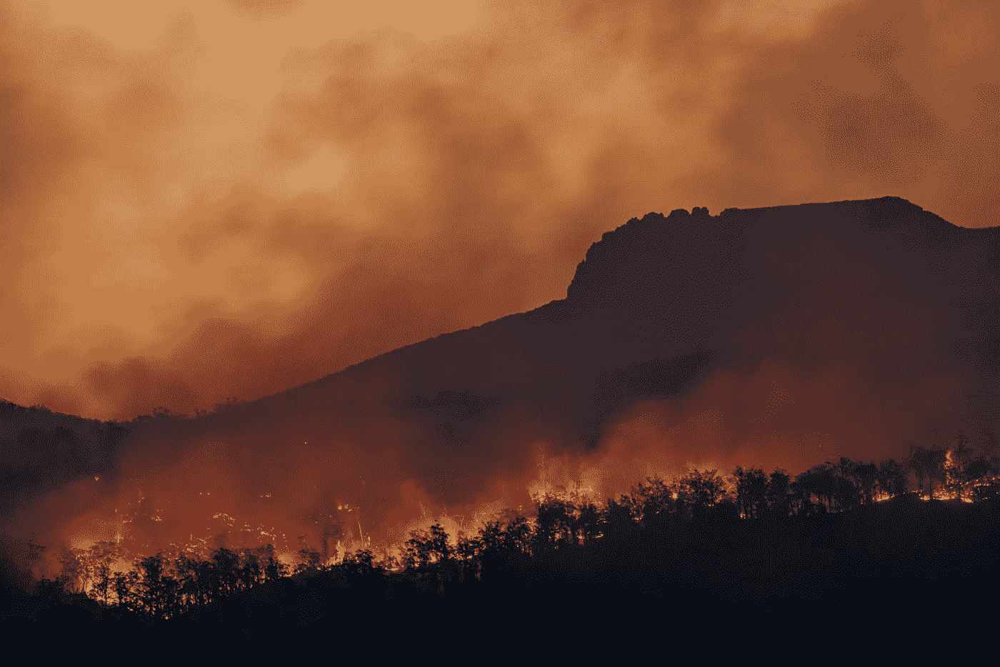
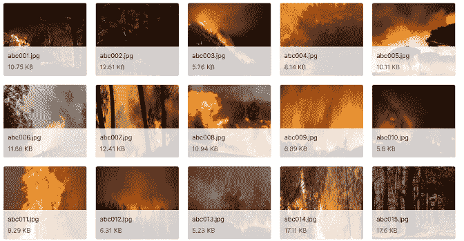
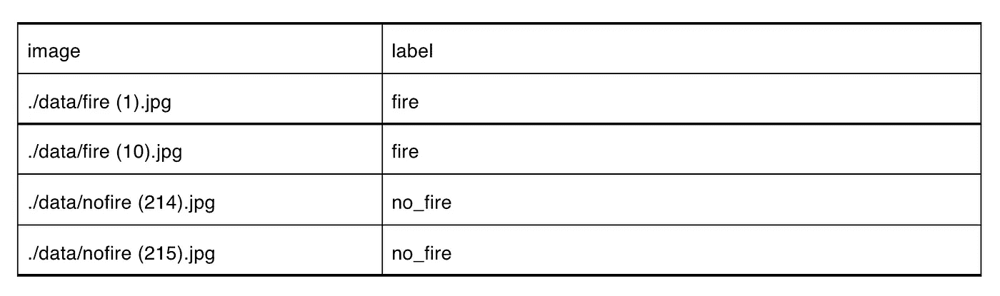
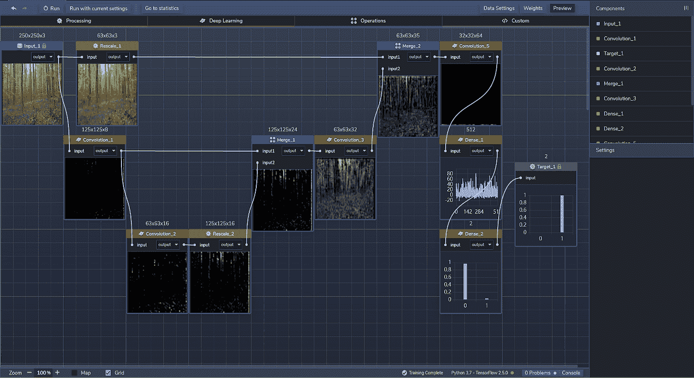
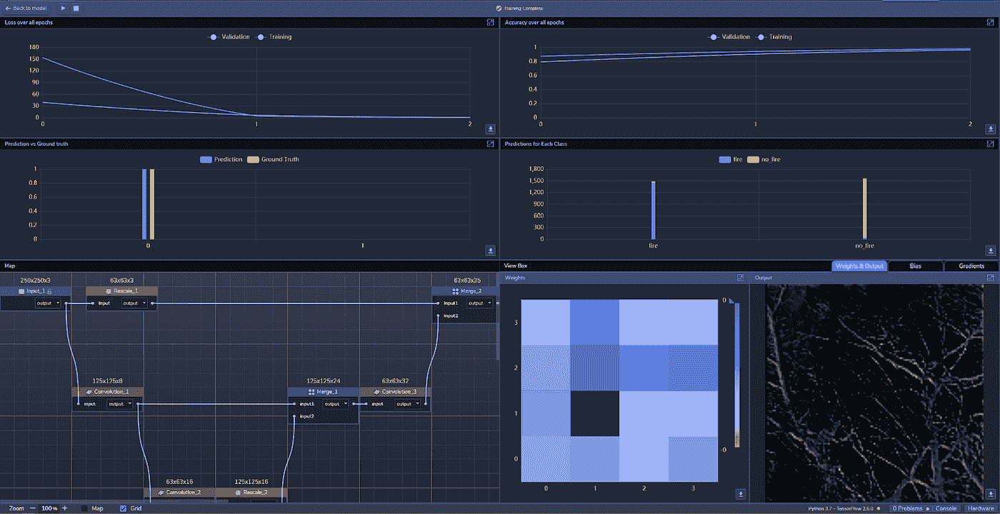
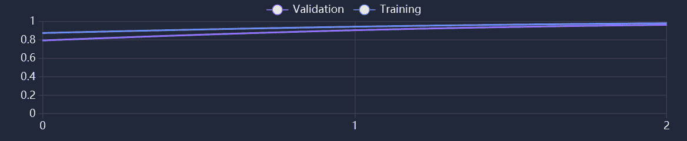
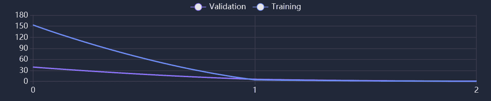
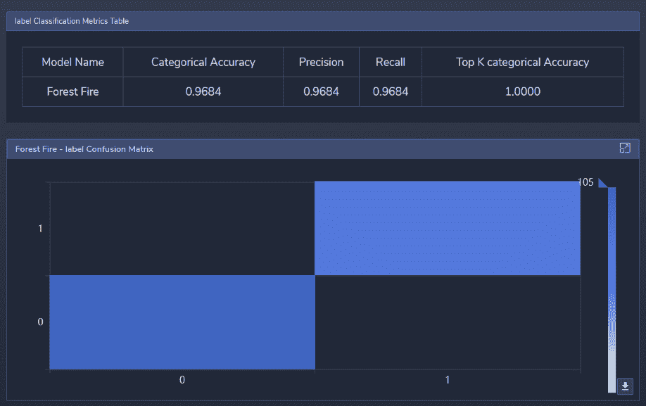

# 用例:野火检测

> 原文：<https://medium.com/mlearning-ai/use-case-wildfire-detection-62e727d04ac7?source=collection_archive---------2----------------------->

每年，由于野火蔓延，数百万公顷的森林消失。然而，使用图像识别，当局现在可以从高速公路或建筑物上的摄像机拍摄的实时图像中识别野火。

受到使用深度学习来帮助拯救环境的潜力的启发，我们在 [PerceptiLabs](https://www.perceptilabs.com/) 中建立了一个图像识别模型，可以分析场景图像来检测火灾。政府或环保组织可能会使用这种模型在火势蔓延太远之前向消防队员发出警报。

**数据集**

为了训练我们的模型，我们在 [Kaggle](https://www.kaggle.com/) 上使用了来自[野火探测图像数据](https://www.kaggle.com/brsdincer/wildfire-detection-image-data)的图像。该数据集包括 1900 个 250x250 像素。jpg 文件，其中一些如图 1 所示:

*Figure 1: Examples of images from the dataset.*

为了对这些图像进行分类，我们设计了两个分类标签: **fire** 和 **no_fire** ，并创建了一个. csv 文件将它们与每个图像文件相关联，以便使用 PerceptiLabs 的[数据向导](https://docs.perceptilabs.com/perceptilabs/references/ui-overview/data-wizard)加载数据。下面是一个部分的例子。csv 文件看起来:

*Example of the .csv file to load data into PerceptiLabs that maps the image files to their classification labels.*

**型号总结**

对于我们的模型，我们构建了一个 CNN 模型，包括以下[组件](https://docs.perceptilabs.com/perceptilabs/references/components):

组件 0:重新缩放，63 x 63，输入:输入组件，输出:组件 6

组件 1:卷积，激活= [ReLU](https://machinelearningmastery.com/rectified-linear-activation-function-for-deep-learning-neural-networks/) ，特征映射=8，Patch_size=4，Batch_Norm=Yes，输入:输入组件，输出:组件 2 和组件 4

分量 2:卷积，激活= [ReLU](https://machinelearningmastery.com/rectified-linear-activation-function-for-deep-learning-neural-networks/) ，特征映射=16，输入:分量 1，输出:分量 3

组件 3:重新缩放，125x125，输入:组件 2，输出:组件 4，组件 4:合并，运算=串联，-1

输入:组件 3 和组件 1，输出:组件 5，组件 5:卷积，激活=ReLU，特征映射=32，面片大小=3，输入:组件 4，输出:组件 6，组件 6:合并，运算=连接，-1，输入:组件 5 和组件 0，输出:组件 7

组件 7:卷积，激活=ReLU，特征映射=64，面片大小=3，输入:组件 6，输出:到组件 8

组件 8:密集，激活=LeakyReLU，神经元=512，输入:组件 7，输出:组件 9

组件 9:密集，激活=Softmax，神经元=2，输入:组件 8，输出:输出

如下图 2 所示，该模型本质上是一个小型的 [U-Net](https://blog.perceptilabs.com/guide-to-using-unets-for-image-segmentation/) 变体，具有标准 U-Net 所具有的跳过连接的类似优势。通过这种架构，我们将*收缩*路径中的图像卷积并汇集到特征地图中，同时使用跳过连接将信息传递到*扩展*路径。然后，扩展路径将特征信息与空间信息结合在一起，然后使用全连接层(密集组件)进行二元分类，分为 **fire** 和 **no_fire** 。

图 2 显示了感知实验室中模型的拓扑结构:

*Figure 2: Topology of the model in PerceptiLabs.*

**训练和结果**

**我们使用 [ADAM](https://machinelearningmastery.com/adam-optimization-algorithm-for-deep-learning/#:~:text=Adam%20is%20a%20replacement%20optimization,sparse%20gradients%20on%20noisy%20problems.) 优化器、0.001 的学习率和交叉熵[损失](https://blog.perceptilabs.com/choosing-and-customizing-loss-functions-for-image-processing/)函数，在三个时期**分批训练模型，每批 32 个。平均训练时间约为 269.73 秒，**我们实现了 97.82%的训练准确率和 96.05%的验证准确率:**

图 3 显示了 PerceptiLabs 的统计视图:

*Figure 3: PerceptiLabs’ Statistics View during training.*

下面的图 4 和图 5 显示了各时期的精度和损耗:

*Figure 4: Accuracy during training and validation.*

*Figure 5: Loss during training and validation.*

在图 4 中，我们可以看到，训练和验证的准确性开始时相对较高，并且以大约相同的速度增加。在图 5 中，训练损失开始时很高，验证损失开始时很低，但是到第二个时期时两者都差不多。

*Figure 6: Classification metrics and confusion matrix.*

图 6 中的混淆矩阵显示了两个非常相似的蓝色阴影，表明该模型几乎总是正确地测试所有样本。**标签度量表**通过显示以下各项的接近 97%的标准化值证实了这一点:**分类准确度**(每个类别的准确度对所有类别进行平均)**精确度**(正面预测的准确度)，以及**召回**(找到的正面的百分比(即，没有被错误分类为负面而不是正面)**前 K 个分类准确度**(前 K 个预测类别中正确类别的频率)的 100%。

**垂直应用**

像这样的模型可以用作分析不同类型的环境图像以检测异常的基础。通过将这个模型用于[迁移学习](https://blog.perceptilabs.com/when-to-use-transfer-learning-in-image-processing/)，你可以潜在地开发出检测其他类型问题的模型，例如洪水、侵蚀或泥石流。它还可以被修改为处理其他数据类型，如卫星图像，以检测未经授权的森林砍伐，水位上升或冰山融化。

**自己试试吧！**

我们已经在 [GitHub](https://github.com/PerceptiLabs/Wildfire-Detection) 上提供了你自己尝试它所需要的一切。

使用 PerceptiLabs，您可以通过[数据向导](https://docs.perceptilabs.com/perceptilabs/references/ui-overview/data-wizard)快速加载这些数据，并使用上面的设置构建一个这样的模型，而无需编写任何代码。或者，使用我们已经包含的 **model.json** 文件将我们的模型直接导入到 PerceptiLabs 中(需要 PerceptiLabs 0.12.0 或更高版本)。无论哪种方式，您都可以立即开始运行！

然后，您可以轻松地切换到不同的数据集，对新数据进行训练，和/或使用新的组件和连接调整模型的拓扑。然后，只需点击几下鼠标就可以导出训练好的模型，之后，模型文件就可以由您的应用程序托管，用于现实世界的推理。

**总结**

这个用例是一个例子，说明图像识别如何用于检测危险的环境条件。如果你想建立一个类似这样的深度学习模型，[运行 PerceptiLabs](https://docs.perceptilabs.com/perceptilabs/getting-started/quickstart-guide) 并在 [GitHub](https://github.com/PerceptiLabs/Wildfire-Detection) 上查看我们为这个用例创建的回购。对于另一个环境用例，请务必查看使用图像识别的[自动天气分析](https://blog.perceptilabs.com/use-case-automated-weather-analysis-using-image-recognition/)。