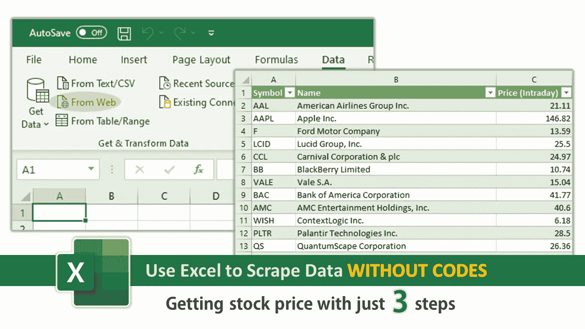

# 使用 Excel 抓取数据(不需要代码)

> 原文：<https://medium.com/mlearning-ai/use-excel-to-scrape-data-no-codes-required-f13748587b0d?source=collection_archive---------0----------------------->

Photo by cyda

# 动机

尽管 Python 和 R 的发展速度非常快，但没有人能否认 Excel 仍然是分析师进行表格探索的主要工具之一，我发现有很大一部分观众对利用 Excel 进一步研究数据感兴趣。