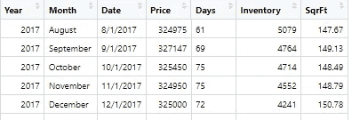
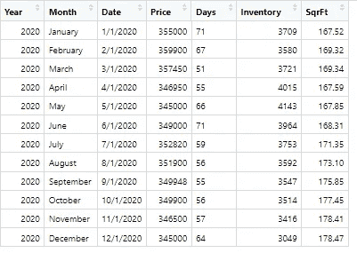
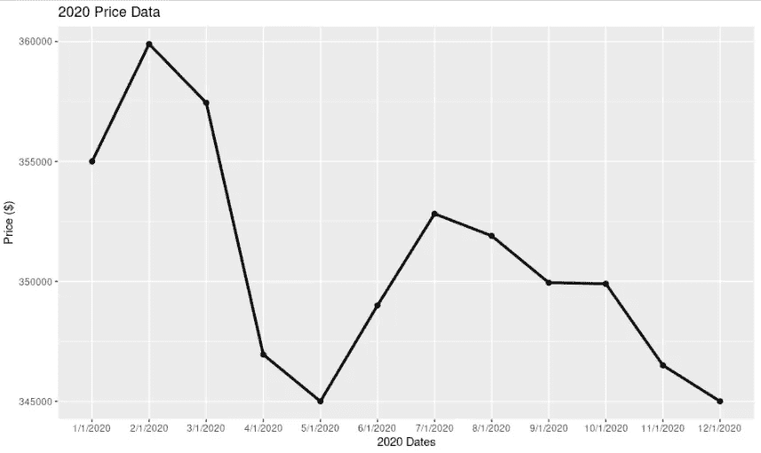
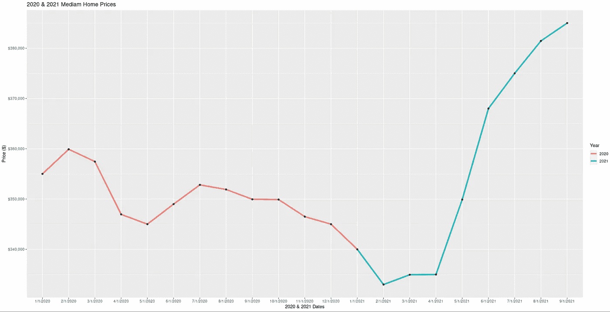
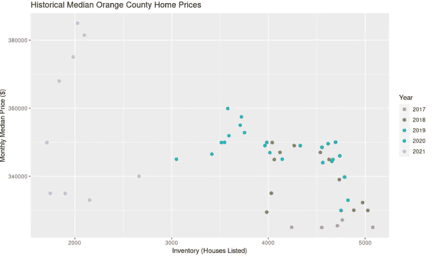
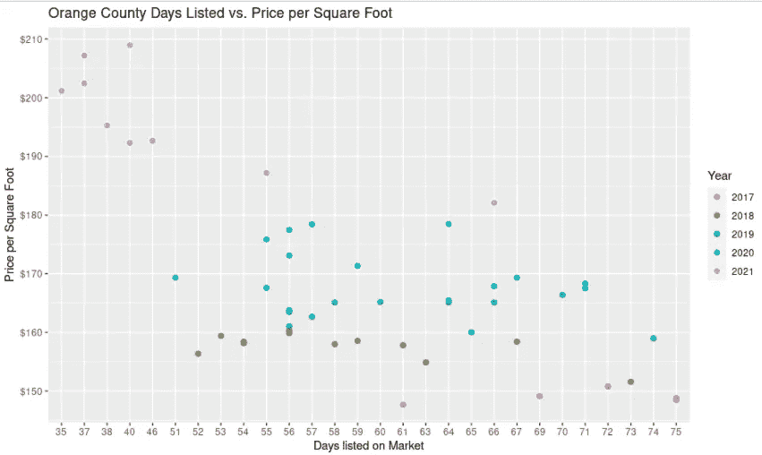
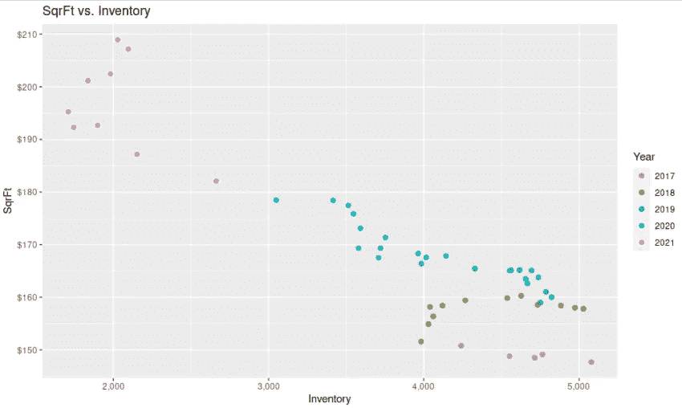

# 使用 Ggplot2 软件包分析 R 中的房地产数据

> 原文：<https://medium.com/mlearning-ai/use-ggplot2-package-to-analyze-real-estate-data-in-r-f688d06404c9?source=collection_archive---------1----------------------->

在本文中，我们将使用 Tidyverse 中的 ggplot2 包在 r 中进行探索性数据分析。我们将分析佛罗里达州奥兰治县的住房数据:信息是从 FRED(美联储经济数据)收集的。

我们的数据框架名为 Orange_County，有 6 个变量:年、月、日期、价格(中间价格)、天数(上市天数)、库存和 SqrFt(每平方英尺的价格)。日期范围为:2017 年 8 月 1 日至 2021 年 9 月 1 日。

如果我们只想查看 2020 年的数据，我们使用下面的代码进行过滤。我们将新的数据帧命名为:“Trimmed_2020”

*Trimmed _ 2020<-filter(Orange _ County，Year == 2020)*

现在让我们绘制新的数据框架。对于 2020 年，我们将把 ggplot()基础保存到变量 g 中。

#为情节和美学奠定基础将数据分成不同的组

*g < - ggplot(Trimmed_2020，aes(x =月，y =价格，组= 1))*

# geom_line()和 geom()告诉 R 我们希望我们的数据如何分层；“大小=1.2”分别给我们一条更粗的线和点

*g < - g +几何线(size = 1.2) +几何点()*

#然后，我们使用 labs()将描述添加到图表中。

*g < - g + labs(title = "2020 价格数据"，y = "价格($)"，x = "日期")*

*g*

**如果我们想绘制 2020 年和 2021 年的价格数据，会怎么样？**首先，我们创建一个向量，并将其赋给一个变量；然后使用该变量筛选出我们希望新数据框架使用的年份。(我将在下图中解释额外的代码。)

Year

Data_Graph

s
s<-s+geom _ line(AES(color = factor(Year))，size = 1.5) + geom_point()

s

s

s

s

Now what if we wanted to see if there is a correlation between Price and Inventory ? We’ll use our original DataFrame: Orange_County

*x<-gg plot(data = Orange _ County，aes(x =库存，y =价格))*

# *(aes(color=factor(Year))，size = 2)* 告诉 R 按年份给我们的点上色。我们还将 Year 转换为一个因子，这样它就可以得到一个离散的色标。

*x<-x+geom _ point(AES(color = factor(Year))，size = 2)*

#我们将刻度重命名为“年”

*x<-x+scale _ color _ discrete(name = " Year ")*

*x < - x + labs(title = "橙县房价历史中值"，y = "月房价中值($)"，x = "库存(房屋列表)")*

*x*

**We see that in 2021, Orange County experienced its lowest inventory numbers in the past 4 years; median home prices are inversely related to same; cementing the common phrase “Supply and Demand”.**

为了继续“供给和需求”的主题，让我们比较一下一处房产在市场上挂牌的平均天数和每平方英尺的价格。我们可以假设价格和库存之间存在反比关系，Days 和 SqrFt 也有类似的关系，但是让我们用图表来更好地了解历史。

使用下面的语法，我们将增加图表的格式。

*z<-gg plot(data = Orange _ County，aes(x = Days，y =SqrFt ))*

*z<-z+geom _ point(AES(color = factor(Year))，size = 2)*

*z<-z+scale _ color _ discrete(name = " Year ")*

#我们现在使用 scale_y_continuous()在 y 轴上添加一个美元符号，此外，我们还创建了断点，以便更好地展开 SqrFt。

*z<-z+scale _ y _ continuous(labels = dollar，break = seq(150，210，10))*

*z < - z + labs(title = "奥兰治县上市天数与每平方英尺价格"，
x = "上市天数"，y = "每平方英尺价格")*

*z*

**我们看到，特别是在 2021 年，随着天数的减少，房屋每平方英尺的价格大幅上涨。市场上较少的一天相当于库存短缺，这反过来又导致价格上涨。随着供应减少，需求增加，买家理应支付更高的房价。**

为了总结和巩固我们对库存和价格的图形化理解，让我们创建一个比较两个变量的快速图表:库存和 SqrFt。

s
s<-s+geom _ point(size = 2，AES(color = factor(Year)))

s<-s+scale _ color _ discrete(name = " Year ")

s

s

s

s

