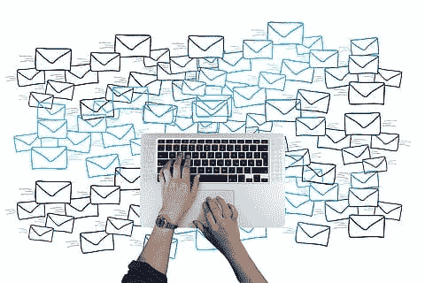

# 使用机器学习来确定电子邮件是否是垃圾邮件

> 原文：<https://medium.com/mlearning-ai/use-machine-learning-to-determine-if-an-email-is-spam-bdc9885307ca?source=collection_archive---------4----------------------->

至少在过去的四分之一世纪里，电子邮件已经成为一种生活方式，远远超过了我们从被亲切地称为“蜗牛邮件”的邮政服务中获得的交流。就像我们历史上从前门收到的邮件一样，我们收到的许多电子邮件都不是被请求的，被称为垃圾邮件是因为它对我们没有用处。