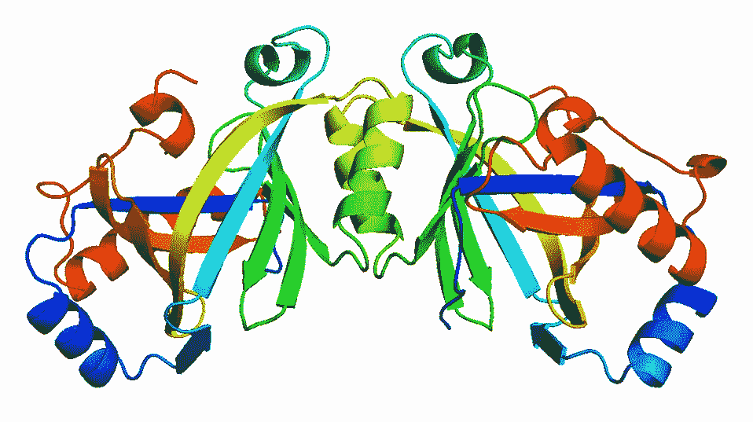

# 利用机器学习预测酶的热稳定性

> 原文：<https://medium.com/mlearning-ai/use-machine-learning-to-predict-on-the-thermal-stability-of-enzymes-9c7901f3bfbc?source=collection_archive---------7----------------------->

昨天，我决定从我应该做的事情中休息一下，并决定在 Kaggle 竞赛页面上看看是否有我可以尝试的竞赛。幸运的是，我发现了一个关于酶的比赛，我认为我可能会成功，所以我决定试一试。