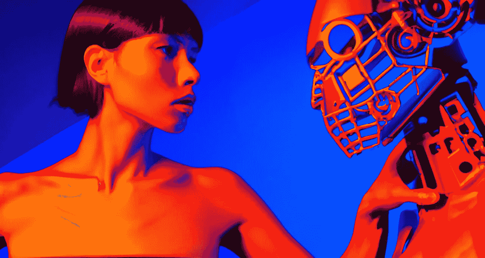

# 使用机器学习来保护 3D 模型

> 原文：<https://medium.com/mlearning-ai/use-machine-learning-to-protect-3d-models-2c1cbcb3904a?source=collection_archive---------2----------------------->

## [机器学习艺术](https://mlearning.substack.com/p/-8-ai-art-tools-worth-learning-about?r=z7zu8&s=w&utm_campaign=post&utm_medium=web)

## [嵌入版权保护](#2d70)

[Can 3D models be copyrighted?](https://mlearning.substack.com)

## [3D](https://mlearning.substack.com/p/can-ai-generate-3d-models?r=z7zu8&s=w&utm_campaign=post&utm_medium=web) 水印会阻止人们复制吗？

版权保护你的 [3D 模型](https://mlearning.substack.com/p/can-ai-generate-3d-models?r=z7zu8&s=w&utm_campaign=post&utm_medium=web)一制作出来，水印就能提醒别人不要盗用你的作品，因为它是受版权保护的。