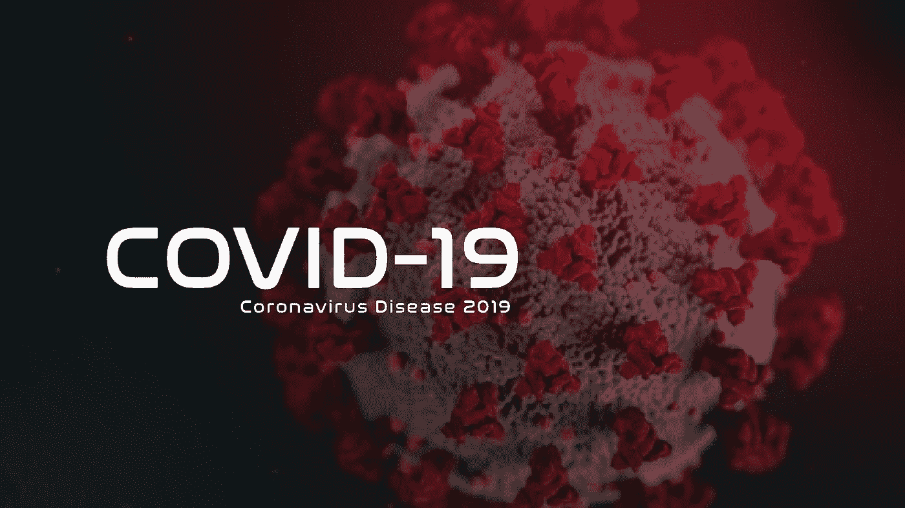

# 使用自然语言处理来分析冠状病毒推文

> 原文：<https://medium.com/mlearning-ai/use-natural-language-processing-to-analyse-coronavirus-tweets-109abf516dc7?source=collection_archive---------5----------------------->

在用 Intellipaat 学习了自然语言处理(NLP)之后，我决定在数据集上工作，并使用我在学习视频/课程时学到的一些技术，这将是一个好主意。我写的关于这个课程的博文可以在这里看到…