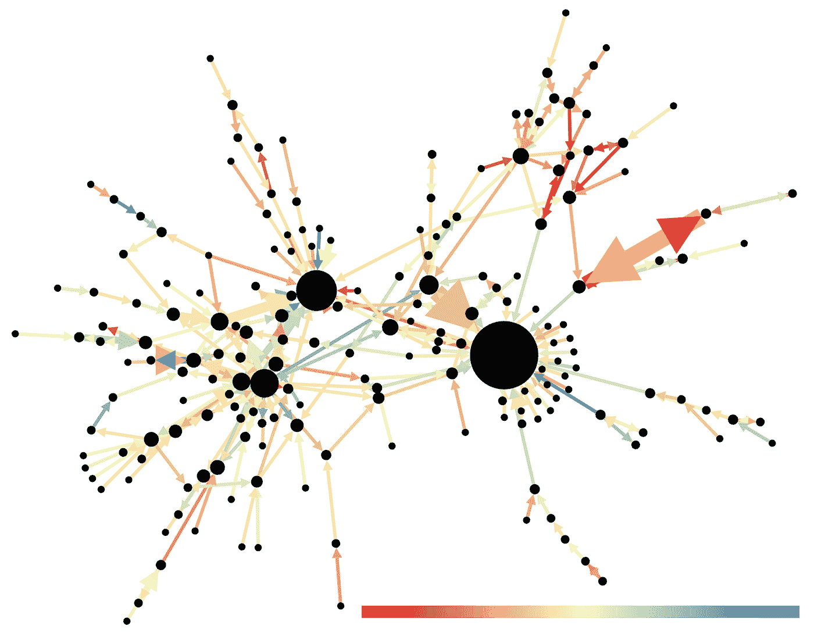

# 使用 NLTK 对电影评论进行情感分类

> 原文：<https://medium.com/mlearning-ai/use-nltk-to-classify-sentiments-in-movie-reviews-286af1442bfb?source=collection_archive---------2----------------------->

在过去的几周里，我一直在学习自然语言处理(NLP ),并且熟悉 nltk 库。我过去曾将 nltk 库与情感分析 Kaggle 竞赛一起使用，但我曾将它与其他库一起使用，如 sklearn 和 spacy。在开始学习 NLP 之前，我没有意识到 nltk 库可以从…