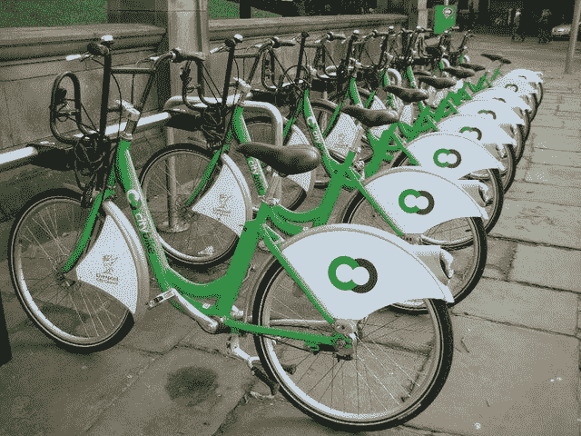

# 使用 Python 对 Kaggle 的自行车租赁社区竞赛进行预测

> 原文：<https://medium.com/mlearning-ai/use-python-to-make-predictions-on-kaggles-bike-rental-community-competition-7efde2a52897?source=collection_archive---------3----------------------->

在女王登基 50 周年的四天假期中，我决定从正常的学习中抽出一点时间，参加一个 Kaggle 社区竞赛。由于我仍在学习数据科学，所以我还不能与 Kaggle 提供的其他竞赛相媲美，所以我选择了自行车租赁竞赛，因为它本质上是表格形式的。