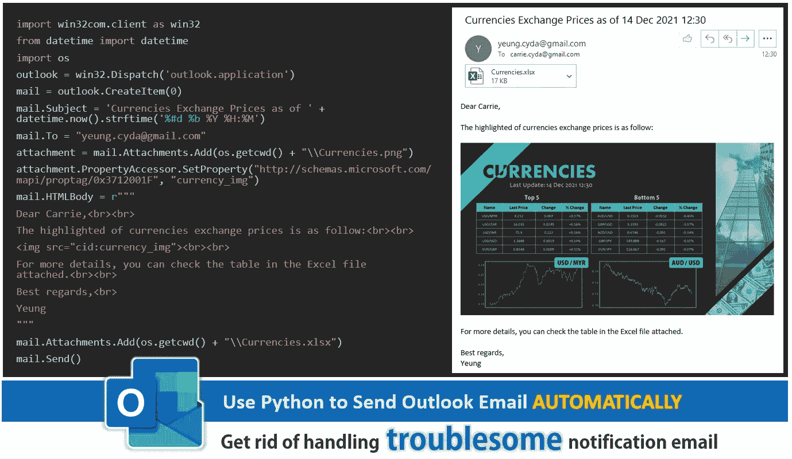

# 使用 Python 发送 Outlook 电子邮件

> 原文：<https://medium.com/mlearning-ai/use-python-to-send-outlook-emails-d673ce9e33e4?source=collection_archive---------0----------------------->

## 使用 Python 发送通知电子邮件的分步教程

Photo by [cyda](https://blog.cyda.hk/)

# 目标

除了 Microsoft Excel 和 PowerPoint，另一个常用的办公工具是 Outlook。我想每个有工作经验的人都会熟悉 Outlook 软件。它是用来收发电子邮件进行交流的。