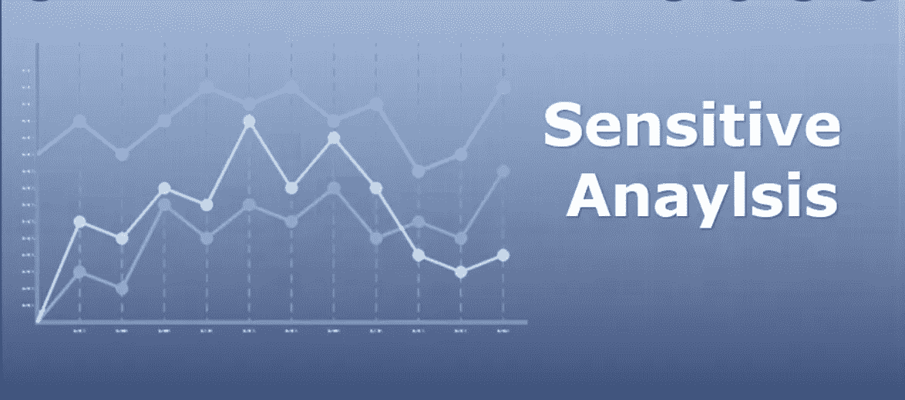

# 基于 SALib 的波士顿房价项目敏感性分析(特征重要性)

> 原文：<https://medium.com/mlearning-ai/use-salib-to-conduct-sensitivity-analysis-feature-importance-on-the-boston-housing-price-project-e3f3fe000a6f?source=collection_archive---------2----------------------->

我最近发现了一个 python 敏感性分析库——SALib，并就此发表了一篇文章:[SALib 的敏感性分析:一个强大的数据分析工具](https://reneelin2019.medium.com/sensitivity-analysis-with-salib-a-powerful-data-analysis-tool-30cced461b6e)。我想把它应用到一个非常基本的机器学习问题上:波士顿房价预测，并检查 SALib 是否能为我们的常识提供类似的特征重要性结果(我们…