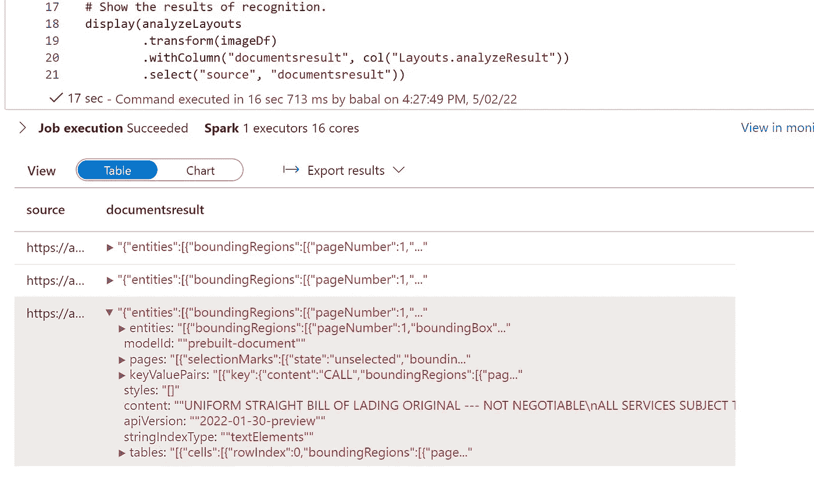
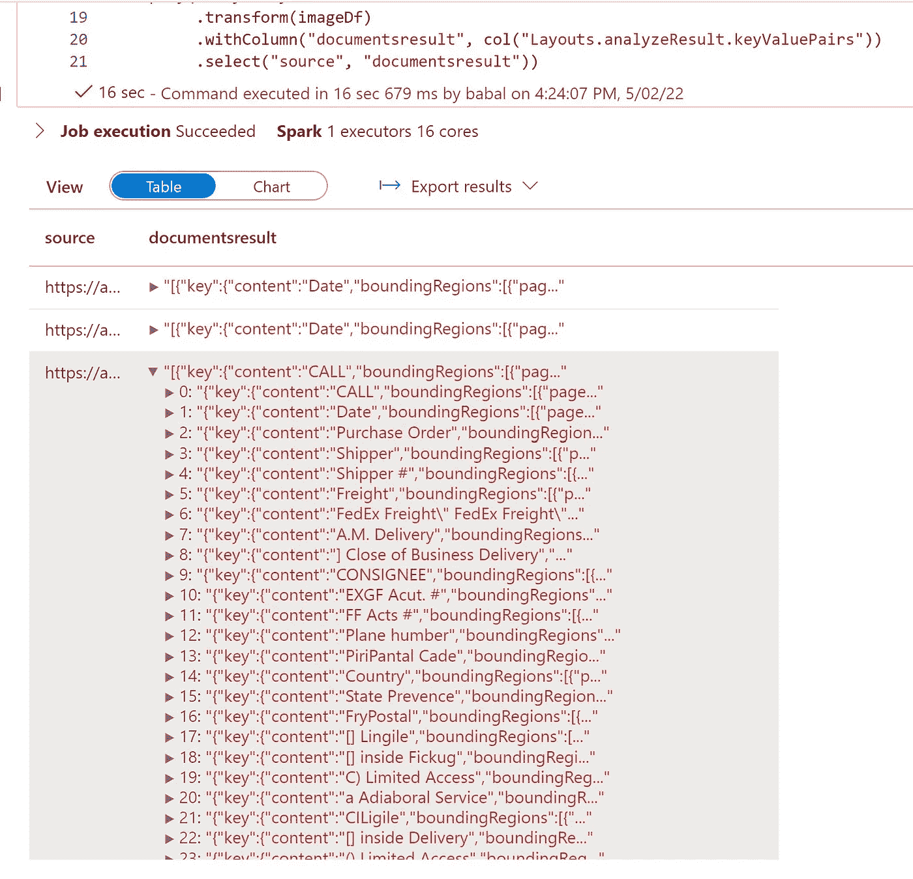
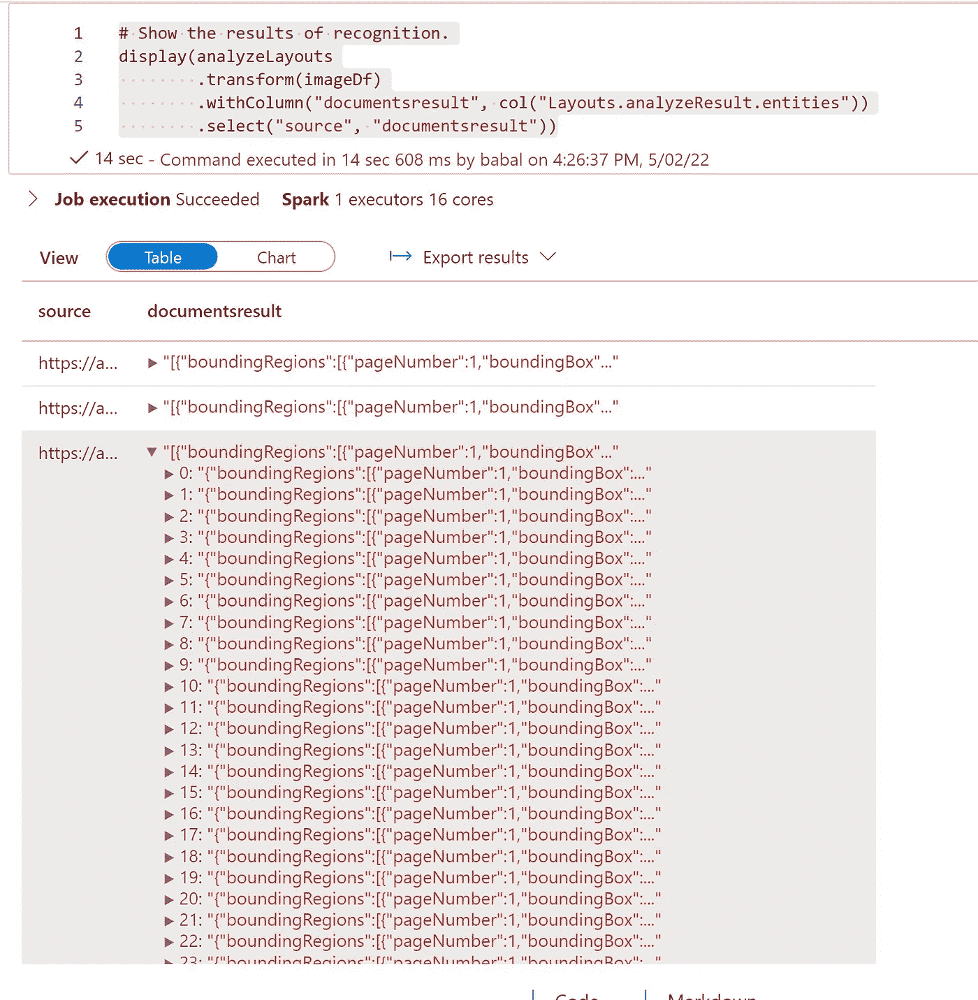
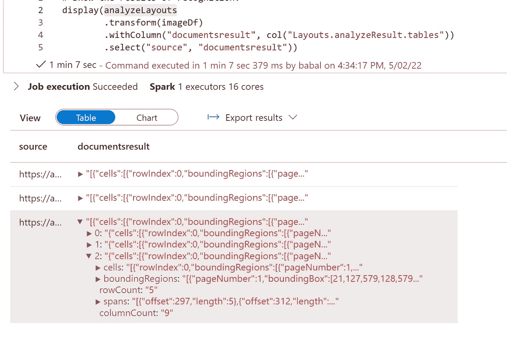
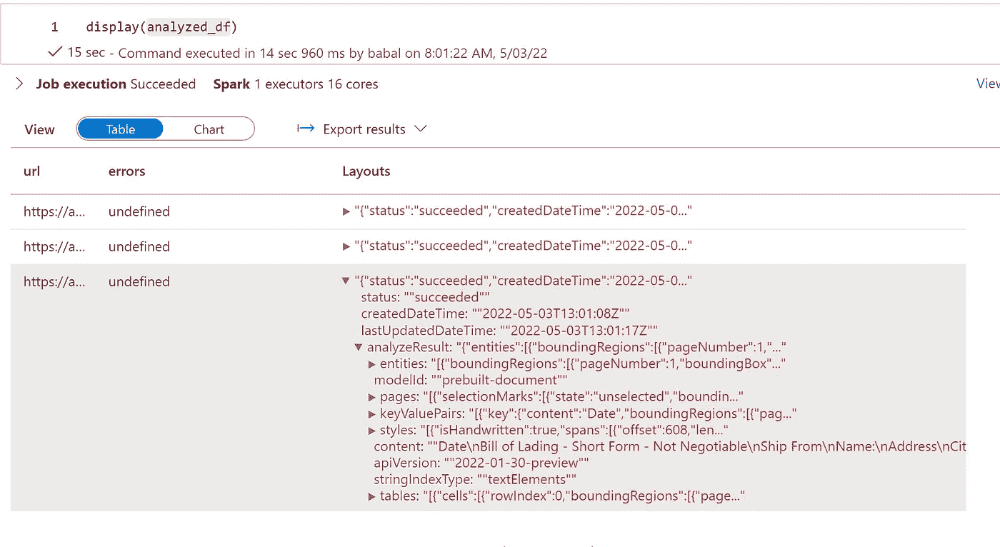

# 使用 SynapseML 通过表单识别处理大型 pdf

> 原文：<https://medium.com/mlearning-ai/use-synapseml-to-process-large-scale-pdf-with-form-recognition-d56ccd854ef5?source=collection_archive---------4----------------------->

# 使用 Azure 认知服务通过表单识别处理大规模 pdf

# 先决条件

*   Azure 帐户
*   Azure 存储帐户
*   Azure 认知服务
*   Azure synapse 分析
*   创建一个容器并上传 pdf 文件
*   为容器创建一个 SAS 密钥

# 使用 SynapseML 和 Spark 的流程

*   创建火花 3.2 预览火花池
*   创建一个新笔记本，并选择创建的新池
*   现在加载最新的 synapseml 预览版用于文档 api 处理

```
%%configure -f
{
    "name": "synapseml",
    "conf": {
        "spark.jars.packages": "com.microsoft.azure:synapseml_2.12:0.9.5-103-4975dda5-SNAPSHOT",
        "spark.jars.repositories": "https://mmlspark.azureedge.net/maven",
        "spark.jars.excludes": "org.scala-lang:scala-reflect,org.apache.spark:spark-tags_2.12,org.scalactic:scalactic_2.12,org.scalatest:scalatest_2.12",
        "spark.yarn.user.classpath.first": "true"
    }
}
```

*   让我们导入必要的库

```
import os
if os.environ.get("AZURE_SERVICE", None) == "Microsoft.ProjectArcadia":
    from pyspark.sql import SparkSession
    spark = SparkSession.builder.getOrCreate()
```

*   现在普通图书馆

```
from pyspark.sql.functions import udf, col
from synapse.ml.io.http import HTTPTransformer, http_udf
from requests import Request
from pyspark.sql.functions import lit
from pyspark.ml import PipelineModel
from pyspark.sql.functions import col
import os
```

*   让我们导入 synapseml

```
from synapse.ml.cognitive import *
```

*   现在让我们阅读一些图片并进行测试

```
from pyspark.sql.functions import col, explode# Create a dataframe containing the source files
imageDf = spark.createDataFrame([
  ("https://storagename.dfs.core.windows.net/containername/billoflading/billofladding1.png?sp=r&st=2022xxxx",),
  "https://storagename.dfs.core.windows.net/containername/billoflading/billofladding2.png?sp=r&st=2022xxxx",),
  "https://storagename.dfs.core.windows.net/containername/billoflading/BillofLading_Labeled_resized.jpg?sp=r&st=2022xxx",)
], ["source",])# Run the Form Recognizer service
analyzeLayouts = (AnalyzeDocument()
                 .setSubscriptionKey("xxxxxxxxxxxxxxxxxxxxxxxxxxx")
                 .setLocation("eastus2")
                 .setPrebuiltModelId("prebuilt-document")
                 .setImageUrlCol("source")
                 .setOutputCol("Layouts"))
# Show the results of recognition.
display(analyzeLayouts
        .transform(imageDf)
        .withColumn("documentsresult", col("Layouts.analyzeResult"))
        .select("source", "documentsresult"))
```



*   仅提取密钥对

```
from pyspark.sql.functions import col, explode# Create a dataframe containing the source files
imageDf = spark.createDataFrame([
  ("https://storagename.dfs.core.windows.net/containername/billoflading/billofladding1.png?sp=r&st=2022xxxx",),
  "https://storagename.dfs.core.windows.net/containername/billoflading/billofladding2.png?sp=r&st=2022xxxx",),
  "https://storagename.dfs.core.windows.net/containername/billoflading/BillofLading_Labeled_resized.jpg?sp=r&st=2022xxx",)
], ["source",])# Run the Form Recognizer service
analyzeLayouts = (AnalyzeDocument()
                 .setSubscriptionKey("xxxxxxxxxxxxxxxxxxxxxxxxxxx")
                 .setLocation("eastus2")
                 .setPrebuiltModelId("prebuilt-document")
                 .setImageUrlCol("source")
                 .setOutputCol("Layouts"))
# Show the results of recognition.
display(analyzeLayouts
        .transform(imageDf)
        .withColumn("documentsresult", col("Layouts.analyzeResult.keyValuePairs"))
        .select("source", "documentsresult"))
```



*   仅显示实体

```
# Show the results of recognition.
display(analyzeLayouts
        .transform(imageDf)
        .withColumn("documentsresult", col("Layouts.analyzeResult.entities"))
        .select("source", "documentsresult"))
```



*   现在只有桌子

```
# Show the results of recognition.
display(analyzeLayouts
        .transform(imageDf)
        .withColumn("documentsresult", col("Layouts.analyzeResult.tables"))
        .select("source", "documentsresult"))
```



# 分析布局

*   使用布局 api

```
from pyspark.sql.functions import col, explode# Create a dataframe containing the source files
imageDf = spark.createDataFrame([
  ("https://storagename.dfs.core.windows.net/containername/billoflading/billofladding1.png?sp=r&st=2022xxxx",),
  "https://storagename.dfs.core.windows.net/containername/billoflading/billofladding2.png?sp=r&st=2022xxxx",),
  "https://storagename.dfs.core.windows.net/containername/billoflading/BillofLading_Labeled_resized.jpg?sp=r&st=2022xxx",)
], ["source",])# Run the Form Recognizer service
analyzeLayouts = (AnalyzeLayout()
                 .setSubscriptionKey("xxxxxxxxxxxxxxxxxxxxxxxxxxxxxxxxx")
                 .setLocation("westus2")
                 .setImageUrlCol("source")
                 .setOutputCol("Layouts"))
# Show the results of recognition.
display(analyzeLayouts
        .transform(imageDf)
        .withColumn("documentsresult", explode(col("Layouts.analyzeResult.readResults")))
        .select("source", "documentsresult"))
```

*   现在显示页面结果

```
from pyspark.sql.functions import col, explode# Create a dataframe containing the source files
imageDf = spark.createDataFrame([
  ("https://storagename.dfs.core.windows.net/containername/billoflading/billofladding1.png?sp=r&st=2022xxxx",),
  "https://storagename.dfs.core.windows.net/containername/billoflading/billofladding2.png?sp=r&st=2022xxxx",),
  "https://storagename.dfs.core.windows.net/containername/billoflading/BillofLading_Labeled_resized.jpg?sp=r&st=2022xxx",)
], ["source",])# Run the Form Recognizer service
analyzeLayouts = (AnalyzeLayout()
                 .setSubscriptionKey("xxxxxxxxxxxxxxxxxxxxxxxxxxxxxxxxx")
                 .setLocation("westus2")
                 .setImageUrlCol("source")
                 .setOutputCol("Layouts"))
# Show the results of recognition.
display(analyzeLayouts
        .transform(imageDf)
        .withColumn("documentsresult", explode(col("Layouts.analyzeResult.pageResults")))
        .select("source", "documentsresult"))
```

# 将大批量作为数据帧处理

*   设置 root 和 sas 键

```
root = "https://storagename.dfs.core.windows.net/containername/billoflading/"
sas = "?sp=r&st=2022-xxxxxxx"
```

*   让我们创建一个函数来解析 abfss 文件 url 并为数据添加 http
*   abfss 是数据帧理解加载到 spark 数据帧中的内容

```
from pyspark.sql.functions import udf
from pyspark.sql.types import StringTypedef blob_to_url(blob):
  [prefix, postfix] = blob.split("@")
  container = prefix.split("/")[-1]
  split_postfix = postfix.split("/")
  account = split_postfix[0]
  filepath = "/".join(split_postfix[1:])
  return "https://{}/{}/{}".format(account, container, filepath) + sas
```

*   为容器添加 sas 密钥以获得对文件的权限
*   现在加载数据帧

```
df2 = (spark.read.format("binaryFile")
       .load("abfss://containername@storageaccount.dfs.core.windows.net/billoflading/*")
       .select("path")
       .limit(10)
       .select(udf(blob_to_url, StringType())("path").alias("url"))
       .cache()
      )
```

*   设置 cog svc 订阅密钥

```
key = "xxxxxx"
```

*   现在调用文档 api

```
from synapse.ml.cognitive import *analyzed_df = (AnalyzeDocument()
  .setSubscriptionKey(key)
  .setLocation("eastus")
  .setPrebuiltModelId("prebuilt-document")
  .setImageUrlCol("url")
  .setOutputCol("Layouts")
  .setErrorCol("errors")
  .setConcurrency(5)
  .transform(df2)
  .cache())
```

*   现在让我们分析结果

```
# Show the results of recognition.
display(analyzed_df)
```



*   现在让我们写回数据帧的输出，以便进一步处理

```
path = "abfss://containername@storagename.dfs.core.windows.net/billofladingoutput/"
analyzed_df.write.format("parquet").mode("overwrite").save(path)
```

*最初发表于*[*【https://github.com】*](https://github.com/balakreshnan/Samples2022/blob/main/SynapseSpark/synapsemlcogform.md)*。*

[](/mlearning-ai/mlearning-ai-submission-suggestions-b51e2b130bfb) [## Mlearning.ai 提交建议

### 如何成为 Mlearning.ai 上的作家

medium.com](/mlearning-ai/mlearning-ai-submission-suggestions-b51e2b130bfb)