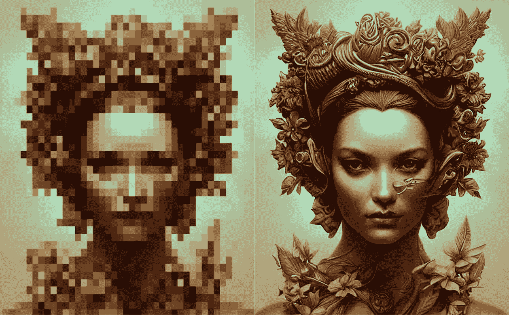

# 使用这个免费的人工智能工具来升级你的人工智能生成的图像

> 原文：<https://medium.com/mlearning-ai/use-this-free-ai-tool-to-upscale-your-ai-generated-images-faed6d4853fa?source=collection_archive---------1----------------------->

Image by [Jim Clyde Monge](https://medium.com/u/819323b399ac?source=post_page-----faed6d4853fa--------------------------------)

如果你最近一直在使用 AI 图像生成器模型，你可能已经注意到它令人讨厌的局限性之一是无法生成高分辨率的结果。

看看这些流行的人工智能工具支持的最大分辨率:

*   OpenAI 的 [Dall-E2](/mlearning-ai/openais-dall-e2-is-impressive-as-f-ck-5075aa5fbd29) :卡在 **1024x1024** 像素。
*   [中途](/mlearning-ai/midjourney-ais-massive-improvements-with-new-v3-algorithm-a44440fb21a8):从 **512x512** 到…