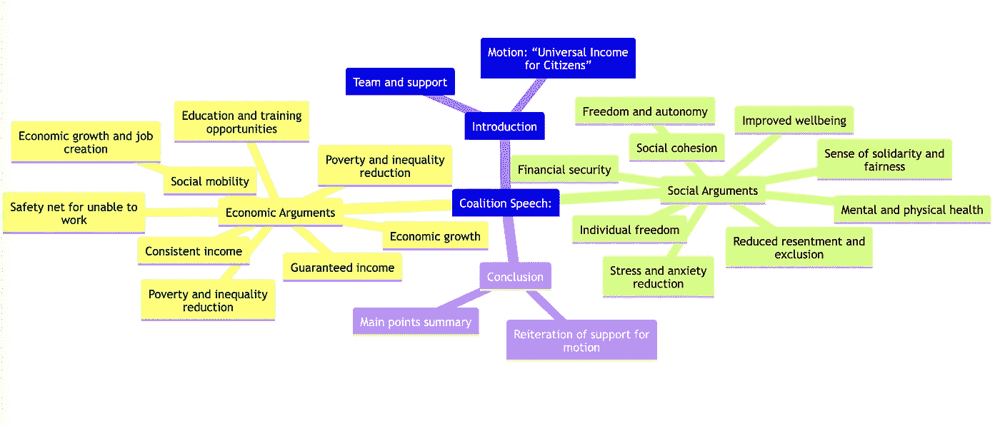

# 使用这个提示技巧来提高 ChatGPT 的性能

> 原文：<https://medium.com/mlearning-ai/use-this-prompting-trick-to-improve-chatgpts-performance-aefd5d9ba0e3?source=collection_archive---------0----------------------->

## 用这个简单的技巧释放 ChatGPT 的全部潜力

作为一个强大和通用的语言模型，OpenAI 的 ChatGPT 有能力就广泛的主题进行复杂的辩论。然而，要真正展示其分析能力并产生深刻而发人深省的回答，可以使用一个技巧来引出更详细和结构化的答案。

诀窍是在提供答案之前，包含一个对 ChatGPT 的请求，以生成**一个分层的内容表**。这使得人工智能仔细分析手头问题的结构，并以逻辑的方式组织其思想，就像人类作家在撰写文章或演讲之前创建一个大纲来规划和组织他们的想法。

从经验上来说，要求提供目录似乎可以大大提高 ChatGPT 撰写连贯的长篇论文的能力。请参见下面的示例。

# 下面是一个“目录”技巧的例子

## 步骤 1:输入以下提示

> 你在世界辩论锦标赛上。辩论的动议是“本议院支持所有公民的普遍收入”。该联盟赞成这项动议。思考支持该动议的论点，使用一个分等级的目录表，将论点分为至少 3 个主题，然后写下联盟的演讲。然后对反对派也这样做，他们应该反驳联盟的论点。

作为对提示的回应，ChatGPT 制作了以下令人印象深刻的大纲:

## 步骤 2:输入以下提示

> 现在写联盟的演讲稿，还有反对派的演讲稿。以“女士们，先生们

现在，GPT3 根据上一步写好的提纲，写出演讲的全文。这是令人难以置信的结果:

# 奖励诡计

作为一个高级的额外技巧，你可以通过提示 ChatGPT 输入 MermaidJS 格式的思维导图，并将结果粘贴到 https://mermaid.live/的[中，从而将目录可视化为一个图形图表。以下是联盟演讲的结果:](https://mermaid.live/)

关于如何使用 ChatGPT 创建思维导图和其他类型的图表的更多信息，请参见以下主题:

你怎么想呢?请在评论中告诉我。

***想多读书？*** *关注我上*[*Twitter*](https://twitter.com/aron_brand)*或者*[*LinkedIn*](https://www.linkedin.com/in/aronbrand/)*。*

 [## Mlearning.ai 提交建议

### 如何成为 Mlearning.ai 上的作家

medium.com](/mlearning-ai/mlearning-ai-submission-suggestions-b51e2b130bfb)