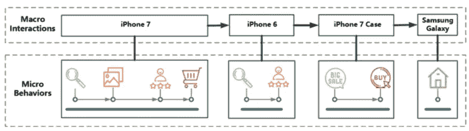
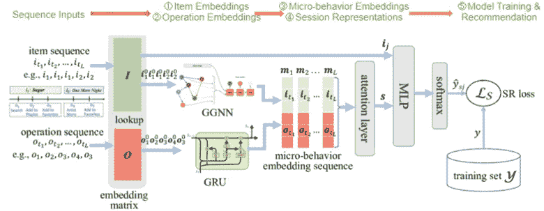
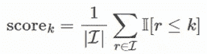
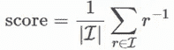
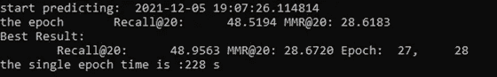
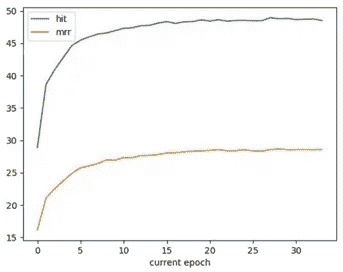

# 基于用户微观行为会话的推荐系统

> 原文：<https://medium.com/mlearning-ai/user-micro-behaviors-session-based-recommendation-systems-2358e1fcfb45?source=collection_archive---------3----------------------->

UT 奥斯汀-商业分析学期项目

作者:张平，安东尼·黄，舒巴姆·辛格，，刘，维奈·帕瓦

# ***摘要***

推荐系统(RSs)在过去十年中迅速普及，几乎每一个主要的在线企业都利用了增加的商业机会。一种在电子商务领域广泛使用的特定推荐系统被称为基于会话的推荐系统(SBRSs)。SBRSs 不同于传统的系统，例如协同过滤和基于内容的过滤，因为它具有动态的用户偏好方法。传统系统保持静态方法，并且对于用户偏好不随时间改变的长期推荐是有利的。然而，在用户偏好发生变化的情况下，传统的推荐系统很难准确地提出相关的推荐。我们将探索的特定类型的模型是用户微观行为 SBRS (UMB-SR)。不像以前的基于用户宏观行为的模型，它只是简单的查看项目，UMB-SR 模型查看用户选择项目的具体行为。在这篇博客中，我们将把 UMB-SR 与另一种基于神经网络的矩阵分解模型进行比较，以突出 SBRS 的优势，并展示在某些情况下，动态的用户偏好方法是多么的有利。

# **简介&背景**

传统上有两大类 RSs:基于协作过滤的系统和基于内容的系统。这些推荐系统倾向于利用所有历史用户-项目交互，并学习用户的长期偏好。这种实践通常与一个潜在的假设相关联，即用户的所有历史交互对于他们当前的偏好同等重要。事实上，情况并非总是如此。用户的偏好经常随着时间而改变，并且他们当前的兴趣更多地基于他们最近的偏好。这种现象在电子商务中很常见，也是许多电子商务公司实施 SBRSs 的原因。

近年来，递归神经网络(RNNs)已经以不同的方式应用于学习用户的动态时移偏好，表现出比传统方法更好的性能。尽管基于 RNN 的模型已经被证明是有效的，但是它们仍然有局限性，比如忽略了遥远项目之间的复杂转换。最近，作者在[3]中采用门控图神经网络(GGNN)来捕获会话中项目之间的复杂转换模式，而不是单一方式的转换模式。为了进一步改进基于 GGNN 的模型，作者在[2]中提出了利用用户微观行为的思想。

以往大多数基于会话的模型只是从宏观的角度对会话进行建模，即把会话看作一系列项目，没有考虑用户的不同操作。然而，即使用户在会话中与同一项目交互，对该项目的不同操作反映了用户在该会话中的不同意图和对该项目的不同偏好。换句话说，用户对某个项目的特定操作可以被视为比项目级的宏观行为(即，一般的用户-项目交互)具有更精细的粒度并提供对用户的更深理解的微观行为。

**Figure 1: A toy example of user micro-behaviors and micro-behaviors**

在此基础上，我们提出了一种新的基于会话的模型，即 UMB-SR，它同时引入了 RNN 和 GNN 来建模微观行为，不仅考虑了项目和操作的差异，而且保持了操作顺序的逻辑性。

# **数据收集/描述**

我们在 Kaggle 的 Retailrocket 数据集上重现并评估了 UMB-SR 模型。Retailrocket 数据集是从一个真实的电子商务网站上收集的。行为数据，即点击、购物车添加、交易等事件，代表了在 4.5 个月期间收集的交互。一个访问者可以创建三种类型的事件，即“查看”、“添加到图表”或“交易”。总共有 2，756，101 个事件，包括由 1，407，580 个独立访问者产生的 2，664，312 个“查看”、69，332 个“添加到图表”和 22，457 个“交易”。具有项目属性的文件包括 20，275，902 行，即描述 417，053 个唯一项目的不同属性。

# **数据预处理&勘探**

创建 UMB-SR 的第一步是定义一个会话。会话的长度、内部顺序、操作类型和用户信息可能会有所不同，并且应该根据数据集进行调整。

## **会期长度**

许多先前的基于会话的推荐系统实现了固定的会话长度，无论它是短的、中等的还是长的。这种做法导致了几个缺点:会话太短，信息有限；会话太长，信息嘈杂。为了克服这些缺点，受[5]和行业经验的启发，我们采用了一种灵活、动态的会话长度策略，将会话视为在定义的用户空闲时间(例如，30 分钟的用户不活动)之后结束。在一个会话中，最少允许 2 个操作，最多允许 30 个操作。一方面，一个动作不会形成一个会话。另一方面，数据集中存在一些非常长的会话，这可能是异常值。30 分钟是一个会话中两个动作之间允许的最长时间，否则它们将被分配到两个单独的会话中。

## **内部订单**

会话中有三种排序类型:无序、严格排序和灵活排序。这些都有各自的优点和缺点。由于电子商务行业的性质，我们的数据集是灵活排序的。灵活排序考虑了顺序相关的操作，并对不相关的随机操作分配较小的权重。用户通常试图在一个会话中完成他们的所有购买；然而，他们想要购买的商品可能相关也可能不相关(例如食品与技术)。灵活排序识别彼此顺序相关的项目和随机插入的项目。

## **动作类型**

会话可以是单一类型操作会话，也可以是多类型操作会话。我们的数据集包括三种不同类型的操作(查看、添加到购物车和事务)，从而产生一个多类型操作会话。单一类型的动作会话可能更容易学习，因为它只包含一种类型的动作，而多类型的动作会话可以提供更高准确度的建议。

## **用户信息**

会话中的用户信息可用于了解用户的长期偏好。然而，由于最小化用户冷启动问题是 UMB-SR 模型的一个目标，我们决定采用匿名会话，其中用户信息是匿名的或者在会话被创建后被丢弃。会话信息进而用于基于会话活动来个性化用户的偏好。这样，即使有新用户加入网站，UMB-SR 模型仍然可以提供个性化推荐。

# **学习/建模**

## **模型构建**

UMB-SR 模型是由五个子模块组成的流水线框架。第一个是生成项目嵌入的 GGNN。接下来是门控递归单元(GRU ),它将操作序列作为输入，输出操作嵌入。然后将项目嵌入和操作嵌入连接起来形成微观行为嵌入。之后，通过对联合嵌入应用软注意机制来计算最终的会话表示。最后对模型进行训练和评估。

**Figure 2: Key steps of the UMB-SR model**

***第一步:学习项目嵌入***

与先前的基于 GRU 的序列模型不同，UMB-SR 模型采用 GGNN 来建模项目序列以获得项目嵌入，这有两个原因。首先，物料序列不同于工序序列，通常更复杂。换句话说，我们必须看看项目是如何与它们前面和后面的项目相关联的，而不仅仅是后面的项目。第二，用户经常在一个会话中与同一个项目交互几次。因此，这种转换模式依赖于双向上下文而不是单向上下文，并且可以由 GGNN 比 GRU 更好地建模。

***第二步:学习操作嵌入***

与项目嵌入学习不同，GRU 更适合操作嵌入学习。想想我们在大多数平台上能有多少独特的操作。数量通常是有限的，并且一个操作可能以不成比例的概率在一个会话中重复出现。因此，如果我们将操作序列转换成有向图，大多数操作嵌入将非常相似，因此无法表征用户偏好的多样性。此外，两个连续操作之间的转换通常表现出一定的顺序模式。在我们的例子中，这意味着用户在将商品添加到购物车之前先查看它，或者在购买之前先将商品添加到购物车。因此，GRU 比 GGNN 工作得更好。

***第三步:获取微行为嵌入***

一旦我们获得了项目嵌入和操作嵌入，我们就将它们连接在一起，形成一个单一的微行为嵌入。基于这种微观行为嵌入，具有相同项目序列但不同操作序列的两个会话仍然具有不同的表示，可以捕捉用户的细粒度意图。

***步骤 4:生成会话表示***

为了更好地预测用户的下一步操作，我们可以在一个会话中应用一种策略来结合他们的长期偏好(全局偏好)和他们的当前兴趣(局部偏好)。具体来说，会话的本地偏好直接由最近微行为的嵌入来表示。为了获得会话的全局偏好，我们然后使用软注意机制来为每个微行为的嵌入分配适当的权重。最后，我们组合局部和全局嵌入向量，对组合进行线性变换，并计算混合会话嵌入。这样的混合嵌入然后被用作最终的会话表示。

***第五步:模型训练与评估***

在我们获得会话表示之后，我们能够将嵌入内容输入到多层感知器中，并使用 softmax 函数来获得最终分数。我们使用二进制交叉熵作为损失函数，并使用时间反向传播(BPTT)算法来训练模型。二进制交叉熵将每个预测概率与实际类输出进行比较，实际类输出可以是 0 或 1。它衡量与实际值有多接近或多远。BPTT 是将反向传播训练算法应用于 RNNs，RNNs 应用于像时间序列这样的序列数据。

**Figure 3: Full picture of the UMB-SR model**

## **超参数选择**

为了再现 UMB-SR 模型，除了会话长度之外，我们使用本文中的默认超参数设置。

●批量:128。因为在基于会话的推荐场景中，大多数会话长度相对较短。因此相对较少的训练步骤有利于防止过度拟合。

●隐藏尺寸:100。这是嵌入维度，并且是由于计算复杂性和空间限制而确定的。

●学习率:0.001

● L2 罚分:0.001

● GGNN 的步骤:1

●耐心:10。这意味着如果模型精度在 10 个时期的累积中没有提高，我们得出结论，训练已经达到饱和，并且将停止。

●纪元:50。这是停止前的最大历元数。

通过上述超参数的选择，UMB-SR 模型需要大约 2-3 个小时来在配有 I7 处理器的 windows 10 机器上使用我们的数据集进行训练。

# **结果**

## **评估指标**

我们使用以下指标来评估 UMB-随机共振模型的预测准确性，这些指标在以前的随机共振评估中被广泛使用。

●Hit @ k:hits @ k 描述了出现在排序排名列表的前 k 个实体中的真实实体的比例。hits@k 位于[0，1]上，其中越接近 1 越好。它被给出为:

● MRR@k:平均倒数秩(MRR)是倒数秩的算术平均值，因而是秩的调和平均值的倒数。MRR@k 位于(0，1)上，其中越接近 1 越好。它被定义为:

在我们的例子中，我们分析 hit@20 和 mrr@20 来评估 UMB-SR 模型预测前 20 名排名列表中的下一个交互项目的准确性。

## **评估结果**

跑了 33 个纪元，模型训练达到了忍耐的门槛，被 stppped。20 岁时的最佳命中率为 48.9563%，由第 27 纪元给出。第 28 代给出的最佳 mrr 为 28.6183%。基于这些结果，我们可以得出结论，近一半的预测前 20 排名列表成功命中真实的下一个交互项目，并且在命中样本中，前 20 排名列表中正确的下一个交互项目的平均排名为 1.71。

**Figure 4: Final results of the UMB-SR model**

**Figure 5: Hit@20 and MRR@20 vs. Epochs**

## **与基线法的比较**

为了证实考虑会话因素的优势，我们对动态模型(UMB-SR 模型)和静态基线模型(基于神经网络的矩阵分解模型)进行了比较分析。关于静态模型，我们设计了一个以用户-用户和用户-产品的加权相似性得分为中心的实验训练例程来进行最终预测。然而@20 的点击率只有 5%。为了捕捉产品的动态行为，我们在层的产品侧包含了简单的 RNN。此外，我们在嵌入矩阵之后，在体系结构的用户端添加了一系列密集层，以便让模型使用潜在向量来学习顺序用户之间的关联行为。这一系列努力帮助我们提高了静态模型的预测能力，但 hit@20 仍在 5%~9%之间。

随着动态和关联层的增加，模型的持续改进帮助我们证实了我们的假设，即基于 GGNN 和 GRU 基础的高级 UMB-SR 模型在提供推荐方面表现更好。

# **前景&未来工作**

## **问题和解决方案**

在这一节中，我们概述了与 UMB-SR 模型和我们的实验相关的三个问题，并提供了相应的解决方案，我们认为这对于我们工作的进一步改进是至关重要的。

***问题 1:物品冷启动问题***

与其他基于 RNN 的模型类似，UMB-SR 模型建立在单级会话数据上，这意味着它忽略了属性信息或历史会话信息，因此对冷启动或数据稀疏问题很敏感。为了解决冷启动项目问题，一个可行的解决方案是利用项目属性作为附加信息，因为这种信息可以帮助提供项目之间的潜在关系，这对于找出会话中连续项目之间的语义相关性是至关重要的。

***第 2 期:概括能力***

模型的概括能力是模型成功的核心。在我们的实验中，我们只使用了一个电子商务数据集来测量 UMB-SR 模型，这不足以证明它在其他领域的推广能力。因此，一种方法是用来自电影、音乐、新闻等其他行业的数据集来训练 UMB-SR 模型，以分析它是如何工作的。

***问题 3:附加质量因素***

我们实验的另一个问题是，我们只使用 hit@20 和 mrr@20 作为评估指标。然而，在实践中，准确性并不是唯一相关的质量因素。可以包括关于测量的附加信息，例如覆盖率和受欢迎程度偏差。就覆盖范围而言，它报告了有多少不同的项目曾经出现在 top-k 推荐中，这有助于反映多样性。就受欢迎程度偏差而言，我们可以报告 top-k 推荐元素的平均受欢迎程度分数，该分数评估算法的受欢迎程度。

## **商业洞察力**

推荐系统对几乎所有在线业务都有好处。通过为每个用户提供量身定制的体验，企业能够提高客户保持率并增加销售额。额外的用户数据还允许企业轻松地分析市场并增强整体用户体验。这可以在互联网上的所有企业中看到，主要的例子有亚马逊、网飞和脸书。这些企业利用推荐系统来推广与特定用户相关的内容，并增加其平台上的销售额或时间。

更高级的推荐系统，例如基于用户微行为会话的系统，允许提高预测准确性，并允许企业进一步利用用户数据。企业能够为其业务需求创建特定的推荐系统，从而为用户带来最佳体验。不足为奇的是，在过去十年中，推荐系统已经在整个互联网上实现，随着更先进模型的创建，数据的利用率和客户体验只会得到改善。

## **吸取的经验教训**

在完成这个项目的过程中，我们希望与您分享我们的主要收获以及我们在解决这个有趣问题时获得的一些有趣的见解。首先，尽管 SBSRs 在捕捉短期和动态用户偏好方面表现出色，但它通常忽略了传统推荐方法可以很好捕捉的长期一般偏好。因此，如何有效地将用户的一般偏好整合到 SBRS 中是至关重要且具有挑战性的。第二，操作内部存在复杂的依赖关系。SBRSs 面临的一大挑战是如何有效而准确地学习操作内和操作间的类型依赖关系，以获得准确的推荐。第三，当准确性在实践中不是唯一相关的质量因素，并且很难用一个综合指标来汇总所有单个性能因素时，多指标评估方法会有所帮助。

# **结论**

在整个项目中，我们的团队成功地引入并实现了一种新颖的基于会话的推荐系统，即 UMB-SR，它考虑了会话中项目序列和操作序列之间的结构和转换的差异，并利用用户微观行为来生成细粒度的会话表示。我们的实验证实了 UMB-SR 相对于基本静态模型和简单动态模型的优越性，并启发了改进 SBRSs 的一个有希望的方向。

# **致谢**

我们要特别感谢 Schlumberger 电气工程百年讲座教授 Joydeep Ghosh 博士，感谢他在整个项目中提出的建设性建议和宝贵指导。

# **参考文献**

[1]，，曹，，盛全志，麦赫迈特·奥尔贡，和连德福。2021.基于会话的推荐系统综述。ACM 计算机。Surv。9、4、第 39 条(2021 年 5 月)，第 39 页。https://doi . org/0000001.0000001

[2]孟文景、和萧。2020.将用户微观行为和项目知识融入多任务学习以实现基于会话的推荐。第 43 届国际计算机学会会议录。

[3]舒武，汤玉元，朱彦桥，，谢星，和。2019.基于会话的图神经网络推荐。《AAAI 人工智能会议论文集》，第 33 卷。346–353.

[4]彭杰任，陈，，等. 2019 .RepeatNet:基于会话推荐的重复感知神经推荐机。在 AAAI，第 33 卷。4806–4813.

[5] Malte Ludewig 和 Dietmar Jannach。2018.基于会话的推荐算法评估。UMUAI 28，4–5(2018)，331–390。

# **Github 链接**

https://github.com/ping2022/Ping-ML-SR UMB-SR:

基线模型:【https://github.com/squareitall/AML_Recommendation_system 

 [## Mlearning.ai 提交建议

### 如何成为 Mlearning.ai 上的作家

medium.com](/mlearning-ai/mlearning-ai-submission-suggestions-b51e2b130bfb)